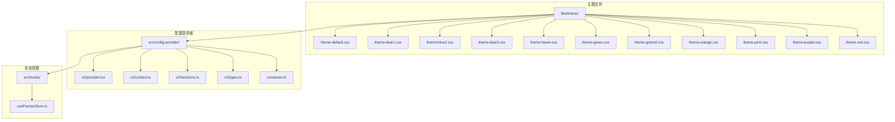
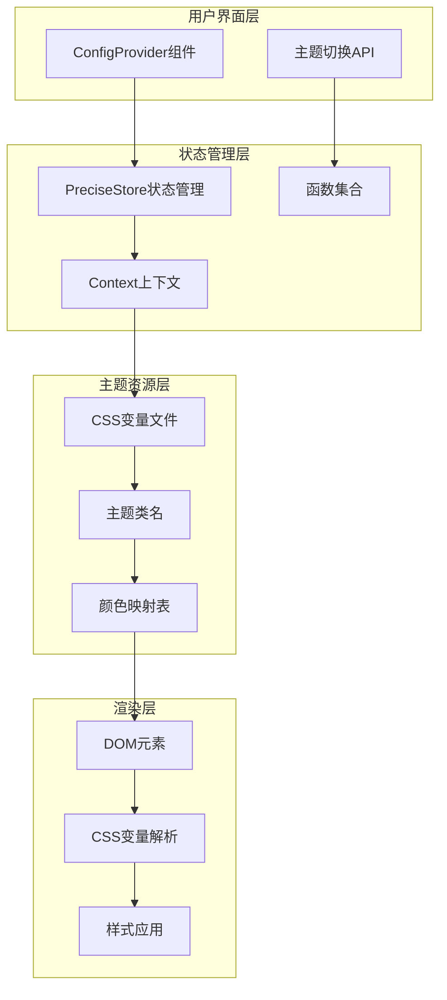
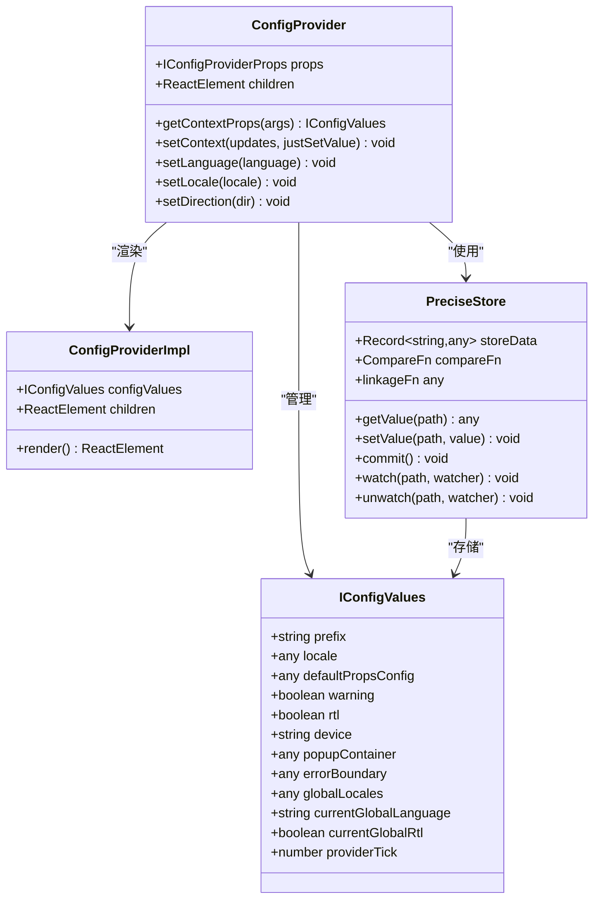
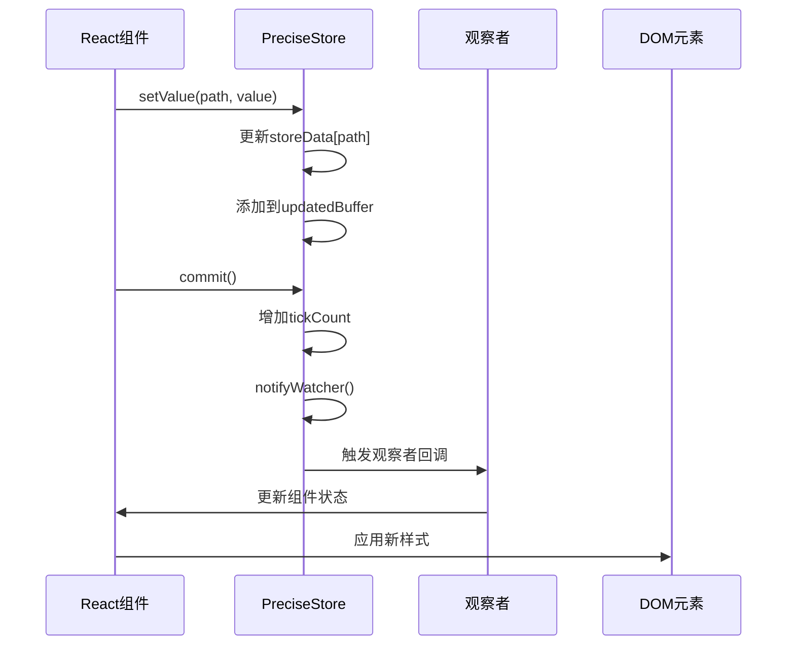
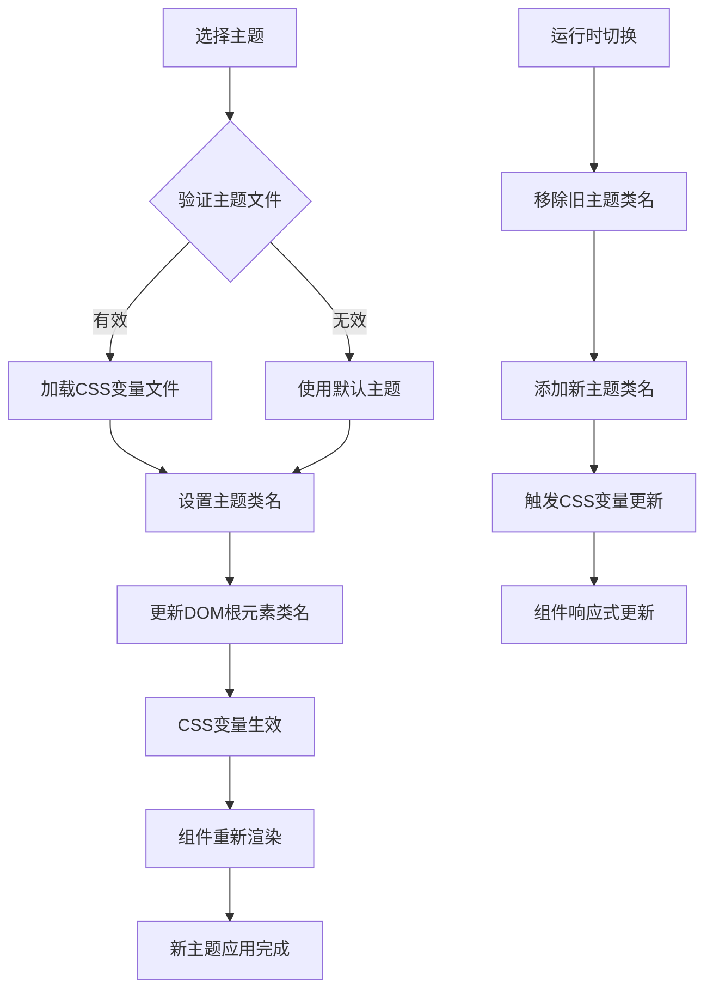
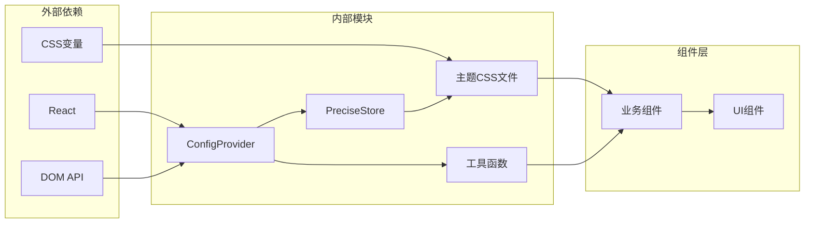

# 主题系统

<cite>
**本文档引用的文件**
- [theme-default.css](file://libs/theme/theme-default.css)
- [theme-blue1.css](file://libs/theme/theme-blue1.css)
- [theme-blue2.css](file://libs/theme/theme-blue2.css)
- [theme-blue3.css](file://libs/theme/theme-blue3.css)
- [theme-blue4.css](file://libs/theme/theme-blue4.css)
- [theme-green.css](file://libs/theme/theme-green.css)
- [theme-green2.css](file://libs/theme/theme-green2.css)
- [theme-orange.css](file://libs/theme/theme-orange.css)
- [theme-pink.css](file://libs/theme/theme-pink.css)
- [theme-purple.css](file://libs/theme/theme-purple.css)
- [theme-red.css](file://libs/theme/theme-red.css)
- [provider.tsx](file://src/config-provider/v2/provider.tsx)
- [context.ts](file://src/config-provider/v2/context.ts)
- [functions.ts](file://src/config-provider/v2/functions.ts)
- [types.ts](file://src/config-provider/v2/types.ts)
- [constants.ts](file://src/config-provider/constants.ts)
- [usePreciseStore.ts](file://src/hooks/usePreciseStore.ts)
</cite>

## 目录
1. [简介](#简介)
2. [项目结构](#项目结构)
3. [核心组件](#核心组件)
4. [架构概览](#架构概览)
5. [详细组件分析](#详细组件分析)
6. [依赖关系分析](#依赖关系分析)
7. [性能考虑](#性能考虑)
8. [故障排除指南](#故障排除指南)
9. [结论](#结论)

## 简介

Fat Design主题系统是一个基于CSS变量的动态主题切换框架，提供了完整的主题管理解决方案。该系统通过预定义的主题文件和ConfigProvider组件，实现了灵活的主题切换机制，支持多种预设主题和自定义主题开发。

主题系统的核心特性包括：
- 基于CSS变量的主题切换
- 多种预设主题（theme-default、theme-blue1、theme-blue2等）
- 动态主题切换API
- 与ConfigProvider的深度集成
- 运行时性能优化

## 项目结构

主题系统在Fat Design项目中的组织结构如下：



**图表来源**
- [theme-default.css](file://libs/theme/theme-default.css#L1-L61)
- [provider.tsx](file://src/config-provider/v2/provider.tsx#L1-L78)
- [context.ts](file://src/config-provider/v2/context.ts#L1-L20)

**章节来源**
- [theme-default.css](file://libs/theme/theme-default.css#L1-L61)
- [provider.tsx](file://src/config-provider/v2/provider.tsx#L1-L78)

## 核心组件

### CSS变量主题文件

主题系统的核心是预定义的CSS变量文件，每个主题文件都包含完整的颜色映射系统：

#### 默认主题（theme-default.css）
```css
.fatd-theme-default {
    --color-bg1-1: #f4f6f9;
    --color-bg1-2: #f2f3f5;
    --color-black: #000;
    --color-brand1-1: #D0D4FF;
    --color-brand1-6: #5263ff;
    --color-brand1-9: #4253b2;
    --color-btn1-normal: #8f9aa9;
    --color-data1-1: #29a5ff;
    --color-data1-2: #82cb79;
    --color-data1-3: #ffcc2c;
    --color-data1-4: #c45dd8;
    --color-data1-5: #f68e4f;
    --color-data1-6: #fc555d;
    --color-data1-7: #c2c2c2;
    --color-data1-8: #6a76ff;
    --color-error-1: #f9d9d5;
    --color-error-2: #f4b3ab;
    --color-error-3: #f04631;
    --color-error-4: #f03118;
    --color-fill1-1: #f2f3f5;
    --color-fill1-2: #f2f3f5;
    --color-fill1-3: #e8ebee;
    --color-fill1-4: #d2d7de;
    --color-gradient-1: linear-gradient(270deg, rgb(121, 232, 199) 0%, rgb(8, 194, 158) 100%);
    --color-gradient-2: linear-gradient(270deg, rgb(125, 238, 255) 0%, rgb(3, 193, 253) 100%);
    --color-gradient-3: linear-gradient(270deg, rgb(255, 237, 117) 0%, rgb(245, 203, 34) 100%);
    --color-gradient-4: linear-gradient(270deg, rgb(255, 163, 166) 0%, rgb(245, 39, 67) 100%);
    --color-help-1: #d8ebf7;
    --color-help-2: #b1d6ef;
    --color-help-3: #3c99d8;
    --color-help-4: #2e76a6;
    --color-line1-1: #f2f3f5;
    --color-line1-2: #e6ebf1;
    --color-line1-3: #d2d7de;
    --color-line1-4: #bbc3cc;
    --color-link-1: #5263ff;
    --color-link-2: #021b40;
    --color-link-3: #0a61de;
    --color-notice-1: #e5f3ff;
    --color-notice-2: #99d0ff;
    --color-notice-3: #5263ff;
    --color-notice-4: #4253b2;
    --color-other-1: #fff;
    --color-other-2: #1f3858;
    --color-other-3: #2c2f33;
    --color-success-1: #d6f0db;
    --color-success-2: #85d394;
    --color-success-3: #00b853;
    --color-success-4: #00a249;
    --color-text1-1: #ccc;
    --color-text1-2: #999;
    --color-text1-3: #666;
    --color-text1-4: #333;
    --color-transparent: transparent;
    --color-warning-1: #fff2cc;
    --color-warning-2: #ffe599;
    --color-warning-3: #ff9f00;
    --color-warning-4: #f09000;
    --color-white: #fff;
}
```

#### 蓝色主题（theme-blue1.css）
蓝色主题展示了更丰富的色彩层次和透明度处理：

```css
.fatd-theme-blue1 {
    --color-black: #000000;
    --color-brand1-1: rgba(230, 253, 255, 1);
    --color-brand1-5: rgba(43, 213, 255, 1);
    --color-brand1-6: rgba(3, 193, 253, 1);
    --color-brand1-9: rgba(0, 157, 214, 1);
    --color-data1-1: rgba(12, 184, 198, 1);
    --color-data1-2: rgba(90, 28, 184, 1);
    --color-data1-3: rgba(159, 24, 184, 1);
    --color-data1-4: rgba(245, 115, 21, 1);
    --color-data1-5: rgba(245, 203, 34, 1);
    --color-data1-6: rgba(8, 194, 158, 1);
    --color-data1-7: rgba(153, 209, 15, 1);
    --color-data1-8: rgba(3, 148, 245, 1);
    --color-error-1: rgba(255, 240, 240, 1);
    --color-error-2: rgba(255, 82, 99, 1);
    --color-error-3: rgba(245, 39, 67, 1);
    --color-error-4: rgba(207, 23, 53, 1);
    --color-fill1-1: rgba(245, 247, 250, 1);
    --color-fill1-2: rgba(244, 246, 249, 1);
    --color-fill1-3: rgba(240, 242, 245, 1);
    --color-fill1-4: rgba(237, 239, 242, 1);
    --color-gradient-1: linear-gradient(270deg, rgb(121, 232, 199) 0%, rgb(8, 194, 158) 100%);
    --color-gradient-2: linear-gradient(270deg, rgb(125, 238, 255) 0%, rgb(3, 193, 253) 100%);
    --color-gradient-3: linear-gradient(270deg, rgb(255, 237, 117) 0%, rgb(245, 203, 34) 100%);
    --color-gradient-4: linear-gradient(270deg, rgb(255, 163, 166) 0%, rgb(245, 39, 67) 100%);
    --color-help-1: rgba(230, 249, 255, 1);
    --color-help-2: rgba(166, 231, 255, 1);
    --color-help-3: rgba(3, 148, 245, 1);
    --color-help-4: rgba(0, 117, 207, 1);
    --color-line1-1: rgba(228, 232, 238, 1);
    --color-line1-2: rgba(220, 223, 230, 1);
    --color-line1-3: rgba(217, 219, 222, 1);
    --color-line1-4: rgba(196, 199, 204, 1);
    --color-link-1: rgba(3, 193, 253, 1);
    --color-link-2: rgba(0, 123, 176, 1);
    --color-link-3: rgba(0, 157, 214, 1);
    --color-notice-1: rgba(230, 253, 255, 1);
    --color-notice-2: rgba(163, 241, 250, 1);
    --color-notice-3: rgba(3, 193, 253, 1);
    --color-notice-4: rgba(0, 157, 214, 1);
    --color-other-1: rgba(31, 38, 51, 1);
    --color-other-2: rgba(88, 93, 102, 1);
    --color-other-3: rgba(141, 146, 153, 1);
    --color-success-1: rgba(230, 255, 246, 1);
    --color-success-2: rgba(121, 232, 199, 1);
    --color-success-3: rgba(8, 194, 158, 1);
    --color-success-4: rgba(0, 156, 130, 1);
    --color-text1-1: rgba(196, 199, 204, 1);
    --color-text1-2: rgba(141, 146, 153, 1);
    --color-text1-3: rgba(88, 93, 102, 1);
    --color-text1-4: rgba(31, 38, 51, 1);
    --color-transparent: transparent;
    --color-warning-1: rgba(255, 254, 240, 1);
    --color-warning-2: rgba(255, 251, 199, 1);
    --color-warning-3: rgba(245, 203, 34, 1);
    --color-warning-4: rgba(207, 163, 19, 1);
    --color-white: #FFFFFF;
}
```

**章节来源**
- [theme-default.css](file://libs/theme/theme-default.css#L1-L61)
- [theme-blue1.css](file://libs/theme/theme-blue1.css#L1-L59)

## 架构概览

主题系统采用分层架构设计，通过CSS变量和React Context实现动态主题切换：



**图表来源**
- [provider.tsx](file://src/config-provider/v2/provider.tsx#L1-L78)
- [context.ts](file://src/config-provider/v2/context.ts#L1-L20)
- [functions.ts](file://src/config-provider/v2/functions.ts#L1-L274)

## 详细组件分析

### ConfigProvider组件

ConfigProvider是主题系统的核心组件，负责管理全局配置和主题上下文：



**图表来源**
- [provider.tsx](file://src/config-provider/v2/provider.tsx#L1-L78)
- [context.ts](file://src/config-provider/v2/context.ts#L1-L20)
- [types.ts](file://src/config-provider/v2/types.ts#L1-L26)

#### 主要功能实现

ConfigProvider组件通过以下机制实现主题管理：

1. **配置值管理**：使用PreciseStore进行精确的状态管理
2. **属性过滤**：只处理必要的配置属性
3. **浅比较优化**：避免不必要的重新渲染
4. **国际化支持**：动态设置语言和区域设置

```typescript
// 关键代码片段
const configProviderPropsName = [
    'prefix',
    'locale',
    'defaultPropsConfig',
    'warning',
    'rtl',
    'device',
    'popupContainer',
    'errorBoundary',
    'globalLocales',
    'currentGlobalLanguage',
    'currentGlobalRtl',
    'providerTick',
];

const configValues: IConfigValues = useMemo(() => {
    const valueNames = configProviderPropsName.filter((name) => {
        const propsAny = props as any;
        return typeof propsAny[name] !== "undefined";
    });
    const nextProps = pickProps(valueNames, props);
    providerFunctions.setContext(nextProps, true);
    return nextProps;
}, [propValues.join('-')]);
```

**章节来源**
- [provider.tsx](file://src/config-provider/v2/provider.tsx#L1-L78)
- [functions.ts](file://src/config-provider/v2/functions.ts#L1-L274)

### PreciseStore状态管理

PreciseStore是主题系统的核心状态管理工具，提供了精确的状态跟踪和通知机制：



**图表来源**
- [usePreciseStore.ts](file://src/hooks/usePreciseStore.ts#L1-L299)

#### 核心特性

1. **精确状态跟踪**：通过路径追踪确保状态更新的准确性
2. **批量更新优化**：使用updatedBuffer减少重复通知
3. **深度监听**：支持嵌套路径的监听
4. **性能优化**：通过比较函数避免不必要的更新

```typescript
// 关键实现
class PreciseStore {
    public readonly storeData: Record<string, any> = {};
    private watcherManager: WatcherManager = new WatcherManager();
    private updatedBuffer: string[] = [];
    private tickCount = 0;
    
    setValue(path: string, value: any) {
        _set(this.storeData, path, value);
        this.updatedBuffer.push(path);
    }
    
    commit() {
        this.tickCount = this.tickCount + 1;
        _set(this.storeData, KEY_SAVED_TICK_COUNT, this.tickCount);
        this.notifyWatcher();
    }
    
    notifyWatcher() {
        const updatedPathList = this.updatedBuffer;
        for (let i = 0; i < updatedPathList.length; i++) {
            const updatedPath = updatedPathList[i];
            const watcherList = this.watcherManager.getWatcherDeepList(updatedPath);
            for (let j = 0; j < watcherList.length; j++) {
                const {watcher, preValue, watchPath} = watcherList[j];
                const nextValue = this.getValue(watchPath);
                if (typeof preValue === "undefined" || !isStateEquals(this.compareFn, preValue, nextValue)) {
                    watcher(nextValue, preValue, this);
                    watcherList[j].preValue = nextValue;
                }
            }
        }
        this.updatedBuffer = [];
    }
}
```

**章节来源**
- [usePreciseStore.ts](file://src/hooks/usePreciseStore.ts#L1-L299)

### 主题切换机制

主题切换通过CSS变量的动态替换实现，无需重新加载页面：



**图表来源**
- [theme-default.css](file://libs/theme/theme-default.css#L1-L61)
- [theme-blue1.css](file://libs/theme/theme-blue1.css#L1-L59)

#### 主题切换API

系统提供了多种主题切换方式：

1. **静态引入**：在HTML中直接引入主题CSS文件
2. **动态加载**：通过JavaScript动态加载主题文件
3. **运行时切换**：在应用运行时切换主题

```javascript
// 动态主题切换示例
function switchTheme(themeName) {
    // 移除现有主题类名
    document.documentElement.classList.remove(
        'fatd-theme-default',
        'fatd-theme-blue1',
        'fatd-theme-blue2'
        // ... 其他主题类名
    );
    
    // 添加新主题类名
    document.documentElement.classList.add(`fatd-theme-${themeName}`);
}
```

**章节来源**
- [theme-default.css](file://libs/theme/theme-default.css#L1-L61)
- [theme-blue1.css](file://libs/theme/theme-blue1.css#L1-L59)

## 依赖关系分析

主题系统的依赖关系展现了清晰的分层架构：



**图表来源**
- [provider.tsx](file://src/config-provider/v2/provider.tsx#L1-L78)
- [usePreciseStore.ts](file://src/hooks/usePreciseStore.ts#L1-L299)

**章节来源**
- [provider.tsx](file://src/config-provider/v2/provider.tsx#L1-L78)
- [context.ts](file://src/config-provider/v2/context.ts#L1-L20)
- [functions.ts](file://src/config-provider/v2/functions.ts#L1-L274)

## 性能考虑

### 渲染优化

1. **浅比较优化**：ConfigProvider使用shallowEqual进行属性比较
2. **记忆化组件**：使用React.memo避免不必要的重新渲染
3. **精确状态更新**：PreciseStore只通知实际变化的组件

### 内存管理

1. **观察者清理**：及时移除不再需要的观察者回调
2. **状态压缩**：只存储必要的配置值
3. **垃圾回收友好**：避免循环引用和内存泄漏

### 运行时性能

1. **CSS变量缓存**：浏览器原生缓存CSS变量计算结果
2. **批量更新**：使用updatedBuffer减少DOM操作
3. **异步处理**：非关键路径的操作使用异步处理

## 故障排除指南

### 常见问题及解决方案

#### 主题不生效
1. 检查CSS文件是否正确加载
2. 验证主题类名是否正确设置
3. 确认CSS变量命名规范

#### 性能问题
1. 使用浏览器开发者工具检查重绘和回流
2. 优化主题切换频率
3. 减少不必要的状态更新

#### 兼容性问题
1. 检查浏览器对CSS变量的支持
2. 提供降级方案
3. 测试不同设备和分辨率

**章节来源**
- [functions.ts](file://src/config-provider/v2/functions.ts#L1-L274)
- [usePreciseStore.ts](file://src/hooks/usePreciseStore.ts#L1-L299)

## 结论

Fat Design主题系统通过精心设计的架构，实现了高效、灵活的主题管理解决方案。系统的主要优势包括：

1. **基于CSS变量的轻量级实现**：无需重新编译，运行时即可切换
2. **完善的类型支持**：TypeScript类型定义确保开发体验
3. **高性能的状态管理**：PreciseStore提供精确的状态跟踪
4. **良好的扩展性**：支持自定义主题开发
5. **深度集成**：与ConfigProvider无缝协作

该系统为开发者提供了强大的主题定制能力，同时保持了优秀的性能表现和用户体验。通过合理的架构设计和优化策略，主题系统能够在各种应用场景下稳定运行。