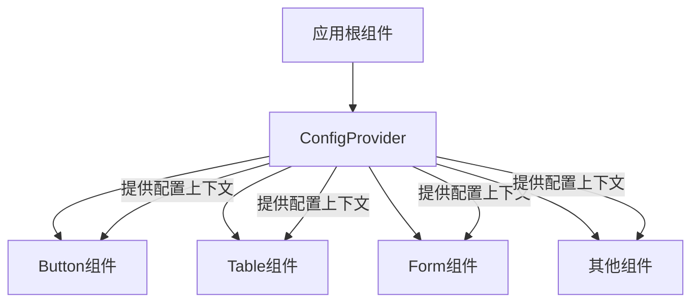
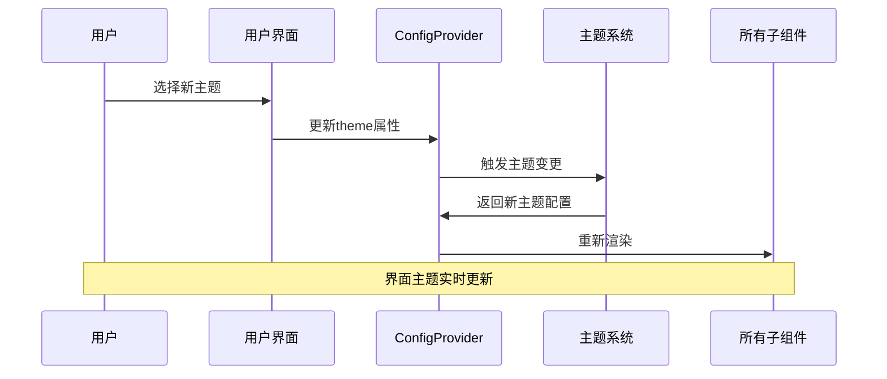
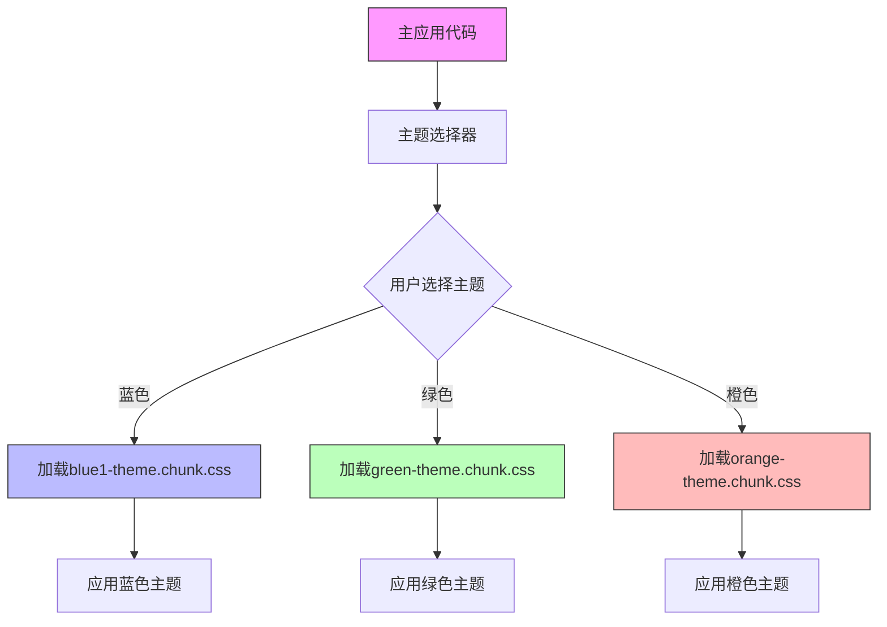

# 内置主题使用

<cite>
**本文档引用的文件**
- [theme-blue1.css](file://libs/theme/theme-blue1.css)
- [theme-blue2.css](file://libs/theme/theme-blue2.css)
- [theme-blue3.css](file://libs/theme/theme-blue3.css)
- [theme-blue4.css](file://libs/theme/theme-blue4.css)
- [theme-default.css](file://libs/theme/theme-default.css)
- [theme-green.css](file://libs/theme/theme-green.css)
- [theme-green2.css](file://libs/theme/theme-green2.css)
- [theme-orange.css](file://libs/theme/theme-orange.css)
- [theme-pink.css](file://libs/theme/theme-pink.css)
- [theme-purple.css](file://libs/theme/theme-purple.css)
- [theme-red.css](file://libs/theme/theme-red.css)
- [config-provider/v2/provider.tsx](file://src/config-provider/v2/provider.tsx)
- [config-provider/v2/functions.ts](file://src/config-provider/v2/functions.ts)
- [config-provider/v2/context.ts](file://src/config-provider/v2/context.ts)
- [core/style/_color.scss](file://src/core/style/_color.scss)
- [button/scss/variable.scss](file://src/button/scss/variable.scss)
</cite>

## 目录
1. [预设主题概览](#预设主题概览)
2. [主题激活方式](#主题激活方式)
3. [CSS变量命名规范](#css变量命名规范)
4. [主题与ConfigProvider协同机制](#主题与configprovider协同机制)
5. [多主题按需加载与代码分割](#多主题按需加载与代码分割)

## 预设主题概览

fat-design 提供了多种预设主题，位于 `libs/theme` 目录下，每个主题文件定义了一套完整的视觉风格。这些主题通过 CSS 自定义属性（CSS Variables）实现，可以轻松地在不同视觉风格之间切换。

### 主题风格与适用场景

**蓝色主题系列**
- `theme-blue1.css`: 以浅蓝色为主色调，适用于需要清新、现代感的管理后台系统
- `theme-blue2.css`: 深蓝色调，适合企业级应用，传达专业、稳重的形象
- `theme-blue3.css`: 高对比度蓝色，适合需要突出品牌色的场景
- `theme-blue4.css`: 柔和蓝色，适合教育类或医疗类应用

**绿色主题**
- `theme-green.css`: 生态绿色，适用于环保、健康类应用
- `theme-green2.css`: 深绿色，适合金融、投资类应用，传达稳健、安全的感觉

**其他主题**
- `theme-orange.css`: 橙色主题，充满活力，适合创意类、年轻化的产品
- `theme-pink.css`: 粉色主题，适合女性用户为主的产品
- `theme-purple.css`: 紫色主题，具有科技感和神秘感，适合创新类应用
- `theme-red.css`: 红色主题，强调警示和重要性，适合监控、报警类系统
- `theme-default.css`: 默认主题，中性色调，适用于大多数通用场景

**Section sources**
- [theme-blue1.css](file://libs/theme/theme-blue1.css)
- [theme-blue2.css](file://libs/theme/theme-blue2.css)
- [theme-blue3.css](file://libs/theme/theme-blue3.css)
- [theme-blue4.css](file://libs/theme/theme-blue4.css)
- [theme-default.css](file://libs/theme/theme-default.css)
- [theme-green.css](file://libs/theme/theme-green.css)
- [theme-green2.css](file://libs/theme/theme-green2.css)
- [theme-orange.css](file://libs/theme/theme-orange.css)
- [theme-pink.css](file://libs/theme/theme-pink.css)
- [theme-purple.css](file://libs/theme/theme-purple.css)
- [theme-red.css](file://libs/theme/theme-red.css)

## 主题激活方式

开发者可以通过引入相应的 CSS 文件来激活特定主题。这是最直接的主题切换方式。

### 引入CSS文件激活主题

```typescript
// 激活蓝色主题1
import 'fat-design/libs/theme/theme-blue1.css';

// 激活绿色主题
import 'fat-design/libs/theme/theme-green.css';

// 激活默认主题
import 'fat-design/libs/theme/theme-default.css';
```

当引入某个主题 CSS 文件时，该文件会定义一个以 `fatd-theme-` 开头的 CSS 类，并在其中设置一系列 CSS 变量。这些变量将被组件系统中的各个组件所使用。

例如，`theme-blue1.css` 文件定义了以下结构：

```css
.fatd-theme-blue1 {
    --color-brand1-1: rgba(230, 253, 255, 1);
    --color-brand1-5: rgba(43, 213, 255, 1);
    --color-brand1-6: rgba(3, 193, 253, 1);
    --color-brand1-9: rgba(0, 157, 214, 1);
    /* 更多颜色变量... */
}
```

**Section sources**
- [theme-blue1.css](file://libs/theme/theme-blue1.css)
- [theme-blue2.css](file://libs/theme/theme-blue2.css)

## CSS变量命名规范

fat-design 的主题系统采用了一套统一的 CSS 变量命名规范，使颜色语义清晰明确。

### 命名规则

CSS 变量采用 `--color-{category}-{level}` 的命名格式：

- `category`: 颜色类别，如 `brand`（品牌色）、`success`（成功）、`error`（错误）等
- `level`: 色阶，表示颜色的深浅程度

### 颜色语义对应关系

| 变量名模式 | 颜色语义 |
|-----------|---------|
| `--color-brand1-{n}` | 品牌主色，n值越大颜色越深 |
| `--color-success-{n}` | 成功状态色，n值越大颜色越深 |
| `--color-error-{n}` | 错误状态色，n值越大颜色越深 |
| `--color-warning-{n}` | 警告状态色，n值越大颜色越深 |
| `--color-notice-{n}` | 提示状态色，n值越大颜色越深 |
| `--color-text1-{n}` | 文本颜色，n值越大颜色越深 |
| `--color-fill1-{n}` | 背景填充色，n值越大颜色越深 |
| `--color-line1-{n}` | 边框线条色，n值越大颜色越深 |

例如，在 `theme-blue1.css` 中：
- `--color-brand1-1`: 品牌色最浅的色调
- `--color-brand1-6`: 品牌色常规色调
- `--color-brand1-9`: 品牌色最深的色调

这种命名方式使得开发者能够直观地理解每个变量的用途，同时也便于在不同主题之间保持一致性。

**Section sources**
- [theme-blue1.css](file://libs/theme/theme-blue1.css)
- [core/style/_color.scss](file://src/core/style/_color.scss)

## 主题与ConfigProvider协同机制

ConfigProvider 组件是 fat-design 主题系统的核心，它负责管理主题配置和上下文传递。

### ConfigProvider工作机制

ConfigProvider 通过 React Context 机制向下传递配置信息，包括主题相关的配置。



**Diagram sources**
- [config-provider/v2/provider.tsx](file://src/config-provider/v2/provider.tsx)
- [config-provider/v2/context.ts](file://src/config-provider/v2/context.ts)

### 类名注入流程

当使用 ConfigProvider 时，它会将主题类名注入到应用的根元素上：

1. 开发者在应用根部包裹 ConfigProvider 组件
2. ConfigProvider 读取主题配置
3. 将相应的主题类名（如 `fatd-theme-blue1`）添加到根元素
4. CSS 变量生效，影响所有子组件的样式

```typescript
import { ConfigProvider } from 'fat-design';

function App() {
  return (
    <ConfigProvider theme="blue1">
      {/* 应用内容 */}
    </ConfigProvider>
  );
}
```

### 运行时动态切换

ConfigProvider 支持运行时动态切换主题，通过状态管理实现主题的实时切换：



**Diagram sources**
- [config-provider/v2/provider.tsx](file://src/config-provider/v2/provider.tsx)
- [config-provider/v2/functions.ts](file://src/config-provider/v2/functions.ts)

**Section sources**
- [config-provider/v2/provider.tsx](file://src/config-provider/v2/provider.tsx)
- [config-provider/v2/functions.ts](file://src/config-provider/v2/functions.ts)
- [config-provider/v2/context.ts](file://src/config-provider/v2/context.ts)

## 多主题按需加载与代码分割

为了优化应用性能，建议采用按需加载和代码分割策略来管理多个主题。

### 动态导入主题

通过动态 import() 语法实现主题的按需加载：

```typescript
// 按需加载蓝色主题
async function loadBlueTheme() {
  await import('fat-design/libs/theme/theme-blue1.css');
  // 主题已加载并生效
}

// 按需加载绿色主题
async function loadGreenTheme() {
  await import('fat-design/libs/theme/theme-green.css');
  // 主题已加载并生效
}
```

### 代码分割最佳实践

在构建时，可以将不同主题分割到独立的 chunk 中，实现真正的按需加载：



**Diagram sources**
- [theme-blue1.css](file://libs/theme/theme-blue1.css)
- [theme-green.css](file://libs/theme/theme-green.css)
- [theme-orange.css](file://libs/theme/theme-orange.css)

### 主题切换管理器

建议创建一个主题管理器来统一处理主题的加载和切换：

```typescript
class ThemeManager {
  private static loadedThemes = new Set<string>();
  
  static async loadTheme(themeName: string) {
    // 避免重复加载
    if (this.loadedThemes.has(themeName)) {
      return;
    }
    
    try {
      await import(`fat-design/libs/theme/theme-${themeName}.css`);
      this.loadedThemes.add(themeName);
    } catch (error) {
      console.error(`Failed to load theme: ${themeName}`, error);
    }
  }
  
  static isThemeLoaded(themeName: string) {
    return this.loadedThemes.has(themeName);
  }
}
```

这种按需加载策略可以显著减少初始加载时间，特别是在应用支持多个主题的情况下。

**Section sources**
- [theme-blue1.css](file://libs/theme/theme-blue1.css)
- [theme-green.css](file://libs/theme/theme-green.css)
- [theme-orange.css](file://libs/theme/theme-orange.css)