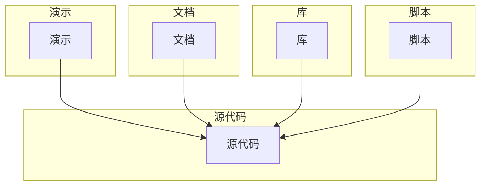
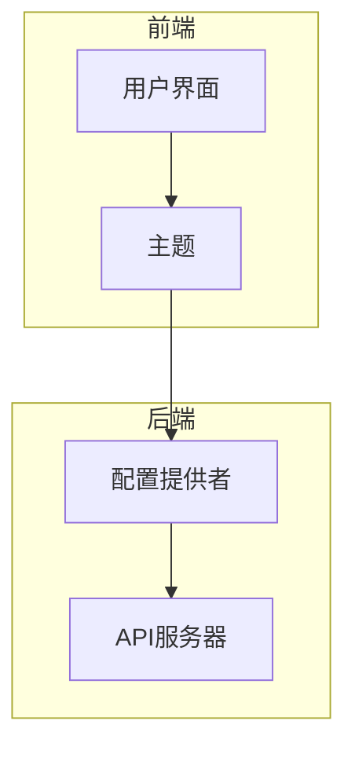
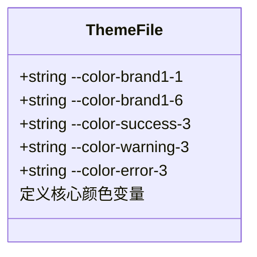
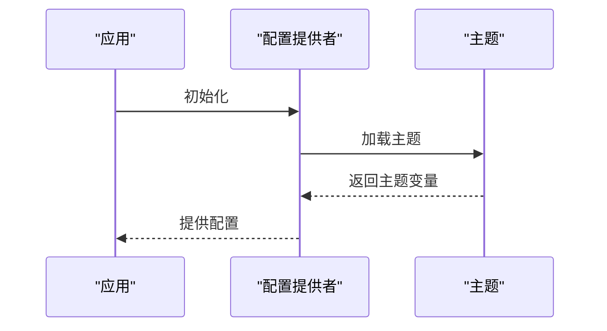
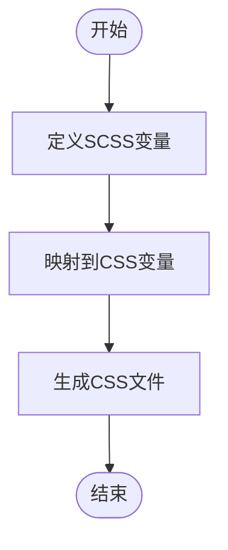
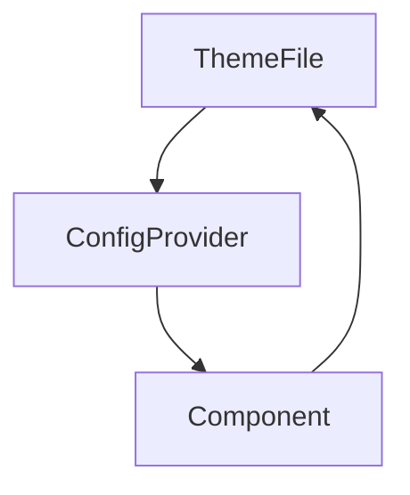

# 自定义主题开发

<cite>
**本文档引用的文件**
- [theme-default.css](file://libs/theme/theme-default.css)
- [context.ts](file://src/config-provider/v2/context.ts)
- [provider.tsx](file://src/config-provider/v2/provider.tsx)
- [variable.scss](file://src/core/style/_color.scss)
- [button.jsx](file://src/button/view/button.jsx)
- [card.scss](file://src/card/scss/variable.scss)
- [vite.config.ts](file://vite.config.ts)
</cite>

## 目录
1. [简介](#简介)
2. [项目结构](#项目结构)
3. [核心组件](#核心组件)
4. [架构概述](#架构概述)
5. [详细组件分析](#详细组件分析)
6. [依赖分析](#依赖分析)
7. [性能考虑](#性能考虑)
8. [故障排除指南](#故障排除指南)
9. [结论](#结论)
10. [附录](#附录)（如有必要）

## 简介
本文档旨在为开发者提供一个全面的指南，以创建基于`theme-default.css`中CSS变量体系的全新主题文件。我们将深入探讨如何定义和覆盖核心颜色变量（如`--color-brand1-6`主色、`--color-success-3`成功色等），并确保与组件库的兼容性。此外，文档还将介绍通过SCSS变量映射生成主题CSS的自动化方案，以及如何利用ConfigProvider的context机制实现运行时主题切换API。最后，我们还会分享一些主题调试技巧、CSS变量继承规则和构建优化建议，以确保自定义主题在不同设备和分辨率下的渲染一致性。

## 项目结构
本项目的结构清晰地分为几个主要部分：演示(demo)、文档(doc)、库(libs)、脚本(script)和源代码(src)。每个部分都有其特定的功能和责任，共同支持自定义主题的开发。

**图示来源**
- [theme-default.css](file://libs/theme/theme-default.css#L1-L60)
- [context.ts](file://src/config-provider/v2/context.ts#L1-L20)

**本节来源**
- [theme-default.css](file://libs/theme/theme-default.css#L1-L60)
- [context.ts](file://src/config-provider/v2/context.ts#L1-L20)

## 核心组件
在自定义主题开发中，核心组件包括主题文件、配置提供者和SCSS变量映射。这些组件共同作用，确保主题的一致性和可维护性。

**本节来源**
- [theme-default.css](file://libs/theme/theme-default.css#L1-L60)
- [context.ts](file://src/config-provider/v2/context.ts#L1-L20)

## 架构概述
整个系统的架构围绕着CSS变量和React的context机制展开。通过定义一系列CSS变量，我们可以轻松地改变应用的外观，而无需修改大量的CSS代码。同时，利用React的context，我们可以在运行时动态地切换主题。

**图示来源**
- [theme-default.css](file://libs/theme/theme-default.css#L1-L60)
- [provider.tsx](file://src/config-provider/v2/provider.tsx#L1-L77)

## 详细组件分析
### 主题文件分析
主题文件是自定义主题的基础。通过查看`theme-default.css`，我们可以看到一系列预定义的CSS变量，这些变量涵盖了从品牌色到功能色的各种颜色。

**图示来源**
- [theme-default.css](file://libs/theme/theme-default.css#L1-L60)

**本节来源**
- [theme-default.css](file://libs/theme/theme-default.css#L1-L60)

### 配置提供者分析
配置提供者负责管理应用的全局配置，包括主题设置。通过`ConfigProvider`，我们可以将配置传递给应用中的所有组件。

**图示来源**
- [provider.tsx](file://src/config-provider/v2/provider.tsx#L1-L77)

**本节来源**
- [provider.tsx](file://src/config-provider/v2/provider.tsx#L1-L77)

### SCSS变量映射分析
SCSS变量映射允许我们将CSS变量转换为SCSS变量，从而在编译时生成最终的CSS文件。这使得主题的定制更加灵活和高效。

**图示来源**
- [variable.scss](file://src/core/style/_color.scss#L1-L199)

**本节来源**
- [variable.scss](file://src/core/style/_color.scss#L1-L199)

## 依赖分析
项目中的依赖关系主要体现在主题文件、配置提供者和组件之间的交互。通过合理的依赖管理，我们可以确保主题的稳定性和可扩展性。

**图示来源**
- [theme-default.css](file://libs/theme/theme-default.css#L1-L60)
- [provider.tsx](file://src/config-provider/v2/provider.tsx#L1-L77)

**本节来源**
- [theme-default.css](file://libs/theme/theme-default.css#L1-L60)
- [provider.tsx](file://src/config-provider/v2/provider.tsx#L1-L77)

## 性能考虑
在开发自定义主题时，性能是一个重要的考虑因素。通过合理使用CSS变量和SCSS变量映射，我们可以减少CSS文件的大小，提高加载速度。此外，利用React的context机制，我们可以避免不必要的重新渲染，进一步提升应用的性能。

## 故障排除指南
在开发过程中，可能会遇到各种问题。以下是一些常见的故障排除技巧：
- **检查CSS变量是否正确覆盖**：确保在自定义主题文件中正确地覆盖了所需的CSS变量。
- **验证SCSS变量映射**：确保SCSS变量正确地映射到了CSS变量。
- **调试运行时主题切换**：使用浏览器的开发者工具检查主题切换是否按预期工作。

**本节来源**
- [theme-default.css](file://libs/theme/theme-default.css#L1-L60)
- [provider.tsx](file://src/config-provider/v2/provider.tsx#L1-L77)

## 结论
通过本文档的指导，开发者可以轻松地创建和管理自定义主题。利用CSS变量和React的context机制，我们可以实现高度可定制的主题系统，同时保持良好的性能和可维护性。

## 附录
如有需要，可以在附录中添加更多详细信息或参考资料。