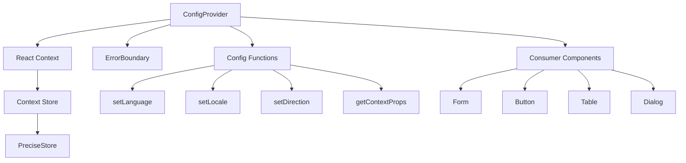
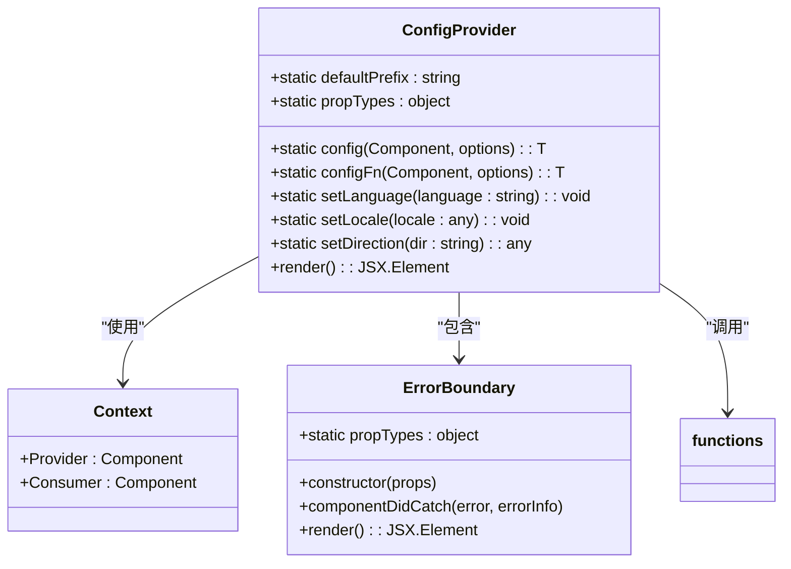
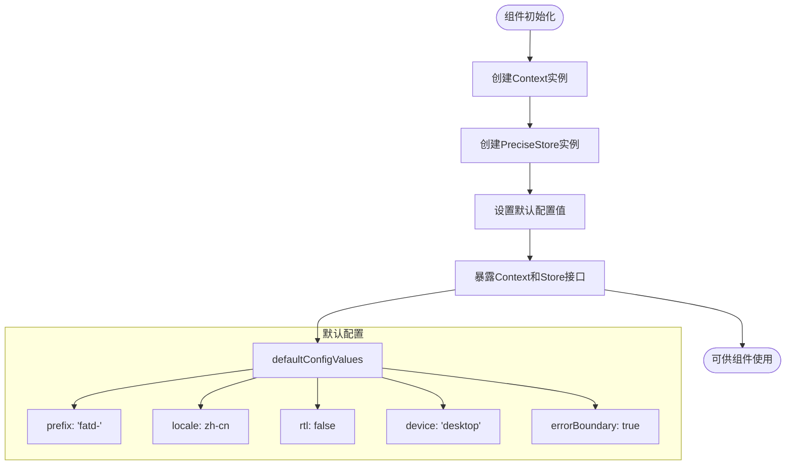
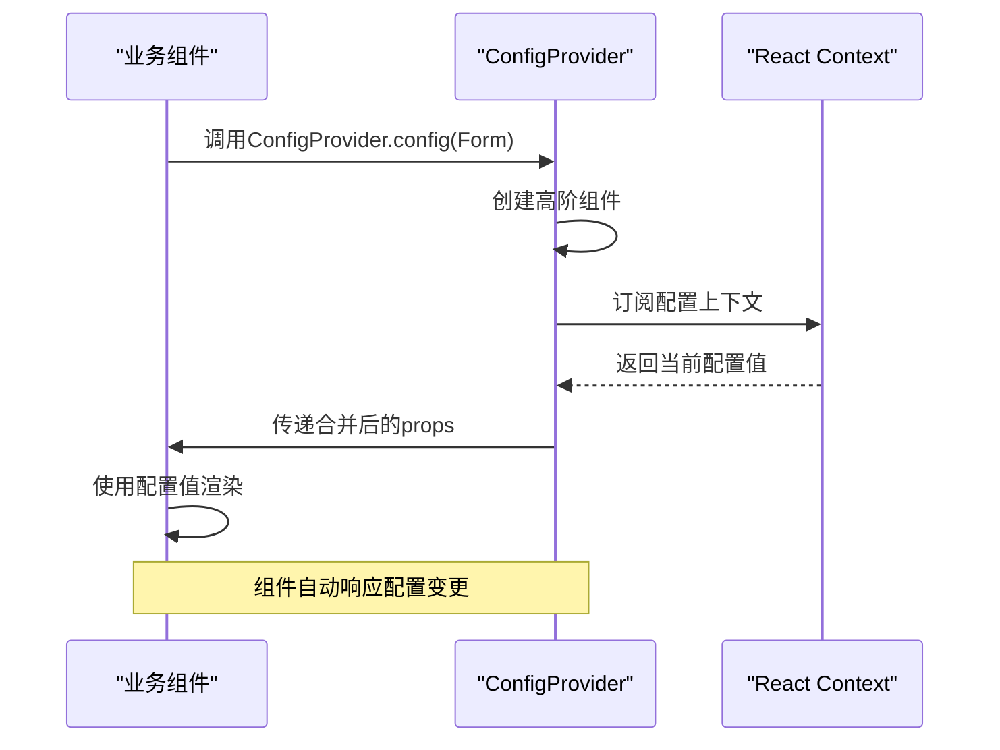
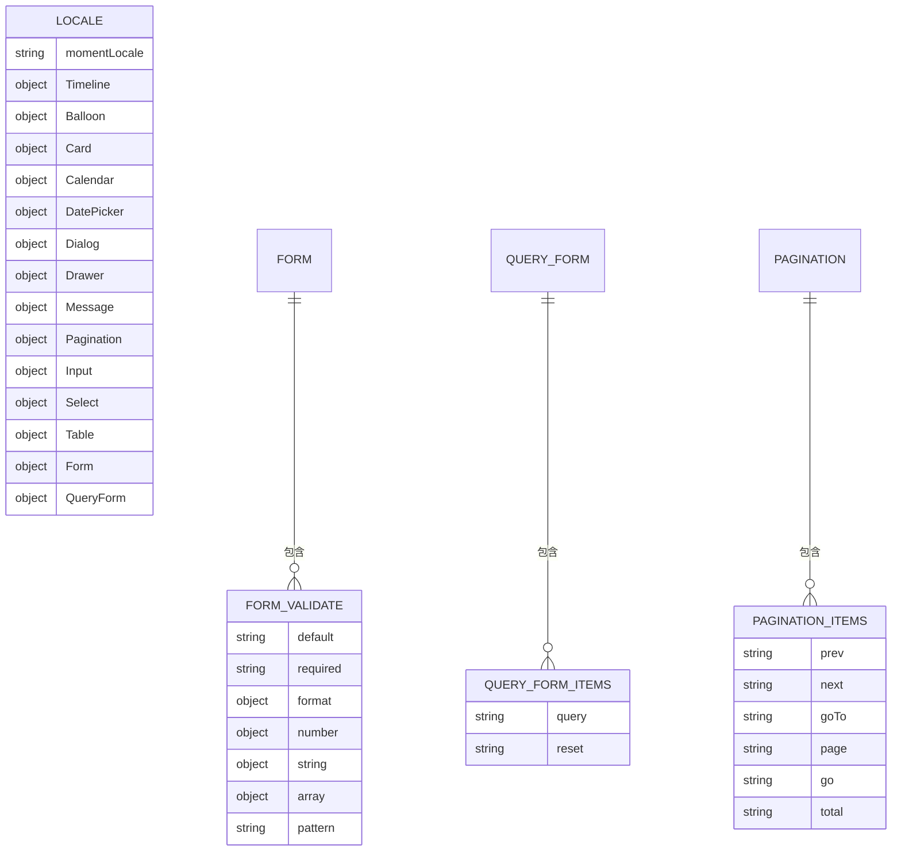
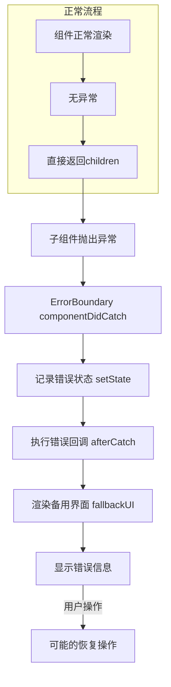
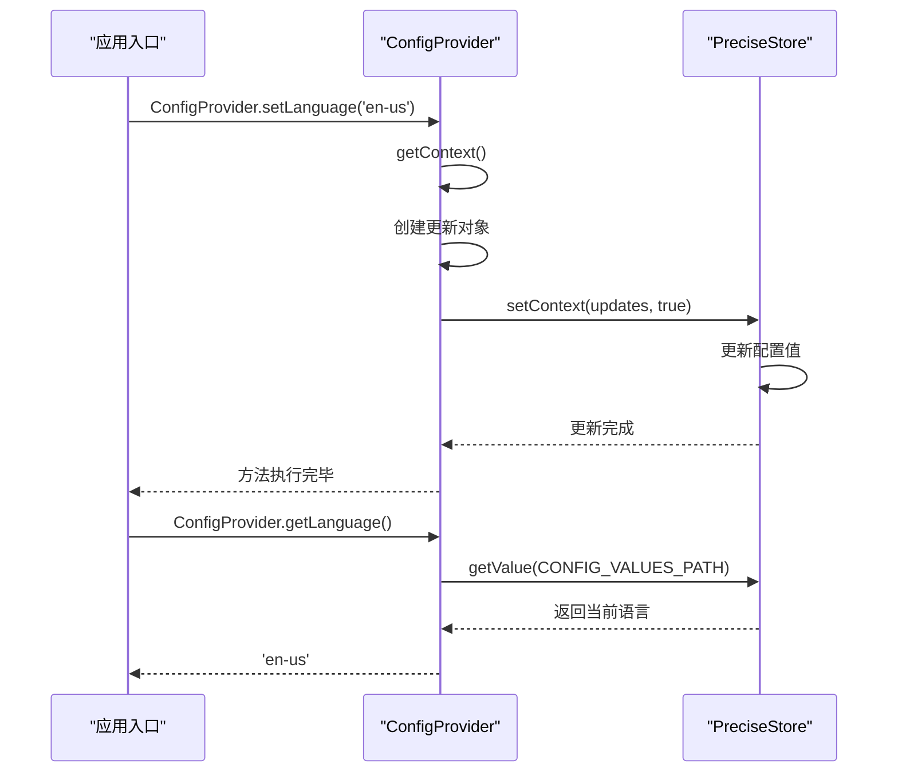
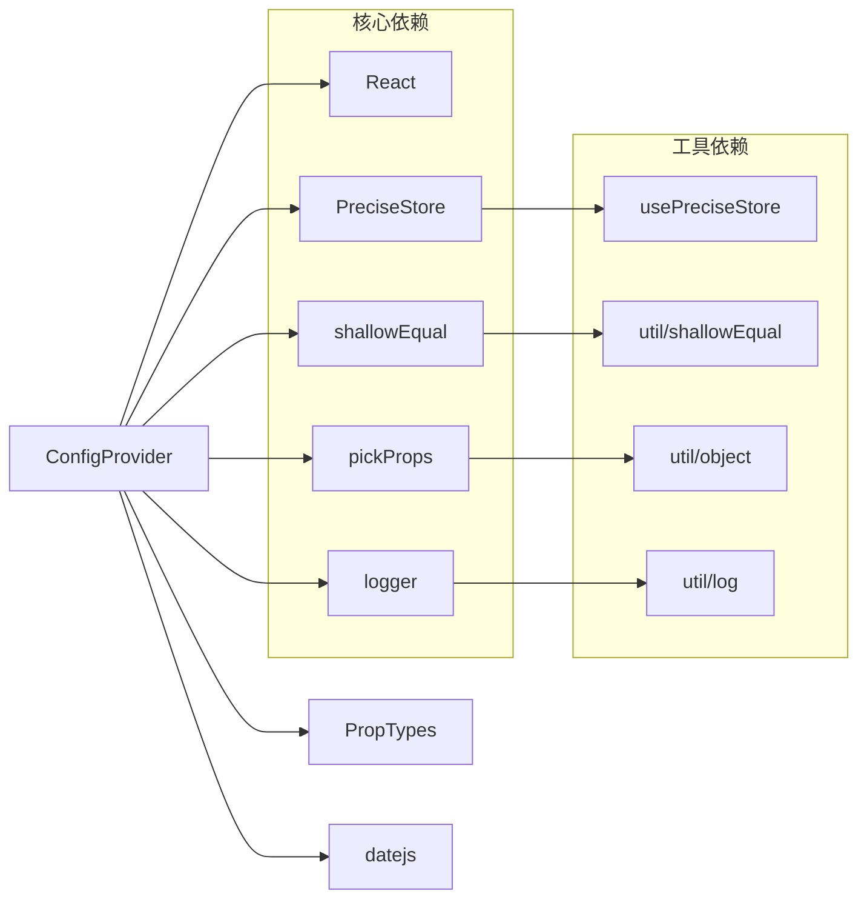

# 全局配置

<cite>
**本文档引用文件**  
- [config-provider.tsx](file://src/config-provider/v2/provider.tsx)
- [context.ts](file://src/config-provider/v2/context.ts)
- [functions.ts](file://src/config-provider/v2/functions.ts)
- [types.ts](file://src/config-provider/v2/types.ts)
- [constants.ts](file://src/config-provider/constants.ts)
- [error-boundary.tsx](file://src/config-provider/v2/error-boundary.tsx)
- [zh-cn.js](file://src/locale/zh-cn.js)
</cite>

## 目录
1. [简介](#简介)
2. [架构概览](#架构概览)
3. [核心组件分析](#核心组件分析)
4. [配置项详解](#配置项详解)
5. [国际化与主题切换](#国际化与主题切换)
6. [错误边界机制](#错误边界机制)
7. [静态方法使用](#静态方法使用)
8. [依赖分析](#依赖分析)

## 简介
全局配置系统是Fat Design组件库的核心基础设施，通过ConfigProvider组件实现全局配置的注入与消费。该系统基于React Context API构建，为所有子组件提供统一的配置环境，包括国际化、类名前缀、布局方向等关键配置。系统设计注重性能优化，采用精确的状态管理机制，确保配置变更时仅重新渲染受影响的组件。

## 架构概览



**图表来源**  
- [provider.tsx](file://src/config-provider/v2/provider.tsx#L1-L76)
- [context.ts](file://src/config-provider/v2/context.ts#L1-L18)
- [functions.ts](file://src/config-provider/v2/functions.ts#L1-L274)

## 核心组件分析

### ConfigProvider 组件实现

ConfigProvider组件作为全局配置的提供者，通过React Context机制将配置值注入到组件树中。组件采用函数式组件与React.memo结合的方式实现，确保在配置值未发生变化时避免不必要的重新渲染。



**图表来源**  
- [provider.tsx](file://src/config-provider/v2/provider.tsx#L1-L76)
- [index.tsx](file://src/config-provider/v2/index.tsx#L1-L41)
- [error-boundary.tsx](file://src/config-provider/v2/error-boundary.tsx#L1-L70)

**本节来源**  
- [provider.tsx](file://src/config-provider/v2/provider.tsx#L1-L76)
- [index.tsx](file://src/config-provider/v2/index.tsx#L1-L41)

### 配置上下文管理

系统通过React.createContext创建全局配置上下文，并使用PreciseStore进行状态管理。PreciseStore确保只有当配置值真正发生变化时才触发状态更新，有效避免了不必要的渲染。



**图表来源**  
- [context.ts](file://src/config-provider/v2/context.ts#L1-L18)
- [constants.ts](file://src/config-provider/constants.ts#L1-L22)

**本节来源**  
- [context.ts](file://src/config-provider/v2/context.ts#L1-L18)
- [constants.ts](file://src/config-provider/constants.ts#L1-L22)

## 配置项详解

### 核心配置项

全局配置系统提供多个关键配置项，这些配置项通过IConfigValues接口定义，可应用于整个应用的组件行为。

| 配置项 | 类型 | 默认值 | 说明 |
|-------|------|-------|------|
| prefix | string | 'fatd-' | 组件类名前缀，用于CSS样式隔离 |
| locale | object | zh-cn语言包 | 国际化文案配置 |
| defaultPropsConfig | object | null | 全局默认属性配置 |
| warning | boolean | false | 警告信息显示开关 |
| rtl | boolean | false | 是否启用从右到左布局 |
| device | string | 'desktop' | 设备类型（tablet/desktop/phone） |
| popupContainer | function | null | 弹层容器自定义函数 |
| errorBoundary | boolean/object | true | 错误边界开关及配置 |
| globalLocales | object | { 'zh-cn': zh-cn } | 所有语言环境的文案集合 |
| currentGlobalLanguage | string | 'zh-cn' | 当前激活的语言环境 |
| currentGlobalRtl | boolean | false | 当前布局方向状态 |

**本节来源**  
- [types.ts](file://src/config-provider/v2/types.ts#L1-L24)
- [constants.ts](file://src/config-provider/constants.ts#L1-L22)

### 配置注入机制

ConfigProvider通过高阶函数config和configFn实现配置注入，使普通组件能够消费全局配置。



**图表来源**  
- [index.tsx](file://src/config-provider/v2/index.tsx#L1-L41)
- [functions.ts](file://src/config-provider/v2/functions.ts#L1-L274)

**本节来源**  
- [index.tsx](file://src/config-provider/v2/index.tsx#L1-L41)
- [functions.ts](file://src/config-provider/v2/functions.ts#L1-L274)

## 国际化与主题切换

### 语言包结构

系统内置多语言支持，语言包采用层级结构组织，每个组件拥有独立的文案配置。



**图表来源**  
- [zh-cn.js](file://src/locale/zh-cn.js#L1-L207)
- [types.ts](file://src/config-provider/v2/types.ts#L1-L24)

### 动态语言切换

系统提供setLanguage和setLocale方法实现动态语言切换，支持运行时修改界面语言。

```mermaid
flowchart TD
A[调用setLanguage('en-us')] --> B["获取当前配置 getContext()"]
B --> C["创建更新对象 updates"]
C --> D["合并新语言文案"]
D --> E["更新全局配置 setContext(updates)"]
E --> F["触发Context变更"]
F --> G["所有订阅组件重新渲染"]
G --> H["界面语言切换完成"]
subgraph "文案合并逻辑"
I["新语言文案 newLocale"]
I --> J["基础中文文案 zhCN"]
I --> K["上下文语言文案 contextValues.locale"]
I --> L["组件属性语言文案 props.locale"]
I --> M["深度合并最终文案"]
end
E --> I
```

**图表来源**  
- [functions.ts](file://src/config-provider/v2/functions.ts#L130-L179)
- [zh-cn.js](file://src/locale/zh-cn.js#L1-L207)

**本节来源**  
- [functions.ts](file://src/config-provider/v2/functions.ts#L130-L179)
- [zh-cn.js](file://src/locale/zh-cn.js#L1-L207)

## 错误边界机制

### 错误边界实现

ConfigProvider集成错误边界功能，为应用提供优雅的错误处理能力。

```mermaid
classDiagram
class ErrorBoundary {
-error : object
-errorInfo : object
+constructor(props)
+componentDidCatch(error, errorInfo)
+render() : JSX.Element
}
class DefaultUI {
+render() : JSX.Element
}
ErrorBoundary --> DefaultUI : "使用"
ErrorBoundary : +afterCatch : function
ErrorBoundary : +fallbackUI : function
ErrorBoundary : +componentName : string
note right of ErrorBoundary
错误边界捕获子组件渲染异常，
防止整个应用崩溃，提供自定义
错误展示界面和错误上报机制。
end note
```

**图表来源**  
- [error-boundary.tsx](file://src/config-provider/v2/error-boundary.tsx#L1-L70)

### 错误处理流程



**图表来源**  
- [error-boundary.tsx](file://src/config-provider/v2/error-boundary.tsx#L1-L70)

**本节来源**  
- [error-boundary.tsx](file://src/config-provider/v2/error-boundary.tsx#L1-L70)

## 静态方法使用

### 配置方法调用

ConfigProvider提供多个静态方法用于配置管理和状态查询。



**图表来源**  
- [functions.ts](file://src/config-provider/v2/functions.ts#L1-L274)
- [index.tsx](file://src/config-provider/v2/index.tsx#L1-L41)

### 静态方法示例

```typescript
// 设置当前语言
ConfigProvider.setLanguage('en-us');

// 设置自定义语言包
ConfigProvider.setLocale({
    momentLocale: 'en-us',
    Dialog: {
        ok: 'OK',
        cancel: 'Cancel'
    },
    Form: {
        buttonSubmit: 'Submit',
        buttonReset: 'Reset'
    }
});

// 设置布局方向
ConfigProvider.setDirection('rtl');

// 获取当前语言
const currentLang = ConfigProvider.getLanguage();

// 获取当前配置
const config = ConfigProvider.getContext();
```

**本节来源**  
- [functions.ts](file://src/config-provider/v2/functions.ts#L1-L274)
- [index.tsx](file://src/config-provider/v2/index.tsx#L1-L41)

## 依赖分析



**图表来源**  
- [provider.tsx](file://src/config-provider/v2/provider.tsx#L1-L76)
- [context.ts](file://src/config-provider/v2/context.ts#L1-L18)
- [functions.ts](file://src/config-provider/v2/functions.ts#L1-L274)

**本节来源**  
- [provider.tsx](file://src/config-provider/v2/provider.tsx#L1-L76)
- [context.ts](file://src/config-provider/v2/context.ts#L1-L18)
- [functions.ts](file://src/config-provider/v2/functions.ts#L1-L274)