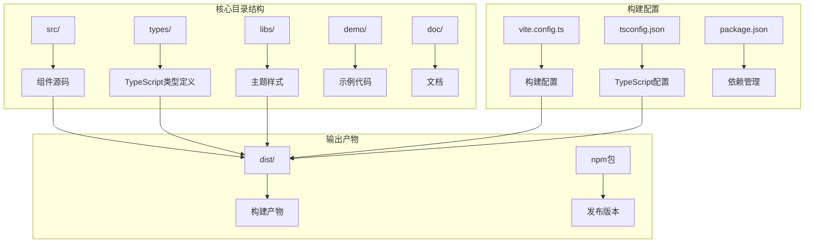

# 安装与集成指南

<cite>
**本文档中引用的文件**
- [README.md](file://README.md)
- [package.json](file://package.json)
- [tsconfig.json](file://tsconfig.json)
- [vite.config.ts](file://vite.config.ts)
- [src/index.tsx](file://src/index.tsx)
- [src/libs.tsx](file://src/libs.tsx)
- [src/others.ts](file://src/others.ts)
- [src/util/comp.tsx](file://src/util/comp.tsx)
- [libs/theme/theme-default.css](file://libs/theme/theme-default.css)
- [libs/theme/theme-blue1.css](file://libs/theme/theme-blue1.css)
</cite>

## 目录
1. [简介](#简介)
2. [项目结构概览](#项目结构概览)
3. [安装指南](#安装指南)
4. [构建工具集成](#构建工具集成)
5. [TypeScript配置](#typescript配置)
6. [组件导入方式](#组件导入方式)
7. [主题系统](#主题系统)
8. [常见问题解决](#常见问题解决)
9. [性能优化建议](#性能优化建议)
10. [总结](#总结)

## 简介

fat-design 是一个轻量级的 React 组件库，具有以下特点：
- **体积小巧**：构建后仅 761KB，比 Next.js 组件库更轻量
- **功能强大**：包含 Form2、Table、Image、QueryForm 等高级组件
- **兼容性强**：支持 React 16、17、18 版本
- **现代化架构**：基于 Vite 和 TypeScript 构建

该组件库采用模块化设计，支持按需加载和 Tree Shaking，能够有效减少应用的打包体积。

## 项目结构概览



**图表来源**
- [src/index.tsx](file://src/index.tsx#L1-L13)
- [vite.config.ts](file://vite.config.ts#L1-L121)
- [package.json](file://package.json#L1-L54)

## 安装指南

### 使用 npm 安装

```bash
# 安装最新版本
npm install fat-design

# 指定版本安装
npm install fat-design@latest

# 开发环境安装（可选）
npm install --save-dev fat-design
```

### 使用 yarn 安装

```bash
# 安装最新版本
yarn add fat-design

# 指定版本安装
yarn add fat-design@latest

# 开发环境安装
yarn add --dev fat-design
```

### 使用 pnpm 安装

```bash
# 安装最新版本
pnpm add fat-design

# 指定版本安装
pnpm add fat-design@latest

# 开发环境安装
pnpm add -D fat-design
```

### 包管理器对比

| 特性 | npm | yarn | pnpm |
|------|-----|------|------|
| 安装速度 | 中等 | 快 | 最快 |
| 缓存机制 | 内置缓存 | 内置缓存 | 文件系统共享缓存 |
| 并发性 | 单线程 | 多线程 | 多线程 |
| 锁文件 | package-lock.json | yarn.lock | pnpm-lock.yaml |

**章节来源**
- [package.json](file://package.json#L1-L54)
- [README.md](file://README.md#L1-L35)

## 构建工具集成

### Vite 集成

Vite 是 fat-design 推荐的构建工具，配置简单且性能优异。

#### 基础配置

```javascript
// vite.config.ts
import { defineConfig } from 'vite'
import react from '@vitejs/plugin-react'

export default defineConfig({
  plugins: [
    react(),
  ],
  build: {
    rollupOptions: {
      external: ['react', 'react-dom'],
      output: {
        globals: {
          react: 'React',
          'react-dom': 'ReactDOM',
        },
      },
    },
  },
})
```

#### 样式处理配置

```javascript
// vite.config.ts
export default defineConfig({
  css: {
    preprocessorOptions: {
      scss: {
        additionalData: `@import "@/styles/variables.scss";`,
      },
    },
  },
})
```

### Webpack 集成

```javascript
// webpack.config.js
module.exports = {
  resolve: {
    extensions: ['.js', '.jsx', '.ts', '.tsx'],
  },
  module: {
    rules: [
      {
        test: /\.(js|jsx|ts|tsx)$/,
        exclude: /node_modules/,
        use: {
          loader: 'babel-loader',
          options: {
            presets: ['@babel/preset-env', '@babel/preset-react']
          }
        }
      },
      {
        test: /\.scss$/,
        use: ['style-loader', 'css-loader', 'sass-loader']
      }
    ]
  },
  externals: {
    react: 'React',
    'react-dom': 'ReactDOM',
  }
}
```

### Rollup 集成

```javascript
// rollup.config.js
import resolve from '@rollup/plugin-node-resolve'
import commonjs from '@rollup/plugin-commonjs'
import babel from '@rollup/plugin-babel'

export default {
  input: 'src/index.js',
  output: {
    file: 'dist/bundle.js',
    format: 'umd',
    name: 'FatDesign',
    globals: {
      react: 'React',
      'react-dom': 'ReactDOM',
    }
  },
  external: ['react', 'react-dom'],
  plugins: [
    resolve(),
    commonjs(),
    babel({ babelHelpers: 'bundled' })
  ]
}
```

**章节来源**
- [vite.config.ts](file://vite.config.ts#L1-L121)
- [package.json](file://package.json#L6-L15)

## TypeScript配置

### 基础配置

```json
{
  "compilerOptions": {
    "target": "ESNext",
    "module": "ESNext",
    "moduleResolution": "Node",
    "lib": ["DOM", "DOM.Iterable", "ESNext"],
    "jsx": "react-jsx",
    "strict": true,
    "esModuleInterop": true,
    "allowSyntheticDefaultImports": true,
    "skipLibCheck": true,
    "forceConsistentCasingInFileNames": true,
    "declaration": true,
    "declarationMap": true,
    "sourceMap": true
  },
  "include": ["src"],
  "exclude": ["node_modules", "dist"]
}
```

### 高级配置选项

```json
{
  "compilerOptions": {
    "baseUrl": ".",
    "paths": {
      "@/*": ["src/*"],
      "fat-design": ["node_modules/fat-design/src/index.tsx"]
    },
    "types": ["node", "vite/client"],
    "typeRoots": ["node_modules/@types", "src/types"],
    "outDir": "dist",
    "rootDir": "src"
  }
}
```

### 类型声明文件

fat-design 提供完整的 TypeScript 类型支持：

```typescript
// 自动导入类型
import { Button, Form, Table } from 'fat-design'

// 手动导入类型
import type { ButtonProps, FormProps, TableProps } from 'fat-design'
```

**章节来源**
- [tsconfig.json](file://tsconfig.json#L1-L23)
- [src/libs.tsx](file://src/libs.tsx#L1-L67)

## 组件导入方式

### 全局导入（不推荐）

```javascript
import FatDesign from 'fat-design'
import 'fat-design/dist/style.css'

// 使用组件
<FatDesign.Button>点击我</FatDesign.Button>
```

### 按需导入（推荐）

```javascript
// 单个组件导入
import { Button } from 'fat-design'
import 'fat-design/es/button/style/css'

// 多个组件导入
import { Button, Form, Table } from 'fat-design'
import 'fat-design/es/button/style/css'
import 'fat-design/es/form/style/css'
import 'fat-design/es/table/style/css'
```

### Tree Shaking 优化

```javascript
// 自动 Tree Shaking
import { Button } from 'fat-design'
import { Form } from 'fat-design'
import { Table } from 'fat-design'

// 只会打包用到的组件
<Button>点击我</Button>
<Form />
<Table />
```

### 动态导入

```javascript
// 按需加载组件
const Button = await import('fat-design/es/button')
const Form = await import('fat-design/es/form')

// 使用动态组件
const DynamicButton = () => (
  <Button.default>动态按钮</Button.default>
)
```

### 组件别名导入

```javascript
// 别名导入
import { Button as FatButton } from 'fat-design'
import { Form as FatForm } from 'fat-design'

// 使用别名
<FatButton>按钮</FatButton>
<FatForm />
```

**章节来源**
- [src/index.tsx](file://src/index.tsx#L1-L13)
- [src/libs.tsx](file://src/libs.tsx#L1-L67)

## 主题系统

fat-design 提供了丰富的主题系统，支持多种预设主题和自定义主题。

### 预设主题

```javascript
// 引入默认主题
import 'fat-design/dist/theme-default.css'

// 引入蓝色主题
import 'fat-design/dist/theme-blue1.css'

// 引入绿色主题
import 'fat-design/dist/theme-green.css'

// 引入红色主题
import 'fat-design/dist/theme-red.css'
```

### 主题切换

```javascript
// 动态切换主题
function changeTheme(themeName) {
  const link = document.getElementById('fat-design-theme')
  if (link) {
    link.href = `/dist/${themeName}.css`
  } else {
    const newLink = document.createElement('link')
    newLink.id = 'fat-design-theme'
    newLink.rel = 'stylesheet'
    newLink.href = `/dist/${themeName}.css`
    document.head.appendChild(newLink)
  }
}

// 使用主题
changeTheme('theme-blue1')
```

### 自定义主题

```scss
// 自定义主题变量
:root {
  --color-brand1-1: #f0f8ff;
  --color-brand1-6: #4169e1;
  --color-brand1-9: #0000cd;
  
  --color-text1-1: #666;
  --color-text1-2: #333;
  --color-text1-3: #000;
  
  --color-line1-1: #eee;
  --color-line1-2: #ddd;
  --color-line1-3: #ccc;
}

// 应用自定义主题
.fatd-custom-theme {
  @import "fat-design/dist/style.css";
}
```

### 主题变量对照表

| 变量类别 | 变量前缀 | 描述 |
|----------|----------|------|
| 品牌色 | `--color-brand1-*` | 主色调系列 |
| 数据色 | `--color-data1-*` | 数据可视化颜色 |
| 文本色 | `--color-text1-*` | 不同级别的文本颜色 |
| 线条色 | `--color-line1-*` | 分割线和边框颜色 |
| 背景色 | `--color-bg1-*` | 页面背景和容器背景 |
| 状态色 | `--color-success-*` | 成功状态颜色 |
| 状态色 | `--color-warning-*` | 警告状态颜色 |
| 状态色 | `--color-error-*` | 错误状态颜色 |

**章节来源**
- [libs/theme/theme-default.css](file://libs/theme/theme-default.css#L1-L61)
- [libs/theme/theme-blue1.css](file://libs/theme/theme-blue1.css#L1-L59)

## 常见问题解决

### 样式冲突问题

**问题描述**：组件样式与其他库样式冲突

**解决方案**：

```javascript
// 方法1：使用CSS模块
import styles from './App.module.css'

function App() {
  return (
    <div className={styles.container}>
      <Button>按钮</Button>
    </div>
  )
}

// 方法2：使用CSS隔离
import { ConfigProvider } from 'fat-design'

function App() {
  return (
    <ConfigProvider prefixCls="my-app">
      <Button>按钮</Button>
    </ConfigProvider>
  )
}
```

### 模块解析失败

**问题描述**：无法找到模块或解析错误

**解决方案**：

```javascript
// package.json 配置
{
  "alias": {
    "fat-design": "node_modules/fat-design/dist/index.esm.js"
  },
  "resolutions": {
    "react": "^18.2.0",
    "react-dom": "^18.2.0"
  }
}

// webpack 配置
resolve: {
  alias: {
    'fat-design': path.resolve(__dirname, 'node_modules/fat-design/dist/index.esm.js')
  }
}
```

### Tree Shaking 失效

**问题描述**：打包体积过大，Tree Shaking 未生效

**解决方案**：

```javascript
// 正确的导入方式
import { Button } from 'fat-design' // ✅ 推荐
import { Button, Form } from 'fat-design' // ✅ 推荐

// 错误的导入方式
import FatDesign from 'fat-design' // ❌ 不推荐
import * as FatDesign from 'fat-design' // ❌ 不推荐
```

### React 版本兼容性

**问题描述**：React 版本不兼容导致运行时错误

**解决方案**：

```javascript
// 自动检测并配置
import { tryAutoConfig } from 'fat-design'

tryAutoConfig()

// 手动配置
import { configReactDOM18, configReactDOM19 } from 'fat-design'

if (React.version.startsWith('18.')) {
  configReactDOM18(ReactDOM, ReactDOM)
} else if (React.version.startsWith('19.')) {
  configReactDOM19(ReactDOM, ReactDOM)
}
```

### TypeScript 类型错误

**问题描述**：TypeScript 报错，找不到类型定义

**解决方案**：

```typescript
// tsconfig.json 配置
{
  "compilerOptions": {
    "typeRoots": ["node_modules/@types", "node_modules/fat-design/types"],
    "types": ["node", "fat-design"]
  }
}

// 手动导入类型
import type { ButtonProps } from 'fat-design'
```

**章节来源**
- [src/others.ts](file://src/others.ts#L1-L58)
- [src/util/comp.tsx](file://src/util/comp.tsx#L1-L125)

## 性能优化建议

### 1. 按需加载优化

```javascript
// 使用动态导入实现按需加载
const loadComponent = async (componentName) => {
  switch (componentName) {
    case 'Button':
      return (await import('fat-design/es/button')).default
    case 'Form':
      return (await import('fat-design/es/form')).default
    case 'Table':
      return (await import('fat-design/es/table')).default
    default:
      throw new Error(`Unknown component: ${componentName}`)
  }
}

// 使用懒加载组件
const LazyButton = lazy(() => import('fat-design/es/button'))
```

### 2. 样式优化

```javascript
// 只导入需要的样式
import 'fat-design/es/button/style/css' // 只导入按钮样式
import 'fat-design/es/form/style/css'  // 只导入表单样式

// 避免导入整个样式文件
// import 'fat-design/dist/style.css' // ❌ 不推荐
```

### 3. 组件缓存

```javascript
// 使用 useMemo 缓存组件实例
import { useMemo } from 'react'

function App() {
  const memoizedButton = useMemo(() => {
    return <Button>按钮</Button>
  }, [])
  
  return memoizedButton
}
```

### 4. 打包优化

```javascript
// vite.config.ts 优化配置
export default defineConfig({
  build: {
    rollupOptions: {
      output: {
        manualChunks: {
          'fat-design': ['fat-design']
        }
      }
    }
  },
  optimizeDeps: {
    include: ['fat-design']
  }
})
```

### 5. CDN 加速

```html
<!-- 使用 CDN 引入 -->
<link rel="stylesheet" href="https://unpkg.com/fat-design/dist/theme-default.css">
<script src="https://unpkg.com/fat-design/dist/index.umd.js"></script>

<!-- 使用异步加载 -->
<script async src="https://unpkg.com/fat-design/dist/index.umd.js"></script>
```

## 总结

fat-design 组件库提供了完整而灵活的安装与集成方案：

### 核心优势

1. **轻量高效**：761KB 的构建体积，支持 Tree Shaking
2. **兼容性强**：支持 React 16-19 各版本
3. **类型安全**：完整的 TypeScript 支持
4. **主题丰富**：多种预设主题和自定义能力
5. **构建友好**：支持 Vite、Webpack、Rollup 等主流构建工具

### 最佳实践

1. **按需导入**：避免全量引入，减少打包体积
2. **样式分离**：单独引入组件样式，避免样式污染
3. **类型检查**：充分利用 TypeScript 类型定义
4. **主题定制**：根据项目需求选择合适的主题
5. **性能优化**：结合动态导入和缓存策略提升性能

### 下一步建议

1. 查看官方文档获取更多组件使用示例
2. 参考 demo 目录中的实际应用场景
3. 测试不同构建工具的集成效果
4. 根据项目需求定制主题样式
5. 关注版本更新，及时升级到最新稳定版本

通过遵循本指南的最佳实践，您可以快速将 fat-design 集成到现有项目中，并获得优秀的开发体验和应用性能。