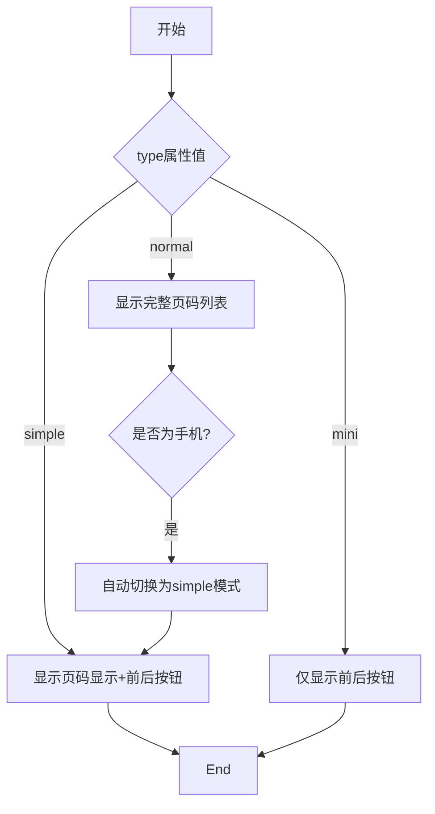
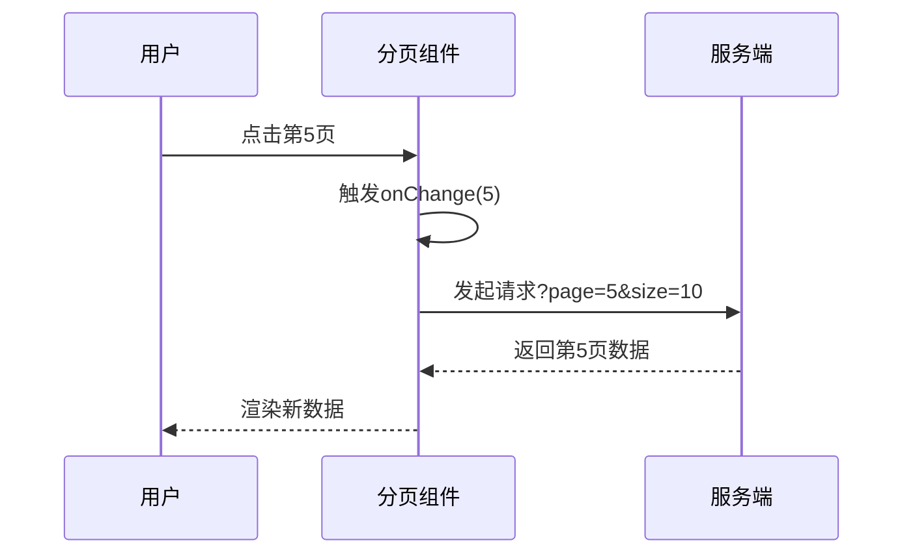
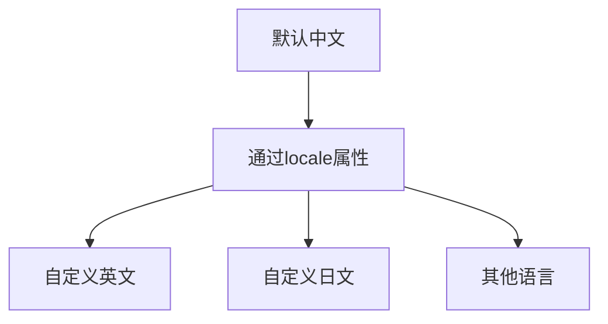

# 分页组件

<cite>
**本文档引用的文件**  
- [pagination.jsx](file://src/pagination/pagination.jsx)
- [index.d.ts](file://types/pagination/index.d.ts)
- [zh-cn.js](file://src/locale/zh-cn.js)
</cite>

## 目录
1. [简介](#简介)
2. [核心属性说明](#核心属性说明)
3. [分页模式配置](#分页模式配置)
4. [页码跳转与每页数量选择](#页码跳转与每页数量选择)
5. [服务端分页与客户端分页集成](#服务端分页与客户端分页集成)
6. [用户体验增强功能](#用户体验增强功能)
7. [国际化支持](#国际化支持)
8. [主题定制](#主题定制)
9. [与TablePro组件联动](#与tablepro组件联动)

## 简介
分页组件（Pagination）用于在数据列表中实现分页功能，支持多种展示模式和交互方式。该组件广泛应用于表格、列表等需要分页展示大量数据的场景，提供灵活的配置选项以满足不同业务需求。

**Section sources**
- [pagination.jsx](file://src/pagination/pagination.jsx#L0-L618)

## 核心属性说明
分页组件的核心属性包括 `total`、`current`、`pageSize` 和 `onChange` 回调机制，这些属性共同控制分页的行为和状态。

- **total**：表示数据的总记录数，用于计算总页数。
- **current**：受控属性，表示当前页码。若使用此属性，则需配合 `onChange` 实现页码变更的响应。
- **pageSize**：每页显示的数据条数，默认值为10。
- **onChange**：页码变化时触发的回调函数，接收新的页码作为参数，是实现分页逻辑的关键。

当 `current` 属性未设置时，组件将使用 `defaultCurrent` 作为初始页码，并在内部维护当前页状态。

**Section sources**
- [pagination.jsx](file://src/pagination/pagination.jsx#L100-L120)
- [index.d.ts](file://types/pagination/index.d.ts#L20-L40)

## 分页模式配置
分页组件支持三种展示模式，通过 `type` 属性进行配置：

- **normal（常规模式）**：显示完整的页码列表、前进后退按钮、跳转输入框等，适用于桌面端复杂场景。
- **simple（简洁模式）**：仅显示前进后退按钮和当前页/总页数的显示，适合移动端或空间受限的界面。
- **mini（迷你模式）**：只显示前进后退按钮，适用于极简设计需求。

在移动设备上，当 `type` 设置为 `normal` 时，组件会自动切换为 `simple` 模式以适应小屏幕。

**Diagram sources**
- [pagination.jsx](file://src/pagination/pagination.jsx#L579-L617)

## 页码跳转与每页数量选择
通过 `showQuickJumper` 和 `showSizeChanger` 配置项可提升用户操作效率。

- **showJump**：控制是否显示页码跳转功能。当总页数超过 `pageShowCount` 时，会显示跳转输入框和按钮，允许用户直接输入目标页码。
- **pageSizeSelector**：启用每页数量选择器，支持 `filter`（按钮组形式）和 `dropdown`（下拉选择）两种样式，用户可动态调整每页显示条数。
- **pageSizeList**：定义每页数量选择器的可选项，可为数字数组或包含 `label` 和 `value` 的对象数组。

选择每页数量后，组件会自动调整总页数，并在必要时更新当前页码以确保其有效性。

**Section sources**
- [pagination.jsx](file://src/pagination/pagination.jsx#L393-L497)

## 服务端分页与客户端分页集成
分页组件适用于两种分页模式：

- **服务端分页**：组件仅负责展示和交互，数据获取由外部逻辑处理。`onChange` 回调中应发起API请求，传递 `current` 和 `pageSize` 参数获取对应页的数据。
- **客户端分页**：所有数据已加载至前端，通过 `current` 和 `pageSize` 计算出当前页的数据子集进行展示。

无论哪种模式，都需正确设置 `total` 属性以确保页码计算准确。

**Diagram sources**
- [pagination.jsx](file://src/pagination/pagination.jsx#L199-L210)

## 用户体验增强功能
组件提供多项功能以优化用户体验：

- **hideOnlyOnePage**：当总页数为1时自动隐藏分页器，避免冗余UI。
- **pageShowCount**：控制可见页码数量，超出部分以省略号显示，防止页码过多导致布局混乱。
- **link**：为页码按钮设置跳转链接模板（如 `https://example.com/{page}`），实现静态页面跳转。
- **pageNumberRender**：自定义页码渲染函数，可用于格式化显示或添加前缀后缀。

**Section sources**
- [pagination.jsx](file://src/pagination/pagination.jsx#L357-L396)

## 国际化支持
分页组件内置国际化支持，通过 `locale` 属性传入自定义文案对象。默认使用中文（zh-CN），包含“上一页”、“下一页”、“跳至”等文本。支持动态切换语言，满足多语言应用需求。

**Diagram sources**
- [pagination.jsx](file://src/pagination/pagination.jsx#L0-L46)
- [zh-cn.js](file://src/locale/zh-cn.js)

## 主题定制
通过 `size` 属性可设置组件大小（small、medium、large），适应不同设计风格。结合项目中的主题CSS文件（如 theme-blue1.css、theme-default.css 等），可实现整体视觉风格统一。

**Section sources**
- [pagination.jsx](file://src/pagination/pagination.jsx#L130-L135)

## 与TablePro组件联动
分页组件常与 TablePro 等高级数据展示组件集成使用。TablePro 可内置 Pagination 组件，并通过自身状态管理同步 `current`、`pageSize` 和 `total` 属性，实现数据与分页的一体化控制。用户操作分页时，TablePro 自动刷新数据并保持状态一致性。

**Section sources**
- [pagination.jsx](file://src/pagination/pagination.jsx#L199-L210)
- [index.d.ts](file://types/pagination/index.d.ts)