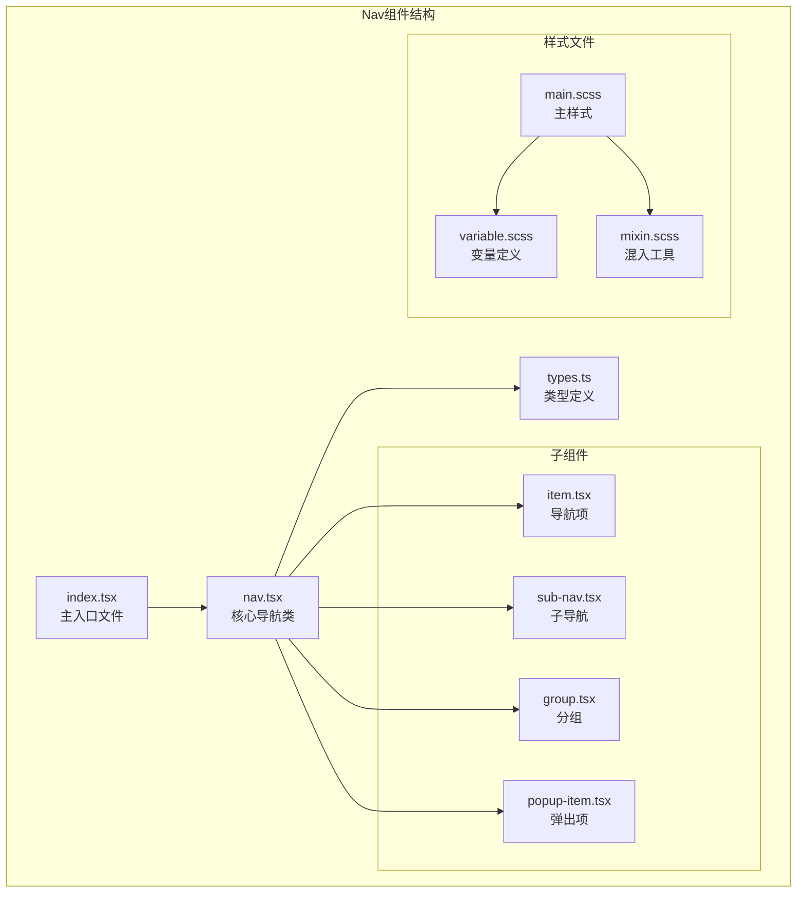
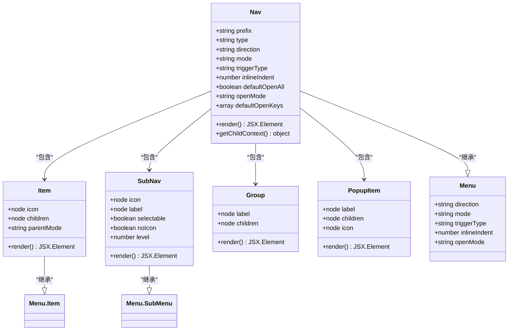
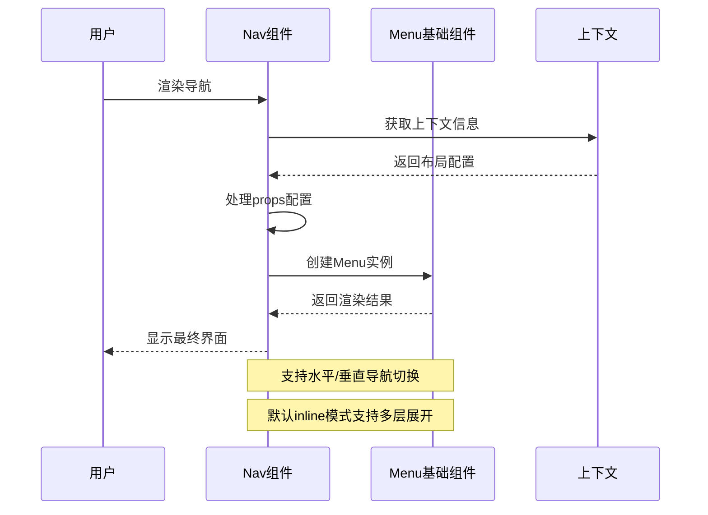
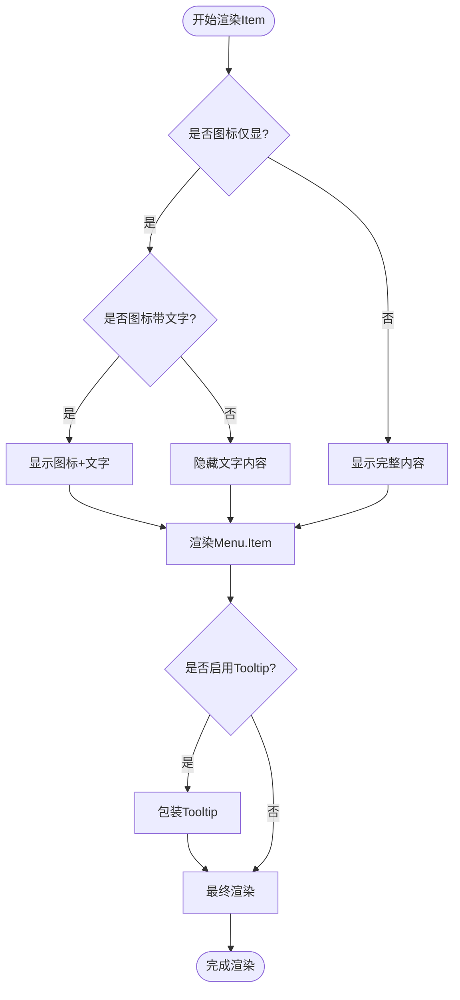
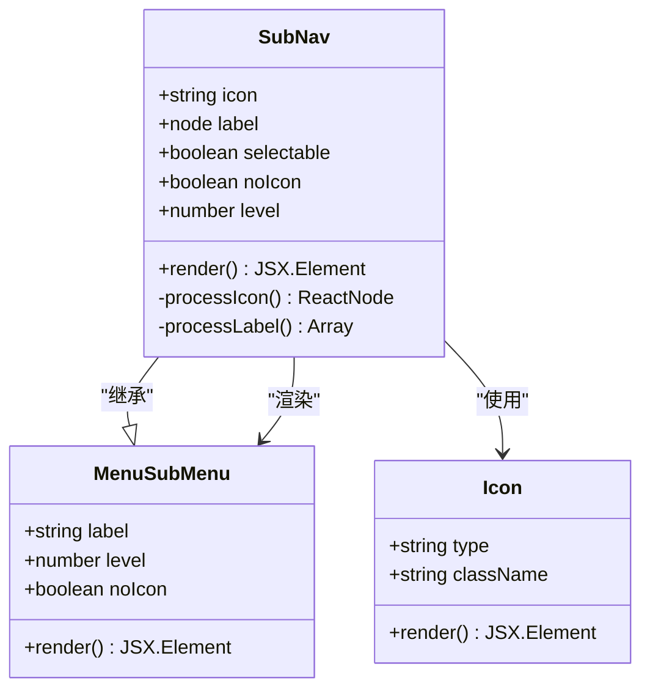
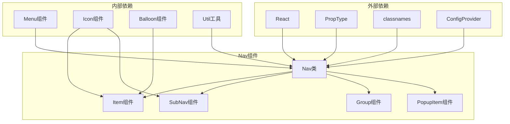

# 导航组件

<cite>
**本文档中引用的文件**
- [src/nav/index.tsx](file://src/nav/index.tsx)
- [src/nav/nav.tsx](file://src/nav/nav.tsx)
- [src/nav/types.ts](file://src/nav/types.ts)
- [src/nav/item.tsx](file://src/nav/item.tsx)
- [src/nav/sub-nav.tsx](file://src/nav/sub-nav.tsx)
- [src/nav/group.tsx](file://src/nav/group.tsx)
- [src/nav/popup-item.tsx](file://src/nav/popup-item.tsx)
- [src/nav/main.scss](file://src/nav/main.scss)
- [src/nav/scss/variable.scss](file://src/nav/scss/variable.scss)
- [src/menu/index.jsx](file://src/menu/index.jsx)
</cite>

## 目录
1. [简介](#简介)
2. [项目结构](#项目结构)
3. [核心组件](#核心组件)
4. [架构概览](#架构概览)
5. [详细组件分析](#详细组件分析)
6. [依赖关系分析](#依赖关系分析)
7. [性能考虑](#性能考虑)
8. [故障排除指南](#故障排除指南)
9. [结论](#结论)

## 简介

Nav组件是Fat Design框架中的一个轻量级导航解决方案，作为Menu组件的简化版本，专为顶部导航栏或侧边导航场景设计。它提供了简洁的API接口和灵活的布局能力，适用于不需要复杂权限控制的导航需求。

Nav组件继承了Menu组件的核心功能，但在设计上更加注重性能和易用性。它支持水平导航和垂直导航的无缝切换，通过defaultOpenKeys属性控制初始展开状态，并提供了多种主题样式（normal、primary、secondary、line）以适应不同的UI设计需求。

## 项目结构

Nav组件采用模块化的设计结构，主要包含以下核心文件：

**图表来源**
- [src/nav/index.tsx](file://src/nav/index.tsx#L1-L14)
- [src/nav/nav.tsx](file://src/nav/nav.tsx#L1-L33)

**章节来源**
- [src/nav/index.tsx](file://src/nav/index.tsx#L1-L14)
- [src/nav/nav.tsx](file://src/nav/nav.tsx#L1-L33)

## 核心组件

Nav组件由多个相互协作的子组件构成，每个组件都有特定的功能和用途：

### 主要组件功能

1. **Nav类**：核心导航容器，负责整体布局和状态管理
2. **Nav.Item**：单个导航项，支持图标和文本显示
3. **Nav.SubNav**：子导航容器，用于组织层级结构
4. **Nav.Group**：导航分组，用于逻辑分组显示
5. **Nav.PopupItem**：弹出式导航项，支持下拉菜单

**章节来源**
- [src/nav/nav.tsx](file://src/nav/nav.tsx#L10-L33)
- [src/nav/types.ts](file://src/nav/types.ts#L1-L50)

## 架构概览

Nav组件采用了基于Menu组件的继承架构，通过组合模式实现功能扩展：

**图表来源**
- [src/nav/nav.tsx](file://src/nav/nav.tsx#L10-L50)
- [src/nav/item.tsx](file://src/nav/item.tsx#L10-L30)
- [src/nav/sub-nav.tsx](file://src/nav/sub-nav.tsx#L10-L30)

## 详细组件分析

### Nav类组件分析

Nav类是整个导航系统的核心，它继承自Menu组件并进行了专门的定制化处理：

**图表来源**
- [src/nav/nav.tsx](file://src/nav/nav.tsx#L60-L120)

#### 关键特性

1. **方向切换**：支持`hoz`（水平）和`ver`（垂直）两种方向
2. **模式选择**：`inline`内联模式和`popup`弹出模式
3. **主题样式**：`normal`、`primary`、`secondary`、`line`四种样式
4. **响应式设计**：自动适配图标仅显模式

**章节来源**
- [src/nav/nav.tsx](file://src/nav/nav.tsx#L15-L50)

### Nav.Item组件分析

Nav.Item是单个导航项的基础组件，提供了丰富的自定义选项：

**图表来源**
- [src/nav/item.tsx](file://src/nav/item.tsx#L30-L80)

#### 特性说明

1. **图标支持**：支持字符串图标类型和自定义React节点
2. **文本显示**：根据显示模式智能控制文本可见性
3. **工具提示**：在图标仅显模式下自动添加工具提示
4. **上下文感知**：自动获取父组件的显示配置

**章节来源**
- [src/nav/item.tsx](file://src/nav/item.tsx#L10-L84)

### Nav.SubNav组件分析

Nav.SubNav用于创建具有层级结构的导航项，支持嵌套和折叠功能：

**图表来源**
- [src/nav/sub-nav.tsx](file://src/nav/sub-nav.tsx#L10-L50)

#### 层级处理机制

1. **图标处理**：根据显示模式动态调整图标
2. **标签渲染**：智能处理标签显示和隐藏
3. **层级标识**：自动设置层级级别
4. **模式适配**：根据不同模式调整显示效果

**章节来源**
- [src/nav/sub-nav.tsx](file://src/nav/sub-nav.tsx#L10-L89)

## 依赖关系分析

Nav组件的依赖关系体现了清晰的层次结构和模块化设计：

**图表来源**
- [src/nav/nav.tsx](file://src/nav/nav.tsx#L1-L10)
- [src/nav/index.tsx](file://src/nav/index.tsx#L1-L10)

**章节来源**
- [src/nav/nav.tsx](file://src/nav/nav.tsx#L1-L10)
- [src/nav/index.tsx](file://src/nav/index.tsx#L1-L10)

## 性能考虑

Nav组件在设计时充分考虑了性能优化：

### 1. 轻量化设计
- 继承Menu组件但移除复杂功能
- 减少不必要的DOM节点
- 优化CSS选择器性能

### 2. 渲染优化
- 使用React.memo减少重渲染
- 智能的条件渲染逻辑
- 上下文缓存机制

### 3. 内存管理
- 合理的ref使用避免内存泄漏
- 及时清理事件监听器
- 优化组件生命周期

## 故障排除指南

### 常见问题及解决方案

#### 1. 导航不显示
**原因**：缺少必要的children或配置错误
**解决**：确保正确使用Nav.Item和Nav.SubNav组件

#### 2. 图标显示异常
**原因**：图标路径错误或组件未正确导入
**解决**：检查Icon组件的导入和使用方式

#### 3. 响应式布局失效
**原因**：未正确设置iconOnly属性
**解决**：根据实际需求设置合适的显示模式

#### 4. 样式冲突
**原因**：CSS优先级问题
**解决**：使用scoped样式或增加CSS特异性

**章节来源**
- [src/nav/nav.tsx](file://src/nav/nav.tsx#L120-L180)
- [src/nav/main.scss](file://src/nav/main.scss#L1-L50)

## 结论

Nav组件作为Fat Design框架中的轻量级导航解决方案，成功地平衡了功能性和性能。它通过继承Menu组件的核心能力，同时去除复杂功能，为开发者提供了一个简洁而强大的导航组件。

### 主要优势

1. **简洁的API设计**：易于理解和使用
2. **灵活的布局能力**：支持多种显示模式和主题
3. **优秀的性能表现**：轻量化设计和优化的渲染机制
4. **完善的类型支持**：完整的TypeScript类型定义
5. **良好的扩展性**：清晰的组件结构便于二次开发

### 适用场景

- 顶部导航栏应用
- 侧边导航菜单
- 垂直或水平导航布局
- 需要图标和文字结合的导航
- 对性能要求较高的应用场景

Nav组件为现代Web应用提供了可靠的导航解决方案，是构建用户友好界面的重要组成部分。