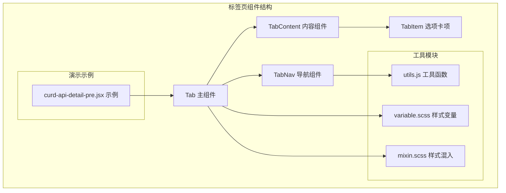
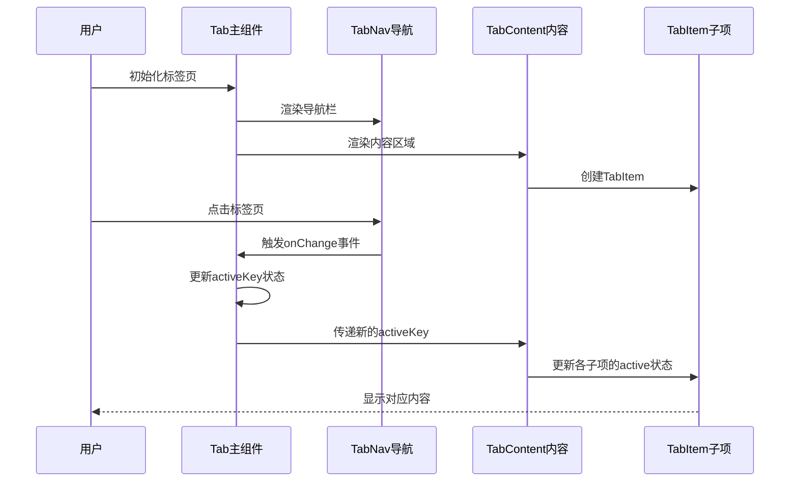
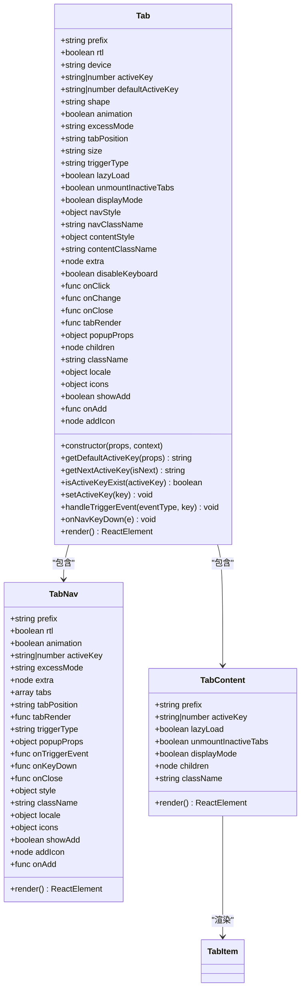
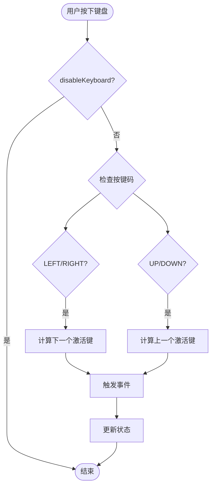
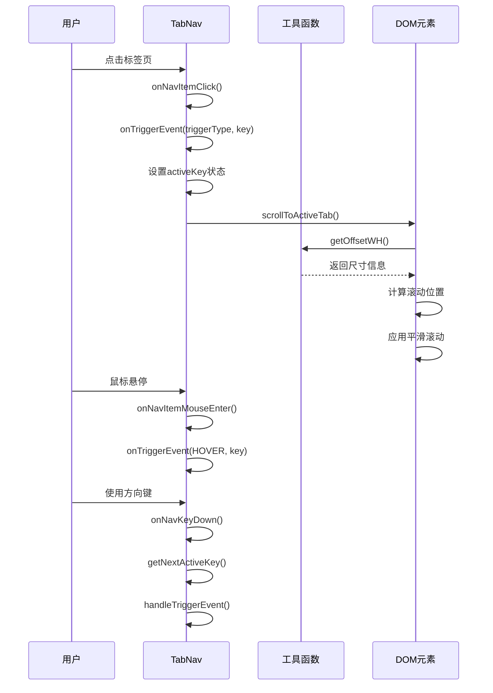
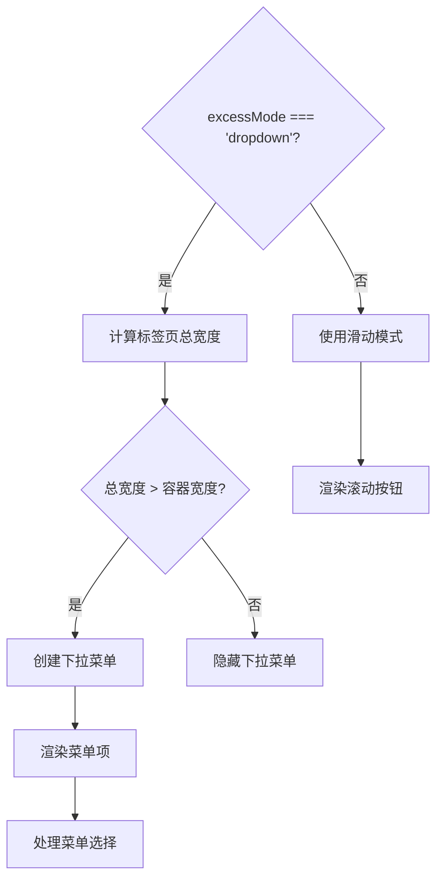
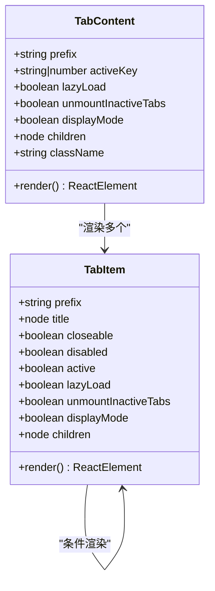
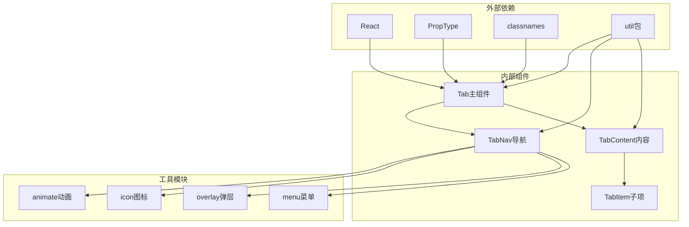

# 标签页组件

<cite>
**本文档引用的文件**
- [tab.jsx](file://src/tab/tab.jsx)
- [nav.jsx](file://src/tab/tabs/nav.jsx)
- [content.jsx](file://src/tab/tabs/content.jsx)
- [tab-item.jsx](file://src/tab/tabs/tab-item.jsx)
- [utils.js](file://src/tab/tabs/utils.js)
- [main.scss](file://src/tab/main.scss)
- [variable.scss](file://src/tab/scss/variable.scss)
- [mixin.scss](file://src/tab/scss/mixin.scss)
- [curd-api-detail-pre.jsx](file://demo/demo-crud-api/curd-api-detail-pre.jsx)
</cite>

## 目录
1. [简介](#简介)
2. [项目结构](#项目结构)
3. [核心组件](#核心组件)
4. [架构概览](#架构概览)
5. [详细组件分析](#详细组件分析)
6. [依赖关系分析](#依赖关系分析)
7. [性能考虑](#性能考虑)
8. [故障排除指南](#故障排除指南)
9. [结论](#结论)

## 简介

Fat Design的标签页组件是一个功能强大且灵活的内容切换组件，提供了多种样式、位置和交互模式。该组件支持受控和非受控模式，具有丰富的动画效果和无障碍支持，能够满足各种复杂的应用场景需求。

标签页组件的核心设计理念是分离关注点，通过`Tab`主组件管理状态和布局，`TabNav`负责导航栏渲染和用户交互，`TabContent`处理内容区域的显示和隐藏逻辑。这种设计使得组件既易于维护又便于扩展。

## 项目结构

标签页组件的文件组织结构清晰明确，遵循了模块化的设计原则：



**图表来源**
- [tab.jsx](file://src/tab/tab.jsx#L1-L398)
- [nav.jsx](file://src/tab/tabs/nav.jsx#L1-L635)
- [content.jsx](file://src/tab/tabs/content.jsx#L1-L55)
- [tab-item.jsx](file://src/tab/tabs/tab-item.jsx#L1-L75)

**章节来源**
- [tab.jsx](file://src/tab/tab.jsx#L1-L398)
- [main.scss](file://src/tab/main.scss#L1-L576)

## 核心组件

### Tab 主组件

`Tab`组件是整个标签页系统的入口点，负责协调导航和内容区域的交互。它支持多种配置选项，包括外观形态、动画效果、触发方式等。

主要特性：
- **受控与非受控模式**：通过`activeKey`属性控制组件行为
- **多位置支持**：支持顶部、底部、左侧、右侧四种导航位置
- **多种样式**：纯文本、包裹式、文本式、胶囊式四种外观形态
- **动画支持**：可配置的淡入淡出动画效果
- **键盘导航**：完整的键盘操作支持

### TabNav 导航组件

`TabNav`专门负责导航栏的渲染和用户交互处理。它实现了复杂的滚动和下拉菜单功能，确保在大量标签页时仍能保持良好的用户体验。

核心功能：
- **智能滚动**：根据容器宽度自动调整滚动按钮的显示
- **下拉菜单**：当标签页超出容器宽度时自动转换为下拉菜单
- **响应式设计**：支持移动端和桌面端的不同交互方式
- **无障碍支持**：完整的ARIA属性和键盘导航

### TabContent 内容组件

`TabContent`管理内容区域的显示逻辑，支持懒加载和按需卸载功能。

关键特性：
- **懒加载**：只有激活的标签页才会渲染其内容
- **按需卸载**：可以配置未激活标签页的内容是否卸载
- **显示模式**：支持不同的显示和隐藏策略
- **动画过渡**：配合导航组件提供流畅的切换效果

**章节来源**
- [tab.jsx](file://src/tab/tab.jsx#L15-L398)
- [nav.jsx](file://src/tab/tabs/nav.jsx#L15-L635)
- [content.jsx](file://src/tab/tabs/content.jsx#L1-L55)

## 架构概览

标签页组件采用了分层架构设计，每一层都有明确的职责分工：



**图表来源**
- [tab.jsx](file://src/tab/tab.jsx#L200-L250)
- [nav.jsx](file://src/tab/tabs/nav.jsx#L400-L450)
- [content.jsx](file://src/tab/tabs/content.jsx#L15-L45)

组件间的通信通过以下机制实现：

1. **状态提升**：`Tab`组件持有`activeKey`状态，向下传递给子组件
2. **事件回调**：`TabNav`通过回调函数通知父组件状态变化
3. **属性传递**：通过props将配置和状态传递给各个子组件
4. **工具函数**：共享的工具函数处理通用逻辑

**章节来源**
- [tab.jsx](file://src/tab/tab.jsx#L326-L396)
- [nav.jsx](file://src/tab/tabs/nav.jsx#L564-L635)

## 详细组件分析

### Tab 组件详细分析

`Tab`组件是整个系统的核心控制器，它实现了复杂的业务逻辑和状态管理：



**图表来源**
- [tab.jsx](file://src/tab/tab.jsx#L15-L120)
- [nav.jsx](file://src/tab/tabs/nav.jsx#L20-L50)
- [content.jsx](file://src/tab/tabs/content.jsx#L5-L20)

#### 受控与非受控模式

组件支持两种工作模式：

**非受控模式**（推荐用于简单场景）：
```jsx
<Tab defaultActiveKey="1">
    <Tab.Item title="选项一">内容一</Tab.Item>
    <Tab.Item title="选项二">内容二</Tab.Item>
</Tab>
```

**受控模式**（推荐用于复杂场景）：
```jsx
<Tab activeKey={currentTab} onChange={handleChange}>
    <Tab.Item title="选项一">内容一</Tab.Item>
    <Tab.Item title="选项二">内容二</Tab.Item>
</Tab>
```

#### 键盘导航支持

组件提供了完整的键盘导航支持：



**图表来源**
- [tab.jsx](file://src/tab/tab.jsx#L250-L270)

### TabNav 导航组件详细分析

`TabNav`组件负责处理导航栏的所有交互逻辑：



**图表来源**
- [nav.jsx](file://src/tab/tabs/nav.jsx#L400-L450)
- [nav.jsx](file://src/tab/tabs/nav.jsx#L350-L400)

#### 滚动功能实现

导航组件实现了智能的滚动功能：

1. **滚动检测**：实时检测容器宽度和标签页总宽度
2. **按钮控制**：根据需要显示或隐藏前进/后退按钮
3. **平滑滚动**：使用CSS3的`scrollTo`方法实现平滑滚动效果
4. **RTL支持**：自动适配从右到左的语言环境

#### 下拉菜单功能

当标签页数量过多时，组件会自动转换为下拉菜单：



**图表来源**
- [nav.jsx](file://src/tab/tabs/nav.jsx#L200-L250)

### TabContent 和 TabItem 组件分析

这两个组件共同负责内容区域的渲染和管理：



**图表来源**
- [content.jsx](file://src/tab/tabs/content.jsx#L5-L20)
- [tab-item.jsx](file://src/tab/tabs/tab-item.jsx#L8-L30)

#### 懒加载机制

组件支持两种懒加载策略：

1. **首次激活加载**：内容只在第一次被激活时渲染
2. **按需渲染**：只有当前激活的标签页内容会被渲染

```javascript
// 懒加载实现
if (lazyLoad && !this._actived) {
    return null;
}
```

#### 动态内容加载

组件支持异步内容加载，这对于大型应用非常有用：

```jsx
<Tab>
    <Tab.Item title="远程数据">
        <AsyncContentLoader />
    </Tab.Item>
</Tab>
```

**章节来源**
- [tab.jsx](file://src/tab/tab.jsx#L200-L300)
- [nav.jsx](file://src/tab/tabs/nav.jsx#L250-L350)
- [content.jsx](file://src/tab/tabs/content.jsx#L15-L45)
- [tab-item.jsx](file://src/tab/tabs/tab-item.jsx#L30-L60)

## 依赖关系分析

标签页组件的依赖关系清晰明了，遵循了良好的软件工程原则：



**图表来源**
- [tab.jsx](file://src/tab/tab.jsx#L1-L15)
- [nav.jsx](file://src/tab/tabs/nav.jsx#L1-L15)

### 核心依赖说明

1. **React生态系统**：使用React 16+的新特性，如Hooks和Context
2. **样式系统**：采用CSS Modules和SCSS混合的方式
3. **动画系统**：集成了专门的动画组件
4. **无障碍支持**：完整的ARIA属性和键盘导航

**章节来源**
- [tab.jsx](file://src/tab/tab.jsx#L1-L15)
- [nav.jsx](file://src/tab/tabs/nav.jsx#L1-L15)

## 性能考虑

标签页组件在设计时充分考虑了性能优化：

### 懒加载优化

- **首次渲染优化**：只有激活的标签页内容会被渲染
- **内存管理**：未激活的标签页内容可以被卸载以释放内存
- **网络优化**：支持异步加载远程内容

### 动画性能

- **硬件加速**：使用CSS3 transform和opacity属性
- **动画队列**：避免同时进行多个动画
- **性能监控**：提供动画开关以便在低性能设备上禁用

### 渲染优化

- **虚拟滚动**：对于大量标签页使用虚拟滚动技术
- **防抖处理**：窗口大小变化时使用防抖减少重绘
- **条件渲染**：只渲染必要的DOM节点

## 故障排除指南

### 常见问题及解决方案

#### 1. 标签页不显示内容

**原因**：可能是`activeKey`设置错误或`children`为空
**解决方案**：
```jsx
// 确保有默认的activeKey
<Tab defaultActiveKey="1">
    <Tab.Item key="1" title="选项一">内容一</Tab.Item>
</Tab>
```

#### 2. 滚动功能异常

**原因**：容器宽度计算错误或CSS样式冲突
**解决方案**：
- 检查容器的CSS样式
- 确保没有设置固定的宽度
- 验证动画配置是否正确

#### 3. 键盘导航失效

**原因**：`disableKeyboard`属性被设置为true
**解决方案**：
```jsx
<Tab disableKeyboard={false}>
    {/* 标签页内容 */}
</Tab>
```

#### 4. RTL语言支持问题

**原因**：RTL模式下的布局计算错误
**解决方案**：
```jsx
<Tab rtl={true}>
    {/* 标签页内容 */}
</Tab>
```

**章节来源**
- [tab.jsx](file://src/tab/tab.jsx#L120-L180)
- [nav.jsx](file://src/tab/tabs/nav.jsx#L100-L150)

## 结论

Fat Design的标签页组件是一个功能完整、设计精良的UI组件。它不仅提供了丰富的功能特性，还保持了良好的可维护性和扩展性。组件的设计充分体现了现代前端开发的最佳实践，包括：

1. **模块化设计**：清晰的职责分离和组件划分
2. **性能优化**：懒加载、动画优化等多重性能考虑
3. **无障碍支持**：完整的键盘导航和ARIA属性
4. **国际化支持**：内置的多语言支持
5. **主题定制**：灵活的样式定制能力

该组件适用于各种复杂的应用场景，从简单的页面导航到复杂的数据展示界面都能很好地胜任。通过合理的配置和使用，可以构建出既美观又实用的用户界面。

对于开发者而言，理解组件的内部工作机制有助于更好地使用和扩展这些功能。建议在实际项目中根据具体需求选择合适的配置选项，并充分利用组件提供的各种高级功能来提升用户体验。