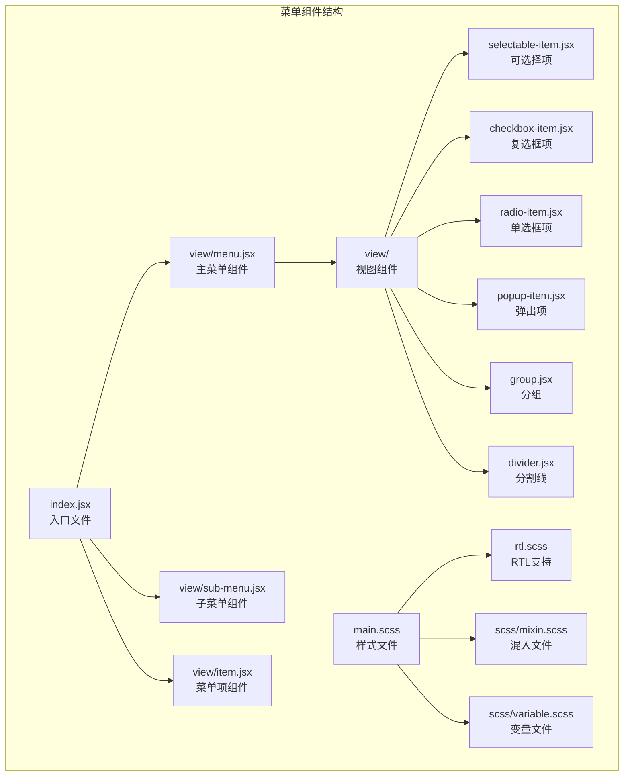
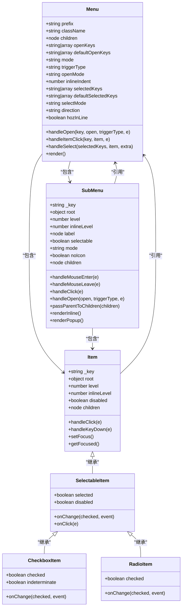
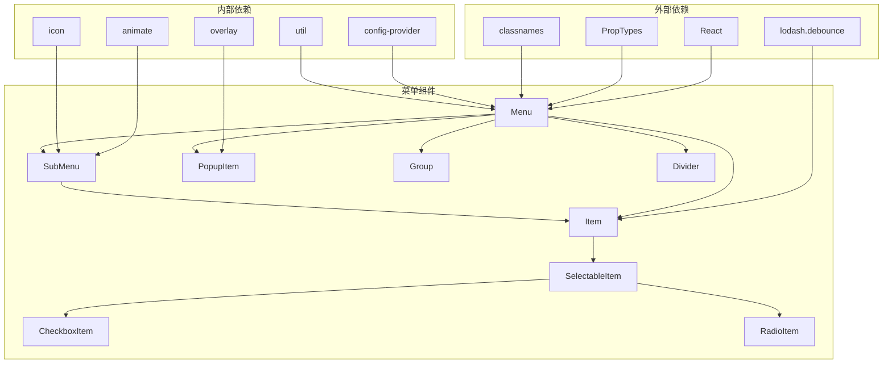

# 菜单组件

<cite>
**本文档引用的文件**
- [src/menu/index.jsx](file://src/menu/index.jsx)
- [src/menu/view/menu.jsx](file://src/menu/view/menu.jsx)
- [src/menu/view/sub-menu.jsx](file://src/menu/view/sub-menu.jsx)
- [src/menu/view/item.jsx](file://src/menu/view/item.jsx)
- [src/menu/view/selectable-item.jsx](file://src/menu/view/selectable-item.jsx)
- [src/menu/view/checkbox-item.jsx](file://src/menu/view/checkbox-item.jsx)
- [src/menu/view/radio-item.jsx](file://src/menu/view/radio-item.jsx)
- [src/menu/view/popup-item.jsx](file://src/menu/view/popup-item.jsx)
- [src/menu/view/group.jsx](file://src/menu/view/group.jsx)
- [src/menu/view/divider.jsx](file://src/menu/view/divider.jsx)
- [src/menu/view/util.js](file://src/menu/view/util.js)
- [src/menu/main.scss](file://src/menu/main.scss)
- [src/menu/rtl.scss](file://src/menu/rtl.scss)
- [types/menu/index.d.ts](file://types/menu/index.d.ts)
- [demo/demo-menu-button.tsx](file://demo/demo-menu-button.tsx)
- [src/menu-button/index.jsx](file://src/menu-button/index.jsx)
</cite>

## 目录
1. [简介](#简介)
2. [项目结构](#项目结构)
3. [核心组件](#核心组件)
4. [架构概览](#架构概览)
5. [详细组件分析](#详细组件分析)
6. [依赖关系分析](#依赖关系分析)
7. [性能考虑](#性能考虑)
8. [故障排除指南](#故障排除指南)
9. [结论](#结论)

## 简介

Fat Design的菜单组件是一个功能强大且灵活的导航系统，支持垂直和水平布局，提供多种交互模式和丰富的UI元素。该组件设计为可扩展的树形结构，支持内嵌、弹出、手风琴折叠等多种模式，具有完善的选中状态管理、图标集成和路由联动功能。

菜单组件的核心设计理念是提供一个统一的导航接口，支持从简单的单级菜单到复杂的多级嵌套菜单结构。它不仅提供了基础的菜单项功能，还集成了复选框、单选框、分组、分割线等高级特性，满足各种复杂场景的需求。

## 项目结构

菜单组件采用模块化的设计，将不同功能分离到独立的文件中，便于维护和扩展：



**图表来源**
- [src/menu/index.jsx](file://src/menu/index.jsx#L1-L53)
- [src/menu/view/menu.jsx](file://src/menu/view/menu.jsx#L1-L50)
- [src/menu/main.scss](file://src/menu/main.scss#L1-L50)

**章节来源**
- [src/menu/index.jsx](file://src/menu/index.jsx#L1-L53)
- [src/menu/view/menu.jsx](file://src/menu/view/menu.jsx#L1-L100)

## 核心组件

菜单组件由以下核心部分组成：

### 主菜单组件 (Menu)
主菜单组件是整个菜单系统的根节点，负责管理子菜单的状态、处理用户交互、协调各个子组件之间的通信。

### 子菜单组件 (SubMenu)
子菜单组件用于创建可展开的菜单层级，支持内嵌和弹出两种显示模式。

### 菜单项组件 (Item)
基础菜单项组件，提供基本的点击交互和状态管理功能。

### 可选择项组件
包括复选框项、单选框项等，支持多选和单选功能。

### 辅助组件
包括分组、分割线等辅助性组件，用于组织和美化菜单结构。

**章节来源**
- [src/menu/view/menu.jsx](file://src/menu/view/menu.jsx#L1-L200)
- [src/menu/view/sub-menu.jsx](file://src/menu/view/sub-menu.jsx#L1-L100)
- [src/menu/view/item.jsx](file://src/menu/view/item.jsx#L1-L100)

## 架构概览

菜单组件采用分层架构设计，通过父子组件通信实现状态同步和功能协调：



**图表来源**
- [src/menu/view/menu.jsx](file://src/menu/view/menu.jsx#L150-L300)
- [src/menu/view/sub-menu.jsx](file://src/menu/view/sub-menu.jsx#L20-L100)
- [src/menu/view/item.jsx](file://src/menu/view/item.jsx#L10-L80)

## 详细组件分析

### 主菜单组件 (Menu)

主菜单组件是整个菜单系统的核心，负责协调所有子组件的行为和状态管理。

#### 主要功能特性

1. **多模式支持**
   - 内嵌模式 (`inline`): 菜单项直接显示在父容器中
   - 弹出模式 (`popup`): 子菜单以弹层形式显示
   - 水平模式 (`hoz`): 支持横向布局
   - 垂直模式 (`ver`): 支持纵向布局

2. **状态管理**
   - 打开状态管理 (`openKeys`)
   - 选中状态管理 (`selectedKeys`)
   - 焦点状态管理 (`focusedKey`)
   - 自动聚焦功能

3. **交互控制**
   - 触发方式控制 (`triggerType`: click/hover)
   - 展开模式控制 (`openMode`: single/multiple)
   - 缩进控制 (`inlineIndent`)

#### 关键方法实现

```javascript
// 处理子菜单打开/关闭
handleOpen(key, open, triggerType, e) {
    const { openKeys } = this.state;
    const newOpenKeys = open ? [...openKeys, key] : openKeys.filter(k => k !== key);
    this.setState({ openKeys: newOpenKeys });
    this.props.onOpen(newOpenKeys, { key, open });
}

// 处理菜单项点击
handleItemClick(key, item, e) {
    this.props.onItemClick(key, item, e);
    this.props.onSelect([key], item, { select: true, key, label: item.props.label });
}
```

**章节来源**
- [src/menu/view/menu.jsx](file://src/menu/view/menu.jsx#L150-L400)

### 子菜单组件 (SubMenu)

子菜单组件专门处理可展开的菜单层级，提供灵活的显示和交互方式。

#### 渲染模式

1. **内嵌渲染 (Inline)**
   ```javascript
   renderInline() {
       const open = this.getOpen();
       return (
           <div className={cx({
               [`${prefix}menu-sub-menu-wrapper`]: true,
               [className]: !!className,
           })}>
               <Item {...itemProps} />
               {open && <ul>{this.passParentToChildren(children)}</ul>}
           </div>
       );
   }
   ```

2. **弹出渲染 (Popup)**
   使用弹层组件实现悬浮显示效果

#### 状态同步机制

子菜单组件通过引用主菜单的状态来实现双向数据流：

```javascript
getOpen() {
    const { _key, root } = this.props;
    const { openKeys } = root.state;
    return openKeys.indexOf(_key) > -1;
}
```

**章节来源**
- [src/menu/view/sub-menu.jsx](file://src/menu/view/sub-menu.jsx#L100-L200)

### 菜单项组件 (Item)

基础菜单项组件提供核心的交互功能和视觉反馈。

#### 交互处理

1. **点击处理**
   ```javascript
   handleClick(e) {
       e.stopPropagation();
       const { _key, root, disabled } = this.props;
       if (!disabled) {
           root.handleItemClick(_key, this, e);
           this.props.onClick && this.props.onClick(e);
       }
   }
   ```

2. **键盘导航**
   ```javascript
   handleKeyDown(e) {
       const { _key, root, type } = this.props;
       if (this.focusable()) {
           root.handleItemKeyDown(_key, type, this, e);
           switch (e.keyCode) {
               case KEYCODE.ENTER:
                   if (!(type === 'submenu')) {
                       this.handleClick(e);
                   }
                   break;
           }
       }
   }
   ```

#### 焦点管理

菜单项组件实现了智能的焦点管理，确保键盘导航的流畅体验：

```javascript
setFocus = debounce(() => {
    const focused = this.getFocused();
    if (focused) {
        this.itemNode.focus({ preventScroll: true });
        // 滚动到可视区域
        if (this.menuNode.scrollHeight > this.menuNode.clientHeight) {
            const scrollBottom = this.menuNode.clientHeight + this.menuNode.scrollTop;
            const itemBottom = this.itemNode.offsetTop + this.itemNode.offsetHeight;
            if (itemBottom > scrollBottom) {
                this.menuNode.scrollTop = itemBottom - this.menuNode.clientHeight;
            } else if (this.itemNode.offsetTop < this.menuNode.scrollTop) {
                this.menuNode.scrollTop = this.itemNode.offsetTop;
            }
        }
    }
}, 40);
```

**章节来源**
- [src/menu/view/item.jsx](file://src/menu/view/item.jsx#L80-L150)

### 可选择项组件

菜单组件提供了多种可选择的子组件，满足不同的业务需求：

#### 复选框项 (CheckboxItem)

```javascript
class CheckboxItem extends ReactComponent {
    static propTypes = {
        checked: PropTypes.bool,
        indeterminate: PropTypes.bool,
        disabled: PropTypes.bool,
        onChange: PropTypes.func,
        children: PropTypes.node,
    };
    
    handleChange = (checked, event) => {
        this.props.onChange && this.props.onChange(checked, event);
    };
}
```

#### 单选框项 (RadioItem)

```javascript
class RadioItem extends ReactComponent {
    static propTypes = {
        checked: PropTypes.bool,
        disabled: PropTypes.bool,
        onChange: PropTypes.func,
        children: PropTypes.node,
    };
    
    handleChange = (checked, event) => {
        this.props.onChange && this.props.onChange(checked, event);
    };
}
```

**章节来源**
- [src/menu/view/checkbox-item.jsx](file://src/menu/view/checkbox-item.jsx#L1-L50)
- [src/menu/view/radio-item.jsx](file://src/menu/view/radio-item.jsx#L1-L50)

### 配置提供者集成

菜单组件与ConfigProvider深度集成，支持全局配置和主题定制：

```javascript
export default ConfigProvider.config(Menu, {
    transform,
});
```

这种集成方式允许：
- 全局主题配置
- 国际化支持
- RTL布局支持
- 默认属性覆盖

**章节来源**
- [src/menu/index.jsx](file://src/menu/index.jsx#L40-L53)

## 依赖关系分析

菜单组件的依赖关系体现了清晰的分层架构：



**图表来源**
- [src/menu/view/menu.jsx](file://src/menu/view/menu.jsx#L1-L20)
- [src/menu/view/sub-menu.jsx](file://src/menu/view/sub-menu.jsx#L1-L15)
- [src/menu/view/item.jsx](file://src/menu/view/item.jsx#L1-L10)

**章节来源**
- [src/menu/view/menu.jsx](file://src/menu/view/menu.jsx#L1-L20)
- [src/menu/view/sub-menu.jsx](file://src/menu/view/sub-menu.jsx#L1-L15)

## 性能考虑

### 渲染优化

1. **虚拟滚动**: 对于大量菜单项，支持虚拟滚动以提高渲染性能
2. **防抖处理**: 焦点设置使用防抖技术，避免频繁DOM操作
3. **条件渲染**: 根据模式和状态动态决定渲染内容

### 内存管理

1. **事件监听器清理**: 组件卸载时自动清理事件监听器
2. **引用管理**: 合理管理DOM引用，避免内存泄漏
3. **状态缓存**: 智能缓存计算结果，减少重复计算

### 样式优化

1. **CSS模块化**: 使用CSS模块化避免样式冲突
2. **条件样式**: 根据状态动态应用样式类
3. **动画性能**: 使用CSS3变换和过渡实现流畅动画

## 故障排除指南

### 常见问题及解决方案

1. **菜单项无法点击**
   - 检查`disabled`属性设置
   - 确认事件冒泡未被阻止
   - 验证`onClick`回调函数正确绑定

2. **子菜单不显示**
   - 检查`mode`属性设置为`popup`
   - 确认`triggerType`配置正确
   - 验证弹层容器存在且可访问

3. **选中状态异常**
   - 检查`selectedKeys`属性类型
   - 确认`selectMode`配置正确
   - 验证`onSelect`回调逻辑

4. **样式问题**
   - 检查CSS类名拼写
   - 确认主题配置正确
   - 验证RTL布局设置

**章节来源**
- [src/menu/view/item.jsx](file://src/menu/view/item.jsx#L80-L120)
- [src/menu/view/sub-menu.jsx](file://src/menu/view/sub-menu.jsx#L80-L120)

## 结论

Fat Design的菜单组件是一个功能完整、设计精良的导航系统。它通过模块化的架构设计、完善的类型定义、灵活的配置选项和优秀的性能表现，为开发者提供了强大的菜单构建能力。

### 主要优势

1. **功能丰富**: 支持多种模式、状态管理和交互方式
2. **易于使用**: 提供直观的API和完整的类型定义
3. **高度可配置**: 支持主题定制、国际化和RTL布局
4. **性能优秀**: 采用多种优化技术确保流畅体验
5. **扩展性强**: 模块化设计便于功能扩展和定制

### 最佳实践建议

1. **合理选择模式**: 根据使用场景选择合适的显示模式
2. **优化性能**: 对大量菜单项使用虚拟滚动
3. **注重可用性**: 确保良好的键盘导航和屏幕阅读器支持
4. **样式定制**: 根据品牌需求定制主题和样式
5. **测试覆盖**: 充分测试各种交互场景和边界情况

通过深入理解和合理使用这些特性，开发者可以构建出既美观又实用的导航界面，提升用户体验和产品价值。