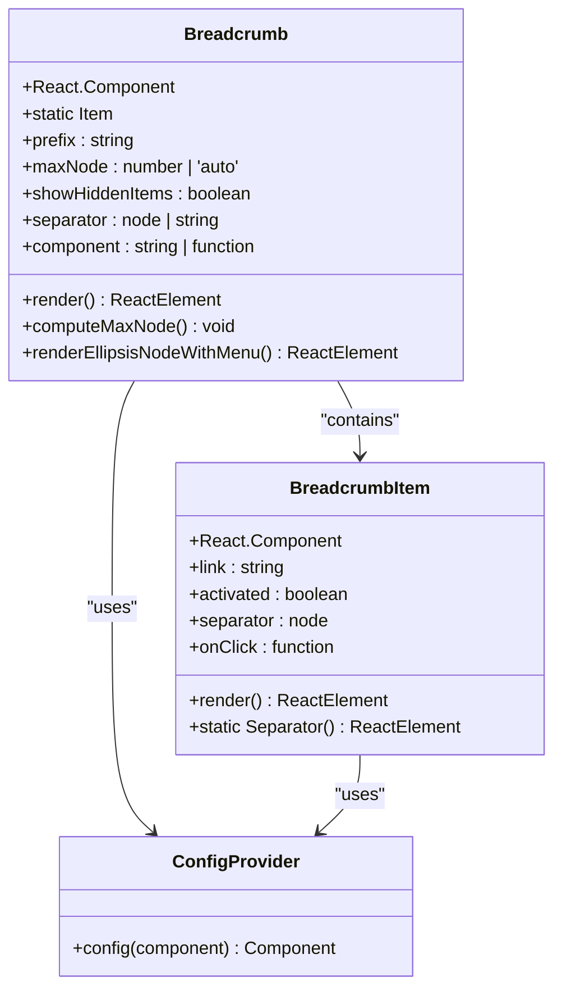
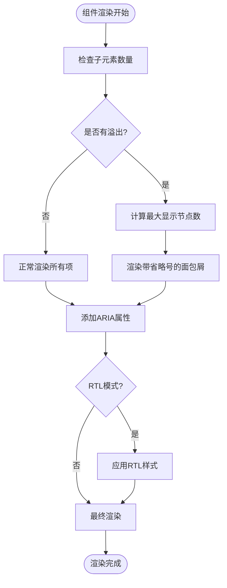

# 面包屑导航组件（Breadcrumb）

<cite>
**本文档引用的文件**
- [src/breadcrumb/index.jsx](file://src/breadcrumb/index.jsx)
- [src/breadcrumb/item.jsx](file://src/breadcrumb/item.jsx)
- [src/breadcrumb/main.scss](file://src/breadcrumb/main.scss)
- [src/breadcrumb/scss/variable.scss](file://src/breadcrumb/scss/variable.scss)
- [src/breadcrumb/scss/mixin.scss](file://src/breadcrumb/scss/mixin.scss)
- [src/breadcrumb/index.d.ts](file://src/breadcrumb/index.d.ts)
- [src/libs.tsx](file://src/libs.tsx)
- [README.md](file://README.md)
</cite>

## 目录
1. [简介](#简介)
2. [核心特性](#核心特性)
3. [基本使用](#基本使用)
4. [组件架构](#组件架构)
5. [详细配置选项](#详细配置选项)
6. [高级功能](#高级功能)
7. [与React Router集成](#与react-router集成)
8. [样式定制](#样式定制)
9. [无障碍支持](#无障碍支持)
10. [最佳实践](#最佳实践)
11. [常见问题](#常见问题)

## 简介

面包屑导航（Breadcrumb）是Fat Design组件库中的重要导航组件，用于展示用户当前在网站或应用中的位置，帮助用户理解当前位置与整体结构的关系。它采用层次化的路径显示方式，提供清晰的导航指引。

面包屑组件具有以下特点：
- 支持多层级路径展示
- 自动处理溢出内容
- 提供可点击的交互功能
- 完善的无障碍支持
- 灵活的样式定制能力

## 核心特性

### 层级路径展示
面包屑组件能够优雅地展示从根目录到当前页面的完整路径，每个层级之间使用分隔符连接。

### 智能溢出处理
当路径层级过多时，组件会自动隐藏多余的层级，并提供下拉菜单展示被隐藏的内容。

### 语义化HTML结构
组件生成符合Web标准的语义化HTML结构，提升SEO效果和可访问性。

### 多种交互模式
支持链接跳转和事件处理两种交互方式，满足不同的业务需求。

## 基本使用

### 基础面包屑示例

```jsx
import { Breadcrumb } from 'fat-design';

function BasicBreadcrumb() {
  return (
    <Breadcrumb>
      <Breadcrumb.Item link="/">首页</Breadcrumb.Item>
      <Breadcrumb.Item link="/user-management">用户管理</Breadcrumb.Item>
      <Breadcrumb.Item>用户详情</Breadcrumb.Item>
    </Breadcrumb>
  );
}
```

### 带有自定义分隔符的面包屑

```jsx
import { Breadcrumb, Icon } from 'fat-design';

function CustomSeparatorBreadcrumb() {
  return (
    <Breadcrumb separator={<Icon type="arrow-right" />}>
      <Breadcrumb.Item link="/">首页</Breadcrumb.Item>
      <Breadcrumb.Item link="/user-management">用户管理</Breadcrumb.Item>
      <Breadcrumb.Item>用户详情</Breadcrumb.Item>
    </Breadcrumb>
  );
}
```

### 使用onClick事件处理

```jsx
import { Breadcrumb } from 'fat-design';

function InteractiveBreadcrumb() {
  const handleItemClick = (event, item) => {
    console.log('Clicked:', item);
    // 自定义处理逻辑
  };

  return (
    <Breadcrumb>
      <Breadcrumb.Item link="/" onClick={(e) => handleItemClick(e, 'home')}>
        首页
      </Breadcrumb.Item>
      <Breadcrumb.Item link="/user-management" onClick={(e) => handleItemClick(e, 'user')}>
        用户管理
      </Breadcrumb.Item>
      <Breadcrumb.Item onClick={(e) => handleItemClick(e, 'detail')}>用户详情</Breadcrumb.Item>
    </Breadcrumb>
  );
}
```

**章节来源**
- [src/breadcrumb/index.jsx](file://src/breadcrumb/index.jsx#L1-L50)
- [src/breadcrumb/item.jsx](file://src/breadcrumb/item.jsx#L1-L40)

## 组件架构

### 组件层次结构



**图表来源**
- [src/breadcrumb/index.jsx](file://src/breadcrumb/index.jsx#L10-L30)
- [src/breadcrumb/item.jsx](file://src/breadcrumb/item.jsx#L8-L25)

### 渲染流程



**图表来源**
- [src/breadcrumb/index.jsx](file://src/breadcrumb/index.jsx#L180-L250)

**章节来源**
- [src/breadcrumb/index.jsx](file://src/breadcrumb/index.jsx#L1-L303)
- [src/breadcrumb/item.jsx](file://src/breadcrumb/item.jsx#L1-L63)

## 详细配置选项

### Breadcrumb组件属性

| 属性名 | 类型 | 默认值 | 描述 |
|--------|------|--------|------|
| `prefix` | string | 'next-' | 样式类名的品牌前缀 |
| `maxNode` | number \| 'auto' | 100 | 面包屑最多显示个数，超出部分会被隐藏 |
| `showHiddenItems` | boolean | false | 当超过的项被隐藏时，是否可通过点击省略号展示菜单 |
| `separator` | node \| string | Icon(type='arrow-right') | 分隔符，可以是文本或Icon组件 |
| `component` | string \| function | 'nav' | 设置标签类型，默认为nav标签 |
| `popupContainer` | any | - | 弹层挂载的容器节点 |
| `followTrigger` | boolean | - | 是否跟随trigger滚动 |
| `popupProps` | object | - | 添加到弹层上的属性 |

### Breadcrumb.Item属性

| 属性名 | 类型 | 默认值 | 描述 |
|--------|------|--------|------|
| `link` | string | - | 面包屑节点链接，设置后该节点为`<a>`标签 |
| `activated` | boolean | - | 是否为激活状态（当前页面） |
| `separator` | node | - | 自定义分隔符 |
| `onClick` | function | - | 元素点击事件处理器 |

**章节来源**
- [src/breadcrumb/index.jsx](file://src/breadcrumb/index.jsx#L20-L60)
- [src/breadcrumb/index.d.ts](file://src/breadcrumb/index.d.ts#L1-L61)

## 高级功能

### 自动溢出检测

面包屑组件支持`maxNode='auto'`模式，能够根据父容器宽度自动调整显示的节点数量：

```jsx
import { Breadcrumb } from 'fat-design';

function AutoBreadcrumb() {
  return (
    <div style={{ width: '300px' }}>
      <Breadcrumb maxNode="auto">
        <Breadcrumb.Item link="/">首页</Breadcrumb.Item>
        <Breadcrumb.Item link="/user-management">用户管理</Breadcrumb.Item>
        <Breadcrumb.Item link="/user-management/users">用户列表</Breadcrumb.Item>
        <Breadcrumb.Item link="/user-management/users/123">用户详情</Breadcrumb.Item>
        <Breadcrumb.Item>编辑信息</Breadcrumb.Item>
      </Breadcrumb>
    </div>
  );
}
```

### 下拉菜单展示隐藏项

当启用`showHiddenItems`时，点击省略号会显示一个下拉菜单，包含所有被隐藏的面包屑项：

```jsx
import { Breadcrumb } from 'fat-design';

function HiddenItemsBreadcrumb() {
  return (
    <Breadcrumb 
      maxNode={3} 
      showHiddenItems
      popupContainer={document.body}
    >
      <Breadcrumb.Item link="/">首页</Breadcrumb.Item>
      <Breadcrumb.Item link="/user-management">用户管理</Breadcrumb.Item>
      <Breadcrumb.Item link="/user-management/users">用户列表</Breadcrumb.Item>
      <Breadcrumb.Item link="/user-management/users/123">用户详情</Breadcrumb.Item>
      <Breadcrumb.Item>编辑信息</Breadcrumb.Item>
    </Breadcrumb>
  );
}
```

### 动态路径生成

```jsx
import { Breadcrumb } from 'fat-design';

function DynamicBreadcrumb({ pathSegments }) {
  const renderPathItems = () => {
    return pathSegments.map((segment, index) => {
      const isLast = index === pathSegments.length - 1;
      return (
        <Breadcrumb.Item 
          key={segment.id}
          link={segment.link}
          activated={isLast}
        >
          {segment.label}
        </Breadcrumb.Item>
      );
    });
  };

  return (
    <Breadcrumb>
      {renderPathItems()}
    </Breadcrumb>
  );
}
```

**章节来源**
- [src/breadcrumb/index.jsx](file://src/breadcrumb/index.jsx#L80-L120)
- [src/breadcrumb/index.jsx](file://src/breadcrumb/index.jsx#L130-L180)

## 与React Router集成

### 基本路由集成

```jsx
import { Breadcrumb } from 'fat-design';
import { Link, useLocation } from 'react-router-dom';

function RouterBreadcrumb() {
  const location = useLocation();
  const pathnames = location.pathname.split('/').filter(x => x);

  return (
    <Breadcrumb>
      <Breadcrumb.Item link="/">
        <Link to="/">首页</Link>
      </Breadcrumb.Item>
      
      {pathnames.map((value, index) => {
        const to = `/${pathnames.slice(0, index + 1).join('/')}`;
        const isLast = index === pathnames.length - 1;
        
        return (
          <Breadcrumb.Item 
            key={to} 
            link={isLast ? undefined : to}
            activated={isLast}
          >
            {value.charAt(0).toUpperCase() + value.slice(1)}
          </Breadcrumb.Item>
        );
      })}
    </Breadcrumb>
  );
}
```

### 带参数的路由集成

```jsx
import { Breadcrumb } from 'fat-design';
import { Link, useLocation } from 'react-router-dom';

function ParameterizedBreadcrumb() {
  const location = useLocation();
  const pathnames = location.pathname.split('/').filter(x => x);
  
  return (
    <Breadcrumb>
      <Breadcrumb.Item link="/">
        <Link to="/">首页</Link>
      </Breadcrumb.Item>
      
      {pathnames.map((value, index) => {
        const isLast = index === pathnames.length - 1;
        const segments = pathnames.slice(0, index + 1);
        const to = `/${segments.join('/')}`;
        
        // 处理参数
        if (value.startsWith(':')) {
          const paramName = value.substring(1);
          const paramValue = location.search.match(new RegExp(`[?&]${paramName}=([^&]+)`))?.[1];
          
          return (
            <Breadcrumb.Item key={to} activated={isLast}>
              {paramValue || paramName}
            </Breadcrumb.Item>
          );
        }
        
        return (
          <Breadcrumb.Item key={to} link={isLast ? undefined : to} activated={isLast}>
            {value.charAt(0).toUpperCase() + value.slice(1)}
          </Breadcrumb.Item>
        );
      })}
    </Breadcrumb>
  );
}
```

### 嵌套路由集成

```jsx
import { Breadcrumb } from 'fat-design';
import { Link, useLocation } from 'react-router-dom';

function NestedRouteBreadcrumb() {
  const location = useLocation();
  const pathnames = location.pathname.split('/').filter(x => x);
  
  // 根据路由配置生成面包屑
  const getBreadcrumbItems = () => {
    const routes = [
      { path: 'dashboard', label: '仪表盘' },
      { path: 'user-management', label: '用户管理' },
      { path: 'product-management', label: '产品管理' },
      { path: 'order-management', label: '订单管理' },
    ];
    
    return pathnames.map((value, index) => {
      const route = routes.find(r => r.path === value);
      const segments = pathnames.slice(0, index + 1);
      const to = `/${segments.join('/')}`;
      const isLast = index === pathnames.length - 1;
      
      return (
        <Breadcrumb.Item key={to} link={isLast ? undefined : to} activated={isLast}>
          {route ? route.label : value.charAt(0).toUpperCase() + value.slice(1)}
        </Breadcrumb.Item>
      );
    });
  };

  return (
    <Breadcrumb>
      <Breadcrumb.Item link="/">
        <Link to="/">首页</Link>
      </Breadcrumb.Item>
      {getBreadcrumbItems()}
    </Breadcrumb>
  );
}
```

## 样式定制

### 自定义分隔符

```jsx
import { Breadcrumb, Icon } from 'fat-design';

function CustomSeparator() {
  return (
    <Breadcrumb separator={<span>•</span>}>
      <Breadcrumb.Item link="/">首页</Breadcrumb.Item>
      <Breadcrumb.Item link="/user-management">用户管理</Breadcrumb.Item>
      <Breadcrumb.Item>用户详情</Breadcrumb.Item>
    </Breadcrumb>
  );
}
```

### 自定义样式类

```jsx
import { Breadcrumb } from 'fat-design';

function StyledBreadcrumb() {
  return (
    <Breadcrumb className="custom-breadcrumb">
      <Breadcrumb.Item link="/" className="home-item">
        首页
      </Breadcrumb.Item>
      <Breadcrumb.Item link="/user-management" className="user-item">
        用户管理
      </Breadcrumb.Item>
      <Breadcrumb.Item className="active-item">
        用户详情
      </Breadcrumb.Item>
    </Breadcrumb>
  );
}
```

### 主题变量定制

```scss
// 自定义面包屑主题变量
$breadcrumb-text-color: #333;
$breadcrumb-text-current-color: #1890ff;
$breadcrumb-icon-color: #999;
$breadcrumb-text-color-hover: #1890ff;

// 应用到面包屑组件
.next-breadcrumb {
  // 自定义样式
  font-size: 14px;
  color: $breadcrumb-text-color;
  
  .next-breadcrumb-text.activated {
    color: $breadcrumb-text-current-color;
    font-weight: bold;
  }
  
  .next-breadcrumb-separator {
    color: $breadcrumb-icon-color;
  }
  
  .next-breadcrumb-text:hover {
    color: $breadcrumb-text-color-hover;
  }
}
```

**章节来源**
- [src/breadcrumb/main.scss](file://src/breadcrumb/main.scss#L1-L44)
- [src/breadcrumb/scss/variable.scss](file://src/breadcrumb/scss/variable.scss#L1-L89)
- [src/breadcrumb/scss/mixin.scss](file://src/breadcrumb/scss/mixin.scss#L1-L140)

## 无障碍支持

### ARIA属性自动添加

面包屑组件会自动为最后一个节点添加`aria-current="page"`属性，表明这是当前页面：

```jsx
// 渲染结果
<nav aria-label="Breadcrumb">
  <ul class="next-breadcrumb">
    <li class="next-breadcrumb-item">
      <a href="/" class="next-breadcrumb-text">首页</a>
      <span class="next-breadcrumb-separator">/</span>
    </li>
    <li class="next-breadcrumb-item">
      <a href="/user-management" class="next-breadcrumb-text">用户管理</a>
      <span class="next-breadcrumb-separator">/</span>
    </li>
    <li class="next-breadcrumb-item">
      <span class="next-breadcrumb-text activated" aria-current="page">用户详情</span>
    </li>
  </ul>
</nav>
```

### 键盘导航支持

面包屑中的链接支持键盘导航，用户可以通过Tab键切换焦点，Enter键激活链接。

### 屏幕阅读器友好

组件生成的HTML结构对屏幕阅读器友好，能够正确识别面包屑的层次关系和当前页面位置。

**章节来源**
- [src/breadcrumb/index.jsx](file://src/breadcrumb/index.jsx#L210-L220)
- [src/breadcrumb/index.jsx](file://src/breadcrumb/index.jsx#L280-L290)

## 最佳实践

### 合理控制层级深度

```jsx
// 推荐：保持合理的层级深度
function RecommendedBreadcrumb() {
  return (
    <Breadcrumb maxNode={5}>
      <Breadcrumb.Item link="/">首页</Breadcrumb.Item>
      <Breadcrumb.Item link="/products">产品中心</Breadcrumb.Item>
      <Breadcrumb.Item link="/products/category">产品分类</Breadcrumb.Item>
      <Breadcrumb.Item link="/products/category/product">产品详情</Breadcrumb.Item>
      <Breadcrumb.Item>购买页面</Breadcrumb.Item>
    </Breadcrumb>
  );
}

// 不推荐：层级过深
function DeepBreadcrumb() {
  return (
    <Breadcrumb>
      <Breadcrumb.Item link="/">首页</Breadcrumb.Item>
      <Breadcrumb.Item link="/level1">一级目录</Breadcrumb.Item>
      <Breadcrumb.Item link="/level1/level2">二级目录</Breadcrumb.Item>
      <Breadcrumb.Item link="/level1/level2/level3">三级目录</Breadcrumb.Item>
      <Breadcrumb.Item link="/level1/level2/level3/level4">四级目录</Breadcrumb.Item>
      <Breadcrumb.Item link="/level1/level2/level3/level4/level5">五级目录</Breadcrumb.Item>
      <Breadcrumb.Item link="/level1/level2/level3/level4/level5/level6">六级目录</Breadcrumb.Item>
    </Breadcrumb>
  );
}
```

### 语义化命名

```jsx
// 推荐：使用语义化的名称
function SemanticBreadcrumb() {
  return (
    <Breadcrumb>
      <Breadcrumb.Item link="/"><span aria-hidden="true">🏠</span> 首页</Breadcrumb.Item>
      <Breadcrumb.Item link="/admin"><span aria-hidden="true">⚙️</span> 管理中心</Breadcrumb.Item>
      <Breadcrumb.Item link="/admin/users"><span aria-hidden="true">👥</span> 用户管理</Breadcrumb.Item>
      <Breadcrumb.Item><span aria-hidden="true">👤</span> 用户详情</Breadcrumb.Item>
    </Breadcrumb>
  );
}
```

### 动态数据处理

```jsx
import { Breadcrumb } from 'fat-design';

function DynamicBreadcrumbWithData({ data }) {
  // 验证数据格式
  if (!Array.isArray(data) || data.length === 0) {
    return null;
  }
  
  // 过滤无效数据
  const validData = data.filter(item => item && item.label && item.link);
  
  return (
    <Breadcrumb>
      {validData.map((item, index) => (
        <Breadcrumb.Item 
          key={item.link || index}
          link={item.link}
          activated={index === validData.length - 1}
        >
          {item.label}
        </Breadcrumb.Item>
      ))}
    </Breadcrumb>
  );
}
```

### 错误处理和边界情况

```jsx
import { Breadcrumb } from 'fat-design';

function RobustBreadcrumb({ pathSegments }) {
  // 处理null或undefined的情况
  if (!pathSegments || !Array.isArray(pathSegments)) {
    return <Breadcrumb />;
  }
  
  // 过滤掉无效的段落
  const validSegments = pathSegments.filter(segment => 
    segment && typeof segment === 'object' && segment.label
  );
  
  // 如果没有有效段落，显示默认面包屑
  if (validSegments.length === 0) {
    return (
      <Breadcrumb>
        <Breadcrumb.Item link="/">首页</Breadcrumb.Item>
      </Breadcrumb>
    );
  }
  
  return (
    <Breadcrumb>
      {validSegments.map((segment, index) => (
        <Breadcrumb.Item 
          key={segment.link || index}
          link={segment.link}
          activated={index === validSegments.length - 1}
        >
          {segment.label || `Segment ${index + 1}`}
        </Breadcrumb.Item>
      ))}
    </Breadcrumb>
  );
}
```

## 常见问题

### Q: 如何解决面包屑在移动端显示不全的问题？

**A:** 使用`maxNode="auto"`属性让面包屑自动适应容器宽度：

```jsx
function MobileFriendlyBreadcrumb() {
  return (
    <div style={{ maxWidth: '100%', overflow: 'hidden' }}>
      <Breadcrumb maxNode="auto">
        {/* 长路径 */}
      </Breadcrumb>
    </div>
  );
}
```

### Q: 如何实现面包屑的动画效果？

**A:** 可以通过CSS过渡效果实现：

```jsx
import { Breadcrumb } from 'fat-design';

function AnimatedBreadcrumb() {
  return (
    <Breadcrumb className="animated-breadcrumb">
      <Breadcrumb.Item link="/">首页</Breadcrumb.Item>
      <Breadcrumb.Item link="/user-management">用户管理</Breadcrumb.Item>
      <Breadcrumb.Item>用户详情</Breadcrumb.Item>
    </Breadcrumb>
  );
}
```

```scss
.animated-breadcrumb {
  .next-breadcrumb-text {
    opacity: 0;
    transform: translateX(-20px);
    transition: all 0.3s ease;
    
    &.activated {
      opacity: 1;
      transform: translateX(0);
    }
  }
}
```

### Q: 如何在面包屑中显示图标？

**A:** 可以直接在Breadcrumb.Item中使用Icon组件：

```jsx
import { Breadcrumb, Icon } from 'fat-design';

function IconBreadcrumb() {
  return (
    <Breadcrumb>
      <Breadcrumb.Item link="/">
        <Icon type="home" /> 首页
      </Breadcrumb.Item>
      <Breadcrumb.Item link="/user-management">
        <Icon type="user" /> 用户管理
      </Breadcrumb.Item>
      <Breadcrumb.Item>
        <Icon type="user-info" /> 用户详情
      </Breadcrumb.Item>
    </Breadcrumb>
  );
}
```

### Q: 如何处理面包屑的国际化？

**A:** 使用国际化库配合面包屑：

```jsx
import { Breadcrumb } from 'fat-design';
import { useTranslation } from 'react-i18next';

function InternationalizedBreadcrumb() {
  const { t } = useTranslation();
  
  return (
    <Breadcrumb>
      <Breadcrumb.Item link="/">{t('breadcrumb.home')}</Breadcrumb.Item>
      <Breadcrumb.Item link="/user-management">{t('breadcrumb.userManagement')}</Breadcrumb.Item>
      <Breadcrumb.Item>{t('breadcrumb.userDetail')}</Breadcrumb.Item>
    </Breadcrumb>
  );
}
```

### Q: 如何调试面包屑组件的渲染问题？

**A:** 可以使用React DevTools检查组件属性和渲染结果：

```jsx
import { Breadcrumb } from 'fat-design';

function DebugBreadcrumb() {
  const debugData = {
    maxNode: 3,
    showHiddenItems: true,
    separator: '/',
    children: [
      { label: '首页', link: '/' },
      { label: '用户管理', link: '/user-management' },
      { label: '用户列表', link: '/user-management/users' },
      { label: '用户详情', link: '/user-management/users/123' },
    ]
  };
  
  return (
    <Breadcrumb 
      maxNode={debugData.maxNode}
      showHiddenItems={debugData.showHiddenItems}
      separator={debugData.separator}
    >
      {debugData.children.map((child, index) => (
        <Breadcrumb.Item 
          key={index} 
          link={child.link}
          activated={index === debugData.children.length - 1}
        >
          {child.label}
        </Breadcrumb.Item>
      ))}
    </Breadcrumb>
  );
}
```

**章节来源**
- [src/breadcrumb/index.jsx](file://src/breadcrumb/index.jsx#L80-L120)
- [src/breadcrumb/index.jsx](file://src/breadcrumb/index.jsx#L130-L180)