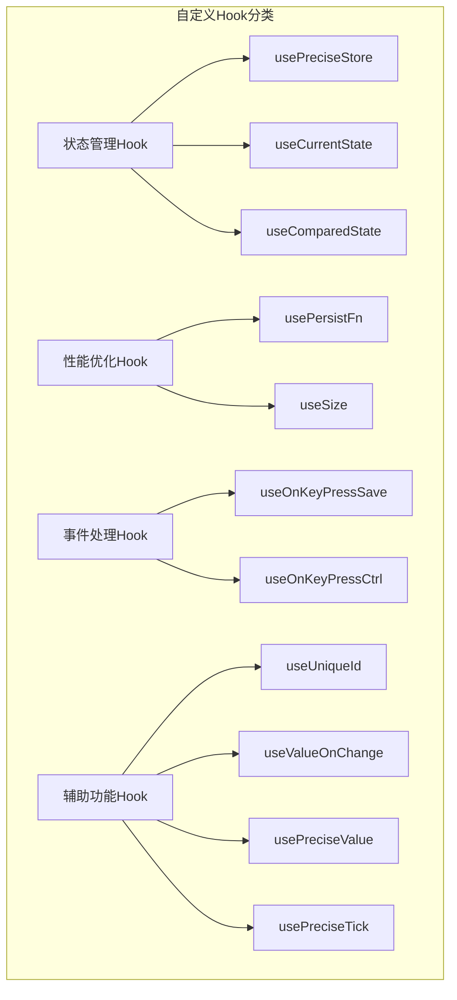
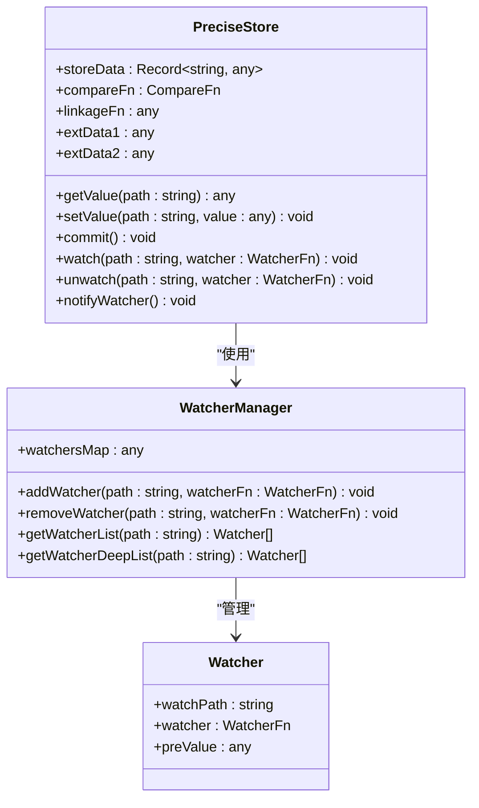
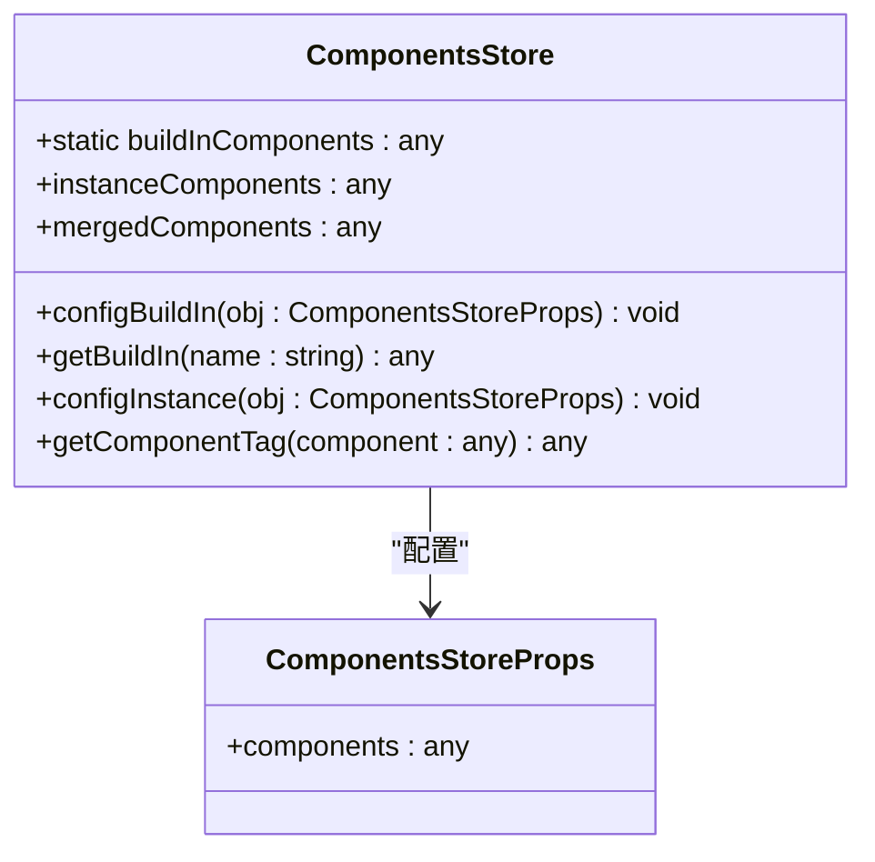

# 工具函数和自定义Hook参考手册

<cite>
**本文档引用的文件**
- [src/hooks/index.ts](file://src/hooks/index.ts)
- [src/hooks/useSize.ts](file://src/hooks/useSize.ts)
- [src/hooks/usePersistFn.ts](file://src/hooks/usePersistFn.ts)
- [src/hooks/usePreciseStore.ts](file://src/hooks/usePreciseStore.ts)
- [src/util/guid.ts](file://src/util/guid.ts)
- [src/util/shallowEqual.ts](file://src/util/shallowEqual.ts)
- [src/util/lodash-get.js](file://src/util/lodash-get.js)
- [src/util/comp.tsx](file://src/util/comp.tsx)
- [src/util/component.ts](file://src/util/component.ts)
- [src/util/index.ts](file://src/util/index.ts)
</cite>

## 目录
1. [简介](#简介)
2. [自定义Hook概览](#自定义hook概览)
3. [核心Hook详解](#核心hook详解)
4. [实用工具函数](#实用工具函数)
5. [组件注册机制](#组件注册机制)
6. [最佳实践案例](#最佳实践案例)
7. [性能优化建议](#性能优化建议)
8. [总结](#总结)

## 简介

Fat Design是一个功能丰富的React组件库，提供了大量实用的工具函数和自定义Hook。本手册系统性地介绍了这些工具的核心功能、使用场景和实现原理，帮助开发者更好地理解和运用这些工具来构建高效、可维护的应用程序。

## 自定义Hook概览

Fat Design的自定义Hook主要集中在`src/hooks`目录下，涵盖了状态管理、性能优化、DOM操作等多个方面：



**图表来源**
- [src/hooks/index.ts](file://src/hooks/index.ts#L1-L30)

**章节来源**
- [src/hooks/index.ts](file://src/hooks/index.ts#L1-L30)

## 核心Hook详解

### useSize Hook - 精确尺寸监听

`useSize` Hook提供了一个简洁的方式来监听DOM元素的尺寸变化，基于现代的ResizeObserver API实现。

```typescript
interface UseSizeRes {
    width: number;
    height: number;
}

function useSize(target: any): UseSizeRes
```

**核心特性：**
- 使用ResizeObserver监听尺寸变化
- 支持多种target类型（DOM节点、ref等）
- 自动清理观察器，防止内存泄漏
- 返回实时的宽度和高度值

**使用示例：**
```javascript
// 基本用法
const size = useSize(ref);

// 在组件中使用
function MyComponent() {
    const ref = useRef(null);
    const {width, height} = useSize(ref);
    
    return (
        <div ref={ref}>
            尺寸: {width} x {height}
        </div>
    );
}
```

**章节来源**
- [src/hooks/useSize.ts](file://src/hooks/useSize.ts#L1-L44)

### usePersistFn Hook - 持久化函数

`usePersistFn` Hook解决了React函数组件中频繁创建新函数导致的性能问题，通过记忆化技术确保函数引用的稳定性。

```typescript
function usePersistFn(fn: any): any
```

**核心实现原理：**
```javascript
// 使用ref保存函数引用
const fnRef = useRef(fn);
fnRef.current = useMemo(function () {
    return fn;
}, [fn]);

// 创建记忆化的包装函数
const memoizedFn = useRef<any>();
if (!memoizedFn.current) {
    memoizedFn.current = function () {
        const args: any[] = [];
        for (let i = 0; i < arguments.length; i++) {
            args[i] = arguments[i];
        }
        return fnRef.current.apply(this, args);
    };
}
```

**应用场景：**
- 作为依赖项传递给useEffect
- 作为回调函数传递给子组件
- 在事件处理器中使用
- 防止不必要的重新渲染

**章节来源**
- [src/hooks/usePersistFn.ts](file://src/hooks/usePersistFn.ts#L1-L29)

### usePreciseStore Hook - 精确状态管理

`usePreciseStore`是Fat Design中最复杂的Hook之一，提供了精确的状态管理和监听机制。



**图表来源**
- [src/hooks/usePreciseStore.ts](file://src/hooks/usePreciseStore.ts#L40-L120)

**核心功能：**
1. **精确状态管理**：支持嵌套对象的状态管理
2. **智能监听**：只通知发生变化的监听器
3. **批量提交**：支持批量更新和事务处理
4. **链式联动**：支持状态间的自动联动

**使用示例：**
```javascript
// 创建PreciseStore
const store = useCreatePreciseStore({
    user: {
        name: '张三',
        age: 25
    },
    settings: {
        theme: 'light'
    }
});

// 设置值并提交
store.setValue('user.name', '李四');
store.commit();

// 添加监听器
store.watch('user.name', (newValue, oldValue, store) => {
    console.log(`用户名从 ${oldValue} 变为 ${newValue}`);
});
```

**章节来源**
- [src/hooks/usePreciseStore.ts](file://src/hooks/usePreciseStore.ts#L1-L299)

## 实用工具函数

### guid工具函数 - 全局唯一标识符

`guid`函数提供了高效的全局唯一标识符生成机制，适用于各种需要唯一ID的场景。

```typescript
function uniqueId(prefix?: string): string
export default function (prefix?: string): string
```

**实现特点：**
- 基于时间戳和索引组合
- 支持前缀定制
- 高性能，避免重复计算
- 完全兼容浏览器环境

**使用示例：**
```javascript
// 生成唯一ID
const id1 = guid(); // "j7jv509c"
const id2 = guid('prefix-'); // "prefix-j7jv509d"

// 在组件中使用
function MyComponent() {
    const uniqueId = guid('component-');
    return <div id={uniqueId}>组件内容</div>;
}
```

**章节来源**
- [src/util/guid.ts](file://src/util/guid.ts#L1-L26)

### shallowEqual工具函数 - 浅比较

`shallowEqual`提供了高效的浅比较算法，用于React组件的性能优化。

```typescript
function shallowEqual(a: any, b: any, ignoreFn: boolean = false): boolean
function deepEqual(a: any, b: any, ignoreFn: boolean = false, deep: number = 0): boolean
```

**核心算法：**
```javascript
const commonEqual = (a: any, b: any, nextCompareMethod: any, ignoreFn: boolean = false) => {
    if (a === b) {
        return true;
    }
    
    const aType = typeof a;
    const bType = typeof b;
    
    if (aType !== bType) {
        return false;
    }
    
    if (isBasicType(aType) && isBasicType(bType)) {
        return a === b;
    }
    
    if (typeof a !== 'object' || !a || typeof b !== 'object' || !b) {
        return false;
    }
    
    return compareByObject(a, b, nextCompareMethod, ignoreFn);
}
```

**应用场景：**
- React.memo的比较函数
- shouldComponentUpdate优化
- 防止不必要的重新渲染
- 对象属性比较

**章节来源**
- [src/util/shallowEqual.ts](file://src/util/shallowEqual.ts#L1-L92)

### lodash-get工具函数 - 安全属性访问

`lodash-get`提供了安全的对象属性访问功能，支持深度路径查询。

**核心特性：**
- 支持点号和方括号语法
- 自动处理null/undefined值
- 性能优化的路径解析
- 完整的lodash兼容性

**使用示例：**
```javascript
// 基本用法
const obj = {
    user: {
        profile: {
            name: '张三'
        }
    }
};

// 安全访问深层属性
const name = get(obj, 'user.profile.name'); // "张三"
const age = get(obj, 'user.profile.age', 25); // 25 (默认值)

// 数组访问
const items = get(obj, 'items[0].name');
```

**章节来源**
- [src/util/lodash-get.js](file://src/util/lodash-get.js#L1-L199)

## 组件注册机制

### ComponentsStore组件注册类

`ComponentsStore`类提供了强大的组件注册和管理机制，支持内置组件和实例组件的合并管理。



**图表来源**
- [src/util/comp.tsx](file://src/util/comp.tsx#L35-L85)

**核心功能：**

1. **内置组件注册**：
```javascript
// 注册内置组件
ComponentsStore.configBuildIn({
    components: {
        DatePicker: DatePickerComponent,
        Select: SelectComponent
    }
});
```

2. **实例组件配置**：
```javascript
// 配置实例组件
const store = new ComponentsStore({
    components: {
        Upload: CustomUploadComponent
    }
});
```

3. **组件合并策略**：
```javascript
// 内置组件优先级高于实例组件
private doMergeComponents(): any {
    this.mergedComponents = {};
    Object.assign(this.mergedComponents, ComponentsStore.buildInComponents);
    Object.assign(this.mergedComponents, this.instanceComponents);
}
```

4. **组件标签解析**：
```javascript
public getComponentTag(component: any): any {
    if (typeof component !== "string") {
        return component;
    }
    
    // 支持两种形式：DatePicker.WeekPicker 或 DatePickerWeekPicker
    let comp = get(components, component);
    if (comp) {
        return comp;
    }
    
    return buildEmptyComponent(component);
}
```

**章节来源**
- [src/util/comp.tsx](file://src/util/comp.tsx#L1-L125)

## 最佳实践案例

### 状态持久化最佳实践

```javascript
// 使用usePreciseStore进行状态持久化
function PersistentForm() {
    const store = useCreatePreciseStore(
        JSON.parse(localStorage.getItem('formData') || '{}'),
        'shallow' // 使用浅比较
    );
    
    // 监听所有变化并持久化
    store.watch('*', (newValue, oldValue, store) => {
        localStorage.setItem('formData', JSON.stringify(newValue));
    });
    
    return (
        <form>
            {/* 表单字段 */}
        </form>
    );
}
```

### 精确状态监听最佳实践

```javascript
// 使用精确监听减少不必要的重渲染
function OptimizedComponent() {
    const store = useCreatePreciseStore({
        user: {
            name: '',
            preferences: {}
        }
    });
    
    // 只监听特定路径的变化
    const userName = usePreciseValue(store, 'user.name');
    const userTheme = usePreciseValue(store, 'user.preferences.theme');
    
    return (
        <div>
            <h1>{userName}'s Preferences</h1>
            <ThemeSelector value={userTheme} />
        </div>
    );
}
```

### 组件动态注册最佳实践

```javascript
// 动态组件注册和使用
function DynamicComponentRegistry() {
    // 注册自定义组件
    ComponentsStore.configBuildIn({
        components: {
            CustomButton: ({children, ...props}) => (
                <button className="custom-btn" {...props}>
                    {children}
                </button>
            )
        }
    });
    
    // 获取组件标签
    const CustomButton = ComponentsStore.getBuildIn('CustomButton');
    
    return (
        <div>
            <CustomButton onClick={() => alert('点击了！')}>
                自定义按钮
            </CustomButton>
        </div>
    );
}
```

### 性能优化最佳实践

```javascript
// 使用usePersistFn优化性能
function OptimizedList() {
    const [items, setItems] = useState([]);
    
    // 使用persistFn避免不必要的重新渲染
    const handleItemClick = usePersistFn((item) => {
        // 处理点击事件
        console.log('Clicked:', item);
    });
    
    return (
        <ul>
            {items.map((item, index) => (
                <li key={item.id} onClick={() => handleItemClick(item)}>
                    {item.name}
                </li>
            ))}
        </ul>
    );
}
```

## 性能优化建议

### Hook使用优化

1. **usePersistFn的正确使用**：
```javascript
// ❌ 错误：每次都会创建新函数
const handleClick = useCallback(() => {
    console.log('clicked');
}, []);

// ✅ 正确：使用persistFn保持引用稳定
const handleClick = usePersistFn(() => {
    console.log('clicked');
});
```

2. **PreciseStore的批量更新**：
```javascript
// ✅ 推荐：批量更新后统一提交
store.setValue('user.name', newName);
store.setValue('user.email', newEmail);
store.commit(); // 只触发一次通知
```

3. **组件注册的时机控制**：
```javascript
// ✅ 推荐：在应用启动时完成组件注册
function App() {
    // 应用启动时注册组件
    ComponentsStore.configBuildIn({
        components: {
            // 组件定义
        }
    });
    
    return <MainApp />;
}
```

### 内存管理建议

1. **及时清理监听器**：
```javascript
function MyComponent() {
    const store = useGetPreciseStore();
    
    useEffect(() => {
        const unwatch = store.watch('user.name', handler);
        
        return () => {
            store.unwatch('user.name', handler);
        };
    }, []);
}
```

2. **避免内存泄漏**：
```javascript
// ✅ 使用正确的清理函数
useEffect(() => {
    const observer = new ResizeObserver(callback);
    observer.observe(element);
    
    return () => {
        observer.disconnect();
    };
}, []);
```

## 总结

Fat Design提供的工具函数和自定义Hook为React应用开发提供了强大而灵活的解决方案。通过合理使用这些工具，可以显著提升应用的性能、可维护性和开发效率。

**关键要点：**
- `useSize`提供了简洁的尺寸监听功能
- `usePersistFn`解决了函数引用不稳定的问题
- `usePreciseStore`实现了精确的状态管理和监听
- `guid`提供了高效的唯一标识符生成
- `shallowEqual`优化了对象比较性能
- `ComponentsStore`实现了灵活的组件注册机制

掌握这些工具的使用方法和最佳实践，将有助于构建更加高效、稳定的React应用程序。