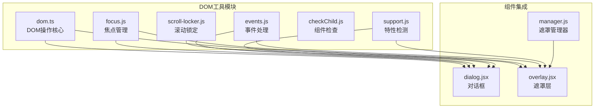

# DOM操作工具

<cite>
**本文档引用的文件**
- [dom.ts](file://src/util/dom.ts)
- [focus.js](file://src/util/focus.js)
- [events.js](file://src/util/events.js)
- [support.js](file://src/util/support.js)
- [checkChild.js](file://src/util/checkChild.js)
- [scroll-locker.js](file://src/util/scroll-locker.js)
- [dialog.jsx](file://src/dialog/dialog.jsx)
- [overlay.jsx](file://src/overlay/overlay.jsx)
- [manager.js](file://src/overlay/manager.js)
</cite>

## 目录
1. [简介](#简介)
2. [项目结构](#项目结构)
3. [核心DOM工具](#核心dom工具)
4. [焦点管理工具](#焦点管理工具)
5. [事件处理工具](#事件处理工具)
6. [浏览器特性检测](#浏览器特性检测)
7. [组件集成应用](#组件集成应用)
8. [性能优化与最佳实践](#性能优化与最佳实践)
9. [故障排除指南](#故障排除指南)
10. [总结](#总结)

## 简介

Fat Design的DOM操作工具集是一套专为现代Web应用设计的高效、可访问性友好的DOM操作解决方案。这套工具提供了完整的DOM查询、操作、属性访问、焦点管理和事件处理功能，广泛应用于模态框、抽屉、下拉菜单等复杂交互组件中。

这些工具的核心设计理念是：
- **跨浏览器兼容性**：统一处理不同浏览器的差异
- **可访问性优先**：确保所有用户都能正常使用
- **性能优化**：高效的DOM操作和内存管理
- **类型安全**：完整的TypeScript类型定义

## 项目结构

DOM操作工具位于`src/util`目录下，包含以下核心文件：



**图表来源**
- [dom.ts](file://src/util/dom.ts#L1-L50)
- [focus.js](file://src/util/focus.js#L1-L30)
- [events.js](file://src/util/events.js#L1-L20)
- [support.js](file://src/util/support.js#L1-L30)

## 核心DOM工具

### DOM检测与基础操作

`dom.ts`提供了完整的DOM操作功能，包括类名管理、样式操作、元素查询等核心功能。

#### 类名管理

```typescript
// 检查元素是否包含指定类名
export function hasClass(node: Element, className: string): boolean

// 添加类名
export function addClass(node: Element, className: string, _force?: boolean): void

// 移除类名
export function removeClass(node: Element, className: string, _force?: boolean): void

// 切换类名
export function toggleClass(node: Element, className: string): boolean
```

这些函数提供了优雅的类名管理，自动处理浏览器兼容性问题。例如，`addClass`函数会根据浏览器支持情况选择使用`classList` API或手动字符串操作。

#### 样式操作

```typescript
// 获取元素计算后的样式
export function getStyle(node: Element, name?: string): any

// 设置元素样式
export function setStyle(node: Element, name: string | object, value?: any): void
```

样式操作函数具有智能的单位处理能力，能够自动添加`px`单位并处理特殊属性如`float`。

#### 元素查询

```typescript
// 元素是否匹配CSS选择器
export const matches: (node: Element, selector: string) => boolean

// 获取元素距离视口的偏移
export function getOffset(node: Element): { top: number, left: number }

// 获取元素的滚动条大小
export function scrollbar(): { width: number, height: number }
```

**章节来源**
- [dom.ts](file://src/util/dom.ts#L1-L425)

### checkChild函数：组件渲染优化

`checkChild.js`提供了高效的子组件类型检查功能，主要用于React组件树的优化渲染。

```javascript
function isChildTypeComp(child) {
    if (!child || !child.type) {
        return false;
    }
    const type = child.type;
    return typeof type === 'function' || typeof type === 'object';
}
```

这个函数在组件渲染优化中的应用：
- **条件渲染优化**：避免不必要的重新渲染
- **类型安全检查**：确保组件类型正确
- **性能提升**：减少DOM操作次数

**章节来源**
- [checkChild.js](file://src/util/checkChild.js#L1-L17)

## 焦点管理工具

### 可访问性友好的焦点控制

`focus.js`实现了完整的焦点管理功能，确保所有用户都能通过键盘导航正常使用界面。

#### 焦点检测系统

```javascript
function _isVisible(node) {
    while (node) {
        const { nodeName } = node;
        if (nodeName === 'BODY' || nodeName === 'HTML') {
            break;
        }
        if (node.style.display === 'none' || node.style.visibility === 'hidden') {
            return false;
        }
        node = node.parentNode;
    }
    return true;
}

function _isFocusable(node) {
    const nodeName = node.nodeName.toLowerCase();
    const tabIndex = parseInt(node.getAttribute('tabindex'), 10);
    const hasTabIndex = !isNaN(tabIndex) && tabIndex > -1;

    if (_isVisible(node)) {
        if (nodeName === 'input') {
            return !node.disabled && node.type !== 'hidden';
        } else if (['select', 'textarea', 'button'].indexOf(nodeName) > -1) {
            return !node.disabled;
        } else if (nodeName === 'a') {
            return node.getAttribute('href') || hasTabIndex;
        } else {
            return hasTabIndex;
        }
    }
    return false;
}
```

#### 焦点管理功能

```typescript
// 获取容器内所有可聚焦元素
export function getFocusNodeList(node: Element): Element[]

// 保存最后聚焦的元素
export function saveLastFocusNode(): void

// 清除焦点记录
export function clearLastFocusNode(): void

// 恢复到最后一个聚焦的元素
export function backLastFocusNode(): void

// 限制Tab键范围
export function limitTabRange(node: Element, e: KeyboardEvent): void
```

**章节来源**
- [focus.js](file://src/util/focus.js#L1-L127)

## 事件处理工具

### 跨浏览器事件处理

`events.js`提供了统一的事件处理接口，解决了不同浏览器的事件模型差异。

#### 基础事件操作

```typescript
// 绑定事件
export function on(
    node: any, 
    eventName: string, 
    callback: Function, 
    useCapture?: boolean
): { off: () => void }

// 取消事件绑定
export function off(
    node: any, 
    eventName: string, 
    callback: Function, 
    useCapture?: boolean
): void

// 绑定一次性事件
export function once(
    node: any, 
    eventName: string, 
    callback: Function, 
    useCapture?: boolean
): { off: () => void }
```

#### 事件处理特点

- **自动清理**：每个绑定的事件都有对应的清理方法
- **跨浏览器兼容**：统一处理`addEventListener`和`attachEvent`
- **内存安全**：防止事件监听器泄漏

**章节来源**
- [events.js](file://src/util/events.js#L1-L62)

## 浏览器特性检测

### 动画和过渡效果检测

`support.js`负责检测浏览器对各种特性的支持情况，为组件提供适配策略。

#### 特性检测系统

```typescript
// 动画结束事件检测
const animationEndEventNames = {
    WebkitAnimation: 'webkitAnimationEnd',
    OAnimation: 'oAnimationEnd',
    animation: 'animationend',
};

// 过渡结束事件检测
const transitionEventNames = {
    WebkitTransition: 'webkitTransitionEnd',
    OTransition: 'oTransitionEnd',
    transition: 'transitionend',
};
```

#### 支持的功能

```typescript
// 动画支持检测
export const animation: { end: string } | false

// 过渡支持检测  
export const transition: { end: string } | false

// Flexbox支持检测
export const flex: boolean
```

**章节来源**
- [support.js](file://src/util/support.js#L1-L95)

## 组件集成应用

### 模态框管理实例

DOM操作工具在模态框组件中的应用展示了完整的交互流程。

#### 对话框焦点管理

```javascript
class Dialog extends Component {
    componentDidMount() {
        events.on(document, 'keydown', this.onKeyDown);
    }

    componentWillUnmount() {
        events.off(document, 'keydown', this.onKeyDown);
    }

    onKeyDown(e) {
        const node = this.getInnerNode();
        if (node) {
            limitTabRange(node, e);
        }
    }
}
```

#### 遮罩层滚动锁定

```javascript
// 滚动锁定实现
function lock(container, style) {
    const originStyle = container.getAttribute('style');
    const uuid = guid();
    lockcache.push({
        uuid,
        container,
        originStyle,
    });
    dom.setStyle(container, style);
    return uuid;
}

function unlock(container, uuid) {
    const list = lockcache.filter(i => i.container === container);
    const item = list.find(i => i.uuid === uuid);
    if (item) {
        // 处理嵌套弹窗的样式恢复
        const idx = list.indexOf(item);
        if (idx !== -1 && idx < list.length - 1) {
            const originStyle = item.originStyle;
            list[idx + 1].originStyle = originStyle;
            lockcache.splice(lockcache.indexOf(item), 1);
            return;
        }
        
        container.setAttribute('style', item.originStyle || '');
        lockcache.pop();
    }
}
```

#### 遮罩管理器

```javascript
const overlayManager = {
    allOverlays: [],

    addOverlay(overlay) {
        this.removeOverlay(overlay);
        this.allOverlays.unshift(overlay);
    },

    isCurrentOverlay(overlay) {
        return overlay && this.allOverlays[0] === overlay;
    },

    removeOverlay(overlay) {
        const i = this.allOverlays.indexOf(overlay);
        if (i > -1) {
            this.allOverlays.splice(i, 1);
        }
    },
};
```

**章节来源**
- [dialog.jsx](file://src/dialog/dialog.jsx#L249-L295)
- [scroll-locker.js](file://src/dialog/scroll-locker.js#L1-L53)
- [manager.js](file://src/overlay/manager.js#L1-L20)

## 性能优化与最佳实践

### 内存泄漏防护

#### 事件监听器清理

```javascript
// 正确的事件清理模式
componentDidMount() {
    this._keydownEvents = events.on(document, 'keydown', this.onKeyDown);
    this._clickEvents = events.on(document, 'click', this.handleClick);
}

componentWillUnmount() {
    // 确保所有事件都被正确清理
    this._keydownEvents && this._keydownEvents.off();
    this._clickEvents && this._clickEvents.off();
}
```

#### DOM引用管理

```javascript
// 使用弱引用避免内存泄漏
class Overlay extends Component {
    componentWillUnmount() {
        // 清理DOM引用
        this.contentRef = null;
        this.gatewayRef = null;
        
        // 清理定时器
        if (this.focusTimeout) {
            clearTimeout(this.focusTimeout);
        }
    }
}
```

### 性能优化建议

#### 1. 批量DOM操作

```javascript
// 避免频繁的DOM操作
export function setStyle(node, name, value) {
    if (typeof name === 'object' && arguments.length === 2) {
        // 批量设置多个样式属性
        each(name, (val, key) => setStyle(node, key, val));
    } else {
        // 单个属性设置
        node.style[camelcase(name)] = value;
    }
}
```

#### 2. 缓存DOM查询结果

```javascript
// 缓存频繁使用的DOM查询
class Component extends React.Component {
    constructor(props) {
        super(props);
        this._cachedElements = new WeakMap();
    }
    
    getCachedElement(key) {
        if (!this._cachedElements.has(key)) {
            this._cachedElements.set(key, document.querySelector(key));
        }
        return this._cachedElements.get(key);
    }
}
```

#### 3. 虚拟化大型列表

```javascript
// 对于大型DOM树，使用虚拟化技术
export function getFocusNodeList(node) {
    const res = [];
    const nodeList = node.querySelectorAll('*');
    
    // 限制遍历深度，避免性能问题
    each(nodeList, (item, index) => {
        if (index > 1000) return false; // 限制最大遍历数量
        
        if (_isFocusable(item)) {
            const method = item.getAttribute('data-auto-focus') ? 'unshift' : 'push';
            res[method](item);
        }
    });
    
    return res;
}
```

## 故障排除指南

### 常见问题与解决方案

#### 1. 焦点丢失问题

**问题描述**：模态框关闭后焦点没有回到原来的位置

**解决方案**：
```javascript
// 确保正确保存和恢复焦点
export function backLastFocusNode() {
    if (lastFocusElement) {
        try {
            // 元素可能已经被移动了
            lastFocusElement.focus();
        } catch (e) {
            // 忽略错误，继续执行
        }
    }
}
```

#### 2. 事件重复绑定

**问题描述**：组件多次挂载导致事件监听器重复绑定

**解决方案**：
```javascript
// 使用唯一标识符避免重复绑定
class Component extends React.Component {
    componentDidMount() {
        if (!this._eventBound) {
            this._eventBound = true;
            events.on(document, 'keydown', this.onKeyDown);
        }
    }
    
    componentWillUnmount() {
        if (this._eventBound) {
            events.off(document, 'keydown', this.onKeyDown);
            this._eventBound = false;
        }
    }
}
```

#### 3. 滚动锁定失效

**问题描述**：多个弹窗同时打开时滚动锁定混乱

**解决方案**：
```javascript
// 使用栈结构管理滚动锁定
const lockcache = [];

function lock(container, style) {
    const uuid = guid();
    lockcache.push({
        uuid,
        container,
        originStyle: container.getAttribute('style'),
    });
    dom.setStyle(container, style);
    return uuid;
}

function unlock(container, uuid) {
    const list = lockcache.filter(i => i.container === container);
    const item = list.find(i => i.uuid === uuid);
    
    if (item) {
        // 处理嵌套弹窗的样式恢复
        const idx = list.indexOf(item);
        if (idx !== -1 && idx < list.length - 1) {
            const originStyle = item.originStyle;
            list[idx + 1].originStyle = originStyle;
            lockcache.splice(lockcache.indexOf(item), 1);
            return;
        }
        
        container.setAttribute('style', item.originStyle || '');
        lockcache.pop();
    }
}
```

#### 4. 样式计算错误

**问题描述**：`getComputedStyle`返回空对象或错误值

**解决方案**：
```javascript
function _getComputedStyle(node) {
    return node && node.nodeType === 1 ? 
        window.getComputedStyle(node, null) : 
        {};
}

export function getStyle(node, name) {
    const style = _getComputedStyle(node);
    
    if (isPlainObject(style)) {
        return null; // 非元素节点返回null
    }
    
    // 处理特殊情况
    name = floatMap[name] ? 
        ('cssFloat' in node.style ? 'cssFloat' : 'styleFloat') : 
        name;
    
    return _getStyleValue(node, name, style.getPropertyValue(hyphenate(name)) || node.style[camelcase(name)]);
}
```

**章节来源**
- [focus.js](file://src/util/focus.js#L80-L95)
- [scroll-locker.js](file://src/dialog/scroll-locker.js#L25-L52)
- [dom.ts](file://src/util/dom.ts#L120-L150)

## 总结

Fat Design的DOM操作工具集提供了一套完整、高效的DOM操作解决方案。通过合理使用这些工具，开发者可以：

### 主要优势

1. **跨浏览器兼容性**：统一处理不同浏览器的差异，确保一致的行为
2. **可访问性支持**：内置的焦点管理和键盘导航支持
3. **性能优化**：智能的缓存机制和批量操作支持
4. **内存安全**：完善的事件清理和DOM引用管理
5. **类型安全**：完整的TypeScript类型定义

### 最佳实践总结

- **事件管理**：始终成对使用`on`和`off`方法
- **DOM操作**：使用批量操作减少重排重绘
- **内存管理**：及时清理事件监听器和DOM引用
- **可访问性**：优先考虑键盘导航和屏幕阅读器支持
- **性能监控**：定期检查DOM操作对性能的影响

这套DOM操作工具不仅适用于Fat Design组件库，也可以作为独立的工具包应用于其他React项目中，为构建高质量的Web应用提供坚实的基础。