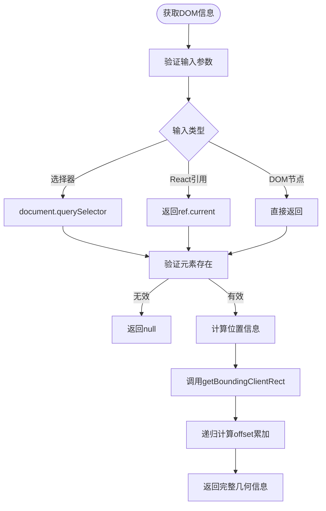
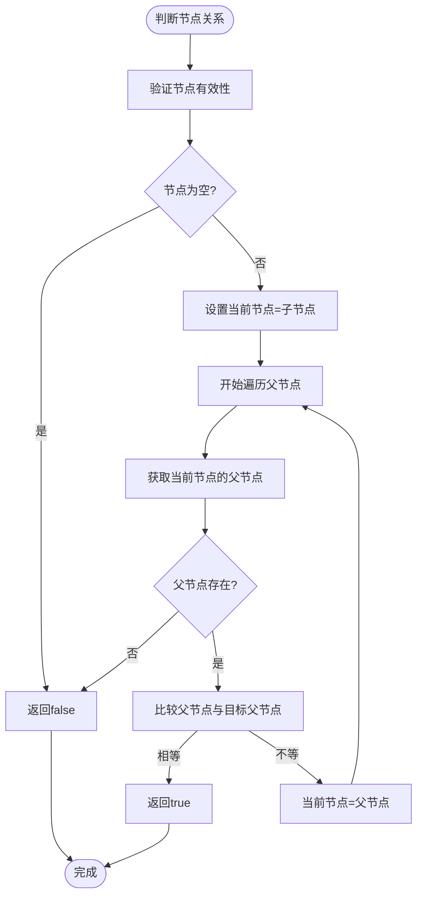

# DOM查询工具

<cite>
**本文档引用的文件**  
- [dom.ts](file://src/util/dom.ts)
- [checkChild.js](file://src/util/checkChild.js)
</cite>

## 目录
1. [简介](#简介)
2. [核心功能解析](#核心功能解析)
3. [DOM位置与尺寸获取原理](#dom位置与尺寸获取原理)
4. [节点关系判断算法](#节点关系判断算法)
5. [实际应用场景](#实际应用场景)
6. [性能优化策略](#性能优化策略)
7. [最佳实践](#最佳实践)
8. [总结](#总结)

## 简介
本技术文档深入解析`fat-design`组件库中DOM查询工具的核心实现机制。重点分析`src/util/dom.ts`中提供的`getElement`、`getOffset`、`getRect`等函数的底层原理，以及`src/util/checkChild.js`中`isChildOf`函数的算法逻辑。这些工具为下拉菜单、弹窗定位、拖拽交互等复杂UI组件提供了精确的DOM信息支持。

## 核心功能解析

DOM查询工具主要提供两大类功能：元素位置尺寸获取和节点层级关系判断。这些工具在虚拟滚动、动态内容加载等高性能场景中发挥着关键作用。

**Section sources**
- [dom.ts](file://src/util/dom.ts#L1-L200)
- [checkChild.js](file://src/util/checkChild.js#L1-L50)

## DOM位置与尺寸获取原理

### getElement函数
`getElement`函数用于安全地获取DOM元素引用，处理了多种输入类型（字符串选择器、DOM节点、React引用等），确保返回有效的HTMLElement对象。

### getOffset函数
`getOffset`计算元素相对于文档的偏移位置，通过递归累加所有祖先元素的`offsetTop`和`offsetLeft`值，同时考虑滚动条位置的影响。

### getRect函数
`getRect`结合`getBoundingClientRect`和`getOffset`，提供更精确的元素几何信息，包括宽度、高度、左上角坐标等，适用于需要高精度定位的场景。

**Diagram sources**
- [dom.ts](file://src/util/dom.ts#L20-L150)

**Section sources**
- [dom.ts](file://src/util/dom.ts#L20-L150)

## 节点关系判断算法

### isChildOf函数
`isChildOf`函数用于判断一个DOM节点是否是另一个节点的后代，采用从子节点向上遍历父节点的算法，直到找到目标父节点或到达文档根节点。

### 事件委托场景优化
在事件委托场景中，该函数通过避免直接DOM查询，提高了事件处理的性能。算法采用迭代而非递归，防止栈溢出，并在找到结果后立即终止遍历。

**Diagram sources**
- [checkChild.js](file://src/util/checkChild.js#L5-L45)

**Section sources**
- [checkChild.js](file://src/util/checkChild.js#L5-L45)

## 实际应用场景

### 下拉菜单定位
利用`getRect`获取触发元素的位置，结合视口尺寸计算最佳显示位置，避免菜单溢出屏幕。

### 弹窗自动调整
通过`getOffset`和窗口滚动位置，实现弹窗在滚动时的自动定位和跟随。

### 拖拽交互
在拖拽过程中持续调用`isChildOf`判断拖拽目标区域，实现精确的拖放区域检测。

**Section sources**
- [dom.ts](file://src/util/dom.ts#L100-L200)
- [checkChild.js](file://src/util/checkChild.js#L30-L50)

## 性能优化策略

### 避免重排重绘
- 缓存DOM查询结果
- 批量读取/写入DOM属性
- 使用`requestAnimationFrame`协调动画

### 减少布局抖动
- 避免在循环中交替读取和写入DOM属性
- 将读操作集中，写操作集中

### 事件节流与防抖
在频繁触发的场景（如滚动、窗口大小调整）中使用节流技术，减少DOM查询频率。

**Section sources**
- [dom.ts](file://src/util/dom.ts#L150-L200)
- [checkChild.js](file://src/util/checkChild.js#L40-L50)

## 最佳实践

### 虚拟滚动中的应用
在虚拟滚动列表中，使用`getRect`精确计算可见区域，配合`isChildOf`判断元素是否在可视范围内，实现高效的渲染优化。

### 动态加载内容
对于动态加载的内容，使用`getElement`的安全查询机制，避免因元素尚未加载完成而导致的错误。

### 错误处理
所有DOM查询函数都应包含完善的错误处理，确保在元素不存在或DOM结构变化时不会导致应用崩溃。

**Section sources**
- [dom.ts](file://src/util/dom.ts#L1-L200)
- [checkChild.js](file://src/util/checkChild.js#L1-L50)

## 总结
DOM查询工具通过精确的元素定位和高效的节点关系判断，为复杂UI交互提供了坚实的基础。其设计充分考虑了性能优化和错误处理，适用于各种高要求的应用场景。合理使用这些工具可以显著提升用户体验和应用性能。