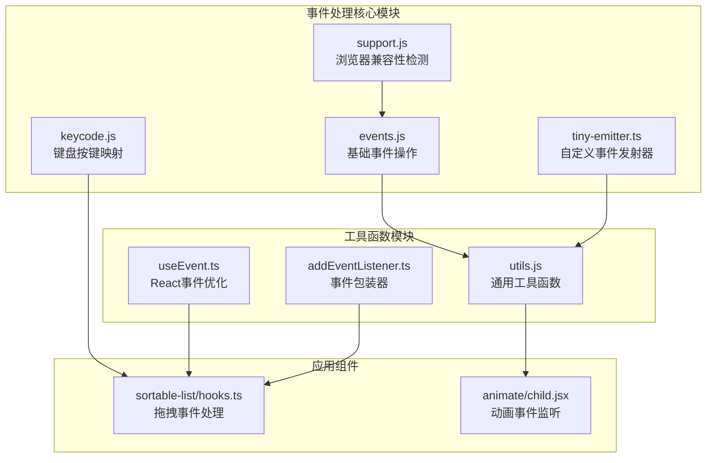
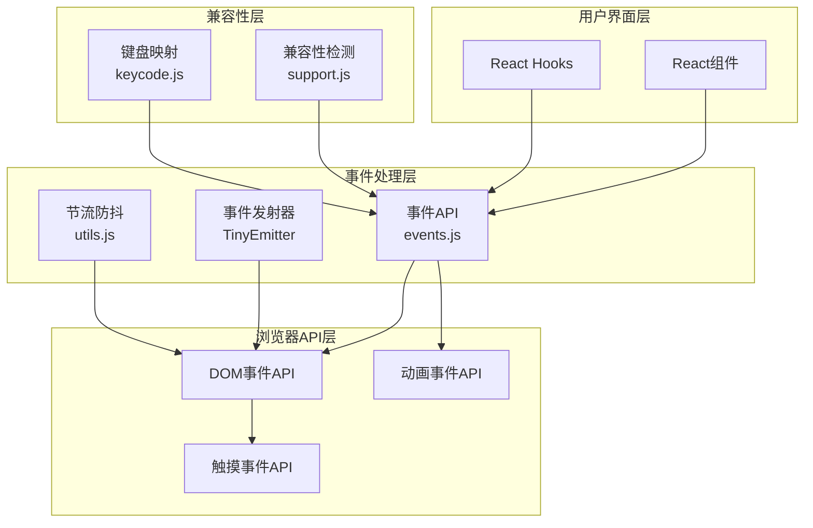
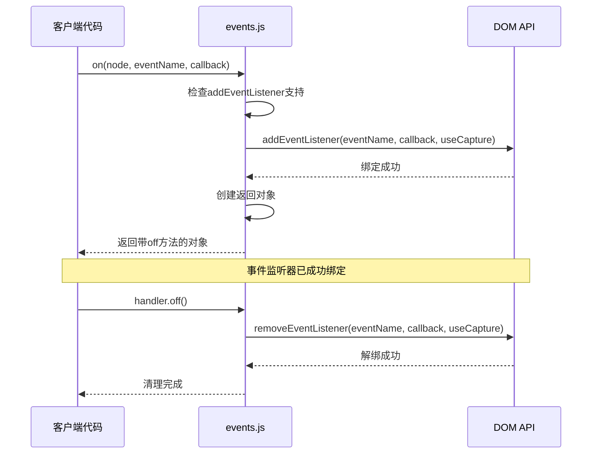
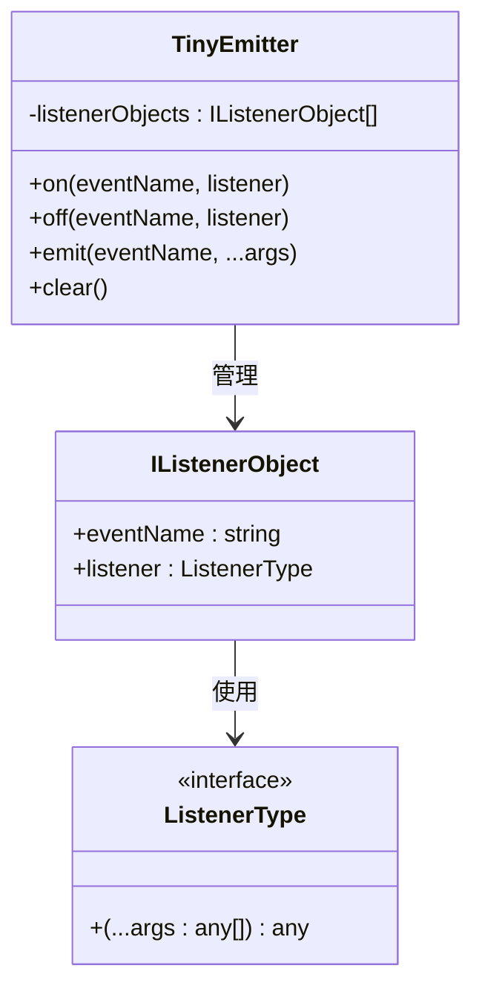
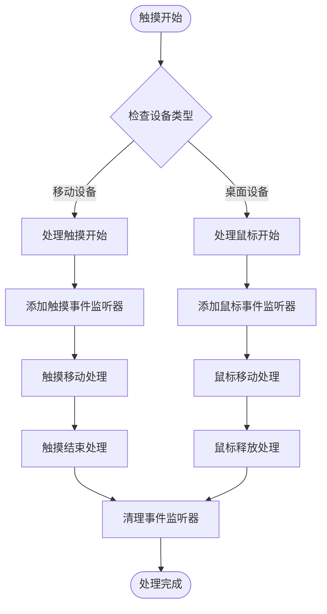
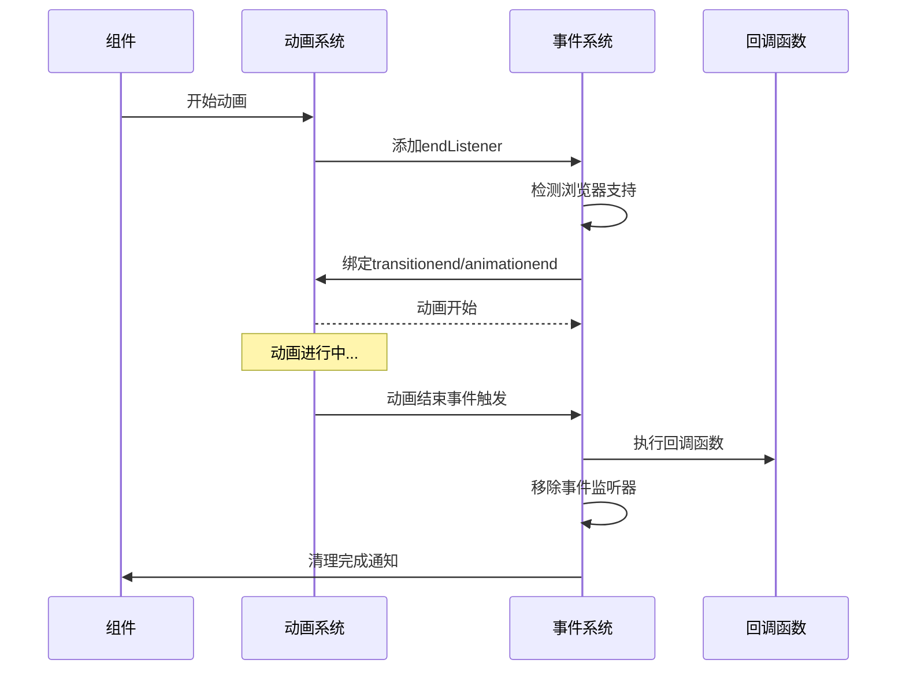
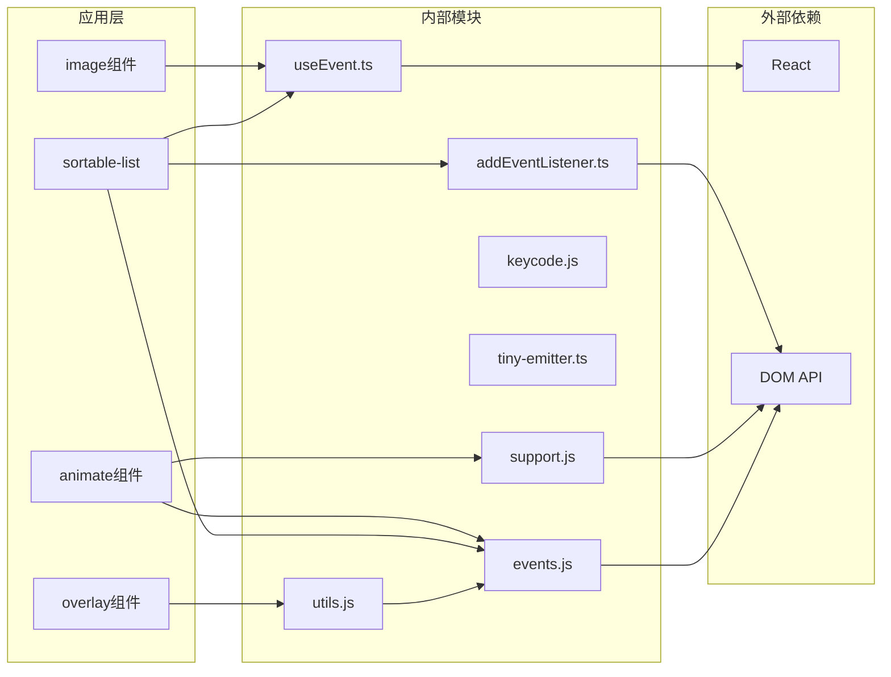

# 事件处理工具

<cite>
**本文档引用的文件**
- [events.js](file://src/util/events.js)
- [support.js](file://src/util/support.js)
- [tiny-emitter.ts](file://src/util/tiny-emitter.ts)
- [keycode.js](file://src/util/keycode.js)
- [useEvent.ts](file://src/image/utils/useEvent.ts)
- [addEventListener.ts](file://src/image/utils/addEventListener.ts)
- [utils.js](file://src/overlay/v2/utils.js)
- [hooks.ts](file://src/sortable-list/hooks.ts)
- [child.jsx](file://src/animate/child.jsx)
</cite>

## 目录
1. [简介](#简介)
2. [项目结构](#项目结构)
3. [核心组件](#核心组件)
4. [架构概览](#架构概览)
5. [详细组件分析](#详细组件分析)
6. [依赖关系分析](#依赖关系分析)
7. [性能考虑](#性能考虑)
8. [故障排除指南](#故障排除指南)
9. [结论](#结论)

## 简介

Fat Design 的事件处理工具提供了一套完整的事件管理解决方案，涵盖了从基础的 DOM 事件绑定到高级的动画事件处理。该工具集设计用于简化复杂的事件操作，包括事件代理、命名空间支持、自定义事件系统，以及跨浏览器兼容性处理。

主要特性包括：
- 基础事件绑定和解绑功能
- 事件代理和命名空间支持
- 自定义事件发射器（TinyEmitter）
- 键盘快捷键和鼠标手势支持
- 触摸事件处理
- 事件节流和防抖优化
- 内存泄漏防护机制

## 项目结构

事件处理工具的核心文件位于 `src/util/` 目录下，采用模块化设计，每个文件专注于特定的功能领域：



**图表来源**
- [events.js](file://src/util/events.js#L1-L62)
- [support.js](file://src/util/support.js#L1-L95)
- [tiny-emitter.ts](file://src/util/tiny-emitter.ts#L1-L61)

**章节来源**
- [events.js](file://src/util/events.js#L1-L62)
- [support.js](file://src/util/support.js#L1-L95)
- [keycode.js](file://src/util/keycode.js#L1-L33)

## 核心组件

### 基础事件操作 (events.js)

events.js 提供了三个核心函数来处理基本的事件操作：

#### on 函数
```javascript
export function on(node, eventName, callback, useCapture) {
    if (node.addEventListener) {
        node.addEventListener(eventName, callback, useCapture || false);
    }

    return {
        off: () => off(node, eventName, callback, useCapture),
    };
}
```

#### off 函数
```javascript
export function off(node, eventName, callback, useCapture) {
    if (node.removeEventListener) {
        node.removeEventListener(eventName, callback, useCapture || false);
    }
}
```

#### once 函数
```javascript
export function once(node, eventName, callback, useCapture) {
    return on(
        node,
        eventName,
        function __fn(...args) {
            callback.apply(this, args);
            off(node, eventName, __fn, useCapture);
        },
        useCapture
    );
}
```

### 浏览器兼容性检测 (support.js)

support.js 模块负责检测浏览器对各种特性的支持情况：

```javascript
export const animation = _supportEnd(animationEndEventNames);
export const transition = _supportEnd(transitionEventNames);
export const flex = _supportCSS({
    display: ['flex', '-webkit-flex', '-moz-flex', '-ms-flexbox'],
});
```

### 自定义事件发射器 (tiny-emitter.ts)

TinyEmitter 类提供了轻量级的事件总线功能：

```typescript
class TinyEmitter {
    private listenerObjects: IListenerObject[];

    on = (eventName: string, listener: ListenerType) => {
        this.listenerObjects.push({
            eventName: eventName,
            listener: listener
        })
    }
    
    off = (eventName: string, listener: ListenerType) => {
        if (!eventName) {
            return;
        }
        if (!listener) {
            this.listenerObjects = this.listenerObjects.filter((obj) => {
                return obj.eventName !== eventName;
            });
        } else {
            this.listenerObjects = this.listenerObjects.filter((obj) => {
                return !(obj.eventName === eventName && obj.listener === listener);
            });
        }
    }
}
```

**章节来源**
- [events.js](file://src/util/events.js#L1-L62)
- [support.js](file://src/util/support.js#L1-L95)
- [tiny-emitter.ts](file://src/util/tiny-emitter.ts#L1-L61)

## 架构概览

事件处理工具采用分层架构设计，从底层的浏览器兼容性检测到高层的业务事件处理：



**图表来源**
- [events.js](file://src/util/events.js#L1-L62)
- [support.js](file://src/util/support.js#L1-L95)
- [utils.js](file://src/overlay/v2/utils.js#L344-L370)

## 详细组件分析

### 事件绑定机制

#### 基础事件绑定流程



**图表来源**
- [events.js](file://src/util/events.js#L20-L35)

#### 事件代理模式

事件代理通过事件冒泡机制实现，允许在父元素上监听子元素的事件：

```javascript
// 事件代理示例
const delegateHandler = events.on(document.body, 'click', function(e) {
    if (e.target.matches('.dynamic-element')) {
        // 处理动态添加的元素点击事件
        handleDynamicClick(e);
    }
});
```

### 自定义事件系统

#### TinyEmitter 实现原理



**图表来源**
- [tiny-emitter.ts](file://src/util/tiny-emitter.ts#L1-L61)

#### 事件命名空间支持

虽然当前实现没有显式的命名空间支持，但可以通过事件名称约定实现类似功能：

```javascript
// 命名空间约定
const namespace = 'myApp.component';
const eventHandlers = {};

// 注册命名空间事件
eventHandlers[`${namespace}.init`] = events.on(window, 'load', initHandler);
eventHandlers[`${namespace}.resize`] = events.on(window, 'resize', resizeHandler);

// 清理命名空间事件
function cleanupNamespace(ns) {
    Object.keys(eventHandlers).forEach(key => {
        if (key.startsWith(ns)) {
            eventHandlers[key].off();
            delete eventHandlers[key];
        }
    });
}
```

### 键盘快捷键处理

#### 键码映射系统

```javascript
export default {
    BACKSPACE: 8,
    TAB: 9,
    ENTER: 13,
    SHIFT: 16,
    CTRL: 17,
    ALT: 18,
    ESC: 27,
    SPACE: 32,
    LEFT: 37,
    UP: 38,
    RIGHT: 39,
    DOWN: 40,
    CMD: 91,
    COMMAND: 91,
};
```

#### 键盘事件处理示例

```javascript
// 键盘快捷键监听
const keyHandler = events.on(document, 'keydown', function(e) {
    switch (e.keyCode) {
        case KEYCODE.ENTER:
            if (e.ctrlKey) {
                handleSubmit();
            }
            break;
        case KEYCODE.ESC:
            handleClose();
            break;
        case KEYCODE.LEFT:
            if (e.altKey) {
                navigateBack();
            }
            break;
    }
});

// 清理键盘监听器
function cleanup() {
    keyHandler.off();
}
```

### 触摸和手势事件

#### 触摸事件处理流程



**图表来源**
- [hooks.ts](file://src/sortable-list/hooks.ts#L145-L269)

#### 触摸事件优化

```javascript
// 触摸事件优化配置
const touchOptions = {
    capture: false,
    passive: false // 必须设置为false以支持preventDefault
};

// 触摸事件处理器
const onTouchMove = React.useCallback((e: TouchEvent) => {
    if (e.cancelable) {
        e.preventDefault(); // 阻止页面滚动
        onDrag(getTouchPoint(e.touches[0]));
    } else {
        // 如果事件不可取消，说明浏览器正在滚动
        document.removeEventListener('touchmove', onTouchMove);
        if (callbacksRef.current.onEnd) {
            callbacksRef.current.onEnd();
        }
    }
}, [onDrag]);
```

### 动画事件处理

#### 动画结束事件监听



**图表来源**
- [child.jsx](file://src/animate/child.jsx#L85-L123)

#### 动画兼容性检测

```javascript
// 动画事件名称检测
const animationEndEventNames = {
    WebkitAnimation: 'webkitAnimationEnd',
    OAnimation: 'oAnimationEnd',
    animation: 'animationend',
};

const transitionEventNames = {
    WebkitTransition: 'webkitTransitionEnd',
    OTransition: 'oTransitionEnd',
    transition: 'transitionend',
};

function _supportEnd(names) {
    if (!hasDOM) {
        return false;
    }

    const el = document.createElement('div');
    let ret = false;

    each(names, (val, key) => {
        if (el.style[key] !== undefined) {
            ret = { end: val };
            return false;
        }
    });

    return ret;
}
```

### 性能优化机制

#### 事件节流和防抖

```javascript
// 节流函数实现
export function throttle(func, wait) {
  let previous = -wait;
  return function () {
    const now = Date.now();
    const args = arguments;
    if (now - previous > wait) {
      const _this = this;
      window.requestAnimationFrame(() => {
        func.apply(_this, args);
      });
      previous = now;
    }
  };
}

// 防抖函数实现
export function debounce(func, wait) {
  let timeoutID;
  return () => {
    const args = arguments;
    clearTimeout(timeoutID);
    timeoutID = setTimeout(() => {
      func.apply(this, args);
    }, wait);
  };
}
```

#### React 事件优化

```typescript
// React useCallback 优化
export default function useEvent<T extends Function>(callback: any): T {
    const fnRef = useRef<any>();
    fnRef.current = callback;

    return useCallback<T>(
        ((...args: any) => {
            if (!fnRef.current) {
                return;
            }
            return fnRef.current(...args);
        }) as any, []);
}
```

**章节来源**
- [events.js](file://src/util/events.js#L1-L62)
- [tiny-emitter.ts](file://src/util/tiny-emitter.ts#L1-L61)
- [utils.js](file://src/overlay/v2/utils.js#L344-L370)
- [useEvent.ts](file://src/image/utils/useEvent.ts#L1-L14)
- [hooks.ts](file://src/sortable-list/hooks.ts#L103-L269)
- [child.jsx](file://src/animate/child.jsx#L85-L123)

## 依赖关系分析

事件处理工具的依赖关系呈现清晰的层次结构：



**图表来源**
- [events.js](file://src/util/events.js#L1-L62)
- [support.js](file://src/util/support.js#L1-L95)
- [utils.js](file://src/overlay/v2/utils.js#L344-L543)

**章节来源**
- [events.js](file://src/util/events.js#L1-L62)
- [support.js](file://src/util/support.js#L1-L95)
- [utils.js](file://src/overlay/v2/utils.js#L344-L543)

## 性能考虑

### 内存泄漏防护

事件处理工具实现了多层内存泄漏防护机制：

1. **自动清理机制**：once 函数确保事件只执行一次后自动清理
2. **手动清理接口**：所有事件绑定都提供 off 方法
3. **组件生命周期管理**：在 React 组件卸载时自动清理事件监听器

```javascript
// 组件卸载时的事件清理
useEffect(() => {
    const handler = events.on(document, 'click', handleClick);
    
    return () => {
        handler.off(); // 确保事件被正确清理
    };
}, []);

// TinyEmitter 的清理
const emitter = new TinyEmitter();
emitter.clear(); // 清理所有事件监听器
```

### 性能优化策略

1. **事件委托**：减少事件监听器数量
2. **节流防抖**：限制高频事件的处理频率
3. **requestAnimationFrame**：优化动画事件处理
4. **useCallback 优化**：React 组件中的事件函数缓存

### 最佳实践建议

1. **始终清理事件监听器**：在组件卸载或不再需要时调用 off 方法
2. **使用事件委托**：对于大量相似元素的事件处理
3. **合理使用节流防抖**：针对 resize、scroll 等高频事件
4. **避免内存泄漏**：确保事件监听器与组件生命周期同步

## 故障排除指南

### 常见问题及解决方案

#### 事件无法触发

**问题描述**：事件监听器注册后无法触发

**可能原因**：
1. DOM 元素不存在或未正确选择
2. 事件名称拼写错误
3. 事件被其他监听器阻止

**解决方案**：
```javascript
// 检查DOM元素是否存在
const element = document.querySelector('.target-element');
if (!element) {
    console.error('目标元素不存在');
    return;
}

// 正确的事件绑定
const handler = events.on(element, 'click', function(e) {
    console.log('事件触发', e);
});
```

#### 事件重复触发

**问题描述**：同一个事件被多次触发

**可能原因**：
1. 事件监听器被重复添加
2. 组件重新渲染导致事件重复绑定

**解决方案**：
```javascript
// 使用 useEffect 确保只绑定一次
useEffect(() => {
    const handler = events.on(document, 'click', handleClick);
    
    return () => {
        handler.off(); // 清理旧的监听器
    };
}, []); // 空依赖数组确保只运行一次
```

#### 内存泄漏

**问题描述**：长时间运行后内存占用持续增长

**可能原因**：
1. 事件监听器未正确清理
2. 循环引用导致垃圾回收失败
3. 大量未清理的 TinyEmitter 实例

**解决方案**：
```javascript
// 定期清理无用的事件监听器
function cleanupUnusedListeners() {
    // 清理特定命名空间的事件
    Object.keys(eventHandlers).forEach(key => {
        if (shouldCleanup(key)) {
            eventHandlers[key].off();
            delete eventHandlers[key];
        }
    });
}

// 在组件卸载时清理
useEffect(() => {
    return () => {
        // 清理所有相关事件
        cleanupUnusedListeners();
    };
}, []);
```

**章节来源**
- [events.js](file://src/util/events.js#L1-L62)
- [tiny-emitter.ts](file://src/util/tiny-emitter.ts#L1-L61)
- [utils.js](file://src/overlay/v2/utils.js#L344-L543)

## 结论

Fat Design 的事件处理工具提供了一套完整而强大的事件管理系统，具有以下优势：

### 主要特点总结

1. **全面的事件支持**：从基础 DOM 事件到高级动画事件
2. **跨浏览器兼容性**：智能检测和适配不同浏览器特性
3. **性能优化**：内置节流、防抖和事件委托机制
4. **内存安全**：完善的清理机制防止内存泄漏
5. **易于使用**：简洁的 API 设计和丰富的使用示例

### 技术亮点

- **模块化设计**：每个功能模块职责单一，便于维护和扩展
- **类型安全**：TypeScript 支持提供良好的开发体验
- **React 集成**：与 React 生态系统无缝集成
- **性能导向**：针对现代浏览器进行了深度优化

### 应用场景

这套事件处理工具适用于：
- 复杂的用户界面交互
- 动画和过渡效果
- 表单验证和输入处理
- 拖拽和手势识别
- 实时数据更新和响应式设计

通过合理使用这些工具，开发者可以构建高性能、可维护的用户界面，同时避免常见的事件处理陷阱和性能问题。