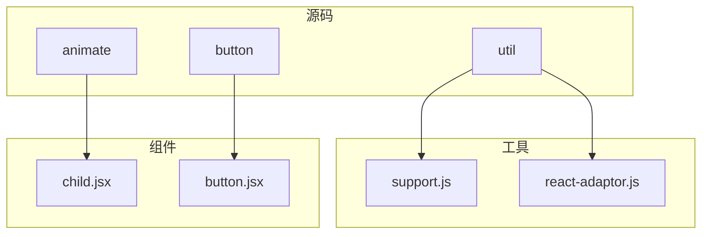
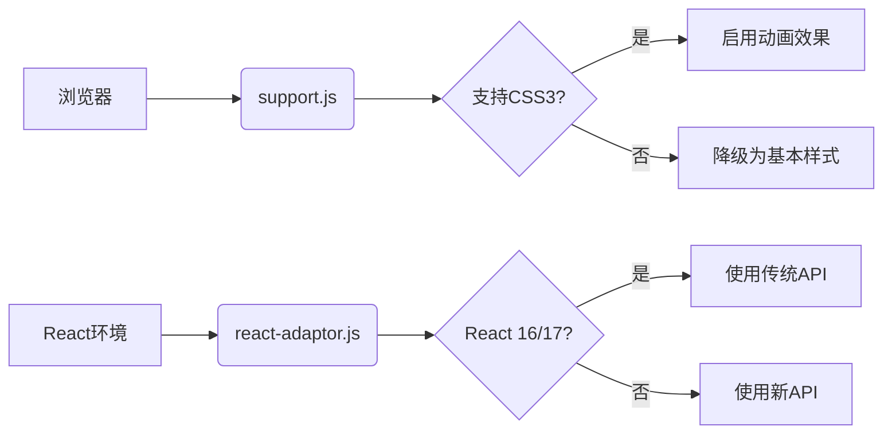
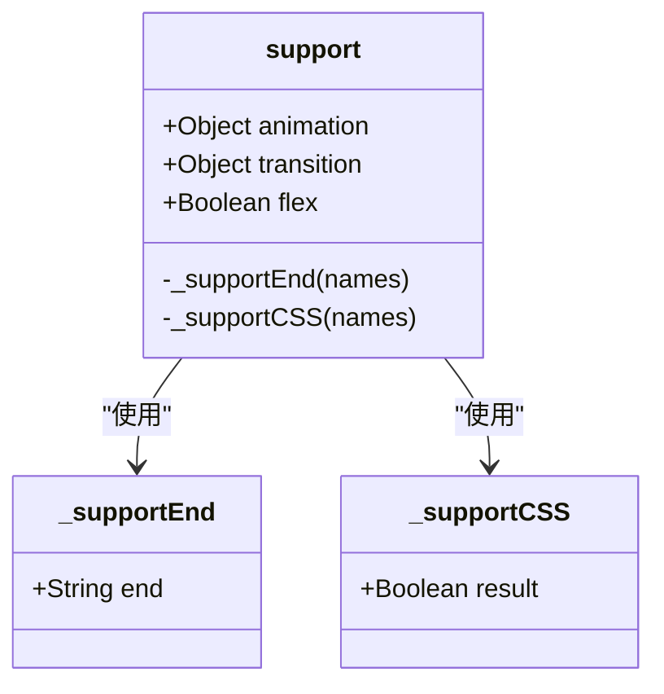
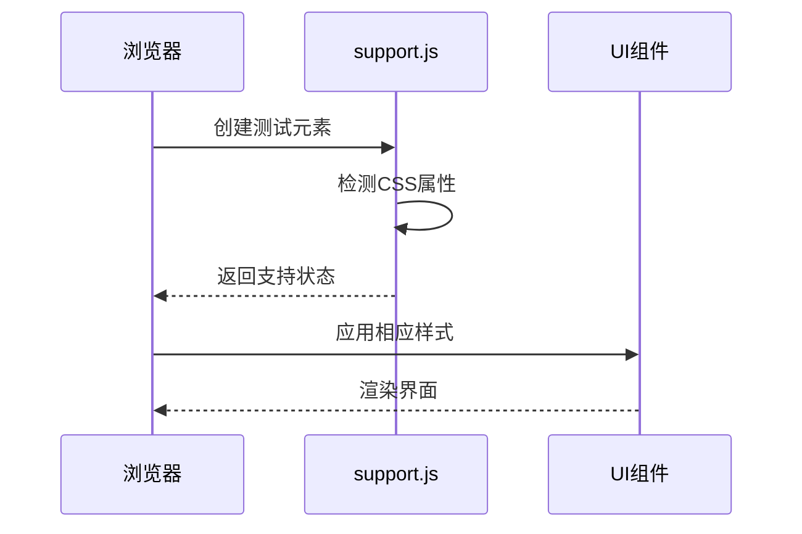
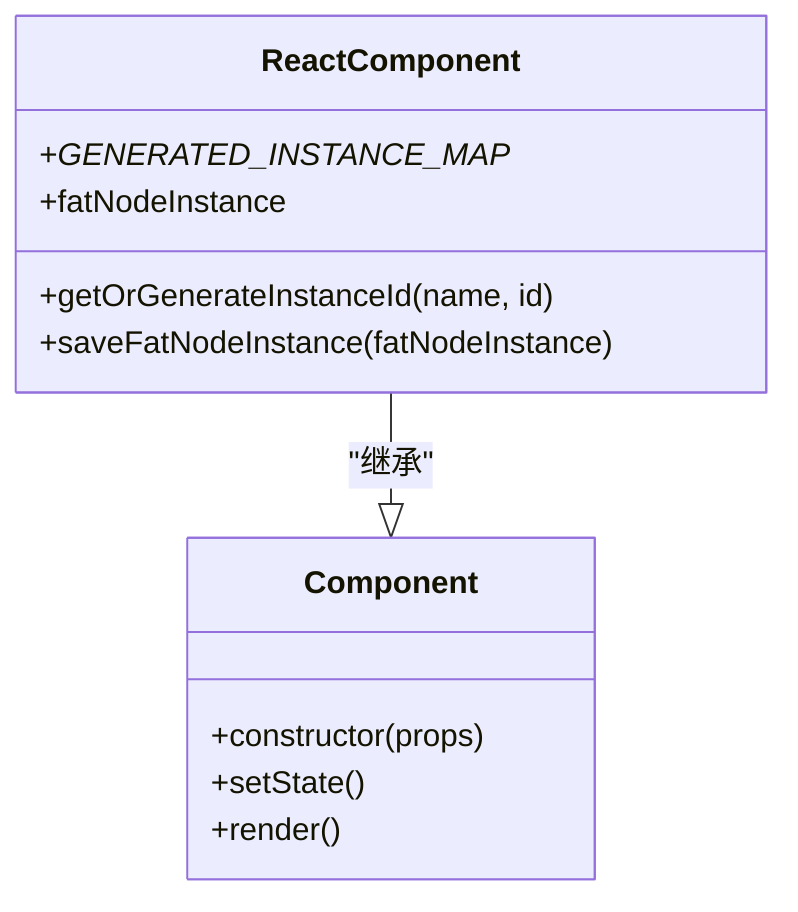
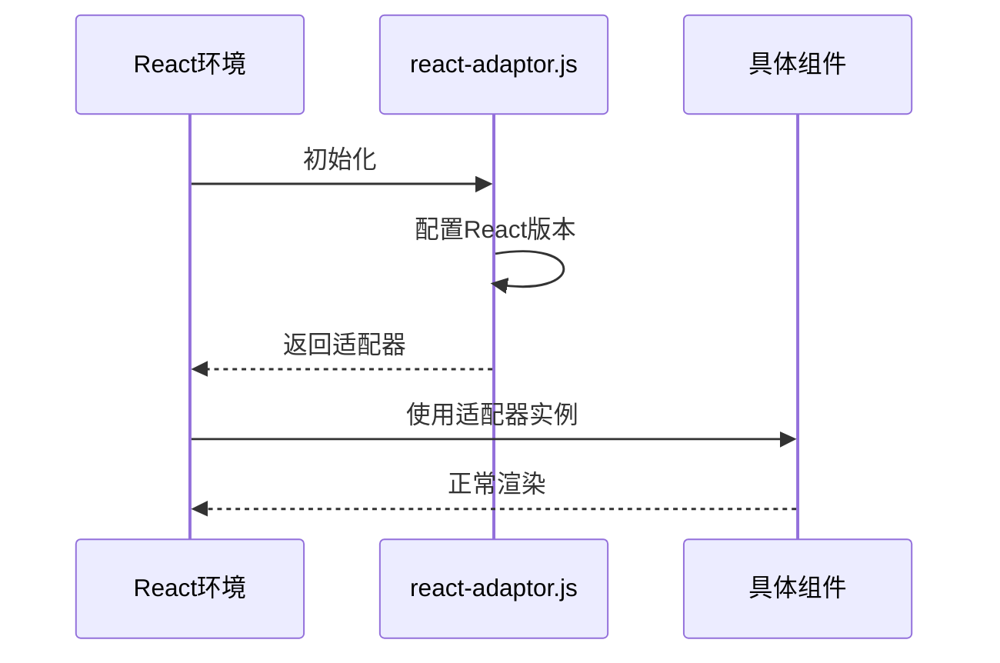
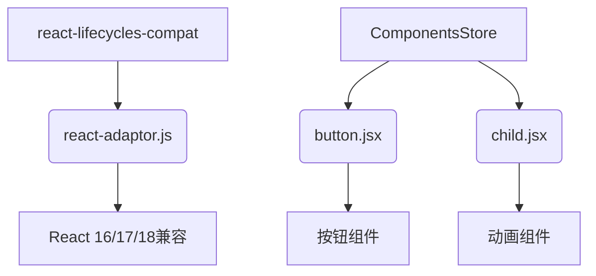

# 浏览器兼容性检测

<cite>
**本文档引用文件**  
- [support.js](file://src/util/support.js)
- [react-adaptor.js](file://src/util/react-adaptor.js)
- [child.jsx](file://src/animate/child.jsx)
- [button.jsx](file://src/button/view/button.jsx)
</cite>

## 目录
1. [简介](#简介)
2. [项目结构](#项目结构)
3. [核心组件](#核心组件)
4. [架构概述](#架构概述)
5. [详细组件分析](#详细组件分析)
6. [依赖分析](#依赖分析)
7. [性能考虑](#性能考虑)
8. [故障排除指南](#故障排除指南)
9. [结论](#结论)

## 简介
本文档深入分析 `support.js` 中对 CSS3 特性、HTML5 API 和事件模型的浏览器能力检测机制，涵盖 transition、animation、flexbox 等关键特性的支持判断。同时解释 `react-adaptor.js` 如何适配不同版本 React 的生命周期和 API 差异，并展示这些检测结果在组件降级、功能开关和用户体验优化中的实际应用。最后提供扩展检测能力的方法以及维护浏览器兼容性矩阵的最佳实践。

## 项目结构
项目结构清晰地组织了各个功能模块，其中 `src/util` 目录包含了核心的工具类文件，如 `support.js` 和 `react-adaptor.js`，用于处理浏览器兼容性和 React 版本适配。

**图示来源**
- [support.js](file://src/util/support.js)
- [react-adaptor.js](file://src/util/react-adaptor.js)
- [child.jsx](file://src/animate/child.jsx)
- [button.jsx](file://src/button/view/button.jsx)

**本节来源**
- [support.js](file://src/util/support.js)
- [react-adaptor.js](file://src/util/react-adaptor.js)

## 核心组件
`support.js` 提供了对 CSS3 动画、过渡和 Flexbox 布局的支持检测，而 `react-adaptor.js` 则通过继承 `React.Component` 实现了对不同 React 版本的兼容性适配。

**本节来源**
- [support.js](file://src/util/support.js#L54-L93)
- [react-adaptor.js](file://src/util/react-adaptor.js#L4-L33)

## 架构概述
系统通过 `support.js` 检测浏览器对现代 Web 特性的支持情况，并根据检测结果动态调整组件的行为。`react-adaptor.js` 则确保组件能够在不同版本的 React 环境中正常运行。

**图示来源**
- [support.js](file://src/util/support.js)
- [react-adaptor.js](file://src/util/react-adaptor.js)

## 详细组件分析

### 支持检测组件分析
`support.js` 使用 `_supportEnd` 和 `_supportCSS` 函数来检测浏览器对特定 CSS 属性和事件的支持情况。

#### 对象导向组件

**图示来源**
- [support.js](file://src/util/support.js#L0-L58)

#### API/服务组件

**图示来源**
- [support.js](file://src/util/support.js#L54-L93)

**本节来源**
- [support.js](file://src/util/support.js#L0-L94)

### React适配器分析
`react-adaptor.js` 通过 `ReactComponent` 类为所有组件提供统一的基类，确保在不同 React 版本下的兼容性。

#### 对象导向组件

**图示来源**
- [react-adaptor.js](file://src/util/react-adaptor.js#L4-L33)

#### API/服务组件

**图示来源**
- [react-adaptor.js](file://src/util/react-adaptor.js)
- [button.jsx](file://src/button/view/button.jsx)

**本节来源**
- [react-adaptor.js](file://src/util/react-adaptor.js#L0-L33)
- [button.jsx](file://src/button/view/button.jsx#L4-L19)

## 依赖分析
系统依赖于 `react-lifecycles-compat` 来处理 React 生命周期的兼容性问题，并通过 `ComponentsStore` 管理组件的注册和查找。

**图示来源**
- [react-adaptor.js](file://src/util/react-adaptor.js)
- [button.jsx](file://src/button/view/button.jsx)
- [child.jsx](file://src/animate/child.jsx)

**本节来源**
- [react-adaptor.js](file://src/util/react-adaptor.js)
- [button.jsx](file://src/button/view/button.jsx)
- [child.jsx](file://src/animate/child.jsx)

## 性能考虑
在进行浏览器兼容性检测时，应尽量减少 DOM 操作的次数，避免频繁创建和销毁测试元素。同时，对于不支持现代特性的旧版浏览器，应及时降级到基础样式，以保证页面的基本可用性。

## 故障排除指南
当遇到兼容性问题时，首先检查 `support.js` 的检测结果是否正确，然后确认 `react-adaptor.js` 是否正确配置了 React 版本。此外，还需检查组件是否正确继承了 `ReactComponent` 类。

**本节来源**
- [support.js](file://src/util/support.js#L54-L93)
- [react-adaptor.js](file://src/util/react-adaptor.js#L4-L33)

## 结论
通过 `support.js` 和 `react-adaptor.js` 的协同工作，系统能够有效地检测和适应不同浏览器及 React 版本的环境，确保组件在各种条件下都能正常运行。未来可以进一步扩展检测范围，增加对更多现代 Web 特性的支持判断，并优化降级策略以提升用户体验。