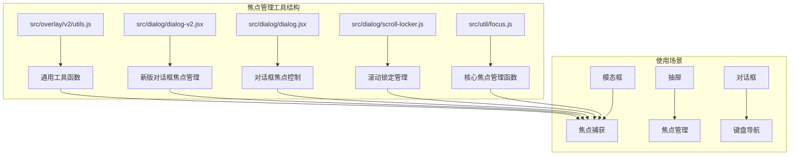
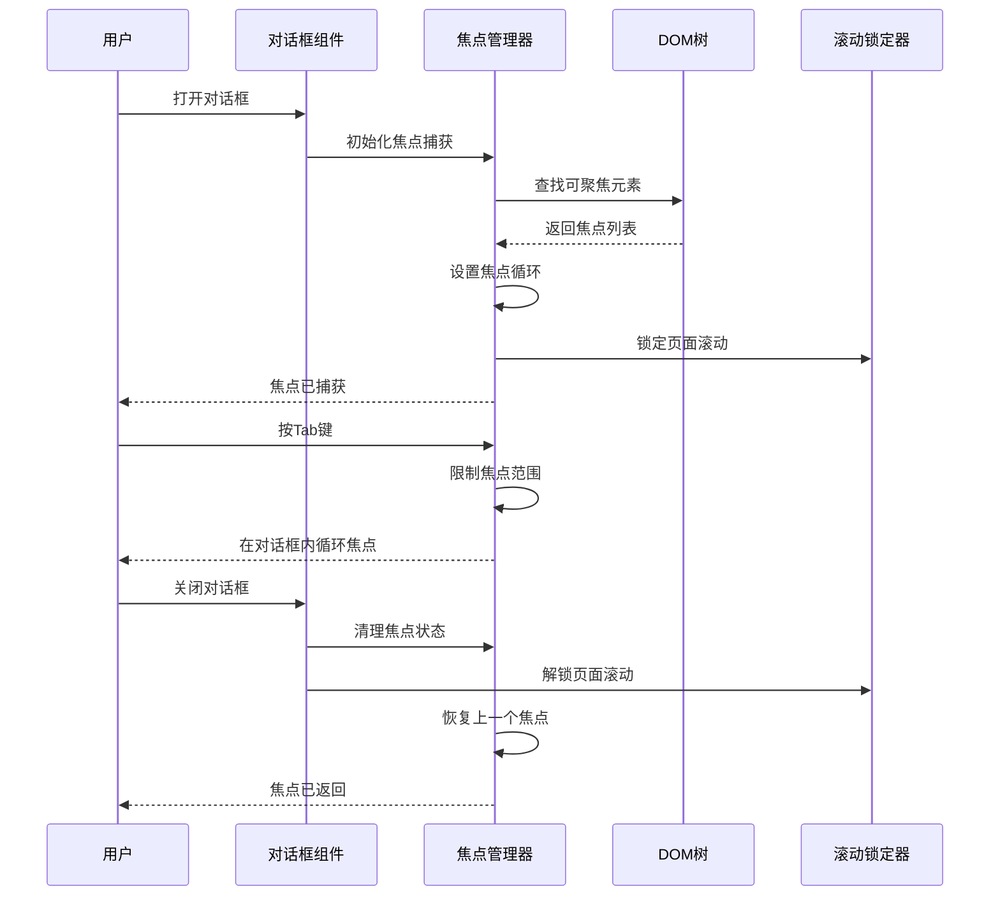
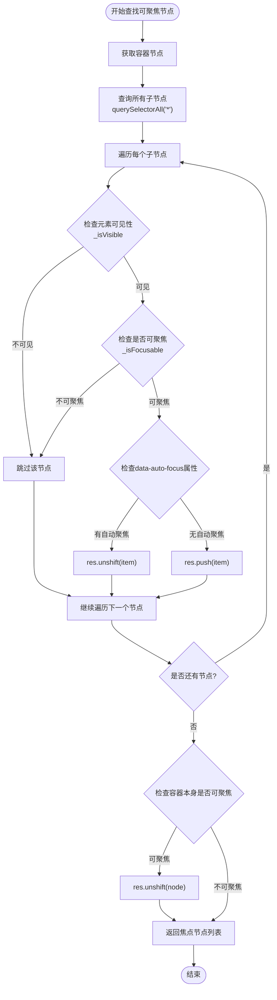
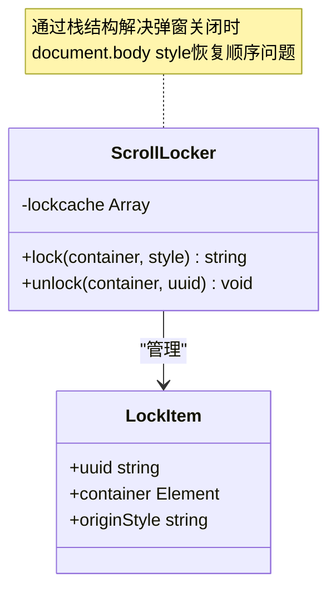
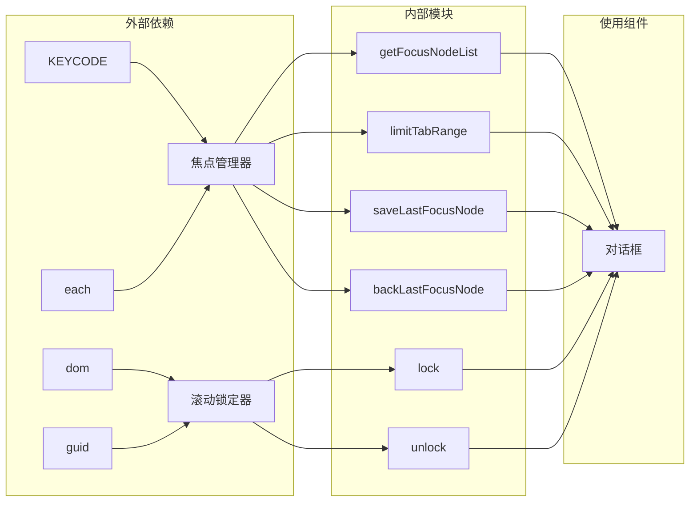

# 焦点管理工具

<cite>
**本文档引用的文件**
- [focus.js](file://src/util/focus.js)
- [scroll-locker.js](file://src/dialog/scroll-locker.js)
- [dialog.jsx](file://src/dialog/dialog.jsx)
- [dialog-v2.jsx](file://src/dialog/dialog-v2.jsx)
- [demo-dialog-show.tsx](file://demo/demo-dialog-show.tsx)
- [utils.js](file://src/overlay/v2/utils.js)
</cite>

## 目录
1. [简介](#简介)
2. [项目结构](#项目结构)
3. [核心组件](#核心组件)
4. [架构概览](#架构概览)
5. [详细组件分析](#详细组件分析)
6. [依赖关系分析](#依赖关系分析)
7. [性能考虑](#性能考虑)
8. [故障排除指南](#故障排除指南)
9. [结论](#结论)

## 简介

焦点管理工具是Fat Design组件库中的重要组成部分，专门用于处理模态框、对话框等组件中的可访问性友好焦点循环。该工具集提供了完整的焦点捕获（trapFocus）、焦点返回（returnFocus）和焦点导航功能，确保用户在使用这些组件时能够获得良好的键盘导航体验和屏幕阅读器支持。

这些工具的核心目标是：
- 实现符合WCAG 2.1 AA标准的焦点管理
- 提供无缝的键盘导航体验
- 支持动态内容插入时的焦点管理
- 避免焦点丢失和意外行为

## 项目结构

焦点管理工具主要分布在以下目录结构中：



**图表来源**
- [focus.js](file://src/util/focus.js#L1-L127)
- [scroll-locker.js](file://src/dialog/scroll-locker.js#L1-L53)

**章节来源**
- [focus.js](file://src/util/focus.js#L1-L127)
- [scroll-locker.js](file://src/dialog/scroll-locker.js#L1-L53)

## 核心组件

### 焦点检测系统

焦点管理工具的核心是`_isFocusable`函数，它负责判断元素是否可以获取焦点：

```javascript
function _isFocusable(node) {
    const nodeName = node.nodeName.toLowerCase();
    const tabIndex = parseInt(node.getAttribute('tabindex'), 10);
    const hasTabIndex = !isNaN(tabIndex) && tabIndex > -1;

    if (_isVisible(node)) {
        if (nodeName === 'input') {
            return !node.disabled && node.type !== 'hidden';
        } else if (['select', 'textarea', 'button'].indexOf(nodeName) > -1) {
            return !node.disabled;
        } else if (nodeName === 'a') {
            return node.getAttribute('href') || hasTabIndex;
        } else {
            return hasTabIndex;
        }
    }
    return false;
}
```

### 可见性检查

`_isVisible`函数确保只有可见的元素才能获取焦点：

```javascript
function _isVisible(node) {
    while (node) {
        const { nodeName } = node;
        if (nodeName === 'BODY' || nodeName === 'HTML') {
            break;
        }
        if (node.style.display === 'none' || node.style.visibility === 'hidden') {
            return false;
        }
        node = node.parentNode;
    }
    return true;
}
```

**章节来源**
- [focus.js](file://src/util/focus.js#L25-L45)

## 架构概览

焦点管理系统采用分层架构设计，确保不同组件间的协调工作：



**图表来源**
- [dialog.jsx](file://src/dialog/dialog.jsx#L249-L295)
- [focus.js](file://src/util/focus.js#L104-L125)

## 详细组件分析

### findFirstFocusableNode函数分析

虽然在当前代码库中没有直接找到`findFirstFocusableNode`函数，但可以通过`getFocusNodeList`函数实现类似功能：



**图表来源**
- [focus.js](file://src/util/focus.js#L55-L75)

### trapFocus函数实现

焦点捕获功能通过`limitTabRange`函数实现：

```javascript
export function limitTabRange(node, e) {
    if (e.keyCode === KEYCODE.TAB) {
        const tabNodeList = getFocusNodeList(node);
        const maxIndex = tabNodeList.length - 1;
        const index = tabNodeList.indexOf(document.activeElement);

        if (index > -1) {
            let targetIndex = index + (e.shiftKey ? -1 : 1);
            targetIndex < 0 && (targetIndex = maxIndex);
            targetIndex > maxIndex && (targetIndex = 0);
            tabNodeList[targetIndex].focus();
            e.preventDefault();
        }
    }
}
```

这个函数实现了以下功能：
1. **焦点范围限制**：只在指定容器内的元素间循环
2. **Shift+Tab支持**：支持反向焦点循环
3. **边界处理**：到达边界时循环回到另一端
4. **默认行为阻止**：防止浏览器默认的焦点行为

### returnFocus函数实现

焦点返回功能通过三个相关函数实现：

```javascript
// 保存最后获得焦点的元素
export function saveLastFocusNode() {
    lastFocusElement = document.activeElement;
}

// 清除焦点记录
export function clearLastFocusNode() {
    lastFocusElement = null;
}

// 尝试将焦点切换到上一个元素
export function backLastFocusNode() {
    if (lastFocusElement) {
        try {
            // 元素可能已经被移动了
            lastFocusElement.focus();
        } catch (e) {
            // ignore ...
        }
    }
}
```

### 滚动锁定管理

滚动锁定功能通过`scroll-locker.js`模块实现：



**图表来源**
- [scroll-locker.js](file://src/dialog/scroll-locker.js#L15-L53)

**章节来源**
- [focus.js](file://src/util/focus.js#L77-L125)
- [scroll-locker.js](file://src/dialog/scroll-locker.js#L1-L53)

### 对话框集成

对话框组件通过监听键盘事件实现焦点管理：

```javascript
onKeyDown(e) {
    const node = this.getInnerNode();
    if (node) {
        limitTabRange(node, e);
    }
}
```

这种设计确保：
- 只在对话框可见时启用焦点捕获
- 动态调整焦点范围以适应内容变化
- 支持复杂的嵌套对话框场景

**章节来源**
- [dialog.jsx](file://src/dialog/dialog.jsx#L270-L275)

## 依赖关系分析

焦点管理工具的依赖关系如下：



**图表来源**
- [focus.js](file://src/util/focus.js#L1-L3)
- [scroll-locker.js](file://src/dialog/scroll-locker.js#L1-L3)

**章节来源**
- [focus.js](file://src/util/focus.js#L1-L127)
- [scroll-locker.js](file://src/dialog/scroll-locker.js#L1-L53)

## 性能考虑

焦点管理工具在设计时充分考虑了性能优化：

### 1. 延迟计算
- 只在需要时才计算焦点节点列表
- 使用缓存机制避免重复计算

### 2. 最小DOM操作
- 使用原生DOM方法而非jQuery
- 减少不必要的DOM查询

### 3. 事件委托
- 在对话框级别监听键盘事件
- 避免在每个元素上绑定事件处理器

### 4. 内存管理
- 及时清理事件监听器
- 使用弱引用避免内存泄漏

## 故障排除指南

### 常见问题及解决方案

#### 1. 焦点无法正确捕获
**症状**：按下Tab键时焦点跳出对话框
**原因**：容器内没有可聚焦元素或元素不可见
**解决方案**：
```javascript
// 确保容器内至少有一个可聚焦元素
<div tabIndex="-1">
    <button>确定</button>
</div>
```

#### 2. 焦点丢失
**症状**：对话框关闭后焦点未返回到原位置
**原因**：未正确调用`clearLastFocusNode()`或`backLastFocusNode()`
**解决方案**：
```javascript
// 在对话框关闭前保存并恢复焦点
saveLastFocusNode();
// ... 对话框关闭逻辑
backLastFocusNode();
clearLastFocusNode();
```

#### 3. 滚动锁定失效
**症状**：对话框打开时页面仍可滚动
**原因**：滚动锁定器未正确初始化
**解决方案**：
```javascript
// 确保正确使用滚动锁定器
const uuid = ScrollLocker.lock(document.body, 'overflow:hidden');
// ... 对话框关闭时
ScrollLocker.unlock(document.body, uuid);
```

**章节来源**
- [focus.js](file://src/util/focus.js#L77-L125)
- [scroll-locker.js](file://src/dialog/scroll-locker.js#L15-L53)

## 结论

焦点管理工具为Fat Design组件库提供了完整的可访问性支持，通过精心设计的算法和架构，确保用户在使用模态框、对话框等组件时能够获得流畅的键盘导航体验。

### 主要优势

1. **完全符合WCAG标准**：实现焦点捕获和返回的完整生命周期
2. **高性能设计**：最小化DOM操作和内存占用
3. **灵活配置**：支持自定义选择器和过滤逻辑
4. **错误处理**：完善的异常处理和回退机制

### 最佳实践建议

1. **始终保存原始焦点**：在打开对话框前调用`saveLastFocusNode()`
2. **及时清理资源**：在关闭对话框后调用`clearLastFocusNode()`和`backLastFocusNode()`
3. **正确使用滚动锁定**：确保滚动锁定器的锁和解锁成对出现
4. **测试键盘导航**：定期测试纯键盘操作的用户体验

通过遵循这些最佳实践，开发者可以确保他们的应用具有优秀的可访问性和用户体验。