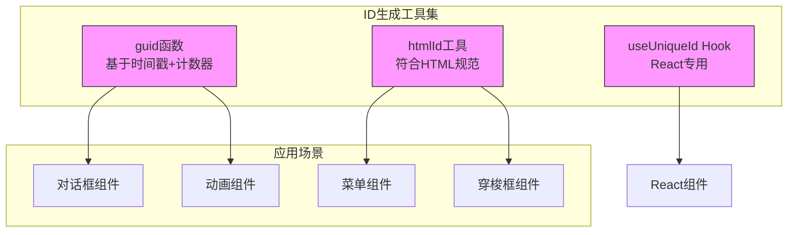
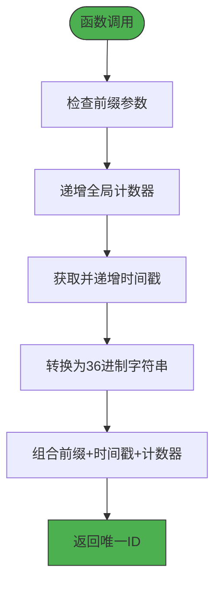
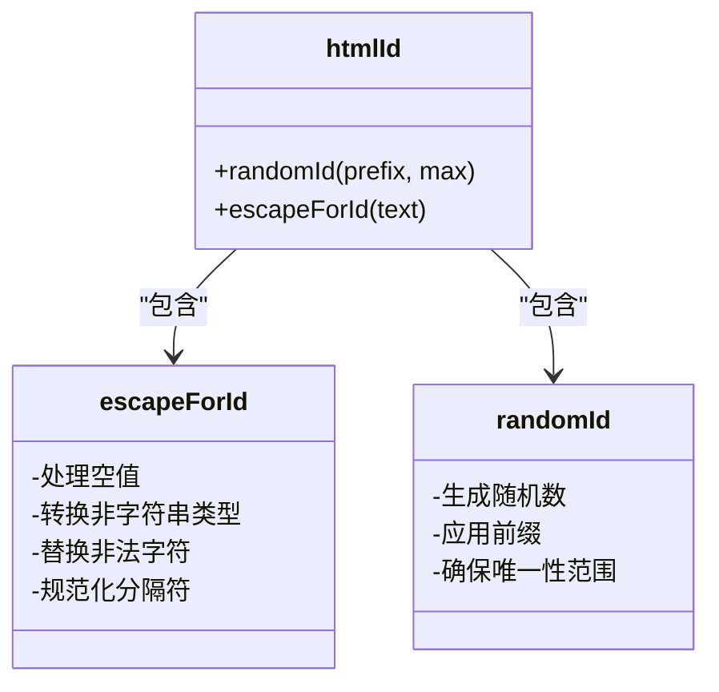
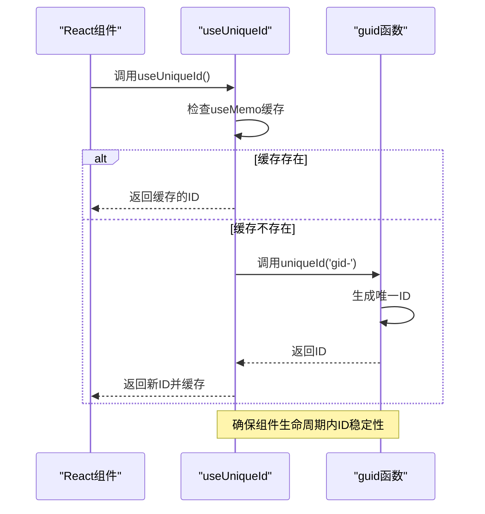
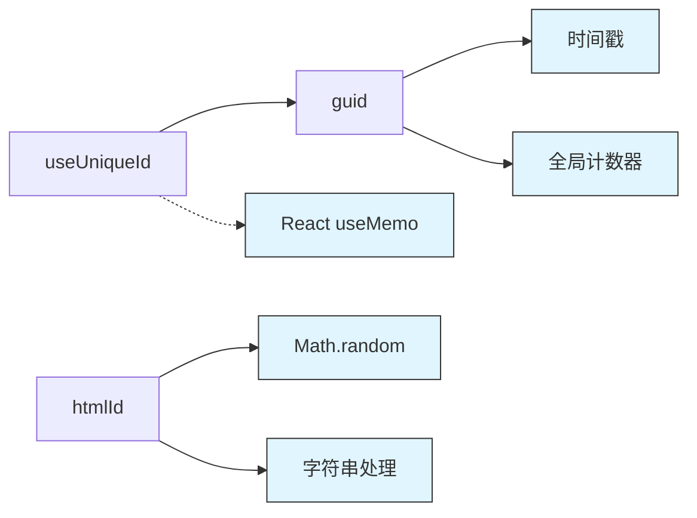

# ID生成工具

<cite>
**本文档引用的文件**  
- [guid.ts](file://src/util/guid.ts)
- [htmlId.js](file://src/util/htmlId.js)
- [useUniqueId.ts](file://src/hooks/useUniqueId.ts)
- [dialog-v2.jsx](file://src/dialog/dialog-v2.jsx)
- [inner.jsx](file://src/dialog/inner.jsx)
- [checkable-item.jsx](file://src/menu/view/checkable-item.jsx)
- [transfer-panel.jsx](file://src/transfer/view/transfer-panel.jsx)
- [guid.d.ts](file://types/0buildTypes/util/guid.d.ts)
- [useUniqueId.d.ts](file://types/0buildTypes/hooks/useUniqueId.d.ts)
</cite>

## 目录
1. [引言](#引言)
2. [核心组件](#核心组件)
3. [架构概览](#架构概览)
4. [详细组件分析](#详细组件分析)
5. [依赖分析](#依赖分析)
6. [性能考量](#性能考量)
7. [故障排除指南](#故障排除指南)
8. [结论](#结论)

## 引言
本文档详细介绍了Fat Design UI库中的ID生成工具集，包括`guid`函数、`htmlId`工具和`useUniqueId` React Hook。这些工具为组件提供全局唯一标识符，确保DOM元素ID的唯一性，支持无障碍访问，并解决服务端渲染场景下的水合不匹配问题。

## 核心组件

ID生成工具集包含三个核心组件：基于时间戳和计数器的`guid`函数、符合HTML规范的`htmlId`生成器，以及用于React组件的`useUniqueId` Hook。这些工具共同解决了前端开发中标识符生成的关键挑战。

**组件来源**
- [guid.ts](file://src/util/guid.ts#L1-L25)
- [htmlId.js](file://src/util/htmlId.js#L1-L32)
- [useUniqueId.ts](file://src/hooks/useUniqueId.ts#L1-L13)

## 架构概览

**图表来源**
- [guid.ts](file://src/util/guid.ts#L1-L25)
- [htmlId.js](file://src/util/htmlId.js#L1-L32)
- [useUniqueId.ts](file://src/hooks/useUniqueId.ts#L1-L13)

## 详细组件分析

### guid函数分析

`guid`函数是ID生成的核心，采用时间戳与递增计数器的组合算法确保全局唯一性。

**图表来源**
- [guid.ts](file://src/util/guid.ts#L5-L15)

**组件来源**
- [guid.ts](file://src/util/guid.ts#L1-L25)
- [guid.d.ts](file://types/0buildTypes/util/guid.d.ts#L1-L12)

### htmlId工具分析

`htmlId`工具专门用于生成符合HTML规范的DOM元素ID，特别关注无障碍访问中的ARIA属性关联。

**图表来源**
- [htmlId.js](file://src/util/htmlId.js#L1-L32)

**组件来源**
- [htmlId.js](file://src/util/htmlId.js#L1-L32)
- [checkable-item.jsx](file://src/menu/view/checkable-item.jsx#L35-L50)
- [transfer-panel.jsx](file://src/transfer/view/transfer-panel.jsx#L40-L60)

### useUniqueId Hook分析

`useUniqueId` Hook为React组件提供稳定的唯一标识符生成能力，特别解决了服务端渲染(SSR)场景下的水合不匹配问题。

**图表来源**
- [useUniqueId.ts](file://src/hooks/useUniqueId.ts#L1-L13)
- [guid.ts](file://src/util/guid.ts#L5-L15)

**组件来源**
- [useUniqueId.ts](file://src/hooks/useUniqueId.ts#L1-L13)
- [useUniqueId.d.ts](file://types/0buildTypes/hooks/useUniqueId.d.ts#L1-L2)

## 依赖分析

**图表来源**
- [guid.ts](file://src/util/guid.ts#L1-L25)
- [htmlId.js](file://src/util/htmlId.js#L1-L32)
- [useUniqueId.ts](file://src/hooks/useUniqueId.ts#L1-L13)

**组件来源**
- [guid.ts](file://src/util/guid.ts#L1-L25)
- [htmlId.js](file://src/util/htmlId.js#L1-L32)
- [useUniqueId.ts](file://src/hooks/useUniqueId.ts#L1-L13)

## 性能考量

ID生成工具在性能方面表现出色，具有以下特征：
- 时间复杂度：O(1) - 所有操作均为常数时间
- 空间复杂度：O(1) - 仅维护少量全局状态
- 内存占用：极低 - 仅存储时间戳和计数器
- 执行速度：极快 - 纯JavaScript运算，无异步操作

这些工具经过优化，可在高频调用场景下保持高性能，适合在大型应用中广泛使用。

## 故障排除指南

### 常见问题及解决方案

1. **ID重复问题**
   - 检查是否正确导入了`guid`函数
   - 确认没有在多个模块中重复定义全局变量
   - 验证时间戳和计数器的递增逻辑

2. **SSR水合不匹配**
   - 确保`useUniqueId`使用`useMemo`进行缓存
   - 检查服务端和客户端的初始状态一致性
   - 验证React版本兼容性

3. **HTML ID规范问题**
   - 使用`escapeForId`处理特殊字符
   - 避免以数字开头的ID
   - 确保ID唯一性，特别是在动态列表中

**组件来源**
- [useUniqueId.ts](file://src/hooks/useUniqueId.ts#L1-L13)
- [htmlId.js](file://src/util/htmlId.js#L1-L32)
- [guid.ts](file://src/util/guid.ts#L1-L25)

## 结论

Fat Design的ID生成工具集提供了一套完整的解决方案，涵盖了从基础ID生成到React集成的各个方面。通过`guid`函数的精确算法、`htmlId`工具的HTML规范兼容性，以及`useUniqueId` Hook的React优化，这套工具能够满足现代前端开发的各种需求。建议在需要唯一标识符的场景中优先使用这些经过验证的工具，以确保应用的稳定性和可访问性。