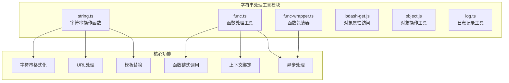
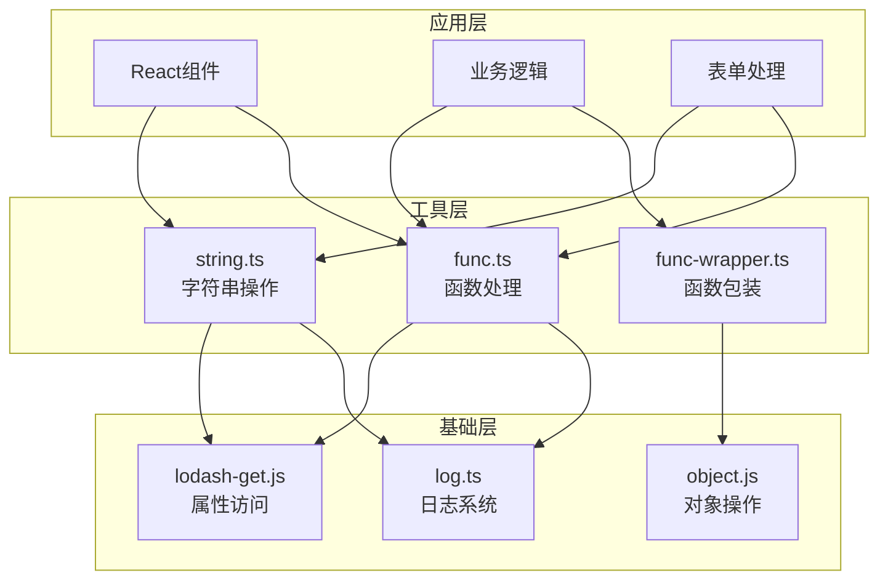
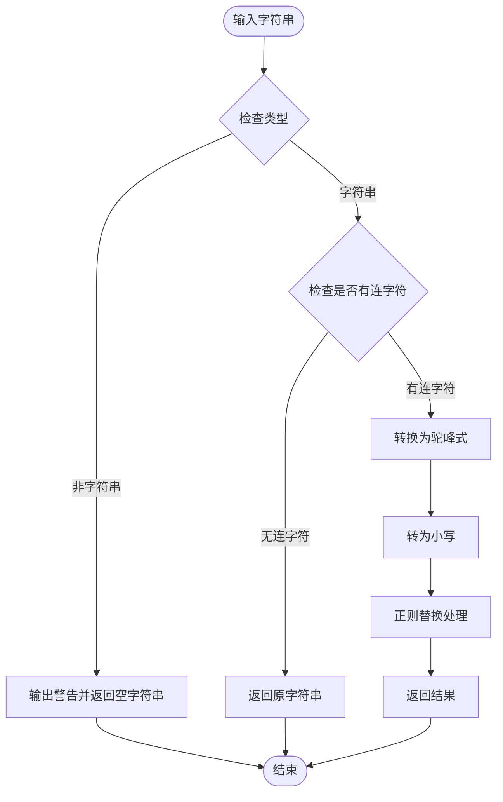
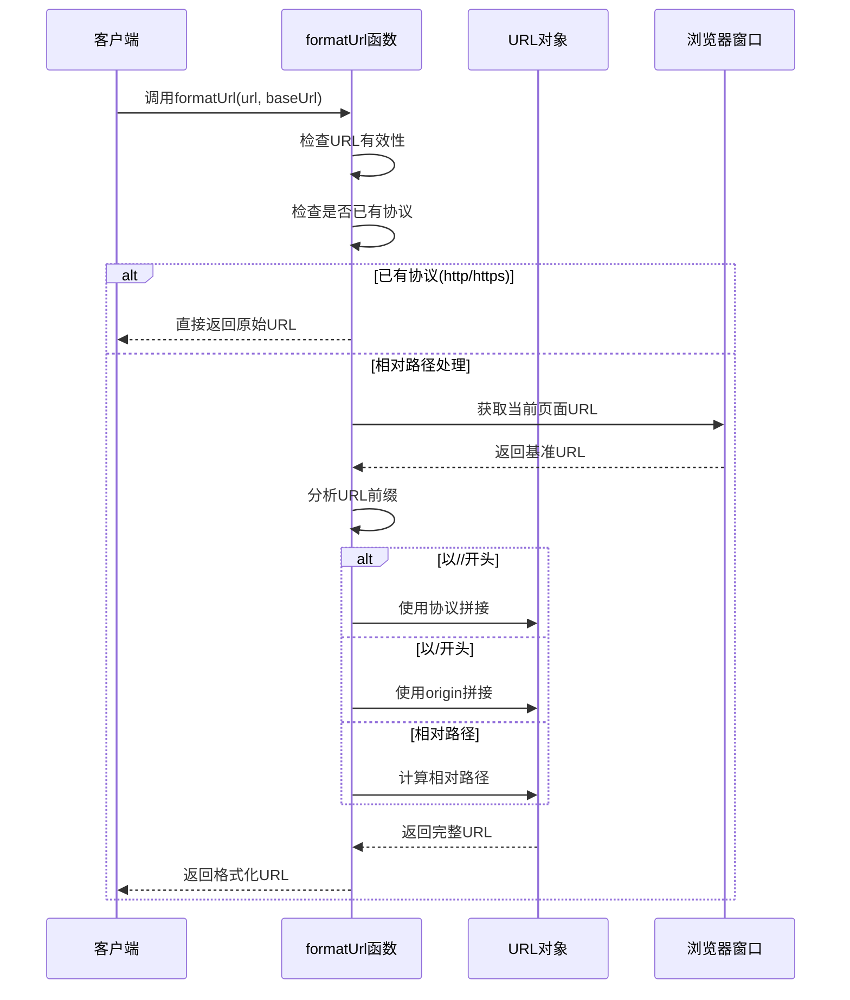
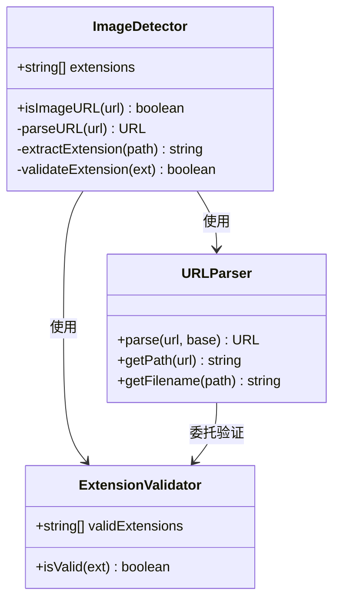
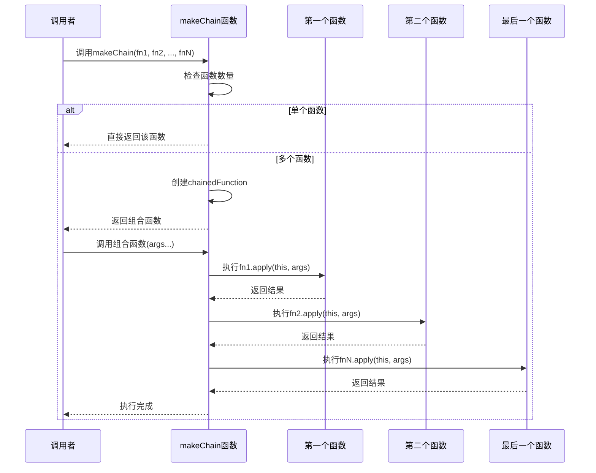
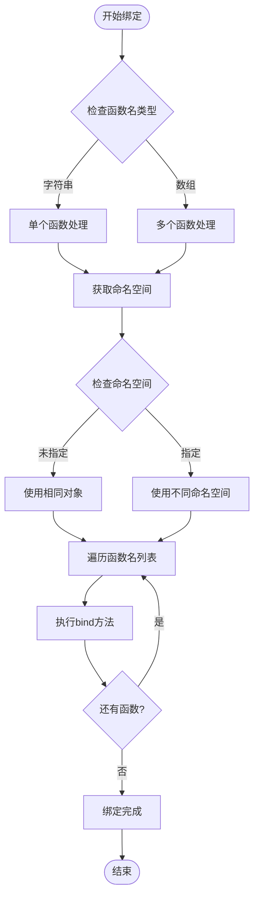
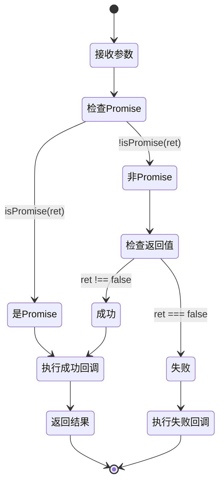
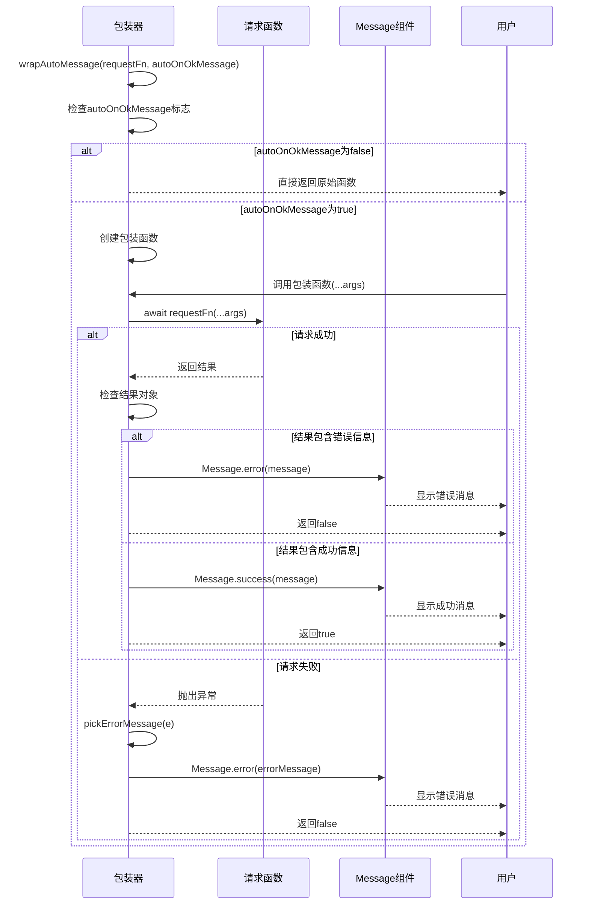
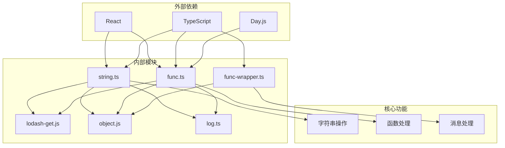

# 字符串处理工具技术指南

<cite>
**本文档引用的文件**
- [string.ts](file://src/util/string.ts)
- [func.ts](file://src/util/func.ts)
- [func-wrapper.ts](file://src/util/func-wrapper.ts)
- [lodash-get.js](file://src/util/lodash-get.js)
- [object.js](file://src/util/object.js)
- [log.ts](file://src/util/log.ts)
</cite>

## 目录
1. [简介](#简介)
2. [项目结构](#项目结构)
3. [核心组件](#核心组件)
4. [架构概览](#架构概览)
5. [详细组件分析](#详细组件分析)
6. [依赖关系分析](#依赖关系分析)
7. [性能考虑](#性能考虑)
8. [故障排除指南](#故障排除指南)
9. [结论](#结论)

## 简介

本文档提供了Fat Design框架中字符串处理工具的完整技术指南。该工具集包含三个核心模块：`string.ts`（字符串操作函数）、`func.ts`（函数处理工具）和`func-wrapper.ts`（函数包装器）。这些工具为表单验证、文本显示、事件处理等场景提供了强大的字符串处理能力和函数增强功能。

字符串处理工具的设计理念是提供高性能、类型安全且易于使用的字符串操作函数，同时支持函数的高级特性如柯里化、防抖和节流。这些工具广泛应用于前端开发的各种场景，从简单的字符串格式化到复杂的异步操作处理。

## 项目结构

字符串处理工具位于`src/util/`目录下，采用模块化设计，每个文件负责特定的功能领域：

**图表来源**
- [string.ts](file://src/util/string.ts#L1-L179)
- [func.ts](file://src/util/func.ts#L1-L297)
- [func-wrapper.ts](file://src/util/func-wrapper.ts#L1-L42)

**章节来源**
- [string.ts](file://src/util/string.ts#L1-L179)
- [func.ts](file://src/util/func.ts#L1-L297)
- [func-wrapper.ts](file://src/util/func-wrapper.ts#L1-L42)

## 核心组件

### 字符串处理模块 (string.ts)

字符串处理模块提供了全面的字符串操作功能，包括格式转换、验证和URL处理：

#### 主要功能
- **驼峰式转换**：`camelcase()`、`hyphenate()`、`camelToUnderscore()`
- **模板替换**：`template()`函数支持动态内容填充
- **URL处理**：`formatUrl()`函数处理各种URL格式
- **图像检测**：`isImageURL()`识别图像文件扩展名
- **数值验证**：`isNumeric()`检查字符串是否仅包含数字

#### 关键特性
- 类型安全的参数验证
- 错误处理和警告机制
- 性能优化的字符编码检查
- 支持多种URL格式处理

### 函数处理模块 (func.ts)

函数处理模块专注于函数的高级操作和增强功能：

#### 核心功能
- **函数链式调用**：`makeChain()`组合多个回调函数
- **上下文绑定**：`bindCtx()`批量绑定函数执行上下文
- **异步处理**：`promiseCall()`处理Promise返回值
- **方法调用**：`invoke()`安全地调用对象方法
- **日期处理**：`checkDate()`和`checkRangeDate()`验证日期

#### 高级特性
- **空方法保护**：`noop()`和`prevent()`提供默认行为
- **错误预防**：`preventDefault()`防止事件默认行为
- **类型转换**：`toNumber()`安全地转换为数字
- **状态管理**：`wrapperFn()`包装函数执行状态

### 函数包装器模块 (func-wrapper.ts)

函数包装器模块提供了函数的自动消息处理功能：

#### 主要功能
- **自动消息处理**：`wrapAutoMessage()`自动显示成功/错误消息
- **异步错误处理**：统一的异常捕获和处理
- **状态指示**：自动显示加载状态
- **构建内组件集成**：与Message组件无缝集成

**章节来源**
- [string.ts](file://src/util/string.ts#L1-L179)
- [func.ts](file://src/util/func.ts#L1-L297)
- [func-wrapper.ts](file://src/util/func-wrapper.ts#L1-L42)

## 架构概览

字符串处理工具采用分层架构设计，确保功能的模块化和可维护性：

**图表来源**
- [string.ts](file://src/util/string.ts#L1-L10)
- [func.ts](file://src/util/func.ts#L1-L10)
- [func-wrapper.ts](file://src/util/func-wrapper.ts#L1-L10)

## 详细组件分析

### 字符串处理函数详细分析

#### camelcase函数分析

**图表来源**
- [string.ts](file://src/util/string.ts#L11-L25)

#### URL格式化函数分析

**图表来源**
- [string.ts](file://src/util/string.ts#L45-L85)

#### 图像URL检测函数分析

**图表来源**
- [string.ts](file://src/util/string.ts#L111-L157)

**章节来源**
- [string.ts](file://src/util/string.ts#L11-L179)

### 函数处理工具详细分析

#### 函数链式调用机制

**图表来源**
- [func.ts](file://src/util/func.ts#L17-L32)

#### 上下文绑定机制

**图表来源**
- [func.ts](file://src/util/func.ts#L34-L50)

#### 异步函数处理流程

**图表来源**
- [func.ts](file://src/util/func.ts#L52-L65)

**章节来源**
- [func.ts](file://src/util/func.ts#L17-L297)

### 函数包装器详细分析

#### 自动消息处理机制

**图表来源**
- [func-wrapper.ts](file://src/util/func-wrapper.ts#L5-L41)

**章节来源**
- [func-wrapper.ts](file://src/util/func-wrapper.ts#L1-L42)

## 依赖关系分析

字符串处理工具的依赖关系体现了清晰的分层架构：

**图表来源**
- [string.ts](file://src/util/string.ts#L1-L3)
- [func.ts](file://src/util/func.ts#L1-L3)
- [func-wrapper.ts](file://src/util/func-wrapper.ts#L1-L3)

**章节来源**
- [string.ts](file://src/util/string.ts#L1-L10)
- [func.ts](file://src/util/func.ts#L1-L10)
- [func-wrapper.ts](file://src/util/func-wrapper.ts#L1-L10)

## 性能考虑

### 字符串处理性能特征

字符串处理工具在设计时充分考虑了性能优化：

#### 内存使用情况
- **字符串缓存**：避免重复创建相同的字符串对象
- **延迟计算**：仅在需要时才进行复杂的字符串操作
- **类型检查优化**：快速失败的类型检查减少不必要的计算

#### 性能优化策略
- **字符编码检查**：使用`charCodeAt()`而非正则表达式进行快速数值验证
- **早期退出**：在检测到无效输入时立即返回
- **最小化DOM操作**：URL处理函数避免不必要的DOM查询

#### 大规模文本处理优化建议
1. **批量处理**：使用`makeChain()`组合多个处理函数
2. **缓存结果**：利用`memoize()`函数缓存昂贵的操作结果
3. **分块处理**：对于超长字符串，考虑分块处理策略
4. **异步处理**：使用`promiseCall()`处理耗时的字符串操作

### 函数处理性能优化

函数处理工具通过以下方式优化性能：

- **函数复用**：避免重复创建相似的函数包装器
- **上下文绑定优化**：使用`bind()`而非箭头函数减少闭包开销
- **Promise链优化**：合理使用`async/await`减少回调嵌套

## 故障排除指南

### 常见问题及解决方案

#### 字符串处理相关问题

**问题1：camelcase函数返回空字符串**
- **原因**：输入不是字符串类型
- **解决方案**：使用`typeOf()`检查输入类型，确保传入有效的字符串

**问题2：URL格式化失败**
- **原因**：URL格式不正确或缺少必要参数
- **解决方案**：检查URL格式，确保提供有效的`baseUrl`参数

**问题3：图像URL检测误判**
- **原因**：URL解析失败或扩展名不在支持列表中
- **解决方案**：检查URL格式，确保扩展名正确且在支持列表中

#### 函数处理相关问题

**问题1：函数链式调用失效**
- **原因**：部分函数不是有效的函数类型
- **解决方案**：在调用`makeChain()`前验证所有参数都是函数

**问题2：上下文绑定失败**
- **原因**：函数名不存在或命名空间配置错误
- **解决方案**：检查函数名拼写，确保命名空间正确

**问题3：异步函数处理异常**
- **原因**：Promise处理逻辑错误
- **解决方案**：检查`promiseCall()`的回调函数定义

**章节来源**
- [string.ts](file://src/util/string.ts#L11-L25)
- [func.ts](file://src/util/func.ts#L17-L65)

## 结论

Fat Design的字符串处理工具提供了一套完整、高效且易于使用的字符串操作和函数处理解决方案。通过模块化的架构设计，这些工具能够满足现代Web应用的各种需求，从简单的字符串格式化到复杂的异步操作处理。

### 主要优势

1. **类型安全**：完整的TypeScript类型定义确保编译时错误检测
2. **性能优化**：针对常见操作进行了深度性能优化
3. **易用性**：简洁的API设计降低学习成本
4. **可扩展性**：模块化设计便于功能扩展和定制

### 应用场景

- **表单验证**：使用字符串验证函数确保数据完整性
- **文本显示**：利用模板替换功能动态生成显示内容
- **事件处理**：通过函数链式调用简化事件处理逻辑
- **异步操作**：使用函数包装器自动处理异步操作的状态和消息

这套工具集为开发者提供了强大的字符串处理能力，是构建高质量Web应用的重要基础设施。通过合理使用这些工具，可以显著提高开发效率和代码质量。