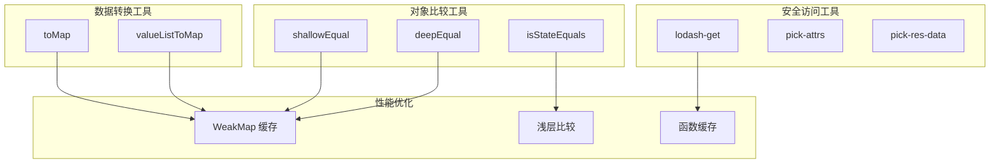
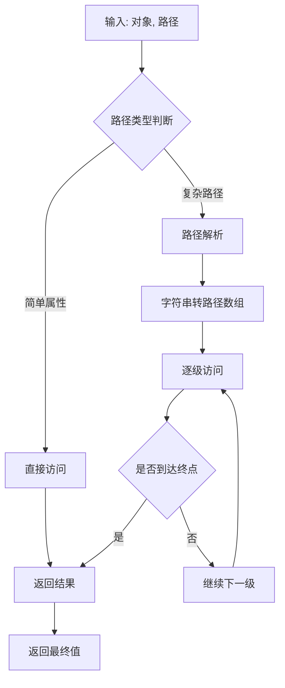
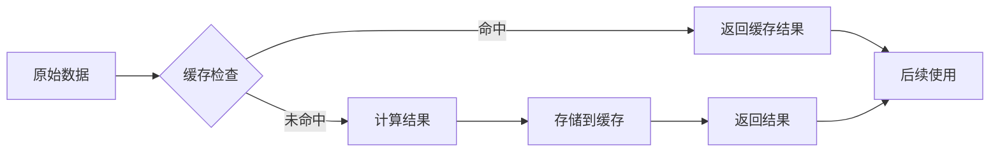

# 对象操作工具

<cite>
**本文档引用的文件**
- [shallowEqual.ts](file://src/util/shallowEqual.ts)
- [isStateEquals.ts](file://src/util/isStateEquals.ts)
- [lodash-get.js](file://src/util/lodash-get.js)
- [toMap.ts](file://src/util/toMap.ts)
- [pick-attrs.js](file://src/util/pick-attrs.js)
- [pick-res-data.ts](file://src/util/pick-res-data.ts)
- [object.js](file://src/util/object.js)
- [usePreciseStore.ts](file://src/hooks/usePreciseStore.ts)
- [affix/index.jsx](file://src/affix/index.jsx)
- [checkbox/checkbox.jsx](file://src/checkbox/checkbox.jsx)
- [table/base.jsx](file://src/table/base.jsx)
</cite>

## 目录
1. [简介](#简介)
2. [核心工具概览](#核心工具概览)
3. [浅层比较工具](#浅层比较工具)
4. [状态比较工具](#状态比较工具)
5. [安全属性访问工具](#安全属性访问工具)
6. [数据转换工具](#数据转换工具)
7. [实用工具函数](#实用工具函数)
8. [性能优化策略](#性能优化策略)
9. [最佳实践指南](#最佳实践指南)
10. [故障排除](#故障排除)

## 简介

Fat Design 的对象操作工具集是一套专为 React 应用程序设计的高性能工具函数集合。这些工具专注于优化组件性能、简化状态管理、安全地访问深层嵌套对象以及高效处理数据转换。通过精心设计的算法和缓存机制，这些工具能够在保持代码简洁性的同时提供卓越的性能表现。

## 核心工具概览



**图表来源**
- [shallowEqual.ts](file://src/util/shallowEqual.ts#L1-L92)
- [isStateEquals.ts](file://src/util/isStateEquals.ts#L1-L34)
- [lodash-get.js](file://src/util/lodash-get.js#L1-L937)

## 浅层比较工具

### shallowEqual 函数

`shallowEqual` 是 Fat Design 中最重要的性能优化工具之一，专门用于 React 组件的 `shouldComponentUpdate` 和 `React.memo` 性能优化。

#### 实现原理

```typescript
const shallowEqual = (a: any, b: any, ignoreFn: boolean = false): boolean => {
    const nextCompareMethod = (nextA: any, nextB: any) => {
        return nextA === nextB;
    }
    return commonEqual(a, b, nextCompareMethod, ignoreFn)
}
```

#### 核心特性

1. **类型安全比较**：支持基本类型（number、string、boolean、undefined）的直接比较
2. **对象属性比较**：递归比较对象的所有可枚举属性
3. **函数忽略选项**：可选择忽略函数类型的属性比较
4. **性能优化**：避免不必要的深度遍历

#### 时间复杂度分析

- **平均情况**：O(n)，其中 n 是对象的属性数量
- **最坏情况**：O(n*m)，当对象包含大量嵌套对象时
- **空间复杂度**：O(1)，不使用额外的内存分配

#### 使用场景

```javascript
// React 组件性能优化
shouldComponentUpdate(nextProps, nextState, nextContext) {
    const { shallowEqual } = obj;
    return (
        !shallowEqual(this.props, nextProps) ||
        !shallowEqual(this.state, nextState) ||
        !shallowEqual(this.context, nextContext)
    );
}

// 表单状态检查
if (!obj.shallowEqual(prevProps, this.props)) {
    const update = true;
}
```

**章节来源**
- [shallowEqual.ts](file://src/util/shallowEqual.ts#L45-L55)
- [affix/index.jsx](file://src/affix/index.jsx#L212-L230)
- [table/base.jsx](file://src/table/base.jsx#L387-L388)

### deepEqual 函数

`deepEqual` 提供深度比较功能，适用于需要完全相等性的场景。

#### 实现特点

1. **递归深度控制**：防止无限递归，最大深度为 10 层
2. **循环引用检测**：通过计数器防止栈溢出
3. **灵活比较策略**：支持自定义比较方法

```javascript
function deepEqual(a: any, b: any, ignoreFn: boolean = false, deep: number = 0): boolean {
    const nextCompareMethod = (nextA: any, nextB: any) => {
        if (deep > 10) {
            return nextA === nextB;
        }
        return deepEqual(nextA, nextB, ignoreFn, deep + 1);
    }
    return commonEqual(a, b, nextCompareMethod, ignoreFn)
}
```

**章节来源**
- [shallowEqual.ts](file://src/util/shallowEqual.ts#L57-L67)

## 状态比较工具

### isStateEquals 函数

`isStateEquals` 是一个通用的状态比较函数，支持多种比较策略，广泛应用于状态管理和组件更新控制。

#### 比较策略

```typescript
export type CompareFn = string | boolean | CompareFn1;

function isStateEquals(compareFn: CompareFn, current: any, nextState: any) {
    if (typeof nextState === "function") {
        return false;
    }

    if (!compareFn) {
        return false;
    }

    if (compareFn === true || compareFn === 'equal') {
        return current === nextState;
    }

    if (compareFn === 'shallowEqual') {
        return shallowEqual(current, nextState);
    }

    if (typeof compareFn === "function") {
        return compareFn(current, nextState);
    }

    return false;
}
```

#### 使用模式

```javascript
// 基本类型比较
const result1 = isStateEquals(true, 1, 1); // true

// 浅层比较
const result2 = isStateEquals('shallowEqual', {a: 1}, {a: 1}); // true

// 自定义比较函数
const result3 = isStateEquals(
    (a, b) => a.id === b.id,
    {id: 1, name: 'test'},
    {id: 1, name: 'changed'}
); // true
```

#### 在状态监听中的应用

```javascript
notifyWatcher() {
    const updatedPathList = this.updatedBuffer;
    for (let i = 0; i < updatedPathList.length; i++) {
        const updatedPath = updatedPathList[i];
        const watcherList = this.watcherManager.getWatcherDeepList(updatedPath);
        for (let j = 0; j < watcherList.length; j++) {
            try {
                const {watcher, preValue, watchPath} = watcherList[j];
                const nextValue = this.getValue(watchPath);
                if (typeof preValue === "undefined" || 
                    !isStateEquals(this.compareFn, preValue, nextValue)) {
                    watcher(nextValue, preValue, this);
                    watcherList[j].preValue = nextValue;
                }
            } catch (e) {
                logger.error("notifyWatcher", e, watcherList[j])
            }
        }
    }
}
```

**章节来源**
- [isStateEquals.ts](file://src/util/isStateEquals.ts#L1-L34)
- [usePreciseStore.ts](file://src/hooks/usePreciseStore.ts#L140-L155)

## 安全属性访问工具

### lodash-get 函数

`lodash-get` 是一个高度优化的安全属性访问函数，能够优雅地处理深层嵌套对象的属性访问。

#### 核心功能

1. **属性路径解析**：支持点号和方括号语法
2. **默认值处理**：提供默认返回值
3. **类型安全**：确保访问过程中的类型安全
4. **性能优化**：使用 WeakMap 缓存解析结果

#### 实现架构



**图表来源**
- [lodash-get.js](file://src/util/lodash-get.js#L400-L450)

#### 使用示例

```javascript
// 基本使用
const user = {profile: {name: 'John', age: 30}};
console.log(_get(user, 'profile.name')); // 'John'

// 复杂路径
const data = {
    users: [
        {id: 1, profile: {name: 'Alice'}},
        {id: 2, profile: {name: 'Bob'}}
    ]
};
console.log(_get(data, 'users[1].profile.name')); // 'Bob'

// 默认值
console.log(_get(data, 'users[2].profile.name', 'Unknown')); // 'Unknown'
```

#### 性能优化机制

```javascript
const cache = new WeakMap();

function memoize(func, resolver) {
    if (typeof func != 'function' || (resolver && typeof resolver != 'function')) {
        throw new TypeError(FUNC_ERROR_TEXT);
    }
    var memoized = function() {
        var args = arguments,
            key = resolver ? resolver.apply(this, args) : args[0],
            cache = memoized.cache;

        if (cache.has(key)) {
            return cache.get(key);
        }
        var result = func.apply(this, args);
        memoized.cache = cache.set(key, result);
        return result;
    };
    memoized.cache = new (memoize.Cache || MapCache);
    return memoized;
}
```

**章节来源**
- [lodash-get.js](file://src/util/lodash-get.js#L1-L937)

### pick-attrs 函数

`pick-attrs` 专门用于从 React 组件的 props 中提取有效的 DOM 属性和事件处理器。

#### 属性分类

```javascript
const attributes = `accept acceptCharset accessKey action allowFullScreen allowTransparency
alt async autoComplete autoFocus autoPlay capture cellPadding cellSpacing challenge
charSet checked classID class className colSpan cols content contentEditable contextMenu
controls coords crossOrigin data dateTime default defer dir disabled download draggable
encType form formAction formEncType formMethod formNoValidate formTarget frameBorder
headers height hidden high href hrefLang htmlFor httpEquiv icon id inputMode integrity
is keyParams keyType kind label lang list loop low manifest marginHeight marginWidth max maxLength media
mediaGroup method min minLength multiple muted name noValidate nonce open
optimum pattern placeholder poster preload radioGroup readOnly rel required
reversed role rowSpan rows sandbox scope scoped scrolling seamless selected
shape size sizes span spellCheck src srcDoc srcLang srcSet start step style
summary tabIndex target title type useMap value width wmode wrap`
    .replace(/\s+/g, ' ')
    .replace(/\t|\n|\r/g, '')
    .split(' ');

const eventsName = `onCopy onCut onPaste onCompositionEnd onCompositionStart onCompositionUpdate onKeyDown
    onKeyPress onKeyUp onFocus onBlur onChange onInput onSubmit onClick onContextMenu onDoubleClick
    onDrag onDragEnd onDragEnter onDragExit onDragLeave onDragOver onDragStart onDrop onMouseDown
    onMouseEnter onMouseLeave onMouseMove onMouseOut onMouseOver onMouseUp onSelect onTouchCancel
    onTouchEnd onTouchMove onTouchStart onScroll onWheel onAbort onCanPlay onCanPlayThrough
    onDurationChange onEmptied onEncrypted onEnded onError onLoadedData onLoadedMetadata
    onLoadStart onPause onPlay onPlaying onProgress onRateChange onSeeked onSeeking onStalled onSuspend onTimeUpdate onVolumeChange onWaiting onLoad onError`
    .replace(/\s+/g, ' ')
    .replace(/\t|\n|\r/g, '')
    .split(' ');
```

#### 使用场景

```javascript
// 表单组件中的属性过滤
const others = obj.pickOthers(Checkbox.propTypes, otherProps);
const othersData = obj.pickAttrsWith(others, 'data-');
if (otherProps.title) {
    othersData.title = otherProps.title;
}

// 渲染时的安全属性传递
<label {...othersData} className={cls}>
    <span className={`${prefix}checkbox`}>
        <span className={`${prefix}checkbox-inner`}>
            <Icon type={type} size="xs" className={iconCls} />
        </span>
        {childInput}
    </span>
    {!isNil(label) ? (<span className={labelCls}>{label}</span>) : null}
    {!isNil(children) ? (<span className={labelCls}>{children}</span>) : null}
</label>
```

**章节来源**
- [pick-attrs.js](file://src/util/pick-attrs.js#L1-L69)
- [checkbox/checkbox.jsx](file://src/checkbox/checkbox.jsx#L190-L200)

## 数据转换工具

### toMap 函数

`toMap` 函数提供了高效的数组到对象映射转换功能，特别适用于需要快速查找的场景。

#### 核心实现

```typescript
const toMap = (items: any[], getKey: any): any => {
    if (!items || items.length === 0) {
        return {};
    }
    const map: any = {};
    for (let i = 0; i < items.length; i++) {
        const e = items[i];
        const key = getKey(e, i);
        map[key] = e;
    }
    return map;
};

function valueListToMap(items: any[]): Record<string, any> {
    if (!items || items.length === 0) {
        return {};
    }

    const oldData = cache.get(items);
    if (oldData) {
        return oldData;
    }

    const map: any = {};
    for (let i = 0; i < items.length; i++) {
        const item = items[i];
        map[item.value] = item;
    }
    cache.set(items, map);
    return map;
}
```

#### 缓存机制

```javascript
const cache = new WeakMap();

function valueListToMap(items: any[]): Record<string, any> {
    const oldData = cache.get(items);
    if (oldData) {
        return oldData;
    }
    
    const map: any = {};
    for (let i = 0; i < items.length; i++) {
        const item = items[i];
        map[item.value] = item;
    }
    cache.set(items, map);
    return map;
}
```

#### 使用场景

```javascript
// API 响应数据处理
function getDataSource(res) {
    const dataSource1 = pickResArray(res, null);
    if (Array.isArray(dataSource1)) {
        return dataSource1;
    }
    if (res && res.data) {
        return pickResArray(res.data, []);
    }
    return [];
}

// 数据索引优化
const data = [
    {id: 1, name: 'Alice'},
    {id: 2, name: 'Bob'},
    {id: 3, name: 'Charlie'}
];

const indexedData = toMap(data, item => item.id);
// 结果: {1: {id: 1, name: 'Alice'}, 2: {id: 2, name: 'Bob'}, 3: {id: 3, name: 'Charlie'}}

// 快速查找
const user = indexedData[2]; // {id: 2, name: 'Bob'}
```

**章节来源**
- [toMap.ts](file://src/util/toMap.ts#L1-L47)
- [table-pro/utils/formatQueryRes.ts](file://src/table-pro/utils/formatQueryRes.ts#L1-L58)

## 实用工具函数

### pick-res-data 函数族

`pick-res-data` 提供了一套完整的 API 响应数据提取工具，支持多种数据格式和约定。

#### 主要函数

```typescript
// 数组数据提取
function pickResArray(obj: any, defaultValue: any = []): any[] {
    if (!obj) {
        return defaultValue;
    }

    if (isArray(obj)) {
        return obj;
    }

    if (typeof obj === "object") {
        const keys = ['dataSource', 'data_source', 'data', 'rows', 'result', 'enums'];
        for (let i = 0; i < keys.length; i++) {
            const key = keys[i];
            const dataValue = obj[key];
            if (isArray(dataValue)) {
                return dataValue
            }
        }
    }

    return defaultValue;
}

// 总数提取
function pickTotalCount(obj: any, defaultValue: any = 0): number | null {
    if (!obj) {
        return defaultValue;
    }

    if (typeof obj === "object") {
        const keys = ['total', 'totalCount', 'total_count', 'result_count', 'resultCount'];
        for (let i = 0; i < keys.length; i++) {
            const key = keys[i];
            const dataValue = obj[key];
            if (typeof dataValue === "number") {
                return dataValue
            }
        }
    }
    return defaultValue;
}

// 错误消息提取
function pickErrorMessage(e: any): string | null{
    if (!e) {
        return null;
    }
    if (typeof e === "string") {
        return e;
    }

    if (typeof e === "object") {
        for (let i = 0; i < errorMessageKeys.length; i++) {
            const key = errorMessageKeys[i];
            const errValue = e[key];
            if (errValue) {
                if (typeof errValue === "string" && errValue.length > 0) {
                    return errValue;
                }
                if (typeof errValue === "object") {
                    return JSON.stringify(errValue);
                }
            }
        }
        return JSON.stringify(e);
    }
    return "" + e;
}
```

#### 错误消息键配置

```javascript
const errorMessageKeys = [
    'errors', 'error', 'failure', 'exception', 'fault',
    'warning', 'warnings', 'errorMsg', 'error_msg', 'errorMessage',
    'error_message', 'errMsg', 'err_msg', 'errorDescription',
    'error_description', 'errorDesc', 'error_desc', 'errDesc',
    'err_desc', 'errorDetail', 'error_detail', 'errorInfo',
    'error_info', 'message'
];
```

#### 使用示例

```javascript
// API 响应格式化
export default function formatQueryRes(res: any): any {
    if (!res || typeof res !== 'object') {
        return null;
    }

    if (!res.tableProps) {
        res.tableProps = {};
    }

    if (!res.paginationProps) {
        res.paginationProps = {};
    }

    if (!res.tableProps.dataSource) {
        res.tableProps.dataSource = getDataSource(res);
    }

    if (typeof res.paginationProps.total !== "number") {
        res.paginationProps.total = getTotalCount(res);
    }

    return res;
}

// 错误处理
try {
    const response = await apiCall();
    const data = pickResArray(response);
    const total = pickTotalCount(response);
} catch (error) {
    const errorMessage = pickErrorMessage(error);
    console.error('API Error:', errorMessage);
}
```

**章节来源**
- [pick-res-data.ts](file://src/util/pick-res-data.ts#L1-L135)
- [table-pro/utils/formatQueryRes.ts](file://src/table-pro/utils/formatQueryRes.ts#L1-L58)

### object.js 工具函数

`object.js` 提供了一系列通用的对象操作工具函数。

#### 核心功能

```javascript
// 属性过滤
export function pickAttrsWith(holdProps, prefix) {
    const others = {};

    for (const key in holdProps) {
        if (key.match(prefix)) {
            others[key] = holdProps[key];
        }
    }

    return others;
}

// 空值检查
export function isNil(value) {
    return typeof value === "undefined" || value === null;
}

// 深度合并
export function deepMerge(target, ...sources) {
    if (!sources.length) return target;
    const source = sources.shift();

    if (!isPlainObject(target)) {
        target = {};
    }

    if (isPlainObject(target) && source && isPlainObject(source)) {
        for (const key in source) {
            if (isPlainObject(source[key]) && !React.isValidElement(source[key])) {
                if (!target[key]) Object.assign(target, { [key]: {} });
                if (!isPlainObject(target[key])) {
                    target[key] = source[key];
                }
            } else {
                target[key] = source[key];
            }
        }
    }
    return target;
}
```

**章节来源**
- [object.js](file://src/util/object.js#L296-L342)

## 性能优化策略

### 缓存机制

Fat Design 的对象操作工具采用了多层次的缓存策略来提升性能：



**图表来源**
- [toMap.ts](file://src/util/toMap.ts#L10-L25)
- [lodash-get.js](file://src/util/lodash-get.js#L700-L750)

### 内存管理

1. **WeakMap 缓存**：自动垃圾回收，避免内存泄漏
2. **函数缓存**：使用 memoize 技术缓存计算结果
3. **对象池**：复用临时对象减少 GC 压力

### 性能监控

```javascript
// 性能基准测试
const benchmark = (fn, iterations = 1000) => {
    const start = performance.now();
    for (let i = 0; i < iterations; i++) {
        fn();
    }
    const end = performance.now();
    return end - start;
};

// 使用示例
const shallowEqualTime = benchmark(() => {
    shallowEqual({a: 1, b: 2}, {a: 1, b: 2});
}, 10000);
```

## 最佳实践指南

### 1. 选择合适的比较策略

```javascript
// 简单对象比较
const result1 = shallowEqual(obj1, obj2);

// 需要深度比较时
const result2 = deepEqual(obj1, obj2);

// 自定义比较逻辑
const result3 = isStateEquals(
    (a, b) => a.id === b.id,
    obj1,
    obj2
);
```

### 2. 合理使用缓存

```javascript
// 利用内置缓存
const cachedMap = valueListToMap(items);

// 手动缓存复杂计算
const expensiveCalculation = memoize((input) => {
    return heavyComputation(input);
});
```

### 3. 安全的属性访问

```javascript
// 使用 lodash-get 处理深层嵌套
const value = _get(data, 'user.profile.settings.theme', 'default');

// 提供默认值
const count = _get(response, 'pagination.total', 0);

// 处理可能的异常
const message = pickErrorMessage(error) || '未知错误';
```

### 4. 数据转换优化

```javascript
// 构建索引映射
const indexedData = toMap(data, item => item.id);

// 批量处理数据
const processedData = dataArray.map(item => ({
    ...item,
    processed: true
}));
```

### 5. 组件性能优化

```javascript
// React 组件中的使用
shouldComponentUpdate(nextProps, nextState, nextContext) {
    const { shallowEqual } = obj;
    return (
        !shallowEqual(this.props, nextProps) ||
        !shallowEqual(this.state, nextState) ||
        !shallowEqual(this.context, nextContext)
    );
}

// 使用 React.memo 优化函数组件
const OptimizedComponent = React.memo(Component, (prevProps, nextProps) => {
    return shallowEqual(prevProps, nextProps);
});
```

## 故障排除

### 常见问题及解决方案

#### 1. 比较结果不准确

**问题**：`shallowEqual` 返回 false，但看起来应该相等

**原因**：
- 对象包含不可枚举属性
- 原型链上的属性差异
- 函数类型的属性

**解决方案**：
```javascript
// 使用 ignoreFn 选项
const result = shallowEqual(obj1, obj2, true);

// 或者手动过滤函数属性
const filteredObj1 = pickAttrsWith(obj1, '');
const filteredObj2 = pickAttrsWith(obj2, '');
const result = shallowEqual(filteredObj1, filteredObj2);
```

#### 2. 缓存失效

**问题**：缓存没有生效，性能下降

**原因**：
- WeakMap 引用丢失
- 对象被垃圾回收
- 缓存键不唯一

**解决方案**：
```javascript
// 确保引用持续存在
const cacheKey = originalObject;
const cachedResult = cache.get(cacheKey);

// 使用稳定的键值
const stableKey = JSON.stringify(object);
const cachedResult = cache.get(stableKey);
```

#### 3. 内存泄漏

**问题**：应用内存使用持续增长

**原因**：
- 缓存对象过多
- 循环引用
- 未正确清理监听器

**解决方案**：
```javascript
// 及时清理监听器
useEffect(() => {
    const cleanup = store.watch(path, handler);
    return () => {
        store.unwatch(path, handler);
    };
}, [store, path]);

// 使用 WeakMap 避免强引用
const cache = new WeakMap();
```

#### 4. 类型错误

**问题**：运行时出现类型错误

**原因**：
- 传入非对象参数
- 属性路径错误
- 缺少必要的依赖

**解决方案**：
```javascript
// 参数验证
function safeShallowEqual(a, b) {
    if (typeof a !== 'object' || typeof b !== 'object') {
        return a === b;
    }
    return shallowEqual(a, b);
}

// 安全的属性访问
const value = _get(data, path, defaultValue);
```

### 调试技巧

#### 1. 性能分析

```javascript
// 启用调试日志
if (process.env.NODE_ENV === 'development') {
    console.log('shallowEqual debug:', {
        obj1: obj1,
        obj2: obj2,
        result: result,
        diff: findDifference(obj1, obj2)
    });
}

// 性能监控
const startTime = performance.now();
const result = shallowEqual(obj1, obj2);
const endTime = performance.now();
console.log(`shallowEqual took ${endTime - startTime} milliseconds`);
```

#### 2. 错误追踪

```javascript
// 包装函数进行错误捕获
function safeCompare(fn, a, b) {
    try {
        return fn(a, b);
    } catch (error) {
        console.error('Comparison failed:', {
            error: error.message,
            a: a,
            b: b,
            stack: error.stack
        });
        return false;
    }
}

// 使用包装函数
const result = safeCompare(shallowEqual, obj1, obj2);
```

#### 3. 状态检查

```javascript
// 检查状态变化
function checkStateChanges(prevState, nextState) {
    const changed = [];
    for (const key in nextState) {
        if (!shallowEqual(prevState[key], nextState[key])) {
            changed.push(key);
        }
    }
    return changed;
}
```

通过遵循这些最佳实践和故障排除指南，开发者可以充分利用 Fat Design 的对象操作工具来构建高性能、稳定可靠的 React 应用程序。这些工具不仅提供了强大的功能，还通过精心设计的性能优化策略确保了应用程序的流畅运行。