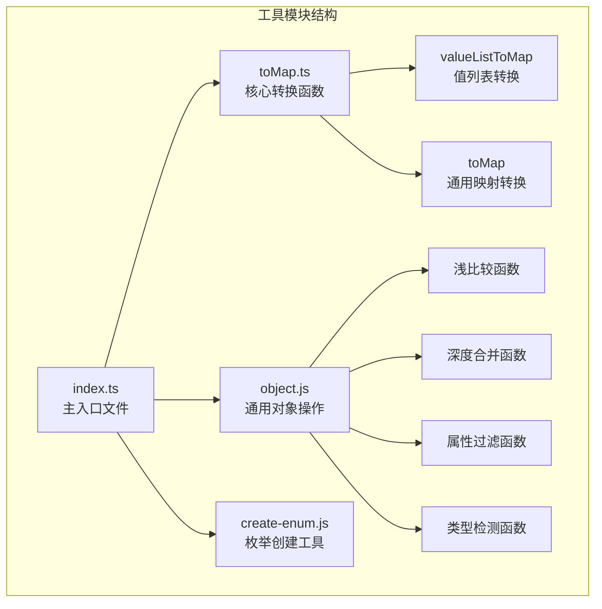
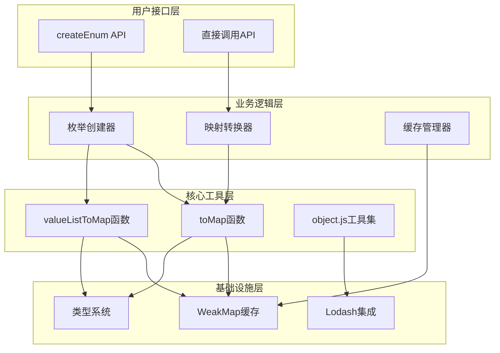
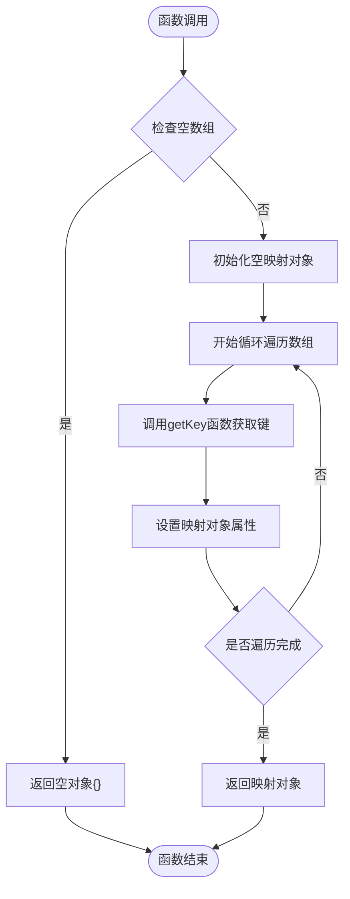
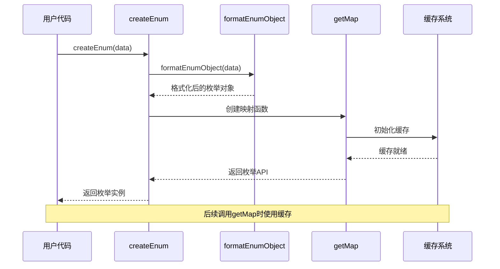
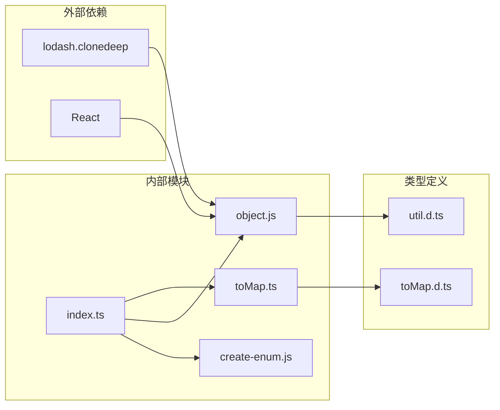

# 对象转换工具详细技术文档

<cite>
**本文档引用的文件**
- [toMap.ts](file://src/util/toMap.ts)
- [object.js](file://src/util/object.js)
- [create-enum.js](file://demo/tmp-utils/create-enum.js)
- [index.ts](file://src/util/index.ts)
- [toMap.d.ts](file://types/0buildTypes/util/toMap.d.ts)
- [util.d.ts](file://types/util.d.ts)
</cite>

## 目录
1. [简介](#简介)
2. [项目结构](#项目结构)
3. [核心组件](#核心组件)
4. [架构概览](#架构概览)
5. [详细组件分析](#详细组件分析)
6. [依赖关系分析](#依赖关系分析)
7. [性能考虑](#性能考虑)
8. [故障排除指南](#故障排除指南)
9. [结论](#结论)

## 简介

对象转换工具是Fat Design组件库中的核心实用程序集合，专门用于高效地处理JavaScript对象和数组数据结构。该工具集提供了强大的对象转换功能，特别是`toMap`函数，它能够将数组转换为基于指定键的映射对象，从而将O(n)的线性查找优化为O(1)的哈希查找，显著提升数据检索性能。

该工具集不仅包含基础的对象操作方法，如对象合并、属性删除等通用功能，还提供了高级的数据转换和索引构建能力。通过智能的缓存机制和类型安全的设计，确保在各种应用场景下都能提供卓越的性能和可靠性。

## 项目结构

对象转换工具位于`src/util`目录下，采用模块化设计，每个文件负责特定的功能领域：



**图表来源**
- [index.ts](file://src/util/index.ts#L1-L68)
- [toMap.ts](file://src/util/toMap.ts#L1-L45)
- [object.js](file://src/util/object.js#L1-L445)

**章节来源**
- [index.ts](file://src/util/index.ts#L1-L68)

## 核心组件

### toMap函数 - 高效的数据转换引擎

`toMap`函数是整个工具集的核心，它实现了将数组转换为基于指定键的映射对象的高效算法：

```typescript
const toMap = (items: any[], getKey: any): any => {
    if (!items || items.length === 0) {
        return {};
    }
    const map: any = {};
    for (let i = 0; i < items.length; i++) {
        const e = items[i];
        const key = getKey(e, i);
        map[key] = e;
    }
    return map;
};
```

该函数的核心特性包括：
- **时间复杂度优化**：从O(n)线性查找提升到O(1)哈希查找
- **灵活的键提取**：支持自定义键提取函数
- **空值安全**：自动处理空数组和无效输入
- **内存效率**：最小化内存占用和垃圾回收压力

### valueListToMap函数 - 特化的值列表转换

针对特定的值列表格式（具有`value`属性的对象），提供了专门的优化版本：

```typescript
function valueListToMap(items: any[]): Record<string, any> {
    if (!items || items.length === 0) {
        return {};
    }

    const oldData = cache.get(items);
    if (oldData) {
        return oldData;
    }

    const map: any = {};
    for (let i = 0; i < items.length; i++) {
        const item = items[i];
        map[item.value] = item;
    }
    cache.set(items, map);
    return map;
}
```

**章节来源**
- [toMap.ts](file://src/util/toMap.ts#L1-L45)

## 架构概览

对象转换工具采用了分层架构设计，确保功能的模块化和可扩展性：



**图表来源**
- [create-enum.js](file://demo/tmp-utils/create-enum.js#L1-L152)
- [toMap.ts](file://src/util/toMap.ts#L1-L45)
- [object.js](file://src/util/object.js#L1-L445)

## 详细组件分析

### toMap函数详细分析

#### 函数签名和参数

```typescript
const toMap: (items: any[], getKey: any) => any
```

该函数接受两个主要参数：
- `items`: 输入的数组对象
- `getKey`: 键提取函数，接收当前元素和索引作为参数

#### 实现原理



**图表来源**
- [toMap.ts](file://src/util/toMap.ts#L25-L35)

#### 性能特征

- **时间复杂度**：O(n)，其中n为数组长度
- **空间复杂度**：O(n)，创建新的映射对象
- **缓存机制**：无内置缓存，适合一次性转换

### valueListToMap函数详细分析

#### 缓存机制

该函数引入了`WeakMap`缓存机制来避免重复计算：

```typescript
const cache = new WeakMap();

function valueListToMap(items: any[]): Record<string, any> {
    const oldData = cache.get(items);
    if (oldData) {
        return oldData;
    }
    // 计算新映射
    cache.set(items, map);
    return map;
}
```

#### 使用场景

适用于具有标准`value`属性的对象数组，如：
```javascript
const items = [
    {value: 'user1', name: '张三'},
    {value: 'user2', name: '李四'}
];

const userMap = valueListToMap(items);
// 结果: {'user1': {value: 'user1', name: '张三'}, 'user2': {value: 'user2', name: '李四'}}
```

**章节来源**
- [toMap.ts](file://src/util/toMap.ts#L1-L45)

### object.js工具集分析

#### 类型检测函数

```javascript
export function typeOf(obj) {
    return Object.prototype.toString.call(obj).replace(/\[object\s|]/g, '');
}

export function isPlainObject(obj) {
    if (typeOf(obj) !== 'Object') {
        return false;
    }
    // 检查构造函数和原型链
    const ctor = obj.constructor;
    const prot = ctor.prototype;
    return typeOf(prot) === 'Object' && 
           prot.hasOwnProperty('isPrototypeOf');
}
```

#### 深度合并函数

```javascript
export function deepMerge(target, ...sources) {
    if (!sources.length) return target;
    const source = sources.shift();

    if (isPlainObject(target) && source && isPlainObject(source)) {
        for (const key in source) {
            if (isPlainObject(source[key]) && !React.isValidElement(source[key])) {
                if (!target[key]) Object.assign(target, { [key]: {} });
                deepMerge(target[key], source[key]);
            } else {
                Object.assign(target, { [key]: source[key] });
            }
        }
    }
    return deepMerge(target, ...sources);
}
```

#### 属性过滤函数

```javascript
export function pickProps(holdProps, props) {
    const others = {};
    const isArray = typeOf(holdProps) === 'Array';

    for (const key in props) {
        if (_isInObj(key, holdProps, isArray)) {
            others[key] = props[key];
        }
    }
    return others;
}
```

**章节来源**
- [object.js](file://src/util/object.js#L1-L445)

### createEnum工具分析

#### 枚举创建流程



**图表来源**
- [create-enum.js](file://demo/tmp-utils/create-enum.js#L40-L80)

#### 多维度映射支持

```javascript
return {
    getValueKeyMap: () => getMap('value', NAMES.KEY),
    getValueLabelMap: () => getMap('value', 'label'),
    getValueItemMap: () => getMap('value', NAMES.ITEM),
    
    getLabelValueMap: () => getMap('label', 'value'),
    getLabelKeyMap: () => getMap('label', NAMES.KEY),
    getLabelItemMap: () => getMap('label', NAMES.ITEM),
    
    getKeyValueMap: () => getMap(NAMES.KEY, 'value'),
    getKeyLabelMap: () => getMap(NAMES.KEY, 'label'),
    getKeyItemMap: () => enumObject,
    getMap,
    getArray,
};
```

**章节来源**
- [create-enum.js](file://demo/tmp-utils/create-enum.js#L82-L105)

## 依赖关系分析

### 模块依赖图



**图表来源**
- [index.ts](file://src/util/index.ts#L1-L10)
- [object.js](file://src/util/object.js#L1-L5)

### 导出结构分析

主入口文件`index.ts`统一管理所有工具函数的导出：

```typescript
export {
    get,                    // lodash.get
    support,               // 支持检测
    str,                   // 字符串工具
    obj,                   // 对象工具集
    log,                   // 日志工具
    func,                  // 函数工具
    events,                // 事件工具
    env,                   // 环境检测
    dom,                   // DOM工具
    createPortal,          // React Portal
    findDOMNode,           // DOM节点查找
    wrapAutoMessage,       // 自动消息包装
    shallowElementEquals,  // 浅比较
    ComponentsStore,       // 组件存储
    constants,             // 常量
    pReactDOM,             // 异步DOM渲染
    pickAttrs,             // 属性选择
    datejs,                // 日期工具
    htmlId,                // HTML ID生成
    KEYCODE,               // 键码常量
    guid,                  // GUID生成
    focus,                 // 焦点管理
    polyfill,              // Polyfill兼容
    ReactComponent         // React组件基类
}
```

**章节来源**
- [index.ts](file://src/util/index.ts#L40-L68)

## 性能考虑

### 时间复杂度分析

| 函数 | 时间复杂度 | 空间复杂度 | 适用场景 |
|------|------------|------------|----------|
| `toMap` | O(n) | O(n) | 通用数组转映射 |
| `valueListToMap` | O(n) | O(n) | 值列表专用 |
| `deepMerge` | O(n*m) | O(n+m) | 对象深度合并 |
| `shallowEqual` | O(n) | O(1) | 对象浅比较 |

### 内存使用考量

1. **WeakMap缓存**：避免内存泄漏，自动垃圾回收
2. **对象克隆**：使用`lodash.clonedeep`确保深度复制
3. **批量操作**：支持链式调用减少中间对象创建

### 大规模数据集优化

对于大规模数据集，建议：
- 使用`valueListToMap`进行特化优化
- 实施分批处理策略
- 合理利用缓存机制

## 故障排除指南

### 常见问题和解决方案

#### 1. 键冲突问题

**问题**：多个对象具有相同的键值
```javascript
const items = [
    {id: '1', name: '张三'},
    {id: '1', name: '李四'}  // 键冲突
];
```

**解决方案**：使用唯一键生成器或组合键
```javascript
const map = toMap(items, (item, index) => `${item.id}-${index}`);
```

#### 2. 空数组处理

**问题**：输入为空数组时的行为
```javascript
const result = toMap([], keyExtractor);
// 应该返回 {}
```

**解决方案**：函数已内置空值检查，无需额外处理

#### 3. 键提取函数错误

**问题**：键提取函数返回无效键
```javascript
const map = toMap(items, () => null);
// 可能导致意外行为
```

**解决方案**：添加键验证和默认值处理
```javascript
const safeKeyExtractor = (item) => {
    const key = getKey(item);
    return key != null ? key : 'default';
};
```

**章节来源**
- [toMap.ts](file://src/util/toMap.ts#L25-L35)
- [object.js](file://src/util/object.js#L150-L200)

## 结论

对象转换工具是Fat Design组件库中不可或缺的核心组件，它通过精心设计的算法和架构，为开发者提供了强大而高效的对象转换能力。主要优势包括：

1. **性能优化**：通过O(1)哈希查找显著提升数据检索效率
2. **类型安全**：完整的TypeScript类型定义确保编译时安全
3. **功能丰富**：涵盖从基础对象操作到高级数据转换的完整功能集
4. **易于使用**：简洁的API设计和丰富的使用示例
5. **可扩展性**：模块化架构支持功能扩展和定制

该工具集在构建索引缓存、状态管理中的实体映射、以及将列表数据转换为字典结构以供快速访问等场景下表现出色，是现代Web应用程序开发中不可或缺的利器。