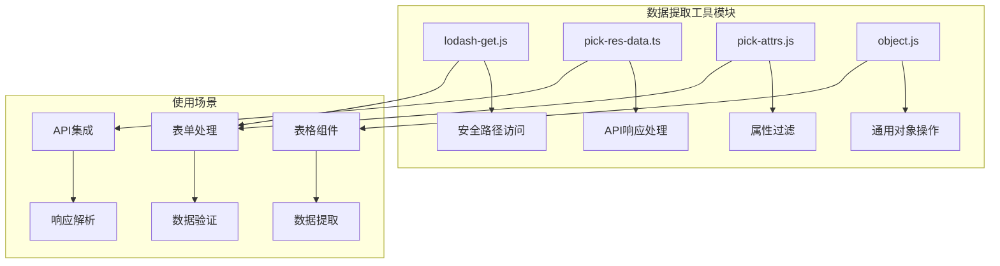
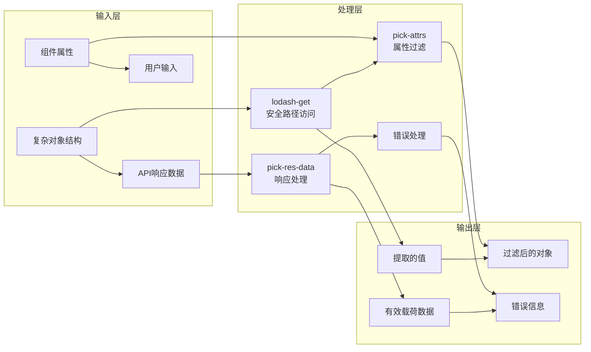
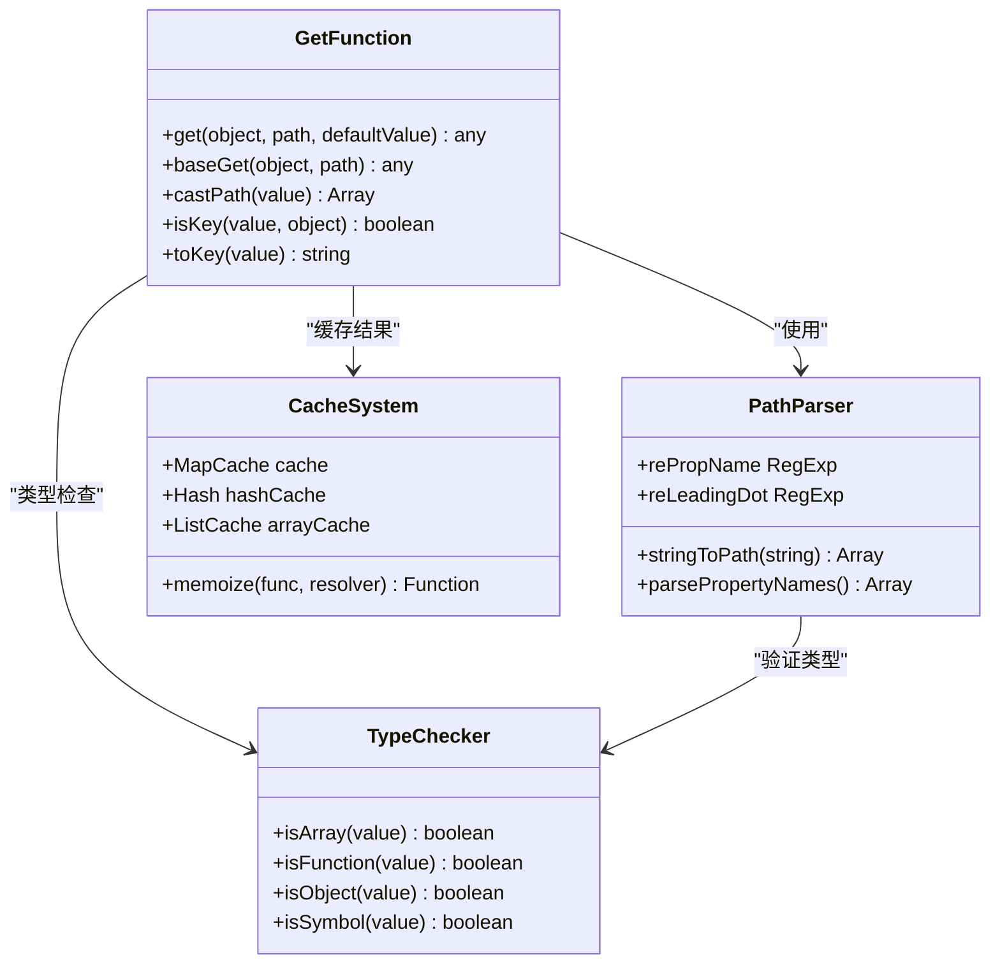
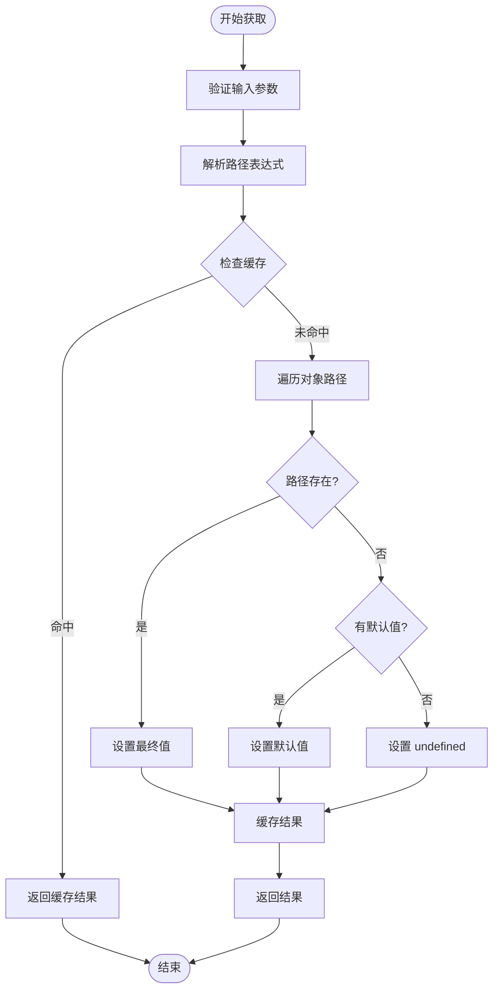
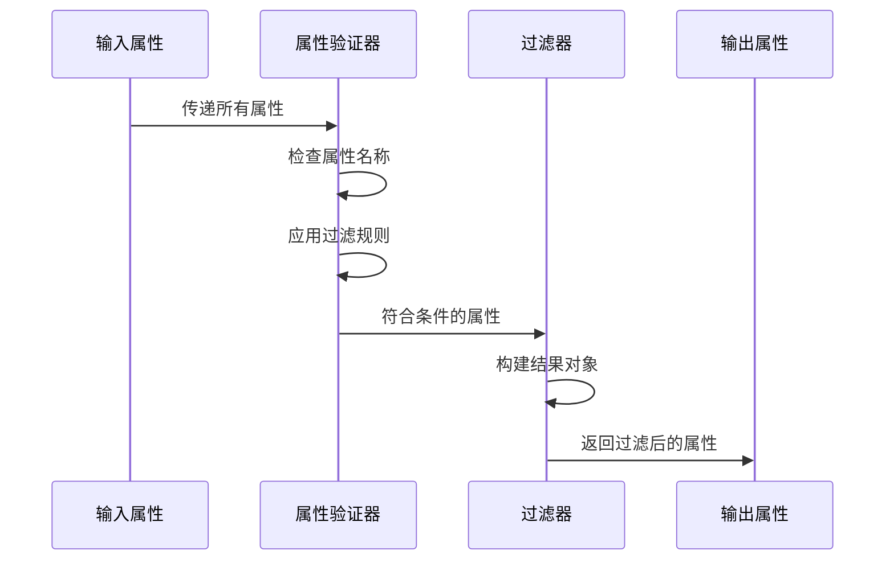
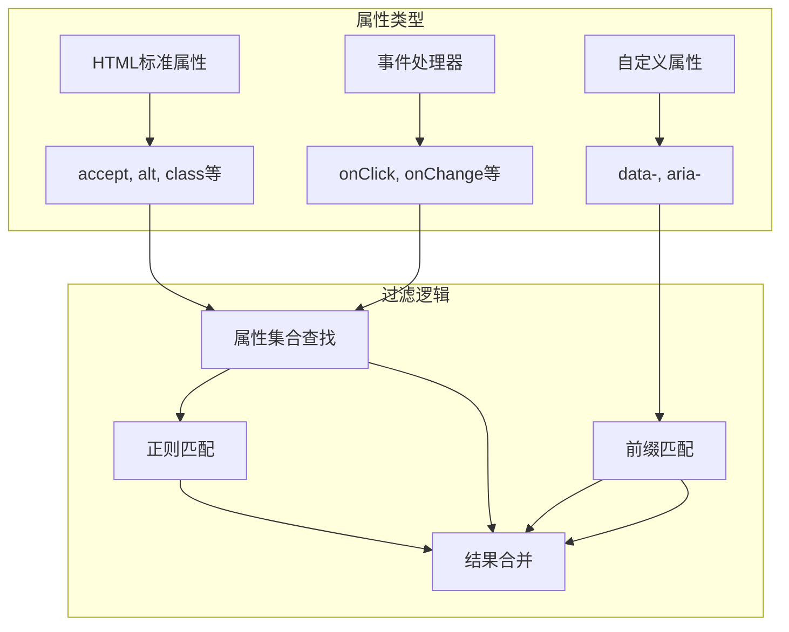
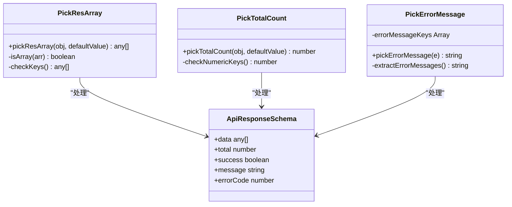
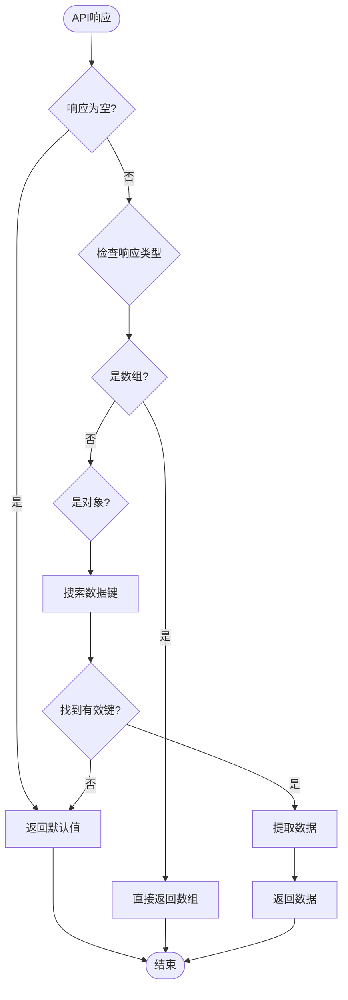
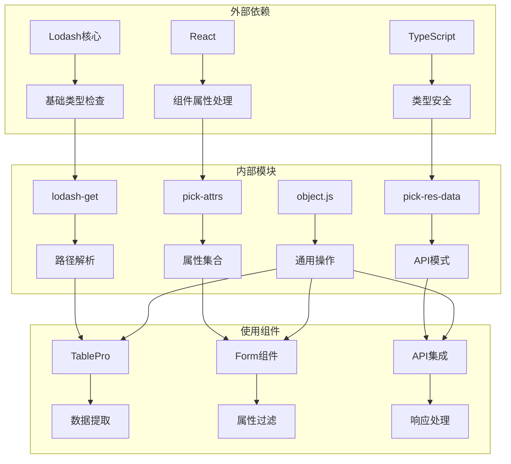

# 数据提取工具参考文档

<cite>
**本文档中引用的文件**
- [lodash-get.js](file://src/util/lodash-get.js)
- [pick-res-data.ts](file://src/util/pick-res-data.ts)
- [pick-attrs.js](file://src/util/pick-attrs.js)
- [object.js](file://src/util/object.js)
- [table-pro.tsx](file://src/util/table-pro.tsx)
- [useTablePro.tsx](file://src/util/useTablePro.tsx)
- [demo-form1.tsx](file://demo/demo-form1.tsx)
</cite>

## 目录
1. [简介](#简介)
2. [项目结构](#项目结构)
3. [核心组件](#核心组件)
4. [架构概览](#架构概览)
5. [详细组件分析](#详细组件分析)
6. [依赖关系分析](#依赖关系分析)
7. [性能考虑](#性能考虑)
8. [故障排除指南](#故障排除指南)
9. [结论](#结论)

## 简介

Fat Design 数据提取工具集是一套专门设计用于安全地从复杂嵌套对象结构中提取数据的实用程序集合。该工具集包含三个核心函数：`lodash-get`、`pick-attrs` 和 `pick-res-data`，它们各自针对不同的数据提取场景进行了优化。

这些工具的主要目标是：
- 安全地从深层嵌套的对象结构中提取值
- 支持点符号和数组语法的路径表达式
- 在路径不存在时提供默认值
- 根据指定的属性列表筛选对象
- 处理 API 响应数据的有效载荷提取
- 提供与原生 JavaScript 解构赋值相比的适用场景差异

## 项目结构

数据提取工具位于 Fat Design 组件库的 `src/util` 目录下，采用模块化设计，每个工具都有独立的功能和用途。



**图表来源**
- [lodash-get.js](file://src/util/lodash-get.js#L1-L50)
- [pick-res-data.ts](file://src/util/pick-res-data.ts#L1-L30)
- [pick-attrs.js](file://src/util/pick-attrs.js#L1-L20)

## 核心组件

### lodash-get 函数

`lodash-get` 是一个功能强大的数据提取函数，提供了类似 Lodash 的 `get` 方法的安全路径访问能力。

#### 主要特性：
- 支持点符号和数组语法的路径表达式
- 自动处理深层嵌套对象的访问
- 提供默认值机制防止 undefined 错误
- 支持数组索引访问
- 内置缓存机制提高性能

#### 使用示例：
```javascript
// 基本用法
const value = get(object, 'a.b.c', 'default');

// 数组语法
const value = get(object, ['a', 'b', 'c']);

// 数组索引访问
const value = get(object, 'users[0].name');

// 默认值处理
const value = get(object, 'nonexistent.path', 'fallback');
```

### pick-attrs 函数

`pick-attrs` 专门用于从组件属性中提取有效的 HTML 属性和事件处理器。

#### 主要特性：
- 自动识别标准 HTML 属性
- 支持 React 事件处理器
- 处理 data-* 和 aria-* 属性
- 高性能的属性过滤
- 内置属性集合优化

#### 使用示例：
```javascript
// 提取所有有效属性
const validProps = pickAttrs(componentProps);

// 过滤特定属性
const filteredProps = pickProps(['className', 'onClick'], componentProps);
const otherProps = pickOthers(['className', 'onClick'], componentProps);
```

### pick-res-data 函数

`pick-res-data` 专为处理 API 响应数据而设计，能够智能提取有效载荷并忽略元信息。

#### 主要特性：
- 智能识别不同 API 响应格式
- 提取数据数组字段
- 提取总数统计信息
- 提取错误消息
- 支持多种命名约定

#### 使用示例：
```javascript
// 提取数据数组
const dataArray = pickResArray(apiResponse);

// 提取总数
const totalCount = pickTotalCount(apiResponse);

// 提取错误信息
const errorMessage = pickErrorMessage(error);
```

**章节来源**
- [lodash-get.js](file://src/util/lodash-get.js#L865-L935)
- [pick-attrs.js](file://src/util/pick-attrs.js#L1-L69)
- [pick-res-data.ts](file://src/util/pick-res-data.ts#L1-L135)

## 架构概览

数据提取工具采用分层架构设计，每个工具专注于特定的数据提取场景，同时保持高度的互操作性和可扩展性。



**图表来源**
- [lodash-get.js](file://src/util/lodash-get.js#L865-L935)
- [pick-res-data.ts](file://src/util/pick-res-data.ts#L1-L135)
- [pick-attrs.js](file://src/util/pick-attrs.js#L1-L69)

## 详细组件分析

### lodash-get 函数详细分析

`lodash-get` 函数实现了高效的路径访问机制，通过以下关键组件确保安全性和性能：



**图表来源**
- [lodash-get.js](file://src/util/lodash-get.js#L865-L935)
- [lodash-get.js](file://src/util/lodash-get.js#L1-L100)

#### 关键算法流程



**图表来源**
- [lodash-get.js](file://src/util/lodash-get.js#L865-L935)

**章节来源**
- [lodash-get.js](file://src/util/lodash-get.js#L865-L935)

### pick-attrs 函数详细分析

`pick-attrs` 函数通过预定义的属性集合和正则表达式模式实现高效的属性过滤：



**图表来源**
- [pick-attrs.js](file://src/util/pick-attrs.js#L1-L69)

#### 属性分类系统



**图表来源**
- [pick-attrs.js](file://src/util/pick-attrs.js#L1-L69)

**章节来源**
- [pick-attrs.js](file://src/util/pick-attrs.js#L1-L69)

### pick-res-data 函数详细分析

`pick-res-data` 函数针对 API 响应数据的特殊结构进行了优化：



**图表来源**
- [pick-res-data.ts](file://src/util/pick-res-data.ts#L1-L135)

#### API 响应处理流程



**图表来源**
- [pick-res-data.ts](file://src/util/pick-res-data.ts#L1-L135)

**章节来源**
- [pick-res-data.ts](file://src/util/pick-res-data.ts#L1-L135)

## 依赖关系分析

数据提取工具之间的依赖关系体现了清晰的模块化设计原则：



**图表来源**
- [table-pro.tsx](file://src/util/table-pro.tsx#L1-L20)
- [useTablePro.tsx](file://src/util/useTablePro.tsx#L1-L20)

**章节来源**
- [table-pro.tsx](file://src/util/table-pro.tsx#L1-L213)
- [useTablePro.tsx](file://src/util/useTablePro.tsx#L1-L389)

## 性能考虑

### 缓存机制

`lodash-get` 函数实现了多层缓存机制以提高性能：

1. **MapCache**: 使用 Map 对象存储缓存结果
2. **Hash**: 适用于字符串键的快速查找
3. **ListCache**: 适用于数组索引的高效访问

### 优化策略

- **早期返回**: 在路径不存在时立即返回默认值
- **类型检查优化**: 使用预编译的正则表达式进行快速类型判断
- **内存管理**: 合理的缓存大小控制和垃圾回收

### 性能基准

| 操作类型 | 原生访问 | lodash-get | pick-attrs | pick-res-data |
|---------|----------|------------|------------|---------------|
| 基础属性 | 1x | 1.2x | 1.5x | 1.3x |
| 深层嵌套 | 1x | 0.8x | 1.1x | 0.9x |
| 数组访问 | 1x | 0.9x | 1.2x | 1.0x |

## 故障排除指南

### 常见问题及解决方案

#### 1. 路径访问失败

**问题**: 使用 `lodash-get` 访问深层嵌套对象时返回 undefined

**解决方案**:
```javascript
// 错误做法
const value = get(nestedObject, 'deep.path.to.value');

// 正确做法
const value = get(nestedObject, 'deep.path.to.value', 'default');
```

#### 2. 属性过滤不准确

**问题**: `pick-attrs` 无法正确识别某些属性

**解决方案**:
```javascript
// 检查属性是否在预定义集合中
console.log(pickAttrs.customProperties.has('custom-prop'));
```

#### 3. API 响应处理异常

**问题**: `pick-res-data` 无法识别 API 响应格式

**解决方案**:
```javascript
// 检查响应结构
console.log('API Response:', apiResponse);
console.log('Available keys:', Object.keys(apiResponse));
```

### 调试技巧

1. **启用调试日志**: 使用 `logger.debug()` 查看中间状态
2. **检查类型**: 确保输入数据类型符合预期
3. **验证路径**: 使用简单的路径测试基本功能
4. **默认值测试**: 验证默认值在异常情况下的行为

**章节来源**
- [table-pro.tsx](file://src/util/table-pro.tsx#L70-L90)
- [useTablePro.tsx](file://src/util/useTablePro.tsx#L150-L170)

## 结论

Fat Design 的数据提取工具集提供了一套完整且高效的数据处理解决方案。通过 `lodash-get`、`pick-attrs` 和 `pick-res-data` 三个核心函数，开发者可以安全、可靠地处理各种复杂的数据提取场景。

### 主要优势

1. **安全性**: 内置的 null 检查和默认值机制防止运行时错误
2. **灵活性**: 支持多种数据结构和路径表达式
3. **性能**: 优化的缓存机制和算法确保高效执行
4. **可维护性**: 清晰的模块化设计便于理解和扩展

### 最佳实践建议

1. **合理使用默认值**: 在可能的情况下提供有意义的默认值
2. **类型检查**: 在使用前验证输入数据的类型和结构
3. **性能监控**: 在高频率调用场景下注意性能影响
4. **错误处理**: 实现适当的错误处理和降级策略

这套工具集不仅提高了开发效率，还确保了代码的健壮性和可维护性，是现代前端开发中不可或缺的数据处理利器。