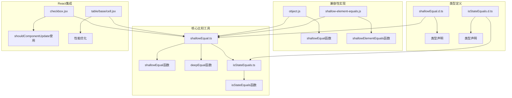
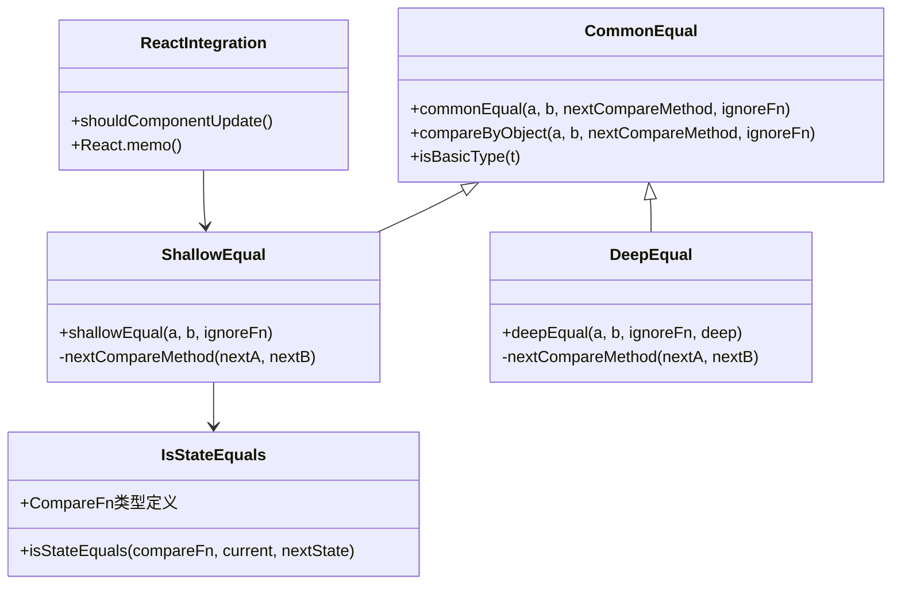
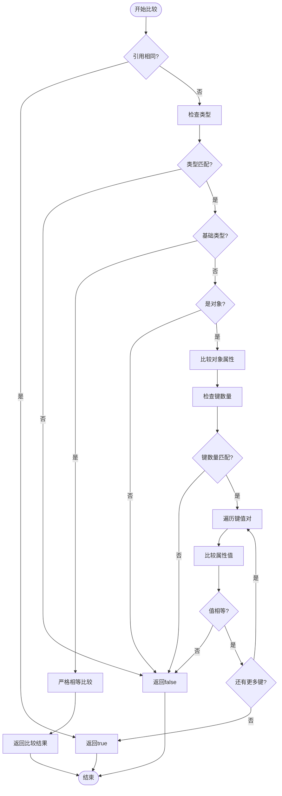
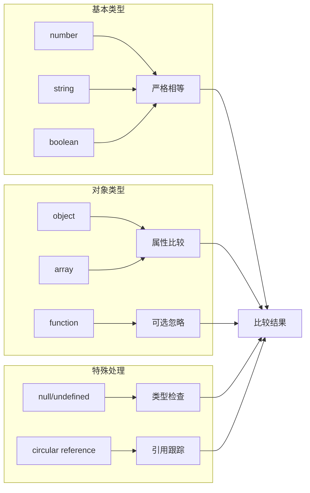
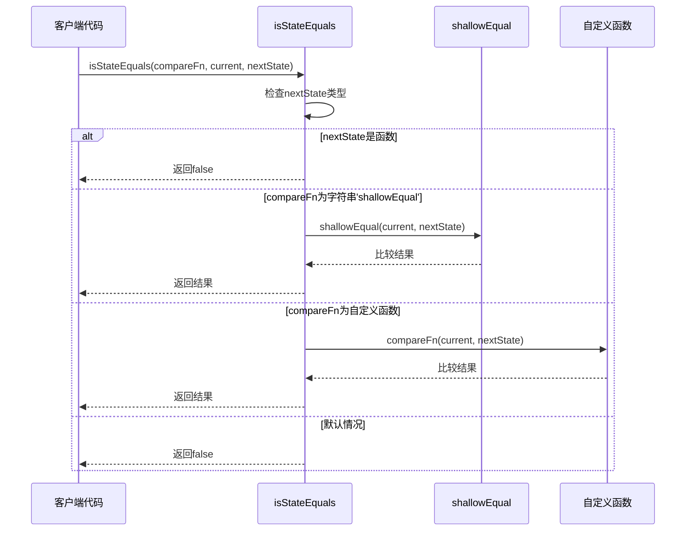
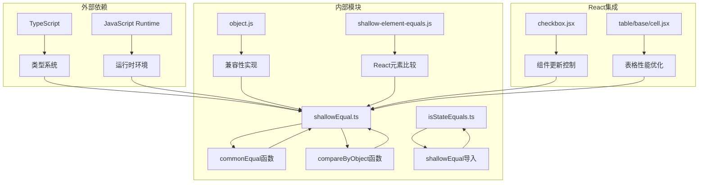

# 浅层比较工具技术文档

<cite>
**本文档引用的文件**
- [shallowEqual.ts](file://src/util/shallowEqual.ts)
- [isStateEquals.ts](file://src/util/isStateEquals.ts)
- [object.js](file://src/util/object.js)
- [shallow-element-equals.js](file://src/util/shallow-element-equals.js)
- [style-equal.js](file://src/util/style-equal.js)
- [isEqual.ts](file://src/image/utils/isEqual.ts)
- [checkbox.jsx](file://src/checkbox/checkbox.jsx)
- [shallowEqual.d.ts](file://types/0buildTypes/util/shallowEqual.d.ts)
- [isStateEquals.d.ts](file://types/0buildTypes/util/isStateEquals.d.ts)
</cite>

## 目录
1. [简介](#简介)
2. [项目结构](#项目结构)
3. [核心组件](#核心组件)
4. [架构概览](#架构概览)
5. [详细组件分析](#详细组件分析)
6. [依赖关系分析](#依赖关系分析)
7. [性能考虑](#性能考虑)
8. [故障排除指南](#故障排除指南)
9. [结论](#结论)

## 简介

浅层比较工具是Fat Design组件库中的核心性能优化工具，主要用于React应用的状态管理和组件渲染优化。该工具集包含多个关键函数：`shallowEqual`用于对象属性的严格相等比较，`deepEqual`用于深度递归比较，以及`isStateEquals`用于状态变更检测。这些工具在React组件的`shouldComponentUpdate`生命周期和`React.memo`高阶组件中发挥重要作用，帮助开发者避免不必要的重新渲染，提升应用性能。

## 项目结构

浅层比较工具分布在多个模块中，形成了完整的比较生态系统：



**图表来源**
- [shallowEqual.ts](file://src/util/shallowEqual.ts#L1-L92)
- [isStateEquals.ts](file://src/util/isStateEquals.ts#L1-L36)
- [object.js](file://src/util/object.js#L48-L107)

**章节来源**
- [shallowEqual.ts](file://src/util/shallowEqual.ts#L1-L92)
- [isStateEquals.ts](file://src/util/isStateEquals.ts#L1-L36)

## 核心组件

### shallowEqual函数

`shallowEqual`是浅层比较的核心函数，它通过遍历对象属性并进行严格相等比较来判断两个对象是否在浅层上相等。

```typescript
const shallowEqual = (a: any, b: any, ignoreFn: boolean = false): boolean => {
    const nextCompareMethod = (nextA: any, nextB: any) => {
        return nextA === nextB;
    }
    return commonEqual(a, b, nextCompareMethod, ignoreFn)
}
```

该函数的主要特点：
- **严格相等比较**：使用`===`运算符进行值比较
- **可选忽略函数**：支持通过`ignoreFn`参数忽略函数类型的属性
- **类型安全**：完整的TypeScript类型定义
- **性能优化**：早期返回机制减少不必要的计算

### deepEqual函数

`deepEqual`提供了深度递归比较功能，支持循环引用检测和层级限制：

```typescript
function deepEqual(a: any, b: any, ignoreFn: boolean = false, deep: number = 0): boolean {
    const nextCompareMethod = (nextA: any, nextB: any) => {
        if (deep > 10) {
            return nextA === nextB;
        }
        return deepEqual(nextA, nextB, ignoreFn, deep + 1);
    }
    return commonEqual(a, b, nextCompareMethod, ignoreFn)
}
```

### isStateEquals函数

`isStateEquals`专门用于状态管理场景中的变更检测：

```typescript
function isStateEquals(compareFn: CompareFn, current: any, nextState: any) {
    if (typeof nextState === "function") {
        return false;
    }
    
    if (compareFn === 'shallowEqual') {
        return shallowEqual(current, nextState);
    }
    
    if (typeof compareFn === "function") {
        return compareFn(current, nextState);
    }
    
    return false;
}
```

**章节来源**
- [shallowEqual.ts](file://src/util/shallowEqual.ts#L65-L92)
- [isStateEquals.ts](file://src/util/isStateEquals.ts#L7-L34)

## 架构概览

浅层比较工具采用分层架构设计，从通用比较逻辑到特定应用场景：



**图表来源**
- [shallowEqual.ts](file://src/util/shallowEqual.ts#L1-L92)
- [isStateEquals.ts](file://src/util/isStateEquals.ts#L1-L36)

## 详细组件分析

### shallowEqual实现机制

`shallowEqual`函数的实现遵循以下步骤：



**图表来源**
- [shallowEqual.ts](file://src/util/shallowEqual.ts#L25-L64)

### 类型处理策略

浅层比较工具对不同数据类型采用不同的处理策略：



**图表来源**
- [shallowEqual.ts](file://src/util/shallowEqual.ts#L46-L64)

### 状态比较函数分析

`isStateEquals`函数提供了灵活的状态比较接口：



**图表来源**
- [isStateEquals.ts](file://src/util/isStateEquals.ts#L7-L34)

**章节来源**
- [shallowEqual.ts](file://src/util/shallowEqual.ts#L1-L92)
- [isStateEquals.ts](file://src/util/isStateEquals.ts#L1-L36)

## 依赖关系分析

浅层比较工具的依赖关系展现了清晰的模块化设计：



**图表来源**
- [shallowEqual.ts](file://src/util/shallowEqual.ts#L1-L92)
- [isStateEquals.ts](file://src/util/isStateEquals.ts#L1-L36)
- [object.js](file://src/util/object.js#L48-L107)

**章节来源**
- [shallowEqual.ts](file://src/util/shallowEqual.ts#L1-L92)
- [isStateEquals.ts](file://src/util/isStateEquals.ts#L1-L36)

## 性能考虑

### 性能特征分析

浅层比较工具在性能方面具有以下特征：

1. **早期返回优化**：当对象引用相同时立即返回，避免不必要的计算
2. **类型检查优先**：在进入复杂比较逻辑前进行快速类型验证
3. **短路求值**：一旦发现不相等就立即返回，减少计算开销
4. **内存效率**：使用原生JavaScript方法，避免额外的内存分配

### 与原生相等性的比较

| 特性 | JavaScript原生相等性 | 浅层比较 |
|------|---------------------|----------|
| 比较范围 | 基本类型值 | 对象属性 |
| 复杂度 | O(1) | O(n)，其中n为属性数量 |
| 循环引用 | 不支持 | 支持检测 |
| 函数属性 | 忽略 | 可配置处理 |
| 性能 | 最快 | 中等 |

### React集成最佳实践

在React组件中使用浅层比较工具的推荐模式：

```javascript
// 使用shallowEqual进行shouldComponentUpdate
shouldComponentUpdate(nextProps, nextState) {
    const { shallowEqual } = require('./shallowEqual');
    return (
        !shallowEqual(this.props, nextProps) ||
        !shallowEqual(this.state, nextState)
    );
}

// 使用React.memo进行组件优化
const OptimizedComponent = React.memo(
    MyComponent,
    (prevProps, nextProps) => {
        return shallowEqual(prevProps, nextProps);
    }
);
```

## 故障排除指南

### 常见问题及解决方案

1. **循环引用处理**
   - 问题：对象包含循环引用导致栈溢出
   - 解决：`deepEqual`函数内置循环检测机制

2. **函数属性比较**
   - 问题：函数类型的属性被错误比较
   - 解决：使用`ignoreFn: true`参数忽略函数属性

3. **React元素比较**
   - 问题：React元素的ref和key属性影响比较结果
   - 解决：使用专门的`shallowElementEquals`函数

4. **性能问题**
   - 问题：大型对象比较耗时
   - 解决：考虑使用`deepEqual`的层级限制或自定义比较函数

### 边界情况处理

浅层比较工具对各种边界情况都有妥善处理：

- **null和undefined**：严格类型检查确保正确处理
- **NaN值**：JavaScript的`NaN !== NaN`特性得到正确体现
- **Symbol属性**：ES6 Symbol类型的属性会被正确比较
- **继承属性**：只比较对象自身的属性，忽略原型链上的属性

**章节来源**
- [shallowEqual.ts](file://src/util/shallowEqual.ts#L46-L64)
- [shallow-element-equals.js](file://src/util/shallow-element-equals.js#L1-L65)

## 结论

浅层比较工具是Fat Design组件库中不可或缺的性能优化组件，它通过精心设计的算法和灵活的接口，为React应用提供了强大的状态管理和渲染优化能力。该工具集不仅包含了核心的比较功能，还提供了完整的类型定义和广泛的使用场景支持。

主要优势包括：
- **高性能**：优化的算法设计确保了良好的性能表现
- **类型安全**：完整的TypeScript支持提供了编译时安全保障
- **灵活配置**：支持多种比较策略和自定义选项
- **广泛适用**：适用于React组件、状态管理、数据验证等多种场景

通过合理使用这些工具，开发者可以显著提升应用性能，减少不必要的重新渲染，为用户提供更好的交互体验。