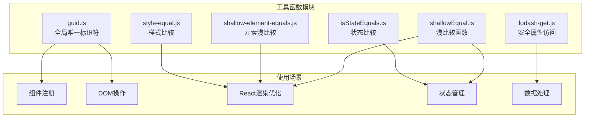
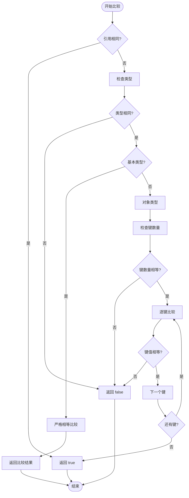
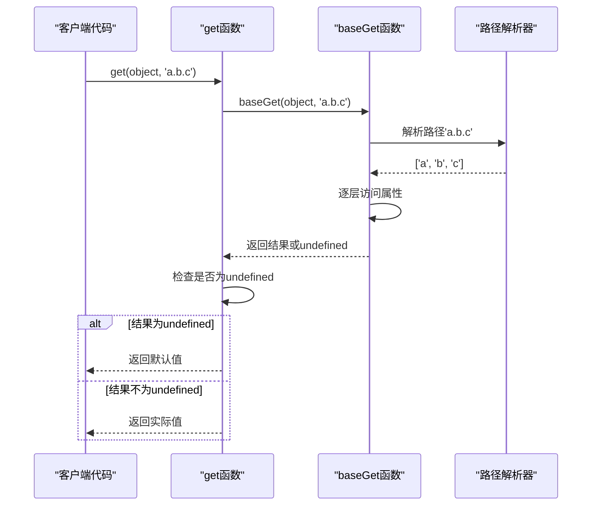
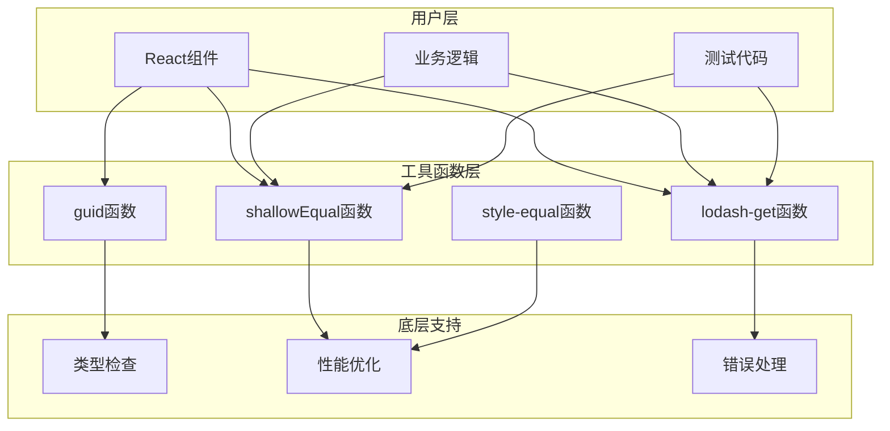

# 工具函数参考手册

<cite>
**本文档引用的文件**
- [guid.ts](file://src/util/guid.ts)
- [shallowEqual.ts](file://src/util/shallowEqual.ts)
- [lodash-get.js](file://src/util/lodash-get.js)
- [shallow-element-equals.js](file://src/util/shallow-element-equals.js)
- [style-equal.js](file://src/util/style-equal.js)
- [isStateEquals.ts](file://src/util/isStateEquals.ts)
- [isEqual.ts](file://src/image/utils/isEqual.ts)
- [useUniqueId.ts](file://src/hooks/useUniqueId.ts)
- [affix/index.jsx](file://src/affix/index.jsx)
- [checkbox/checkbox.jsx](file://src/checkbox/checkbox.jsx)
- [dialog/show-table.jsx](file://src/dialog/show-table.jsx)
</cite>

## 目录
1. [简介](#简介)
2. [项目结构概览](#项目结构概览)
3. [核心工具函数详解](#核心工具函数详解)
4. [架构设计分析](#架构设计分析)
5. [详细组件分析](#详细组件分析)
6. [性能考虑](#性能考虑)
7. [故障排除指南](#故障排除指南)
8. [总结](#总结)

## 简介

Fat Design是一个现代化的React组件库，提供了丰富的UI组件和实用的工具函数。本文档专注于介绍三个核心工具函数：`guid`（全局唯一标识符生成）、`shallowEqual`（浅比较）和`lodash-get`（安全属性访问），这些函数在组件开发中发挥着重要作用。

这些工具函数不仅简化了常见的编程任务，还通过优化的算法提升了应用程序的性能。它们广泛应用于状态管理、DOM操作、组件通信和数据处理等场景。

## 项目结构概览

Fat Design采用模块化的组织结构，工具函数位于`src/util`目录下，每个函数都有独立的文件进行管理：



**图表来源**
- [guid.ts](file://src/util/guid.ts#L1-L26)
- [shallowEqual.ts](file://src/util/shallowEqual.ts#L1-L92)
- [lodash-get.js](file://src/util/lodash-get.js#L1-L199)

## 核心工具函数详解

### guid函数 - 全局唯一标识符生成器

`guid`函数是Fat Design中用于生成全局唯一标识符的核心工具。它基于时间戳和索引组合生成具有高唯一性的字符串标识符。

#### 函数签名与实现原理

```typescript
export function uniqueId(prefix?: string): string {
    prefix = prefix || '';
    uniqueIdIndex++;
    return prefix + (timestamp++).toString(36) + "_" + uniqueIdIndex.toString(36);
}
```

#### 关键特性

1. **时间戳基础**：使用`Date.now()`作为基础时间戳，确保时间顺序性
2. **基数转换**：将时间戳和索引转换为36进制，提高编码效率
3. **索引递增**：在同一毫秒内使用递增索引避免重复
4. **前缀支持**：可选的前缀参数，便于识别和调试

#### 使用示例

```javascript
// 基本用法
guid(); // "j7jv509c"
guid('prefix-'); // "prefix-j7jv509d"

// 在React组件中使用
const [uuid] = useState(guid()); // 为对话框生成唯一ID
const id = guid('dialog-title-'); // 为标题生成唯一ID
```

#### 应用场景

- **组件注册**：为新注册的组件生成唯一标识符
- **DOM操作**：为动态生成的DOM元素设置唯一ID
- **事件绑定**：为事件监听器创建唯一标识
- **状态管理**：为临时状态项生成唯一键值

**章节来源**
- [guid.ts](file://src/util/guid.ts#L1-L26)
- [useUniqueId.ts](file://src/hooks/useUniqueId.ts#L1-L12)

### shallowEqual函数 - 浅比较优化器

`shallowEqual`函数实现了高效的浅比较算法，专门用于React组件的性能优化。它能够快速判断两个对象是否相等，避免不必要的重新渲染。

#### 函数签名与实现原理

```typescript
const shallowEqual = (a: any, b: any, ignoreFn: boolean = false): boolean => {
    const nextCompareMethod = (nextA: any, nextB: any) => {
        return nextA === nextB;
    }
    return commonEqual(a, b, nextCompareMethod, ignoreFn)
}
```

#### 核心算法流程



**图表来源**
- [shallowEqual.ts](file://src/util/shallowEqual.ts#L46-L90)

#### 性能特点

1. **早期退出**：引用相同时立即返回true
2. **类型检查**：不同类型的对象直接返回false
3. **键数量优化**：首先比较键的数量，避免不必要的遍历
4. **忽略函数**：可选择忽略函数类型的属性比较

#### 使用示例

```javascript
// 基本比较
shallowEqual({a: 1, b: 2}, {a: 1, b: 2}); // true
shallowEqual({a: 1, b: 2}, {a: 1, b: 3}); // false

// 忽略函数比较
const obj1 = {a: 1, fn: () => {}};
const obj2 = {a: 1, fn: () => {}};
shallowEqual(obj1, obj2); // false
shallowEqual(obj1, obj2, true); // true

// React组件优化
shouldComponentUpdate(nextProps, nextState, nextContext) {
    const { shallowEqual } = obj;
    return (
        !shallowEqual(this.props, nextProps) ||
        !shallowEqual(this.state, nextState) ||
        !shallowEqual(this.context, nextContext)
    );
}
```

#### 应用场景

- **React组件优化**：在`shouldComponentUpdate`中使用避免不必要的重渲染
- **状态比较**：比较新旧状态决定是否更新组件
- **表单验证**：检查表单字段是否有变化
- **缓存优化**：判断缓存数据是否需要更新

**章节来源**
- [shallowEqual.ts](file://src/util/shallowEqual.ts#L1-L92)
- [affix/index.jsx](file://src/affix/index.jsx#L212-L230)
- [checkbox/checkbox.jsx](file://src/checkbox/checkbox.jsx#L169-L173)

### lodash-get函数 - 安全属性访问器

`lodash-get`函数提供了安全的属性访问功能，能够优雅地处理嵌套对象的属性访问，避免因属性不存在而导致的运行时错误。

#### 函数签名与实现原理

```javascript
function get(object, path, defaultValue) {
  var result = object == null ? undefined : baseGet(object, path);
  return result === undefined ? defaultValue : result;
}
```

#### 路径解析机制



**图表来源**
- [lodash-get.js](file://src/util/lodash-get.js#L865-L935)
- [lodash-get.js](file://src/util/lodash-get.js#L432-L484)

#### 支持的路径格式

1. **点号表示法**：`'user.profile.name'`
2. **数组表示法**：`['users', '0', 'profile', 'name']`
3. **混合表示法**：`'users[0].profile.name'`

#### 使用示例

```javascript
const user = {
    profile: {
        name: '张三',
        age: 25,
        address: {
            city: '北京',
            country: '中国'
        }
    },
    skills: ['JavaScript', 'React', 'TypeScript']
};

// 基本用法
get(user, 'profile.name'); // "张三"
get(user, 'profile.age'); // 25

// 多层嵌套
get(user, 'profile.address.city'); // "北京"
get(user, 'skills.1'); // "React"

// 默认值处理
get(user, 'profile.phone', '未提供'); // "未提供"
get(user, 'profile.email', '默认邮箱'); // "默认邮箱"

// 数组访问
get(user, 'skills[2]'); // "TypeScript"
get(user, ['skills', '1']); // "React"
```

#### 应用场景

- **配置管理**：从复杂配置对象中提取值
- **API响应处理**：安全地访问API返回的嵌套数据
- **表单数据处理**：从表单对象中提取特定字段
- **状态管理**：从Redux状态树中获取深层属性

**章节来源**
- [lodash-get.js](file://src/util/lodash-get.js#L865-L935)
- [dialog/show-table.jsx](file://src/dialog/show-table.jsx#L1-L64)

## 架构设计分析

### 工具函数的分层架构



### 设计原则

1. **单一职责**：每个工具函数专注于特定的功能领域
2. **高性能**：采用优化的算法减少计算开销
3. **易用性**：提供简洁的API接口
4. **兼容性**：支持多种数据类型和使用场景
5. **可扩展性**：为未来功能扩展预留空间

## 详细组件分析

### 组件注册中的guid应用

在Fat Design的组件系统中，`guid`函数主要用于组件的唯一标识生成：

```javascript
// 对话框组件中的UUID生成
const [uuid] = useState(guid());

// 弹出层组件中的key生成
const key = props.key || guid('message-');

// 动画组件中的ID生成
const id = guid();
```

这种应用确保了：
- **组件唯一性**：每个组件实例都有唯一的标识符
- **DOM一致性**：保持DOM元素的稳定性
- **事件隔离**：避免事件冒泡和冲突

### React渲染优化中的shallowEqual应用

`shallowEqual`函数在React组件的性能优化中发挥关键作用：

```javascript
// Checkbox组件的shouldComponentUpdate实现
shouldComponentUpdate(nextProps, nextState, nextContext) {
    const { shallowEqual } = obj;
    return (
        !shallowEqual(this.props, nextProps) ||
        !shallowEqual(this.state, nextState) ||
        !shallowEqual(this.context, nextContext)
    );
}

// Affix组件的状态更新优化
_setAffixStyle(affixStyle, affixed = false) {
    if (obj.shallowEqual(affixStyle, this.state.style)) {
        return;
    }
    this.setState({ style: affixStyle });
}
```

这种应用的优势包括：
- **减少重渲染**：只在必要时触发组件更新
- **提升性能**：避免不必要的DOM操作
- **保持状态**：维持组件内部状态的一致性

### 数据处理中的lodash-get应用

`lodash-get`函数在数据处理场景中提供了强大的属性访问能力：

```javascript
// 表格组件的数据处理
function getDep(name) {
    return _get(ComponentsStore.buildInComponents, name);
}

// 配置参数的安全访问
const maxBodyHeight = _get(tableProProps, 'tableProps.maxBodyHeight');
if (!maxBodyHeight) {
    const maxHeight = Math.min(
        parseInt(contentStyle.height) || parseInt(contentStyle.maxHeight), 
        500
    ) - 100;
    _set(tableProProps, 'tableProps.maxBodyHeight', maxHeight);
}
```

这种应用的价值在于：
- **错误处理**：避免因属性不存在导致的运行时错误
- **默认值支持**：提供合理的默认值策略
- **灵活性**：支持复杂的嵌套数据结构访问

**章节来源**
- [affix/index.jsx](file://src/affix/index.jsx#L212-L230)
- [checkbox/checkbox.jsx](file://src/checkbox/checkbox.jsx#L169-L173)
- [dialog/show-table.jsx](file://src/dialog/show-table.jsx#L1-L64)

## 性能考虑

### 时间复杂度分析

1. **guid函数**：O(1)，常数时间复杂度
2. **shallowEqual函数**：O(n)，其中n为对象的键数量
3. **lodash-get函数**：O(m)，其中m为路径深度

### 内存使用优化

- **无状态设计**：所有工具函数都是纯函数，无副作用
- **最小依赖**：只依赖必要的内置对象和方法
- **及时释放**：避免内存泄漏和不必要的引用保留

### 最佳实践建议

1. **合理使用**：根据具体场景选择合适的工具函数
2. **缓存结果**：对于频繁使用的比较结果可以进行缓存
3. **避免滥用**：不要在简单场景中过度使用复杂工具函数
4. **性能监控**：定期评估工具函数的性能影响

## 故障排除指南

### 常见问题与解决方案

#### guid函数相关问题

**问题**：生成的ID重复
**原因**：在同一毫秒内调用次数过多
**解决方案**：增加索引递增机制，确保唯一性

**问题**：ID长度过长
**原因**：时间戳基数转换后的字符串较长
**解决方案**：考虑使用更短的前缀或自定义编码方案

#### shallowEqual函数相关问题

**问题**：误判对象相等
**原因**：对象包含不可比较的属性（如函数）
**解决方案**：使用`ignoreFn: true`参数忽略函数比较

**问题**：性能问题
**原因**：比较过于复杂的对象结构
**解决方案**：考虑使用深比较或自定义比较函数

#### lodash-get函数相关问题

**问题**：默认值未生效
**原因**：属性值为`null`或`undefined`
**解决方案**：明确指定默认值或使用条件判断

**问题**：路径解析错误
**原因**：路径格式不正确或包含特殊字符
**解决方案**：使用数组形式的路径或预处理路径字符串

### 调试技巧

1. **日志记录**：在关键位置添加调试日志
2. **单元测试**：为工具函数编写全面的测试用例
3. **性能分析**：使用浏览器开发者工具分析性能瓶颈
4. **类型检查**：利用TypeScript进行静态类型检查

**章节来源**
- [shallowEqual.ts](file://src/util/shallowEqual.ts#L46-L90)
- [lodash-get.js](file://src/util/lodash-get.js#L865-L935)

## 总结

Fat Design的工具函数系统展现了现代前端开发的最佳实践。通过精心设计的`guid`、`shallowEqual`和`lodash-get`函数，开发者能够：

1. **提高开发效率**：通过简化的API减少样板代码
2. **增强应用性能**：利用优化的算法提升用户体验
3. **降低维护成本**：通过可靠的工具函数减少bug风险
4. **保证代码质量**：遵循一致的设计原则和编码规范

这些工具函数不仅是Fat Design组件库的重要组成部分，也为整个前端生态系统提供了宝贵的参考。随着Web技术的不断发展，这些工具函数将继续演进，为开发者提供更加强大和便捷的功能支持。

在实际项目中，合理使用这些工具函数能够显著提升开发效率和应用性能。建议开发者深入理解每个函数的实现原理和适用场景，以便在合适的时机选择最合适的工具。