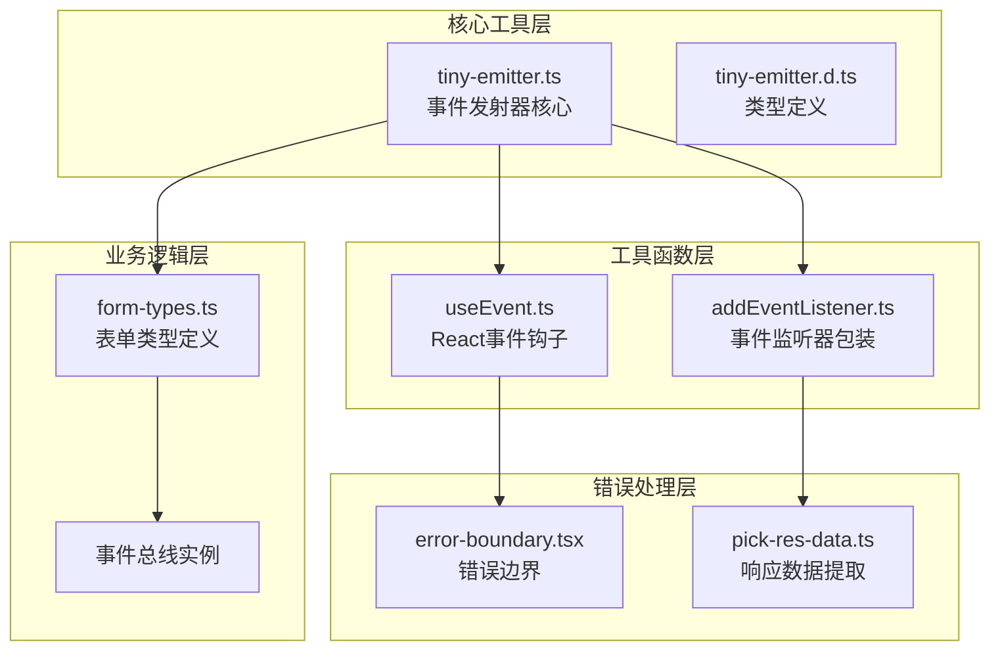
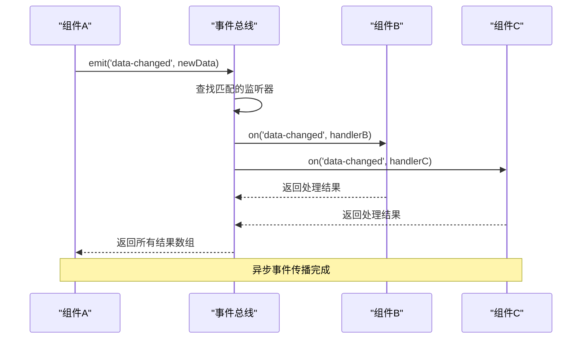
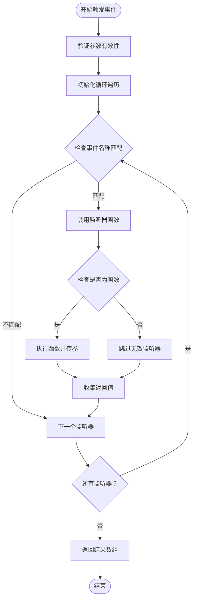
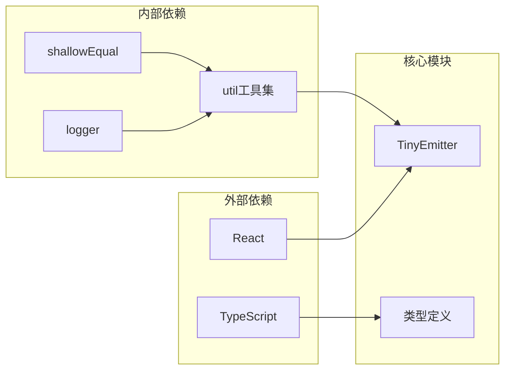

# 事件通信工具

<cite>
**本文档引用的文件**
- [tiny-emitter.ts](file://src/util/tiny-emitter.ts)
- [tiny-emitter.d.ts](file://types/0buildTypes/util/tiny-emitter.d.ts)
- [form-types.ts](file://src/form2/form-types.ts)
- [useEvent.ts](file://src/image/utils/useEvent.ts)
- [addEventListener.ts](file://src/image/utils/addEventListener.ts)
- [usePersistFn.ts](file://src/hooks/usePersistFn.ts)
- [usePreciseStore.ts](file://src/hooks/usePreciseStore.ts)
- [error-boundary.tsx](file://src/config-provider/v2/error-boundary.tsx)
- [pick-res-data.ts](file://src/util/pick-res-data.ts)
</cite>

## 目录
1. [简介](#简介)
2. [项目结构](#项目结构)
3. [核心组件](#核心组件)
4. [架构概览](#架构概览)
5. [详细组件分析](#详细组件分析)
6. [依赖关系分析](#依赖关系分析)
7. [性能考虑](#性能考虑)
8. [故障排除指南](#故障排除指南)
9. [结论](#结论)

## 简介

事件通信工具是一个轻量级的事件发射器（Event Emitter）实现，基于观察者模式设计，为Fat Design组件库提供了高效的组件间通信机制。该工具专为复杂应用中的状态变化通知、插件系统集成和跨组件通信场景而设计，具有简洁的API接口和优秀的性能表现。

tiny-emitter.ts作为核心模块，实现了完整的事件生命周期管理，包括事件注册、触发和移除功能。它采用单例模式设计，确保在整个应用中只有一个事件总线实例，从而避免了重复的事件监听器和内存泄漏问题。

## 项目结构

事件通信工具在Fat Design项目中的组织结构体现了清晰的模块化设计理念：



**图表来源**
- [tiny-emitter.ts](file://src/util/tiny-emitter.ts#L1-L63)
- [form-types.ts](file://src/form2/form-types.ts#L428-L428)

**章节来源**
- [tiny-emitter.ts](file://src/util/tiny-emitter.ts#L1-L63)
- [tiny-emitter.d.ts](file://types/0buildTypes/util/tiny-emitter.d.ts#L1-L11)

## 核心组件

### TinyEmitter类设计

TinyEmitter类是整个事件通信系统的核心，采用了简洁而高效的设计模式：

```typescript
class TinyEmitter {
    private listenerObjects: IListenerObject[];
    
    constructor() {
        this.listenerObjects = [];
    }
    
    on = (eventName: string, listener: ListenerType) => {
        this.listenerObjects.push({
            eventName: eventName,
            listener: listener
        })
    }
}
```

该类的核心特性包括：

- **轻量级设计**：仅包含必要的事件管理方法，无额外依赖
- **类型安全**：完整的TypeScript类型定义，确保编译时类型检查
- **内存友好**：采用数组存储监听器，便于快速查找和移除
- **链式调用**：所有方法都支持链式调用语法

### 监听器对象结构

每个事件监听器都被封装为IListenerObject接口：

```typescript
interface IListenerObject {
    eventName: string,
    listener: ListenerType
}
```

这种设计的优势：
- **解耦合**：事件名称和回调函数分离存储
- **可追踪**：便于调试和错误定位
- **扩展性**：未来可以轻松添加元数据字段

**章节来源**
- [tiny-emitter.ts](file://src/util/tiny-emitter.ts#L1-L63)
- [tiny-emitter.d.ts](file://types/0buildTypes/util/tiny-emitter.d.ts#L1-L11)

## 架构概览

事件通信工具的整体架构基于观察者模式，通过事件总线实现松耦合的组件通信：



**图表来源**
- [tiny-emitter.ts](file://src/util/tiny-emitter.ts#L35-L61)

### 事件生命周期

事件通信遵循标准的生命周期模式：

1. **事件注册阶段**：组件通过`on()`方法注册事件监听器
2. **事件触发阶段**：通过`emit()`方法触发事件并传递参数
3. **事件处理阶段**：所有匹配的监听器按顺序执行
4. **事件清理阶段**：通过`off()`方法移除不需要的监听器

## 详细组件分析

### 事件注册机制（on方法）

`on`方法负责注册新的事件监听器：

```typescript
on = (eventName: string, listener: ListenerType) => {
    this.listenerObjects.push({
        eventName: eventName,
        listener: listener
    })
}
```

该方法的特点：
- **即时生效**：监听器立即被添加到监听器列表中
- **无重复检查**：允许同一个监听器注册多次，满足特定业务需求
- **类型安全**：严格验证事件名称和回调函数类型

### 事件触发机制（emit方法）

`emit`方法是事件系统的核心执行引擎：



**图表来源**
- [tiny-emitter.ts](file://src/util/tiny-emitter.ts#L35-L61)

### 事件移除机制（off方法）

`off`方法提供了灵活的监听器移除策略：

```typescript
off = (eventName: string, listener: ListenerType) => {
    if (!eventName) {
        return;
    }
    if (!listener) {
        // 移除指定事件的所有监听器
        this.listenerObjects = this.listenerObjects.filter((obj) => {
            return obj.eventName !== eventName;
        });
    } else {
        // 移除特定监听器
        this.listenerObjects = this.listenerObjects.filter((obj) => {
            return !(obj.eventName === eventName && obj.listener === listener);
        });
    }
}
```

支持三种移除模式：
- **全量移除**：移除指定事件名称的所有监听器
- **精确移除**：移除特定事件和监听器的组合
- **条件移除**：根据事件名称过滤

### 清理机制（clear方法）

`clear`方法用于清空所有事件监听器：

```typescript
clear = () => {
    this.listenerObjects = [];
}
```

该方法适用于：
- 组件卸载时的资源清理
- 应用重启前的状态重置
- 内存泄漏预防

**章节来源**
- [tiny-emitter.ts](file://src/util/tiny-emitter.ts#L15-L61)

### 在表单系统中的应用

事件通信工具在Fat Design的表单系统中扮演着关键角色：

```typescript
export interface IFormContext {
    formProps: FormProps;
    formStore: any;
    formActions: any;
    formComponents: any;
    formOnChange: any;
    formEventBus: TinyEmitter; // 事件总线实例
}
```

表单事件总线的应用场景：
- **状态同步**：表单项状态变化时通知相关组件
- **联动更新**：多表单项间的联动逻辑处理
- **验证通知**：表单验证结果的广播机制
- **提交流程**：表单提交过程中的事件协调

**章节来源**
- [form-types.ts](file://src/form2/form-types.ts#L428-L428)

## 依赖关系分析

事件通信工具的依赖关系体现了良好的模块化设计原则：



**图表来源**
- [tiny-emitter.ts](file://src/util/tiny-emitter.ts#L1-L63)

### 与其他工具的协作

事件通信工具与多个工具模块协同工作：

1. **useEvent Hook**：为React组件提供稳定的事件回调
2. **usePersistFn Hook**：优化事件处理函数的性能
3. **ErrorBoundary**：提供事件处理过程中的错误保护
4. **PreciseStore**：与状态管理系统配合使用

**章节来源**
- [useEvent.ts](file://src/image/utils/useEvent.ts#L1-L14)
- [usePersistFn.ts](file://src/hooks/usePersistFn.ts#L1-L27)
- [error-boundary.tsx](file://src/config-provider/v2/error-boundary.tsx#L1-L68)

## 性能考虑

### 内存管理策略

事件通信工具采用了多种策略来优化内存使用：

1. **监听器去重**：虽然允许重复注册，但提供了精确移除机制
2. **及时清理**：组件卸载时主动调用`clear()`方法
3. **弱引用模式**：避免强引用导致的内存泄漏

### 性能优化技巧

- **批量处理**：`emit`方法一次性处理所有匹配监听器
- **早期退出**：无效监听器被跳过，减少不必要的函数调用
- **类型检查**：运行时验证确保只有有效函数被调用

### 最佳实践建议

1. **合理使用事件命名**：采用有意义的事件名称，避免冲突
2. **及时移除监听器**：在组件卸载时清理事件监听器
3. **避免过度使用**：对于简单的父子组件通信，优先使用props和回调

## 故障排除指南

### 常见问题及解决方案

#### 1. 内存泄漏问题

**症状**：应用内存持续增长，性能下降
**原因**：事件监听器未正确移除
**解决方案**：
```typescript
// 正确的做法
useEffect(() => {
    const unsubscribe = eventBus.on('data-update', handleDataUpdate);
    return () => {
        unsubscribe(); // 或者直接调用 eventBus.off('data-update', handleDataUpdate)
    };
}, []);
```

#### 2. 事件未触发

**症状**：监听器注册后没有被调用
**可能原因**：
- 事件名称拼写错误
- 监听器函数引用不一致
- 事件总线实例不匹配

**诊断步骤**：
1. 检查事件名称的一致性
2. 验证监听器函数的引用
3. 确认事件总线实例的唯一性

#### 3. 性能问题

**症状**：大量事件触发导致性能瓶颈
**解决方案**：
- 使用事件节流或防抖
- 合理设计事件粒度
- 避免在事件处理函数中进行复杂计算

### 调试支持

事件通信工具提供了基本的调试能力：

```typescript
// 可以通过扩展TinyEmitter添加调试日志
class DebuggableEmitter extends TinyEmitter {
    emit(eventName: string, ...args: any[]): any[] {
        console.log(`[Event] Emitting ${eventName}`, args);
        const result = super.emit(eventName, ...args);
        console.log(`[Event] Results:`, result);
        return result;
    }
}
```

**章节来源**
- [error-boundary.tsx](file://src/config-provider/v2/error-boundary.tsx#L42-L68)
- [pick-res-data.ts](file://src/util/pick-res-data.ts#L49-L133)

## 结论

事件通信工具作为Fat Design组件库的重要基础设施，展现了优秀的软件设计原则：

### 主要优势

1. **简洁性**：API设计直观易懂，学习成本低
2. **可靠性**：经过实际项目验证的稳定实现
3. **性能**：轻量级设计，适合高频率事件处理
4. **可维护性**：清晰的代码结构和完善的类型定义

### 适用场景

- **组件间通信**：父子组件、兄弟组件间的松耦合通信
- **状态管理**：全局状态变化的通知机制
- **插件系统**：插件注册和事件分发
- **异步操作**：任务完成、错误处理等异步事件

### 发展方向

随着应用复杂度的增加，事件通信工具可以在以下方面进一步完善：

1. **通配符支持**：添加事件名称通配符匹配功能
2. **命名空间**：支持事件命名空间隔离
3. **once方法**：添加事件只触发一次的功能
4. **错误处理增强**：更完善的异常捕获和恢复机制

事件通信工具为Fat Design提供了坚实的事件驱动架构基础，其设计理念和实现方式值得在类似项目中借鉴和推广。