# 数据处理工具

<cite>
**本文档引用的文件**
- [array-move.js](file://src/util/array-move.js)
- [date.js](file://src/util/date.js)
- [localforage.ts](file://src/util/localforage.ts)
- [log.ts](file://src/util/log.ts)
- [tiny-emitter.ts](file://src/util/tiny-emitter.ts)
- [sortable-list.tsx](file://src/sortable-list/sortable-list.tsx)
- [time-picker/utils/index.js](file://src/time-picker/utils/index.js)
</cite>

## 目录
1. [简介](#简介)
2. [项目结构](#项目结构)
3. [核心组件](#核心组件)
4. [架构概览](#架构概览)
5. [详细组件分析](#详细组件分析)
6. [依赖关系分析](#依赖关系分析)
7. [性能考虑](#性能考虑)
8. [故障排除指南](#故障排除指南)
9. [结论](#结论)

## 简介

本文档全面介绍了Fat Design框架中的五个核心数据处理工具：`array-move`数组移动函数、`date.js`日期处理工具、`localforage.ts`本地存储API、`log.ts`日志记录系统和`tiny-emitter.ts`事件发射器。这些工具为现代Web应用程序提供了高效的数据处理能力，支持拖拽排序、日期操作、持久化存储、日志记录和组件间通信等功能。

## 项目结构

数据处理工具位于`src/util/`目录下，每个工具都有明确的功能定位：

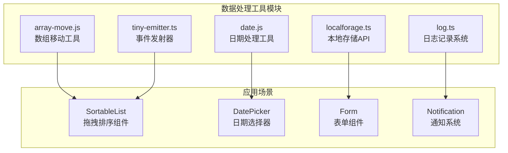

**图表来源**
- [array-move.js](file://src/util/array-move.js#L1-L17)
- [date.js](file://src/util/date.js#L1-L24)
- [localforage.ts](file://src/util/localforage.ts#L1-L53)
- [log.ts](file://src/util/log.ts#L1-L130)
- [tiny-emitter.ts](file://src/util/tiny-emitter.ts#L1-L63)

## 核心组件

### 数组移动工具 (array-move.js)

`array-move`是一个高效的数组元素移动工具，提供可变和不可变两种操作模式：

- **可变版本**：直接修改原数组，性能最优
- **不可变版本**：返回新数组，保持原始数据不变

### 日期处理工具 (date.js)

基于dayjs的增强包装器，集成了多个常用插件：
- 自定义解析格式
- 季度计算
- 高级格式化
- 本地化支持

### 本地存储API (localforage.ts)

提供基于Promise的本地存储解决方案，支持多种后端存储机制：
- IndexedDB（优先）
- WebSQL
- localStorage（降级）

### 日志记录系统 (log.ts)

分级日志记录工具，支持颜色标记和条件输出：
- 调试级别：绿色背景
- 错误级别：红色背景  
- 信息级别：紫色背景
- 警告级别：黄色背景

### 事件发射器 (tiny-emitter.ts)

轻量级事件发射器，支持事件订阅、取消和触发：
- 事件监听
- 条件移除
- 批量清理
- 结果收集

**章节来源**
- [array-move.js](file://src/util/array-move.js#L1-L17)
- [date.js](file://src/util/date.js#L1-L24)
- [localforage.ts](file://src/util/localforage.ts#L1-L53)
- [log.ts](file://src/util/log.ts#L1-L130)
- [tiny-emitter.ts](file://src/util/tiny-emitter.ts#L1-L63)

## 架构概览

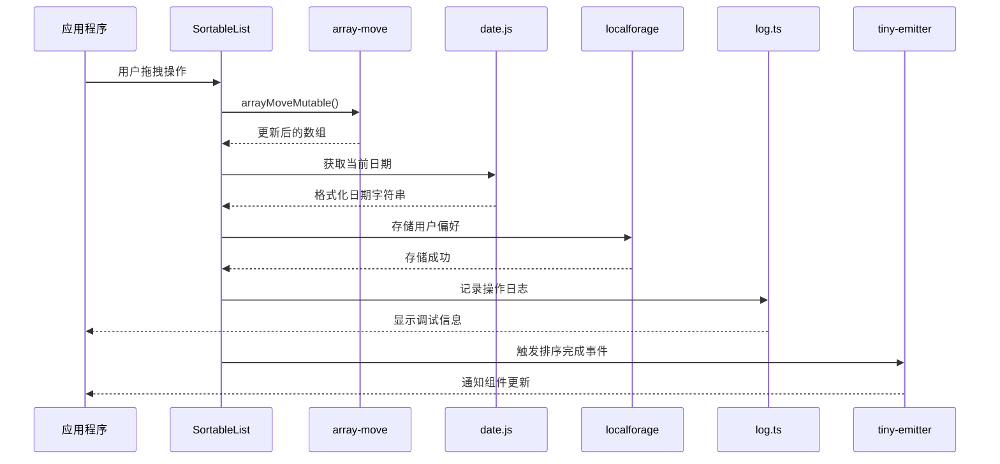

**图表来源**
- [sortable-list.tsx](file://src/sortable-list/sortable-list.tsx#L128-L194)
- [array-move.js](file://src/util/array-move.js#L1-L17)
- [date.js](file://src/util/date.js#L1-L24)
- [localforage.ts](file://src/util/localforage.ts#L1-L53)
- [log.ts](file://src/util/log.ts#L1-L130)
- [tiny-emitter.ts](file://src/util/tiny-emitter.ts#L1-L63)

## 详细组件分析

### 数组移动工具详细分析

#### 实现原理

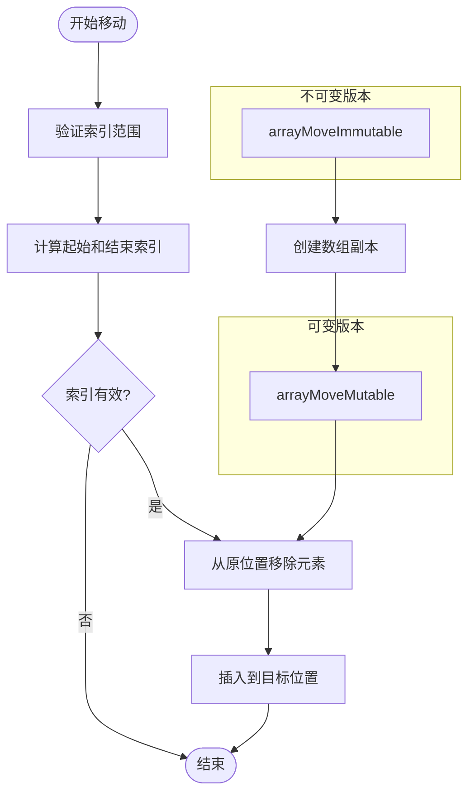

**图表来源**
- [array-move.js](file://src/util/array-move.js#L1-L17)

#### 性能特性

- **时间复杂度**：O(n)，其中n为数组长度
- **空间复杂度**：可变版本O(1)，不可变版本O(n)
- **算法优化**：使用splice方法进行原地操作

#### 使用示例

```javascript
// 可变版本 - 直接修改原数组
const arr = ['a', 'b', 'c', 'd'];
arrayMoveMutable(arr, 1, 3); // ['a', 'c', 'd', 'b']

// 不可变版本 - 返回新数组
const original = ['a', 'b', 'c', 'd'];
const moved = arrayMoveImmutable(original, 1, 3); // ['a', 'c', 'd', 'b']
```

**章节来源**
- [array-move.js](file://src/util/array-move.js#L1-L17)

### 日期处理工具详细分析

#### 插件集成架构

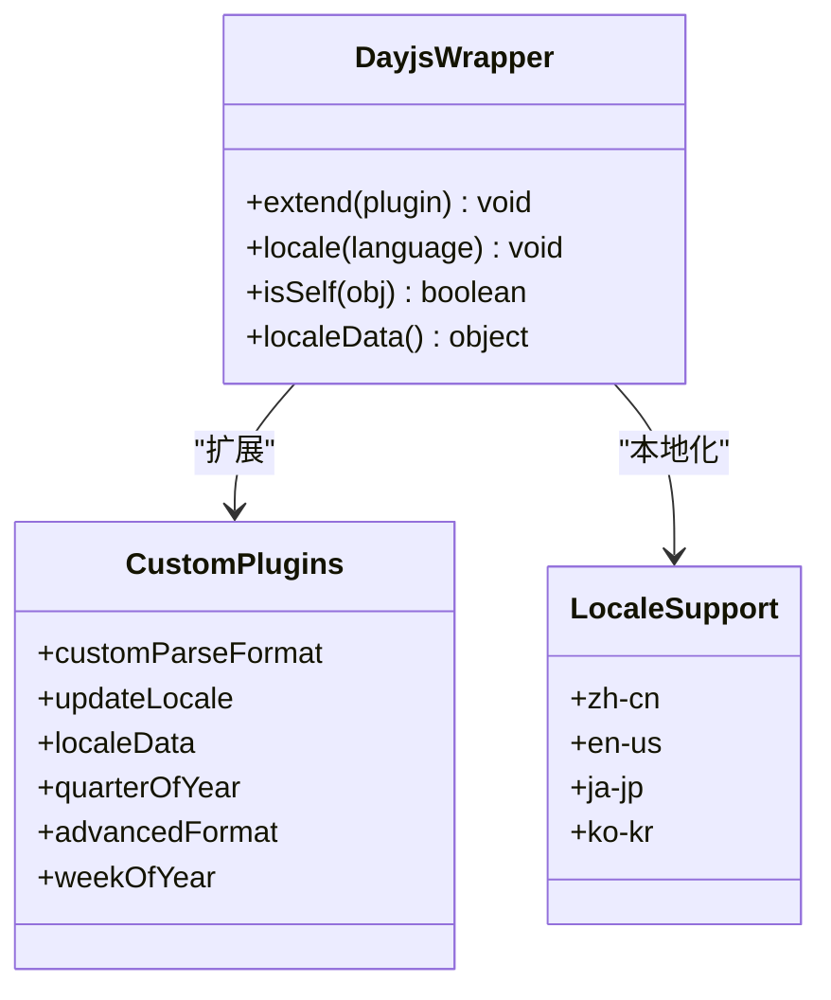

**图表来源**
- [date.js](file://src/util/date.js#L1-L24)

#### 功能特性

- **多语言支持**：内置中文、英文、日文、韩文等语言包
- **格式化扩展**：支持季度、周数等高级格式化选项
- **解析增强**：自定义日期格式解析
- **本地化配置**：动态切换语言环境

#### 在组件中的应用

```javascript
// 时间选择器中的日期验证
export function checkDayjsObj(props, propName, componentName) {
    if (props[propName] && !datejs.isSelf(props[propName])) {
        return new Error(`Invalid prop ${propName} supplied to ${componentName}. Required a dayjs object.`);
    }
}
```

**章节来源**
- [date.js](file://src/util/date.js#L1-L24)
- [time-picker/utils/index.js](file://src/time-picker/utils/index.js#L1-L34)

### 本地存储API详细分析

#### 存储机制选择流程

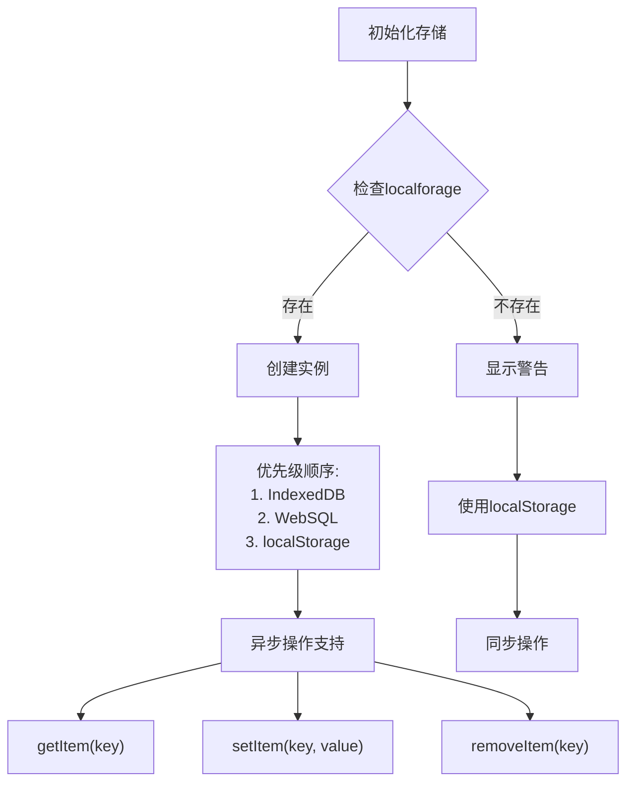

**图表来源**
- [localforage.ts](file://src/util/localforage.ts#L1-L53)

#### 类设计

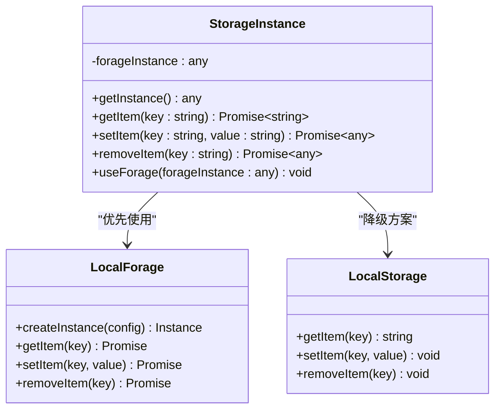

**图表来源**
- [localforage.ts](file://src/util/localforage.ts#L1-L53)

#### 使用场景

- **用户偏好存储**：保存用户的界面设置
- **临时数据缓存**：减少服务器请求
- **离线数据同步**：支持离线操作

**章节来源**
- [localforage.ts](file://src/util/localforage.ts#L1-L53)

### 日志记录系统详细分析

#### 日志级别和样式映射

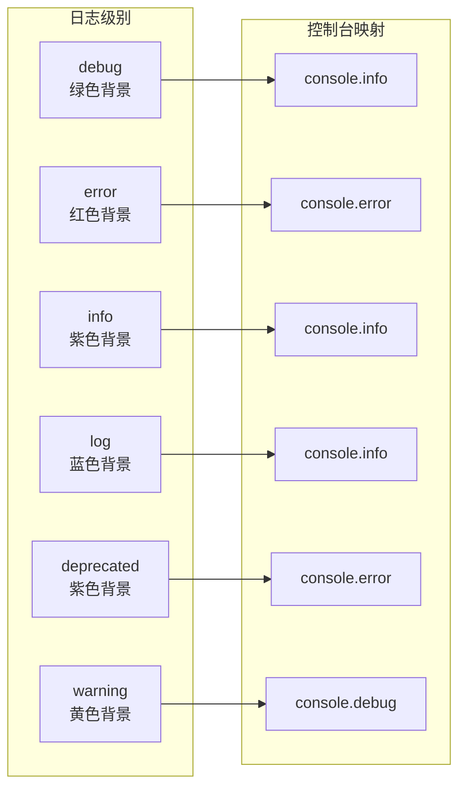

**图表来源**
- [log.ts](file://src/util/log.ts#L1-L130)

#### 条件控制机制

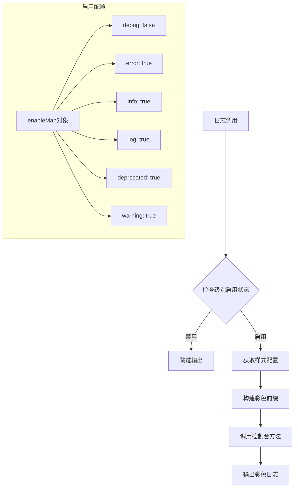

**图表来源**
- [log.ts](file://src/util/log.ts#L1-L130)

#### 生产环境优化

- **条件输出**：根据环境变量控制日志级别
- **性能影响最小化**：仅在启用时执行格式化逻辑
- **浏览器兼容性**：优雅降级到原生console方法

**章节来源**
- [log.ts](file://src/util/log.ts#L1-L130)

### 事件发射器详细分析

#### 事件管理架构

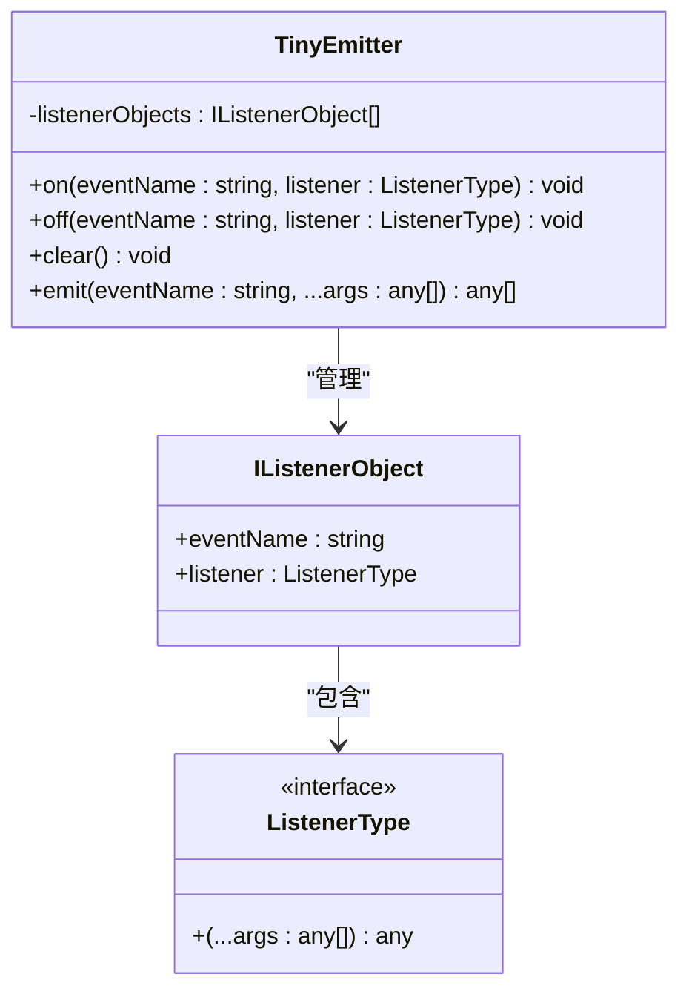

**图表来源**
- [tiny-emitter.ts](file://src/util/tiny-emitter.ts#L1-L63)

#### 事件生命周期

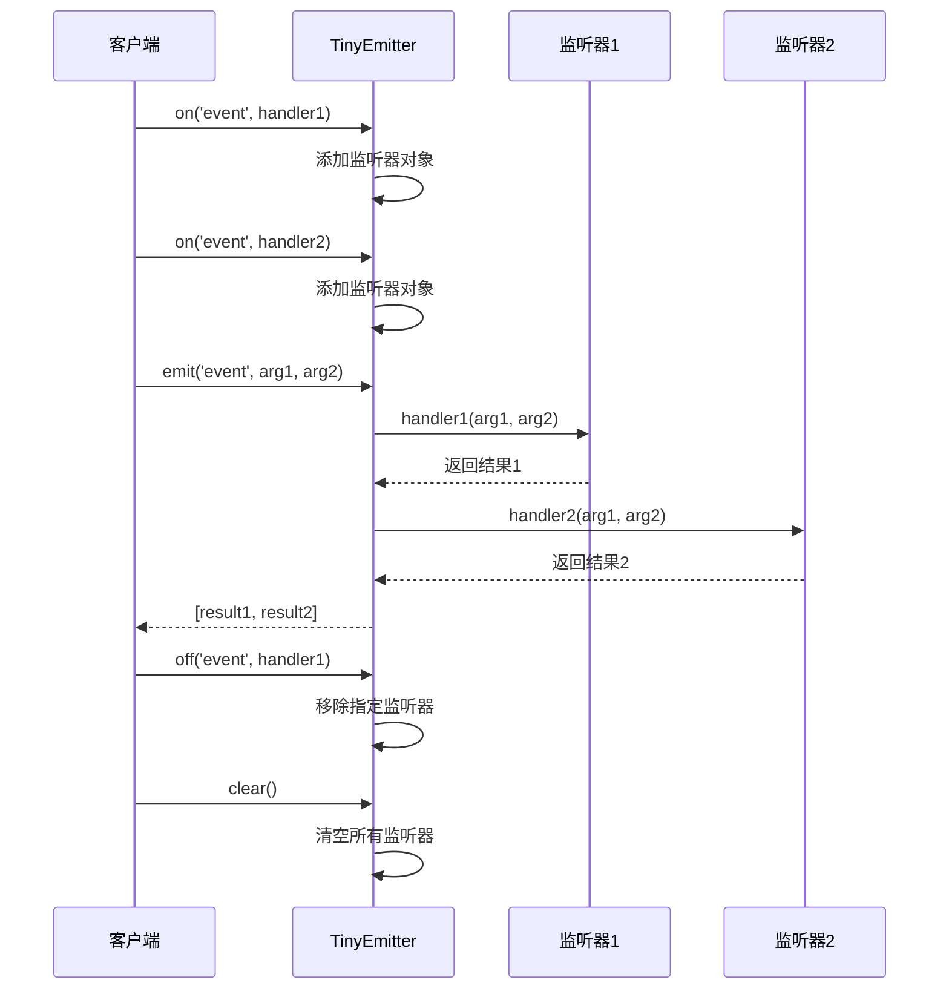

**图表来源**
- [tiny-emitter.ts](file://src/util/tiny-emitter.ts#L1-L63)

#### 性能优化特性

- **内存管理**：及时清理不需要的监听器
- **批量操作**：支持一次性移除多个监听器
- **类型安全**：完整的TypeScript类型定义

**章节来源**
- [tiny-emitter.ts](file://src/util/tiny-emitter.ts#L1-L63)

## 依赖关系分析

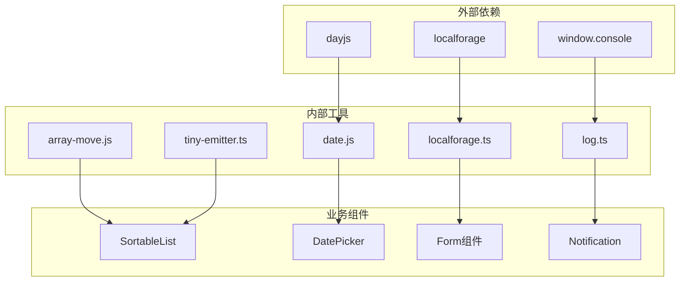

**图表来源**
- [array-move.js](file://src/util/array-move.js#L1-L17)
- [date.js](file://src/util/date.js#L1-L24)
- [localforage.ts](file://src/util/localforage.ts#L1-L53)
- [log.ts](file://src/util/log.ts#L1-L130)
- [tiny-emitter.ts](file://src/util/tiny-emitter.ts#L1-L63)

**章节来源**
- [array-move.js](file://src/util/array-move.js#L1-L17)
- [date.js](file://src/util/date.js#L1-L24)
- [localforage.ts](file://src/util/localforage.ts#L1-L53)
- [log.ts](file://src/util/log.ts#L1-L130)
- [tiny-emitter.ts](file://src/util/tiny-emitter.ts#L1-L63)

## 性能考虑

### 数组移动工具性能

- **大数据集优化**：对于大型数组，建议使用可变版本以减少内存分配
- **频繁操作**：在循环中使用时，考虑批量操作而非逐个移动

### 本地存储性能

- **异步操作**：利用Promise避免阻塞主线程
- **存储大小限制**：注意不同存储后端的容量限制
- **序列化开销**：JSON.stringify/parse的性能影响

### 日志系统性能

- **条件编译**：生产环境中可以完全移除日志代码
- **格式化延迟**：仅在启用时执行复杂的格式化逻辑
- **批量输出**：减少控制台调用次数

### 事件发射器性能

- **监听器数量**：避免创建过多监听器导致内存泄漏
- **事件频率**：高频事件应考虑节流或防抖
- **错误处理**：确保监听器异常不会影响其他监听器

## 故障排除指南

### 常见问题及解决方案

#### 数组移动工具

**问题**：负索引处理不正确
```javascript
// 错误用法
arrayMoveMutable(arr, -1, 0); // 可能导致越界

// 正确用法
const lastIndex = arr.length - 1;
arrayMoveMutable(arr, -1, 0); // 明确指定最后一个元素
```

#### 日期处理工具

**问题**：本地化设置未生效
```javascript
// 确保正确导入和初始化
import dayjs from 'dayjs';
import 'dayjs/locale/zh-cn';
dayjs.locale('zh-cn');
```

#### 本地存储API

**问题**：存储失败或降级
```javascript
// 检查存储可用性
if (typeof window.localStorage === 'undefined') {
    console.warn('localStorage不可用，可能在隐私模式下');
}
```

#### 日志系统

**问题**：日志不显示
```javascript
// 启用相应级别的日志
logger.setLogEnable({ debug: true, info: true });

// 或启用所有级别
logger.setLogEnable(true);
```

#### 事件发射器

**问题**：事件监听器无法移除
```javascript
// 确保使用相同的引用
const handler = () => console.log('event');
emitter.on('test', handler);
emitter.off('test', handler); // 必须使用相同引用
```

**章节来源**
- [array-move.js](file://src/util/array-move.js#L1-L17)
- [date.js](file://src/util/date.js#L1-L24)
- [localforage.ts](file://src/util/localforage.ts#L1-L53)
- [log.ts](file://src/util/log.ts#L1-L130)
- [tiny-emitter.ts](file://src/util/tiny-emitter.ts#L1-L63)

## 结论

Fat Design的数据处理工具集合为现代Web应用程序提供了强大而灵活的基础设施。这些工具不仅实现了各自的核心功能，还通过精心设计的架构确保了良好的可维护性和扩展性。

### 主要优势

1. **模块化设计**：每个工具独立且专注，便于单独测试和维护
2. **类型安全**：完整的TypeScript支持，提升开发体验
3. **性能优化**：针对不同使用场景提供多种实现方式
4. **兼容性强**：优雅降级和跨浏览器支持
5. **易于集成**：与现有组件无缝配合

### 最佳实践建议

- 根据具体需求选择合适的工具实现方式
- 注意性能影响，特别是在高频操作场景
- 充分利用工具提供的类型定义和错误处理
- 在生产环境中合理配置日志级别
- 定期检查和更新外部依赖版本

这些工具为开发者提供了坚实的技术基础，支持构建高质量、高性能的用户界面和交互体验。