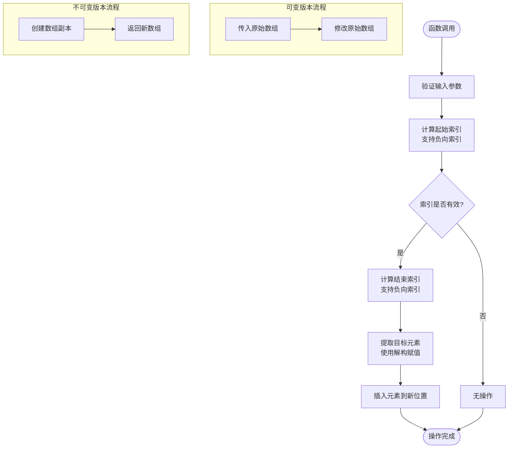
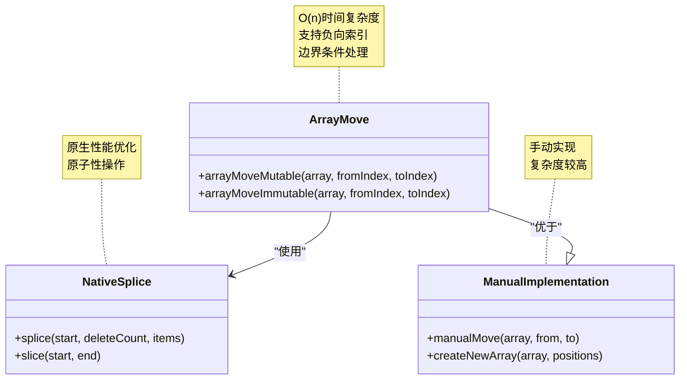
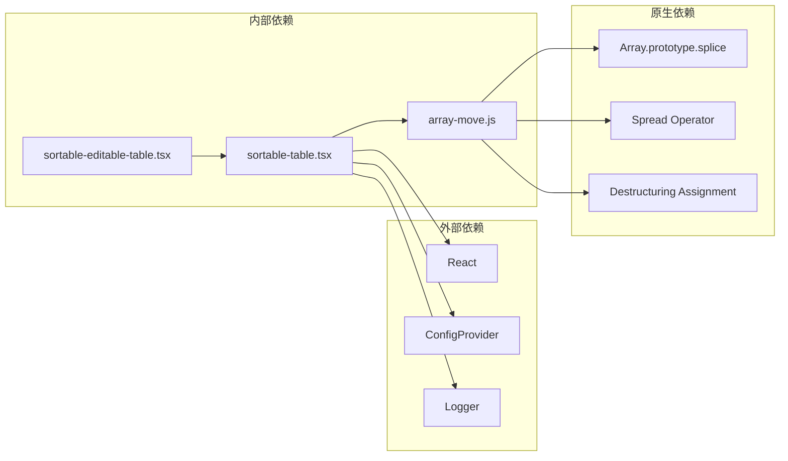

# 数组操作工具

<cite>
**本文档引用的文件**
- [array-move.js](file://src/util/array-move.js)
- [demo-sortable-table.tsx](file://demo/demo-sortable-table.tsx)
- [sortable-table.tsx](file://src/sortable-list/sortable-table.tsx)
- [sortable-editable-table.tsx](file://src/sortable-list/sortable-editable-table.tsx)
- [index.tsx](file://src/sortable-list/index.tsx)
- [package.json](file://package.json)
</cite>

## 目录
1. [简介](#简介)
2. [项目结构](#项目结构)
3. [核心组件](#核心组件)
4. [架构概览](#架构概览)
5. [详细组件分析](#详细组件分析)
6. [依赖关系分析](#依赖关系分析)
7. [性能考虑](#性能考虑)
8. [故障排除指南](#故障排除指南)
9. [结论](#结论)

## 简介

数组操作工具是Fat Design组件库中的一个重要实用程序模块，专门用于高效地在数组中移动元素位置。该工具提供了两个核心函数：`arrayMoveMutable`和`arrayMoveImmutable`，分别实现了可变和不可变的数组移动操作。这些函数支持正向和负向索引，并具备完善的边界条件处理能力。

该工具的主要应用场景包括拖拽排序、列表重排、数据重新组织等用户界面交互场景。通过巧妙地利用JavaScript原生的`splice`方法，该工具实现了O(n)的时间复杂度性能特征，确保在各种规模的数据集上都能保持良好的响应速度。

## 项目结构

数组操作工具位于`src/util/`目录下，作为通用工具函数模块的一部分。该项目采用现代化的React组件库架构，支持TypeScript类型检查和ES模块导入。

```mermaid
graph TB
subgraph "项目根目录"
Root[]
end
subgraph "源代码目录"
Src[src/]
Util[util/]
ArrayMove[array-move.js]
end
subgraph "演示目录"
Demo[demo/]
SortableDemo[demo-sortable-table.tsx]
end
subgraph "排序列表组件"
SortableList[sortable-list/]
SortableTable[sortable-table.tsx]
SortableEditable[sortable-editable-table.tsx]
end
Root --> Src
Root --> Demo
Src --> Util
Util --> ArrayMove
Demo --> SortableDemo
SortableList --> SortableTable
SortableList --> SortableEditable
SortableTable --> ArrayMove
```

**图表来源**
- [array-move.js](file://src/util/array-move.js#L1-L17)
- [sortable-table.tsx](file://src/sortable-list/sortable-table.tsx#L1-L20)

**章节来源**
- [array-move.js](file://src/util/array-move.js#L1-L17)
- [package.json](file://package.json#L1-L54)

## 核心组件

### arrayMoveMutable 函数

`arrayMoveMutable`是一个可变版本的数组移动函数，直接修改传入的数组对象。该函数的核心逻辑基于JavaScript的`splice`方法，实现了高效的元素移动操作。

```javascript
export function arrayMoveMutable(array, fromIndex, toIndex) {
    const startIndex = fromIndex < 0 ? array.length + fromIndex : fromIndex;

    if (startIndex >= 0 && startIndex < array.length) {
        const endIndex = toIndex < 0 ? array.length + toIndex : toIndex;

        const [item] = array.splice(fromIndex, 1);
        array.splice(endIndex, 0, item);
    }
}
```

### arrayMoveImmutable 函数

`arrayMoveImmutable`是一个不可变版本的数组移动函数，通过创建数组副本的方式避免直接修改原始数据。这种设计模式特别适用于React应用程序的状态管理。

```javascript
export function arrayMoveImmutable(array, fromIndex, toIndex) {
    array = [...array];
    arrayMoveMutable(array, fromIndex, toIndex);
    return array;
}
```

**章节来源**
- [array-move.js](file://src/util/array-move.js#L1-L17)

## 架构概览

数组操作工具采用了简洁而高效的函数式编程架构。两个主要函数共享相同的底层逻辑，但提供了不同的数据操作模式以适应不同的使用场景。



**图表来源**
- [array-move.js](file://src/util/array-move.js#L1-L17)

## 详细组件分析

### 函数签名与参数说明

#### arrayMoveMutable(array, fromIndex, toIndex)

**参数说明：**
- `array`: 要操作的目标数组，必须是有效的数组对象
- `fromIndex`: 起始元素的索引位置，支持负向索引（-1表示最后一个元素）
- `toIndex`: 目标位置的索引，同样支持负向索引

**返回值：** 无返回值（void），直接修改传入的数组对象

**异常处理策略：**
- 当`fromIndex`超出数组范围时，函数会静默忽略操作
- 支持负向索引自动转换为正向索引
- 不抛出异常，保持函数的健壮性

#### arrayMoveImmutable(array, fromIndex, toIndex)

**参数说明：**
- `array`: 要操作的目标数组
- `fromIndex`: 起始元素索引
- `toIndex`: 目标位置索引

**返回值：** 返回一个新的数组对象，包含移动后的元素排列

**异常处理策略：**
- 完全复制原始数组，避免任何副作用
- 继承`arrayMoveMutable`的所有错误处理特性

### 实际应用示例

在SortableTable组件中，`arrayMoveImmutable`被用于处理表格行的拖拽排序：

```javascript
onSortEnd={function noRefCheck(oldIndex: number, newIndex: number) {
    console.log('onSortEnd', oldIndex, newIndex)
    setItems((array) => {
        const nextArray = arrayMoveImmutable(array, oldIndex, newIndex);
        if (typeof onSortEnd === "function") {
            onSortEnd(nextArray, oldIndex, newIndex);
        }
        return nextArray;
    })
}}
```

### 性能特征分析

#### 时间复杂度分析

该工具的时间复杂度为O(n)，其中n是数组的长度。这是因为：

1. **索引计算**：O(1) - 基本的数学运算
2. **边界检查**：O(1) - 简单的条件判断
3. **元素提取**：O(k) - k为从起始索引到结束索引之间的元素数量
4. **元素插入**：O(m) - m为从结束索引到数组末尾的元素数量

总体而言，在最坏情况下需要遍历整个数组，因此时间复杂度为O(n)。

#### 空间复杂度分析

- 可变版本：O(1) - 直接修改原始数组，不创建额外空间
- 不可变版本：O(n) - 需要创建新的数组副本

### 与原生数组方法的对比

#### splice方法的优势

该工具充分利用了JavaScript原生的`splice`方法，具有以下优势：

1. **原子性操作**：`splice`方法保证了删除和插入操作的原子性
2. **性能优化**：原生方法经过浏览器引擎的高度优化
3. **边界处理**：内置了完善的边界条件处理逻辑

#### 与其他实现方式的比较



**图表来源**
- [array-move.js](file://src/util/array-move.js#L1-L17)

**章节来源**
- [array-move.js](file://src/util/array-move.js#L1-L17)
- [sortable-table.tsx](file://src/sortable-list/sortable-table.tsx#L200-L210)

## 依赖关系分析

数组操作工具的依赖关系相对简单，主要依赖于JavaScript原生的数组方法和基本语法特性。



**图表来源**
- [array-move.js](file://src/util/array-move.js#L1-L17)
- [sortable-table.tsx](file://src/sortable-list/sortable-table.tsx#L1-L15)

**章节来源**
- [array-move.js](file://src/util/array-move.js#L1-L17)
- [sortable-table.tsx](file://src/sortable-list/sortable-table.tsx#L1-L15)

## 性能考虑

### React状态更新中的不可变性优势

在React应用程序中，使用`arrayMoveImmutable`函数可以确保状态更新的不可变性，这对于React的虚拟DOM比较和性能优化至关重要。

### 性能优化建议

1. **批量操作**：当需要连续进行多个数组移动操作时，建议先收集所有变更，然后一次性应用
2. **缓存结果**：对于频繁访问的数组，可以考虑缓存移动后的结果
3. **避免不必要的复制**：仅在确实需要保留原始数据时才使用不可变版本

### 内存使用优化

- 对于小型数组（少于100个元素），可变版本的内存开销可以忽略不计
- 对于大型数组，不可变版本虽然创建了新的数组副本，但提供了更好的数据安全性

## 故障排除指南

### 常见使用误区

#### 1. 忽略边界检查

```javascript
// 错误示例：未检查索引有效性
const arr = [1, 2, 3];
arrayMoveMutable(arr, 10, 0); // 操作无效，不会抛出异常

// 正确做法：添加边界检查
if (fromIndex >= 0 && fromIndex < array.length) {
    arrayMoveMutable(array, fromIndex, toIndex);
}
```

#### 2. 混淆可变与不可变版本

```javascript
// 错误示例：期望返回新数组
const newArray = arrayMoveMutable(originalArray, 0, 2);
console.log(newArray === originalArray); // true

// 正确做法：使用不可变版本
const newArray = arrayMoveImmutable(originalArray, 0, 2);
console.log(newArray === originalArray); // false
```

#### 3. 负向索引理解错误

```javascript
// 错误理解：认为-1指向第一个元素
const arr = [1, 2, 3];
arrayMoveMutable(arr, -1, 0); // 将最后一个元素移到开头

// 正确理解：-1始终指向最后一个元素
console.log(arr); // [3, 1, 2]
```

### 调试技巧

1. **日志记录**：在关键位置添加console.log语句
2. **断点调试**：使用浏览器开发者工具设置断点
3. **单元测试**：编写针对不同场景的测试用例

**章节来源**
- [array-move.js](file://src/util/array-move.js#L1-L17)

## 结论

数组操作工具是Fat Design组件库中一个设计精良的实用程序模块。它通过简洁的API设计和高效的算法实现，为开发者提供了可靠的数组元素移动功能。

### 主要优势

1. **高性能**：O(n)的时间复杂度确保了良好的性能表现
2. **易用性**：直观的函数签名和参数设计降低了学习成本
3. **可靠性**：完善的边界条件处理和错误处理策略
4. **灵活性**：同时提供可变和不可变两种操作模式

### 应用场景

- 表格拖拽排序
- 列表重新排列
- 数据可视化组件
- 用户界面交互控件

### 发展方向

随着React生态系统的不断发展，该工具可以进一步扩展功能，例如：
- 添加批量移动操作的支持
- 提供更丰富的配置选项
- 增强对特殊数据类型的兼容性

该工具的设计充分体现了现代JavaScript开发的最佳实践，为构建高质量的用户界面组件奠定了坚实的基础。