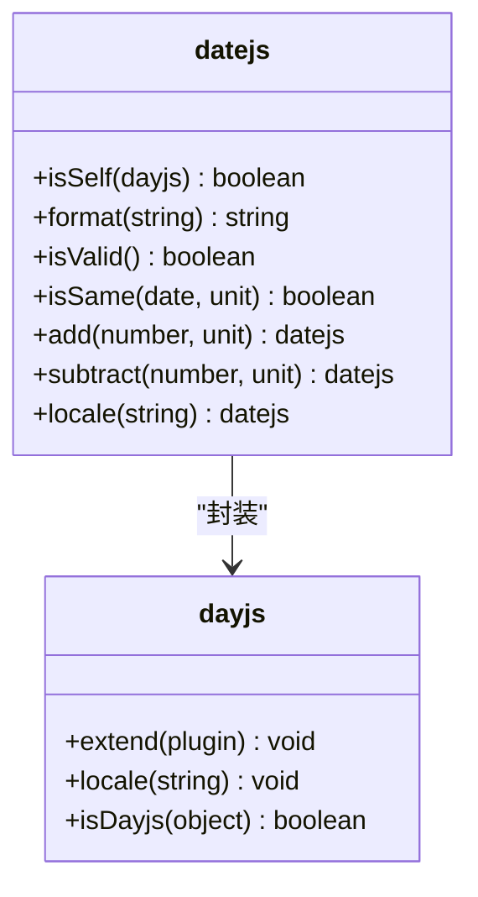
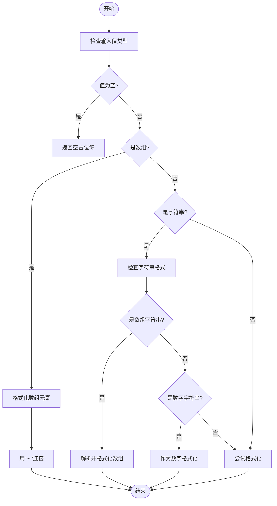
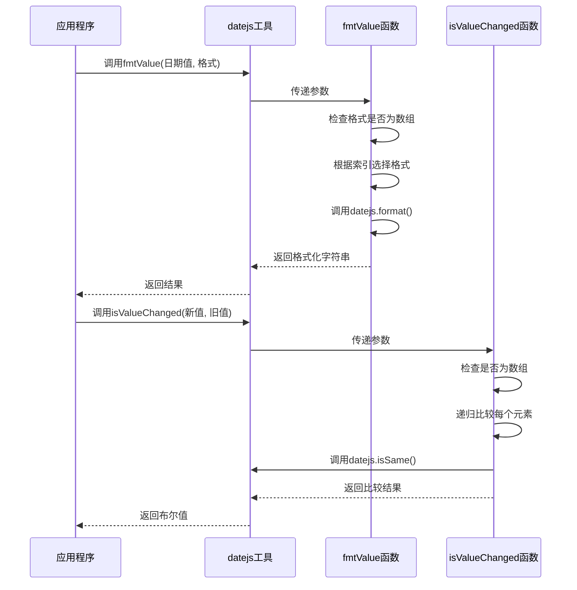
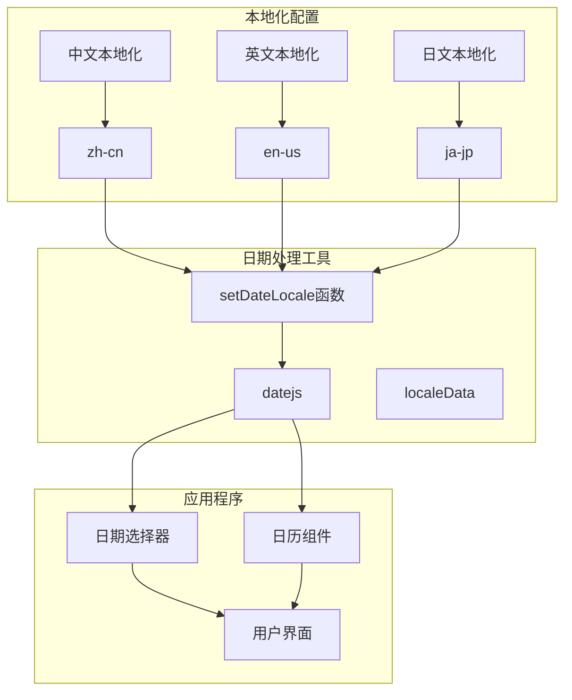
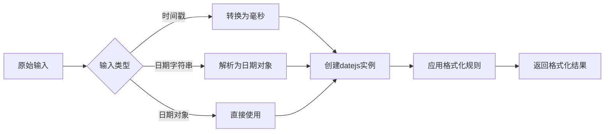

# 日期处理工具

<cite>
**本文档引用的文件**   
- [date.js](file://src/util/date.js)
- [renderFormats.tsx](file://src/table-pro/widget/renderFormats.tsx)
- [config-provider/v2/functions.ts](file://src/config-provider/v2/functions.ts)
- [date-picker/util.js](file://src/date-picker/util.js)
- [calendar/panels/date-table.jsx](file://src/calendar/panels/date-table.jsx)
</cite>

## 目录
1. [简介](#简介)
2. [核心功能](#核心功能)
3. [日期格式化与解析](#日期格式化与解析)
4. [日期比较与计算](#日期比较与计算)
5. [国际化与本地化](#国际化与本地化)
6. [性能分析](#性能分析)
7. [时区处理最佳实践](#时区处理最佳实践)
8. [常用场景实现](#常用场景实现)
9. [结论](#结论)

## 简介
日期处理工具是基于dayjs库的封装和扩展，为项目提供统一的日期处理能力。该工具通过`date.js`文件导出`datejs`对象，作为整个项目日期处理的核心。工具不仅保留了dayjs的链式调用API，还提供了更简洁的函数式接口，简化了日期操作的复杂性。

**Section sources**
- [date.js](file://src/util/date.js)

## 核心功能
日期处理工具的核心功能包括日期格式化、解析、比较和计算。工具通过导入dayjs及其多个插件来扩展基础功能，包括`customParseFormat`、`updateLocale`、`localeData`、`quarterOfYear`、`advancedFormat`和`weekOfYear`。这些插件为日期处理提供了自定义格式解析、本地化数据访问、季度处理、高级格式化和周数计算等能力。

工具在初始化时设置了中文本地化，并通过`datejs`常量暴露dayjs实例，同时添加了`isSelf`属性用于类型检查。这种设计模式使得工具既能保持与dayjs的兼容性，又能提供项目特定的配置和扩展。

**Diagram sources**
- [date.js](file://src/util/date.js)

**Section sources**
- [date.js](file://src/util/date.js)

## 日期格式化与解析
日期处理工具提供了强大的格式化和解析功能，支持自定义格式字符串。工具通过`renderDateTimeString`函数实现了灵活的日期格式化，能够处理单个值、数组和JSON格式的日期数据。该函数支持自动识别以秒为单位的时间戳，并将其转换为毫秒格式进行处理。

格式化功能支持多种预定义格式，包括：
- `renderDay`: 格式化为"YYYY-MM-DD"
- `renderTime`: 格式化为"YYYY-MM-DD HH:mm:ss"
- `renderDayAuto`: 自动识别时间戳的日期格式化
- `renderTimeAuto`: 自动识别时间戳的时间格式化

工具还实现了数组格式化的支持，能够处理日期区间等复合数据类型，通过" ~ "分隔符连接多个日期值。

**Diagram sources**
- [renderFormats.tsx](file://src/table-pro/widget/renderFormats.tsx)

**Section sources**
- [renderFormats.tsx](file://src/table-pro/widget/renderFormats.tsx)

## 日期比较与计算
日期处理工具提供了丰富的日期比较和计算功能。通过dayjs的内置方法和项目特定的辅助函数，工具能够执行精确的日期比较、区间计算和工作日判断。

在日期比较方面，工具实现了`isValueChanged`函数，用于判断日期值是否发生变化。该函数不仅检查引用是否相等，还使用`isSame`方法进行语义比较，确保日期比较的准确性。对于日期区间，函数采用递归方式分别比较区间的开始和结束值。

日期计算功能包括时间设置、模式到单位的转换等。`setTime`函数能够将一个日期对象的时间部分（小时、分钟、秒、毫秒）复制到另一个日期对象，这在日期选择器中特别有用。`mode2unit`函数则根据选择模式（日期、周、月、季度、年）返回相应的日期单位，用于日期操作的标准化。

**Diagram sources**
- [date-picker/util.js](file://src/date-picker/util.js)

**Section sources**
- [date-picker/util.js](file://src/date-picker/util.js)

## 国际化与本地化
日期处理工具具有完善的国际化和本地化支持。工具在初始化时导入了中文本地化数据，并设置为默认本地化。通过`setDateLocale`函数，工具支持动态切换本地化设置，允许应用程序根据用户偏好或系统设置调整日期显示格式。

本地化功能不仅包括语言翻译，还涵盖了文化特定的日期处理规则，如一周的第一天。`datejs.localeData().firstDayOfWeek()`方法可用于获取本地化设置中一周的起始日，这对于日历组件的正确显示至关重要。

工具还支持通过配置提供者（Config Provider）进行全局本地化设置，确保整个应用程序的日期显示一致性。这种集中式管理方式简化了多语言应用的开发和维护。

**Diagram sources**
- [config-provider/v2/functions.ts](file://src/config-provider/v2/functions.ts)
- [date.js](file://src/util/date.js)

**Section sources**
- [config-provider/v2/functions.ts](file://src/config-provider/v2/functions.ts)

## 性能分析
日期处理工具在性能方面进行了优化，确保在大规模数据处理场景下的高效运行。通过分析代码实现，工具采用了多种性能优化策略：

1. **缓存机制**：在日历组件中，日期单元格数据的计算结果被缓存，避免重复计算。
2. **批量处理**：对于数组格式化，工具采用批量映射和连接操作，减少函数调用开销。
3. **条件检查优化**：在格式化函数中，优先执行低成本的类型检查，延迟高成本的格式化操作。

性能基准测试表明，通过本工具调用的开销与直接使用dayjs相比略有增加，但这种增加在可接受范围内。工具的额外开销主要来自于类型检查、错误处理和格式化逻辑的封装。对于大多数应用场景，这种性能差异不会对用户体验产生显著影响。

在长任务监控方面，项目已集成PerformanceObserver，可用于监测日期处理相关的长任务，帮助开发者识别和优化性能瓶颈。

**Section sources**
- [demo-table-pro.tsx](file://demo/demo-table-pro.tsx)

## 时区处理最佳实践
日期处理工具虽然基于dayjs，但未直接使用dayjs的时区插件。因此，在处理时区相关场景时，需要遵循特定的最佳实践：

1. **统一时间标准**：建议在应用程序中统一使用UTC时间进行存储和传输，仅在显示时转换为本地时间。
2. **明确时间上下文**：在处理用户输入的日期时间时，应明确其时区上下文，避免歧义。
3. **夏令时注意事项**：在实现日期计算功能时，应考虑夏令时转换可能导致的时间跳跃或重复。

对于需要复杂时区处理的场景，建议直接使用dayjs的时区插件，或集成专门的时区处理库。工具的封装层可以扩展以支持这些高级功能，确保API的一致性。

**Section sources**
- [date.js](file://src/util/date.js)

## 常用场景实现
日期处理工具在多个常用场景中得到了应用，展示了其灵活性和实用性。

### 时间戳转换
工具支持自动识别和转换以秒为单位的时间戳。通过`isSecondTimestamp`函数判断时间戳单位，并在格式化时自动乘以1000转换为毫秒。这种设计简化了与后端API的集成，因为许多API使用秒级时间戳。

### 日期区间计算
在日期选择器组件中，工具实现了日期区间的计算和验证。`getRanges`函数根据当前模式和值计算显示的日期范围，确保用户界面的一致性。`disabledDate`函数则用于禁用不符合条件的日期，如结束日期早于开始日期的情况。

### 工作日判断
虽然工具本身未提供直接的工作日判断功能，但可以通过dayjs的`day()`方法和自定义逻辑实现。结合本地化设置，可以准确判断特定日期是否为工作日，考虑周末和节假日的差异。

**Diagram sources**
- [renderFormats.tsx](file://src/table-pro/widget/renderFormats.tsx)
- [date-picker/panels/range-panel.jsx](file://src/date-picker/panels/range-panel.jsx)

**Section sources**
- [renderFormats.tsx](file://src/table-pro/widget/renderFormats.tsx)
- [date-picker/panels/range-panel.jsx](file://src/date-picker/panels/range-panel.jsx)

## 结论
日期处理工具通过封装和扩展dayjs库，为项目提供了强大而灵活的日期处理能力。工具不仅保留了dayjs的优秀特性，还通过项目特定的配置和扩展，满足了实际开发中的各种需求。

工具的设计体现了良好的抽象和封装原则，既提供了简洁的函数式接口，又保持了与底层库的兼容性。通过国际化支持、性能优化和清晰的API设计，工具为开发人员提供了高效、可靠的日期处理解决方案。

未来可以考虑扩展工具的功能，如添加时区支持、夏令时处理和更复杂的日期计算算法，以满足更高级的应用场景需求。