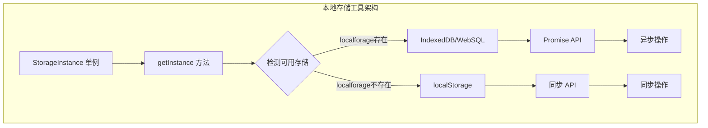
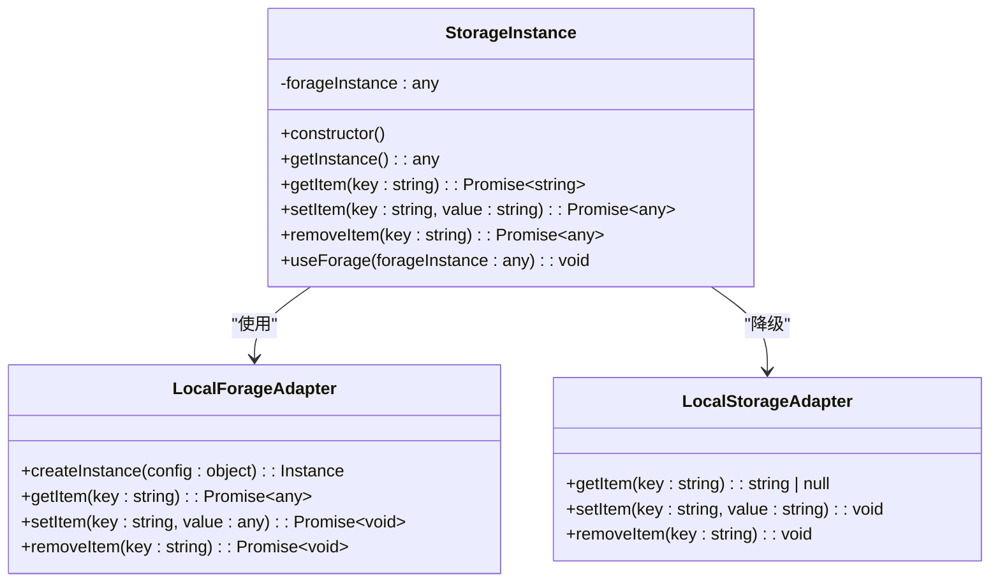
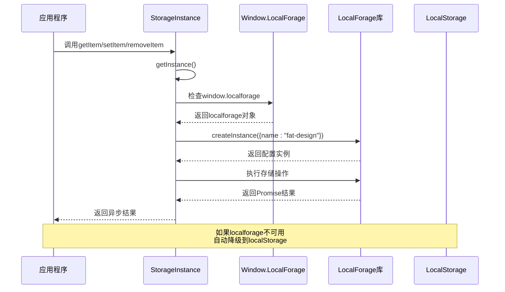
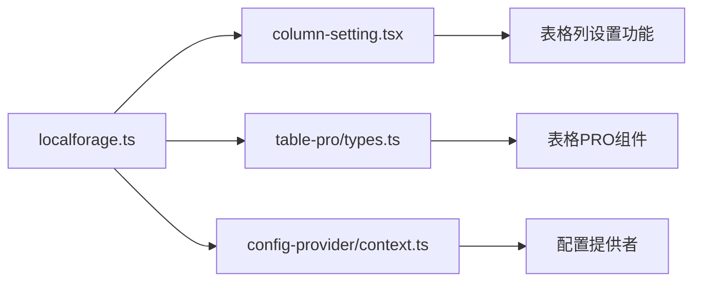

# 本地存储工具

<cite>
**本文档中引用的文件**
- [localforage.ts](file://src/util/localforage.ts)
- [localforage.d.ts](file://types/0buildTypes/util/localforage.d.ts)
- [column-setting.tsx](file://src/table-pro/widget/column-setting.tsx)
- [package-lock.json](file://package-lock.json)
- [env.ts](file://src/util/env.ts)
- [isEqual.ts](file://src/image/utils/isEqual.ts)
- [util.js](file://src/validate/util.js)
</cite>

## 目录
1. [简介](#简介)
2. [项目结构](#项目结构)
3. [核心组件](#核心组件)
4. [架构概览](#架构概览)
5. [详细组件分析](#详细组件分析)
6. [依赖关系分析](#依赖关系分析)
7. [性能考虑](#性能考虑)
8. [故障排除指南](#故障排除指南)
9. [结论](#结论)

## 简介

本地存储工具是一个基于localForage库的增强型本地存储解决方案，为Fat Design组件库提供了统一的本地存储抽象层。该工具支持多种存储后端（IndexedDB、WebSQL和localStorage），并提供了基于Promise的异步API设计，确保在现代浏览器环境中提供最佳的存储体验。

该工具的核心设计理念是提供一个统一的接口，隐藏底层存储技术的差异，同时保持高性能和良好的用户体验。它特别适用于需要持久化用户偏好设置、离线数据缓存和会话状态持久化的场景。

## 项目结构

本地存储工具位于`src/util/localforage.ts`文件中，采用单例模式设计，确保在整个应用程序中只有一个存储实例。该工具的设计遵循以下原则：



**图表来源**
- [localforage.ts](file://src/util/localforage.ts#L1-L53)

**章节来源**
- [localforage.ts](file://src/util/localforage.ts#L1-L53)

## 核心组件

### StorageInstance 类

StorageInstance类是整个本地存储工具的核心，它封装了对不同存储后端的访问，并提供了统一的API接口。

```typescript
class StorageInstance {
    private forageInstance: any = null;
    
    constructor() {
        this.forageInstance = null;
    }
    
    getInstance(): any {
        // 实现存储后端检测和初始化逻辑
    }
    
    async getItem(key: string): Promise<string | null> {
        return this.getInstance().getItem(key)
    }
    
    async setItem(key: string, value: string): Promise<any> {
        return this.getInstance().setItem(key, value)
    }
    
    async removeItem(key: string): Promise<any> {
        return this.getInstance().removeItem(key)
    }
    
    useForage(forageInstance: any): void {
        this.forageInstance = forageInstance;
    }
}
```

### 存储后端降级策略

该工具实现了智能的存储后端降级策略：

1. **优先级1：localforage实例** - 如果全局window.localforage可用，则使用localforage库
2. **优先级2：自定义forage实例** - 支持外部传入的localforage实例
3. **优先级3：localStorage** - 作为最后的备选方案

**章节来源**
- [localforage.ts](file://src/util/localforage.ts#L1-L53)

## 架构概览

本地存储工具采用了适配器模式，将不同的存储后端抽象为统一的接口：



**图表来源**
- [localforage.ts](file://src/util/localforage.ts#L6-L52)
- [localforage.d.ts](file://types/0buildTypes/util/localforage.d.ts#L1-L11)

## 详细组件分析

### 存储实例初始化流程



**图表来源**
- [localforage.ts](file://src/util/localforage.ts#L12-L28)

### 序列化机制和复杂对象处理

虽然当前实现主要处理字符串值，但该工具为未来的复杂对象存储做好了准备。通过TypeScript类型定义可以看出，工具设计支持Promise-based的异步操作：

```typescript
// 当前实现支持字符串序列化
async getItem(key: string): Promise<string | null> {
    return this.getInstance().getItem(key)
}

async setItem(key: string, value: string) {
    return this.getInstance().setItem(key, value)
}
```

对于复杂JavaScript对象的处理，可以参考项目中的其他序列化工具：

```typescript
// 参考项目中的循环引用检测机制
export default function isEqual(obj1: any, obj2: any, shallow = false): boolean {
    const refSet = new Set<any>();
    function deepEqual(a: any, b: any, level = 1): boolean {
        const circular = refSet.has(a);
        if (circular) {
            return false;
        }
        // ... 深度比较逻辑
    }
}
```

**章节来源**
- [localforage.ts](file://src/util/localforage.ts#L29-L42)
- [isEqual.ts](file://src/image/utils/isEqual.ts#L1-L47)

### 实际应用场景

#### 用户偏好设置持久化

在表格列设置功能中，该工具被用于持久化用户的列配置：

```typescript
// 列设置持久化示例
const LOCAL_FORAGE_KEY = getLocaleForageKey(settingName);
const setting = (await storageInstance.getItem(LOCAL_FORAGE_KEY)) as string;
const settingArray = parseJsonObject(setting);
const editingColumns = toEditingColumns(tableProps.columns || [], settingArray);

// 保存设置
await storageInstance.setItem(LOCAL_FORAGE_KEY, JSON.stringify(editingColumns));

// 移除设置
await storageInstance.removeItem(LOCAL_FORAGE_KEY);
```

#### 离线数据缓存

该工具可以用于缓存API响应数据，减少网络请求：

```typescript
// 离线缓存示例
async function getCachedData(key: string): Promise<any> {
    const cached = await storageInstance.getItem(`cache_${key}`);
    return cached ? JSON.parse(cached) : null;
}

async function setCachedData(key: string, data: any, ttl: number = 3600000): Promise<void> {
    const cacheEntry = {
        data,
        timestamp: Date.now(),
        ttl
    };
    await storageInstance.setItem(`cache_${key}`, JSON.stringify(cacheEntry));
}
```

**章节来源**
- [column-setting.tsx](file://src/table-pro/widget/column-setting.tsx#L187-L224)

## 依赖关系分析

### 外部依赖

该工具的主要外部依赖是localforage库：

```json
{
  "localforage": {
    "version": "1.10.0",
    "resolved": "https://registry.npmjs.org/localforage/-/localforage-1.10.0.tgz",
    "requires": {
      "lie": "3.1.1"
    }
  }
}
```

### 内部依赖

该工具与项目中的其他组件有以下依赖关系：



**图表来源**
- [package-lock.json](file://package-lock.json#L850-L855)

**章节来源**
- [package-lock.json](file://package-lock.json#L850-L855)

## 性能考虑

### 存储配额管理

不同存储后端有不同的配额限制：

- **localStorage**: 通常为5MB（各浏览器可能不同）
- **IndexedDB**: 通常为50MB-1GB（受浏览器限制）
- **WebSQL**: 已废弃，不推荐使用

### 性能优化技巧

1. **批量操作**: 对于多个存储操作，考虑使用事务或批量处理
2. **数据压缩**: 对大型数据进行压缩后再存储
3. **过期机制**: 实现数据过期清理机制
4. **内存管理**: 及时释放不需要的存储引用

### 浏览器兼容性

该工具支持广泛的浏览器环境：

```typescript
// 兼容性检查示例
function checkStorageSupport(): boolean {
    return (
        typeof window !== 'undefined' &&
        (window.localStorage !== undefined ||
         window.localforage !== undefined)
    );
}
```

**章节来源**
- [env.ts](file://src/util/env.ts#L1-L38)

## 故障排除指南

### 常见问题和解决方案

#### 1. localforage未找到警告

**问题**: 控制台显示"建议使用localforage: storageInstance.useForage"警告

**解决方案**: 
```typescript
// 在应用启动时注入localforage实例
import localforage from 'localforage';
import { storageInstance } from './util/localforage';

storageInstance.useForage(localforage);
```

#### 2. 存储空间不足

**问题**: IndexedDB或localStorage存储失败

**解决方案**:
```typescript
// 实现存储空间检查
async function checkStorageCapacity(): Promise<number> {
    try {
        const testKey = 'test_capacity';
        const testData = 'x'.repeat(1024 * 1024); // 1MB测试数据
        
        await storageInstance.setItem(testKey, testData);
        await storageInstance.removeItem(testKey);
        
        return 1; // 表示有足够的空间
    } catch (error) {
        return 0; // 表示空间不足
    }
}
```

#### 3. 数据序列化问题

**问题**: 复杂对象无法正确序列化

**解决方案**:
```typescript
// 使用JSON.stringify的安全包装
function safeSerialize(data: any): string {
    try {
        return JSON.stringify(data);
    } catch (error) {
        console.error('序列化失败:', error);
        return '{}'; // 返回空对象作为安全替代
    }
}
```

**章节来源**
- [localforage.ts](file://src/util/localforage.ts#L23-L25)

## 结论

本地存储工具为Fat Design组件库提供了一个强大而灵活的本地存储解决方案。通过智能的存储后端降级策略和Promise-based的异步API设计，它能够在各种浏览器环境中提供一致的存储体验。

该工具的主要优势包括：

1. **多存储后端支持**: 自动选择最适合的存储方式
2. **统一API接口**: 隐藏底层存储技术的复杂性
3. **异步操作**: 基于Promise的非阻塞操作
4. **类型安全**: 完整的TypeScript类型定义
5. **易于扩展**: 支持自定义存储实例

未来的发展方向可以考虑添加以下功能：
- 数据加密选项
- 多实例隔离
- 更复杂的序列化机制
- 存储配额监控
- 批量操作支持

该工具已经成功应用于用户偏好设置、离线数据缓存和会话状态持久化等场景，为提升用户体验做出了重要贡献。