# 组件注册机制

<cite>
**本文档中引用的文件**  
- [comp.tsx](file://src/util/comp.tsx)
- [component.ts](file://src/util/component.ts)
- [index.tsx](file://src/index.tsx)
- [libs.tsx](file://src/libs.tsx)
- [provider.tsx](file://src/config-provider/v2/provider.tsx)
- [functions.ts](file://src/config-provider/v2/functions.ts)
- [deps.ts](file://src/table-pro/widget/deps.ts)
- [editable-table.jsx](file://src/editable-table/editable-table.jsx)
- [form2/deps.ts](file://src/form2/deps.ts)
</cite>

## 目录
1. [引言](#引言)
2. [组件注册机制概述](#组件注册机制概述)
3. [ComponentsStore核心设计](#componentsstore核心设计)
4. [组件注册与获取流程](#组件注册与获取流程)
5. [动态加载与运行时替换](#动态加载与运行时替换)
6. [多版本React兼容机制](#多版本react兼容机制)
7. [与ConfigProvider协同工作](#与configprovider协同工作)
8. [实际应用场景](#实际应用场景)
9. [最佳实践指南](#最佳实践指南)
10. [结论](#结论)

## 引言
Fat Design组件库通过ComponentsStore机制实现了灵活的组件注册与管理，支持全局组件注册、动态加载和运行时替换。该机制为组件扩展、主题切换和国际化提供了坚实的基础架构。

## 组件注册机制概述

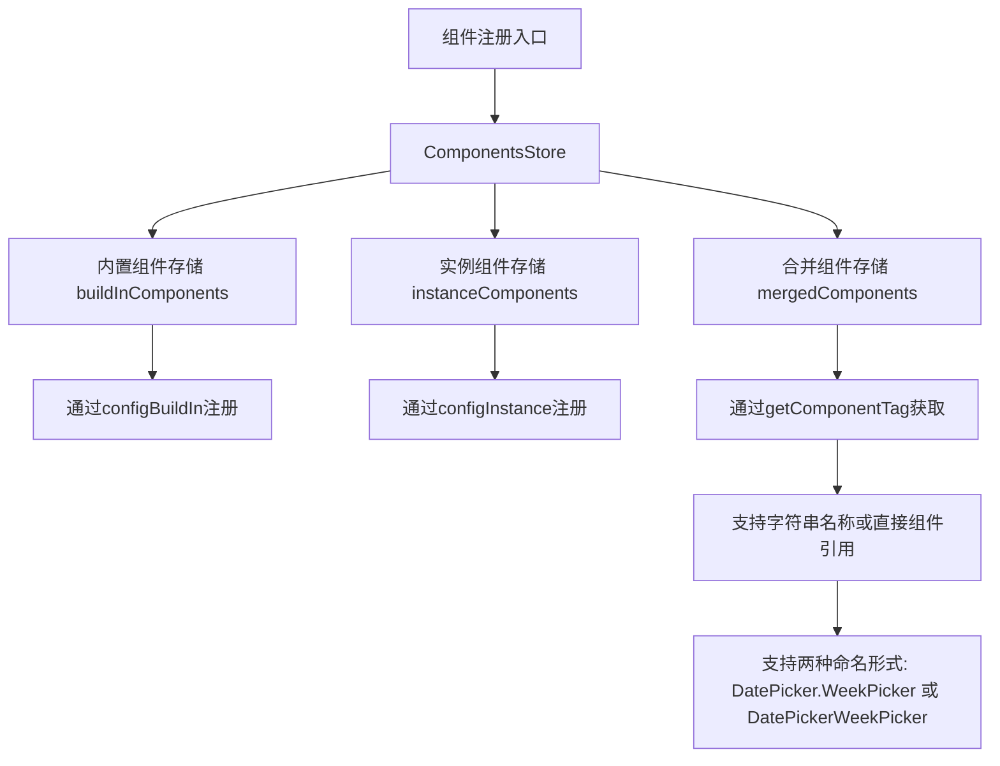

**图示来源**  
- [comp.tsx](file://src/util/comp.tsx#L0-L124)

## ComponentsStore核心设计

### 单例模式实现
ComponentsStore采用静态属性实现全局单例模式，通过`buildInComponents`静态属性存储全局内置组件，确保组件注册的全局一致性。

```mermaid
classDiagram
class ComponentsStore {
+static buildInComponents : any
-instanceComponents : any
-mergedComponents : any
+constructor(obj : ComponentsStoreProps)
+static configBuildIn(obj : ComponentsStoreProps) : void
+static getBuildIn(name : string) : any
+configInstance(obj : ComponentsStoreProps) : void
+getComponentTag(component : any) : any
}
ComponentsStore --> ComponentsStoreProps : "依赖"
ComponentsStoreProps : +components : any
```

**图示来源**  
- [comp.tsx](file://src/util/comp.tsx#L0-L124)

### 组件存储结构
ComponentsStore维护三种组件存储：
- **buildInComponents**: 静态属性，存储全局内置组件
- **instanceComponents**: 实例属性，存储运行时临时组件
- **mergedComponents**: 实例属性，存储合并后的最终组件库

**组件存储结构说明**
- `buildInComponents`通过`configBuildIn`方法注册，影响所有实例
- `instanceComponents`通过`configInstance`方法注册，仅影响当前实例
- `mergedComponents`在`doMergeComponents`中合并前两者，作为最终生效的组件库

**Section sources**
- [comp.tsx](file://src/util/comp.tsx#L49-L93)

## 组件注册与获取流程

### 注册接口
ComponentsStore提供两种注册接口：

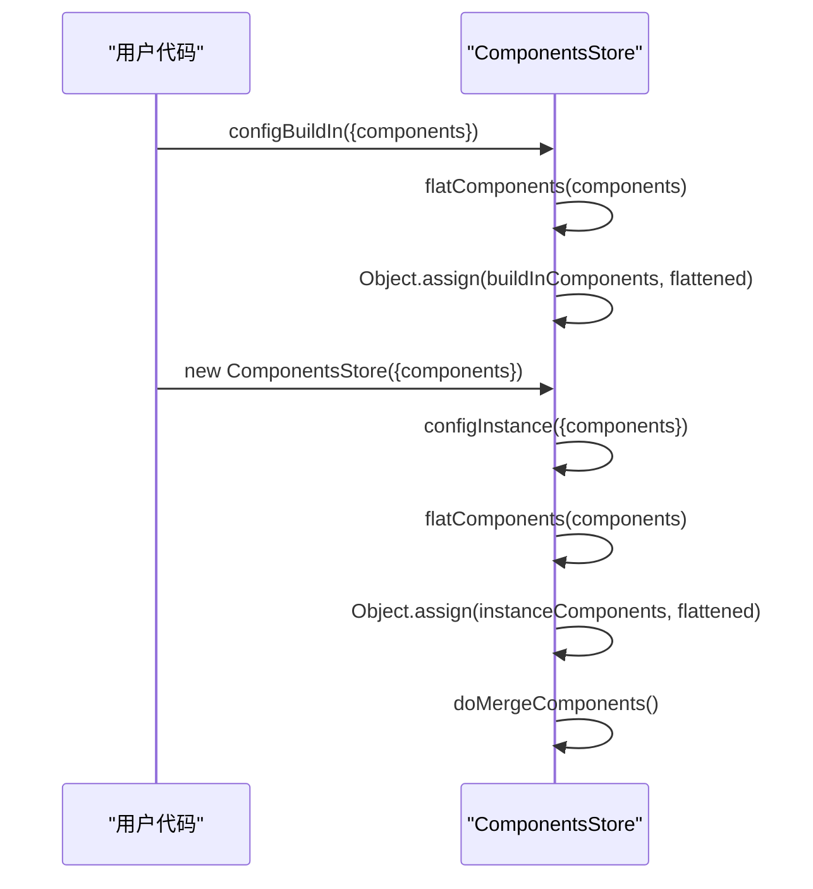

**图示来源**  
- [comp.tsx](file://src/util/comp.tsx#L49-L93)

### 获取接口
getComponentTag方法实现组件获取逻辑：

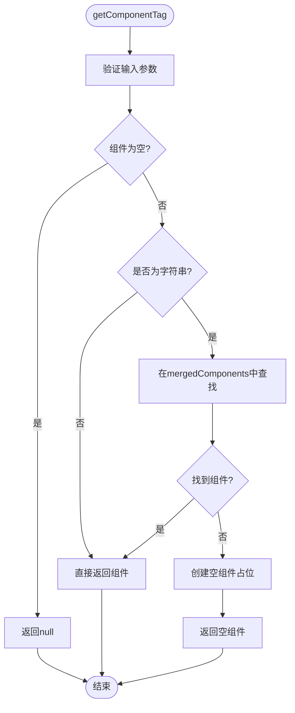

**图示来源**  
- [comp.tsx](file://src/util/comp.tsx#L88-L123)

### 组件扁平化处理
flatComponents函数实现组件名称的智能扁平化：

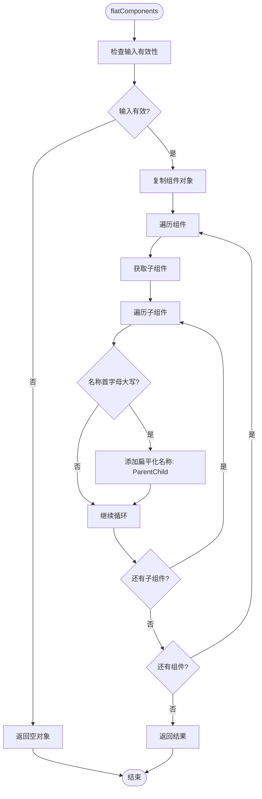

**图示来源**  
- [comp.tsx](file://src/util/comp.tsx#L0-L52)

## 动态加载与运行时替换

### 动态替换实现
ComponentsStore支持运行时组件替换，通过优先级机制实现：

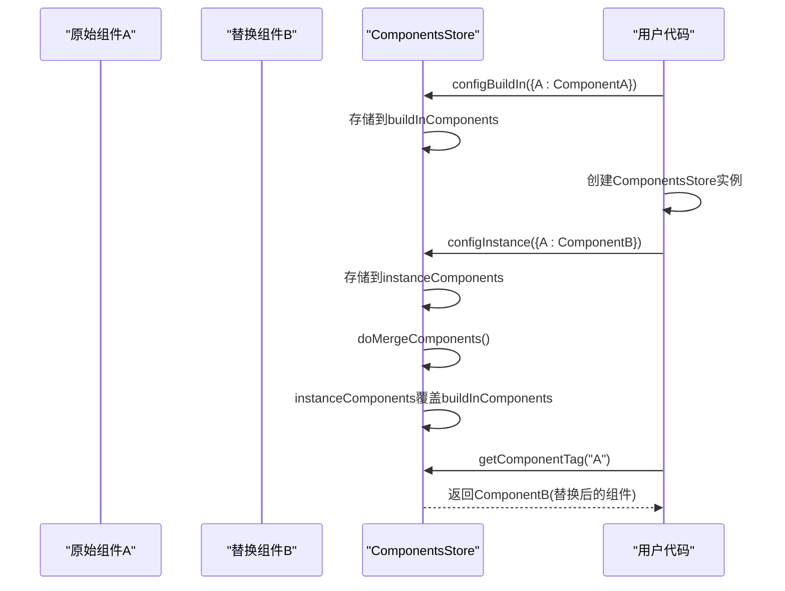

**图示来源**  
- [comp.tsx](file://src/util/comp.tsx#L49-L93)

### 实际代码示例
在EditableTable中动态使用注册组件：

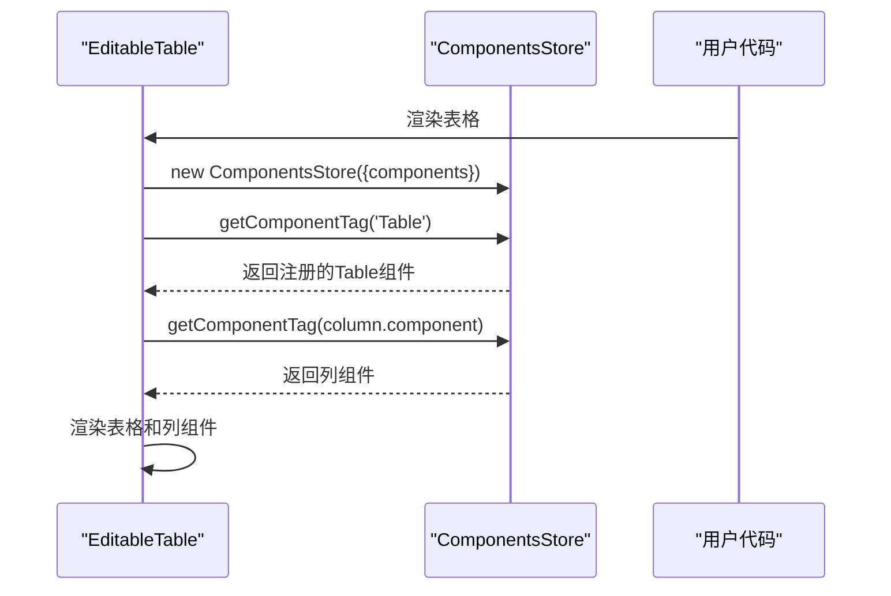

**Section sources**
- [editable-table.jsx](file://src/editable-table/editable-table.jsx#L60-L166)

## 多版本React兼容机制

### 兼容性配置
通过全局函数实现React版本兼容：

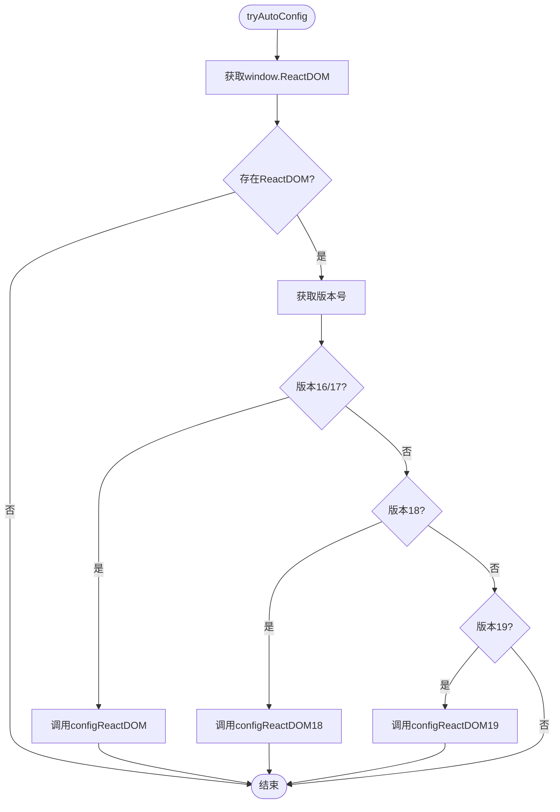

**Section sources**
- [others.ts](file://src/others.ts#L0-L56)

## 与ConfigProvider协同工作

### 协同架构
ComponentsStore与ConfigProvider共同构建配置体系：

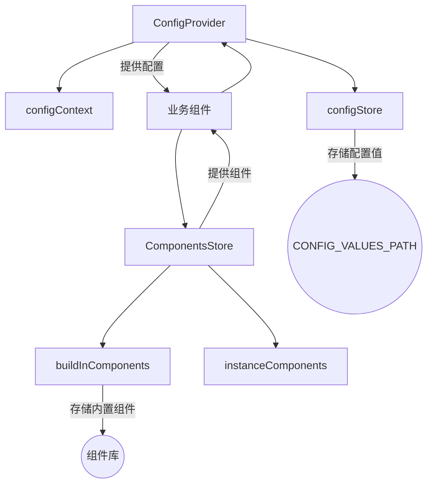

**图示来源**  
- [provider.tsx](file://src/config-provider/v2/provider.tsx#L0-L77)
- [comp.tsx](file://src/util/comp.tsx#L0-L124)

### 依赖注入机制
通过getDep函数实现依赖注入：

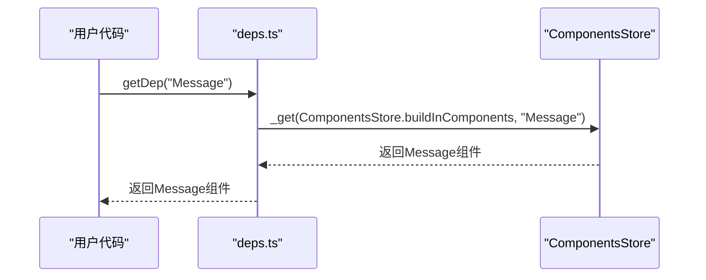

**Section sources**
- [deps.ts](file://src/table-pro/widget/deps.ts#L0-L10)
- [form2/deps.ts](file://src/form2/deps.ts#L0-L26)

## 实际应用场景

### 主题切换
通过组件替换实现主题切换：

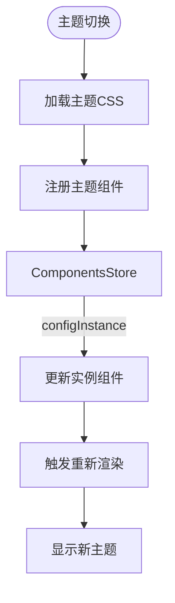

### 国际化支持
结合ConfigProvider实现国际化：

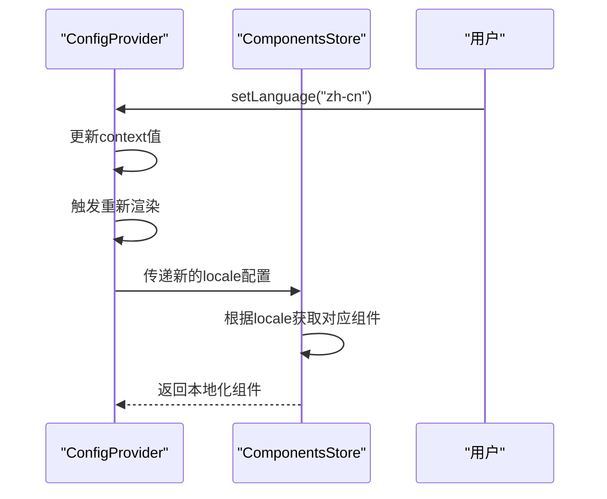

### 组件扩展
实现自定义组件扩展：

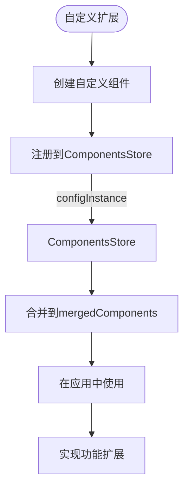

**Section sources**
- [comp.tsx](file://src/util/comp.tsx#L49-L93)
- [provider.tsx](file://src/config-provider/v2/provider.tsx#L0-L77)

## 最佳实践指南

### 组件注册最佳实践
- **全局注册**: 使用`configBuildIn`注册基础组件库
- **局部覆盖**: 使用`configInstance`实现特定场景的组件替换
- **命名规范**: 遵循PascalCase命名约定，支持点号分隔和驼峰命名两种形式

### 动态替换策略
- **优先级管理**: instanceComponents优先级高于buildInComponents
- **版本兼容**: 确保替换组件与原组件API兼容
- **性能考虑**: 避免频繁的组件替换操作

### 扩展开发建议
- **依赖注入**: 使用getDep函数获取依赖组件
- **配置协同**: 与ConfigProvider配合使用，获取全局配置
- **错误处理**: 提供空组件占位，避免运行时错误

**Section sources**
- [comp.tsx](file://src/util/comp.tsx#L0-L124)
- [component.ts](file://src/util/component.ts#L0-L8)

## 结论
ComponentsStore组件注册机制通过精心设计的存储结构和接口，实现了灵活的组件管理和扩展能力。该机制支持全局注册、动态加载和运行时替换，为Fat Design组件库的可扩展性提供了坚实基础。通过与ConfigProvider等机制的协同工作，构建了完整的配置和组件管理体系，适用于主题切换、国际化和组件扩展等多种场景。