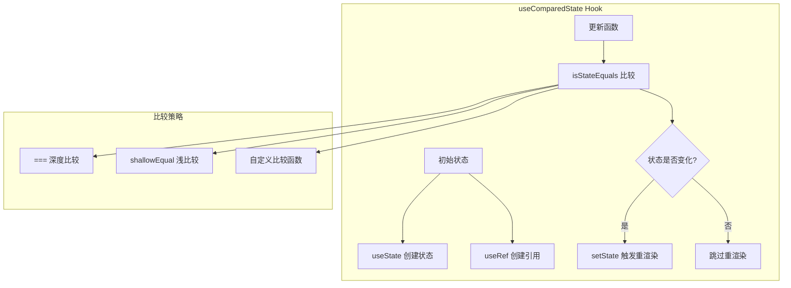
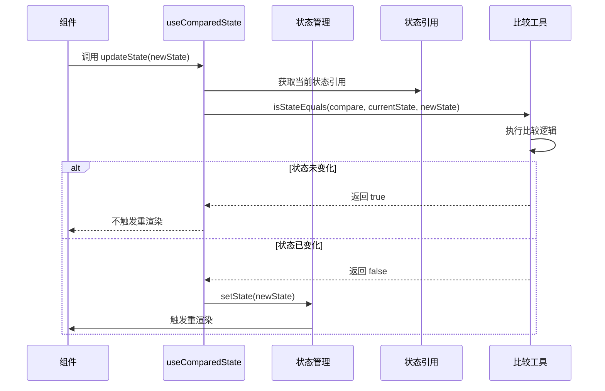
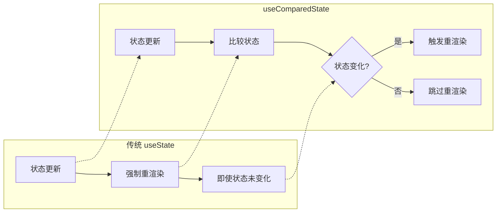

# useComparedState Hook 详细文档

<cite>
**本文档中引用的文件**
- [useComparedState.ts](file://src/hooks/useComparedState.ts)
- [isStateEquals.ts](file://src/util/isStateEquals.ts)
- [shallowEqual.ts](file://src/util/shallowEqual.ts)
- [useCurrentState.ts](file://src/hooks/useCurrentState.ts)
- [index.ts](file://src/hooks/index.ts)
</cite>

## 目录
1. [简介](#简介)
2. [核心功能](#核心功能)
3. [类型定义](#类型定义)
4. [实现原理](#实现原理)
5. [使用示例](#使用示例)
6. [性能优化](#性能优化)
7. [与其他Hook的对比](#与其他hook的对比)
8. [常见问题与解决方案](#常见问题与解决方案)
9. [最佳实践](#最佳实践)
10. [总结](#总结)

## 简介

`useComparedState` 是 Fat Design 组件库中一个高性能的状态管理 Hook，它扩展了 React 原生 `useState` 的功能。通过引入自定义比较函数，该 Hook 能够智能地判断状态是否真正发生变化，从而避免不必要的组件重新渲染，显著提升应用性能。

与传统的 `useState` 不同，`useComparedState` 在状态更新时会执行比较逻辑，只有当新状态与当前状态确实不同时，才会触发组件重新渲染。这种机制特别适用于处理复杂对象状态、性能敏感组件以及需要精确控制渲染时机的场景。

## 核心功能

### 主要特性

1. **智能状态比较**：支持多种比较策略（浅比较、深比较、自定义比较函数）
2. **性能优化**：避免不必要的重新渲染，提升应用性能
3. **类型安全**：完整的 TypeScript 类型定义
4. **灵活配置**：支持初始状态和可选的比较函数参数
5. **内存优化**：使用 `useRef` 避免闭包陷阱

### 功能架构图



**图表来源**
- [useComparedState.ts](file://src/hooks/useComparedState.ts#L5-L18)
- [isStateEquals.ts](file://src/util/isStateEquals.ts#L7-L30)

## 类型定义

### 主要类型接口

```typescript
// 比较函数类型定义
export type CompareFn1 = (current: any, nextState: any) => boolean;
export type CompareFn = string | boolean | CompareFn1;

// Hook 函数签名
function useComparedState<T>(
    initialState: T, 
    compare?: CompareFn
): [T, (nextState: T | ((prevState: T) => T)) => void];
```

### 参数说明

- **initialState**: 状态的初始值，可以是任意类型
- **compare**: 可选的比较函数，默认为 `'shallowEqual'`
  - `'equal'` 或 `true`: 使用严格相等比较 (`===`)
  - `'shallowEqual'`: 使用浅比较算法
  - 自定义函数: 接受 `(current, nextState)` 参数，返回布尔值

**章节来源**
- [useComparedState.ts](file://src/hooks/useComparedState.ts#L1-L24)
- [isStateEquals.ts](file://src/util/isStateEquals.ts#L1-L36)

## 实现原理

### 内部工作流程



**图表来源**
- [useComparedState.ts](file://src/hooks/useComparedState.ts#L10-L16)
- [isStateEquals.ts](file://src/util/isStateEquals.ts#L7-L30)

### 核心实现代码

```typescript
function useComparedState(initialState: any, compare: any = 'shallowEqual') {
    const [state, setState] = useState(initialState);
    const stateRef = useRef(initialState);

    // 更新state：只有当nextState与当前state产生变化时才会触发渲染，优化性能
    const updateState = useCallback((nextState: any) => {
        if (isStateEquals(compare, stateRef.current, nextState)) {
            return;
        }
        setState(nextState);
    }, []);

    return [state, updateState];
}
```

### 比较函数实现

```typescript
function isStateEquals(compareFn: CompareFn, current: any, nextState: any) {
    // 处理函数类型的nextState
    if (typeof nextState === "function") {
        return false;
    }

    // 处理空比较函数的情况
    if (!compareFn) {
        return false;
    }

    // 根据比较函数类型执行不同策略
    if (compareFn === true || compareFn === 'equal') {
        return current === nextState;
    }

    if (compareFn === 'shallowEqual') {
        return shallowEqual(current, nextState);
    }

    if (typeof compareFn === "function") {
        return compareFn(current, nextState);
    }

    return false;
}
```

**章节来源**
- [useComparedState.ts](file://src/hooks/useComparedState.ts#L5-L18)
- [isStateEquals.ts](file://src/util/isStateEquals.ts#L7-L30)

## 使用示例

### 基本使用示例

```typescript
import { useComparedState } from 'fat-design';

// 基础用法：使用默认的浅比较
function BasicExample() {
    const [count, setCount] = useComparedState(0);
    
    const increment = () => {
        setCount(prev => prev + 1);
    };
    
    return (
        <div>
            <p>计数器: {count}</p>
            <button onClick={increment}>增加</button>
        </div>
    );
}

// 对象状态管理
function ObjectStateExample() {
    const [user, setUser] = useComparedState({
        name: '张三',
        age: 25,
        address: { city: '北京' }
    });
    
    const updateUser = () => {
        // 这个更新不会触发重渲染，因为对象引用相同
        setUser(prev => ({ ...prev }));
        
        // 这个更新会触发重渲染，因为对象属性发生了变化
        setUser(prev => ({ ...prev, age: 26 }));
    };
    
    return <div>{user.name}</div>;
}
```

### 性能敏感场景

```typescript
// 复杂对象状态管理
function ComplexObjectExample() {
    const [data, setData] = useComparedState(
        { items: [], filters: {}, pagination: {} },
        'shallowEqual'
    );
    
    const updateFilters = (newFilters) => {
        // 只有当filters实际发生变化时才更新
        setData(prev => ({
            ...prev,
            filters: newFilters
        }));
    };
    
    return <div>数据列表</div>;
}

// 自定义比较函数
function CustomCompareExample() {
    const [state, setState] = useComparedState(
        { value: '', timestamp: Date.now() },
        (current, next) => {
            // 只比较value字段，忽略timestamp
            return current.value === next.value;
        }
    );
    
    return <div>自定义比较</div>;
}
```

### 高级使用模式

```typescript
// 深度比较示例
function DeepCompareExample() {
    const [deepObj, setDeepObj] = useComparedState(
        { a: { b: { c: 1 } } },
        'equal' // 使用严格相等比较
    );
    
    return <div>深度比较状态</div>;
}

// 异步状态更新
function AsyncStateExample() {
    const [loading, setLoading] = useComparedState(false);
    const [result, setResult] = useComparedState(null);
    
    const fetchData = async () => {
        setLoading(true);
        try {
            const response = await api.getData();
            setResult(response.data);
        } finally {
            setLoading(false);
        }
    };
    
    return <div>异步数据加载</div>;
}
```

## 性能优化

### 性能对比分析



### 性能优势

1. **减少不必要的重渲染**：只有状态真正变化时才触发组件更新
2. **内存效率**：使用 `useRef` 避免闭包陷阱
3. **计算优化**：比较函数只在必要时执行
4. **批量更新**：支持 React 的批量更新机制

### 性能测试场景

```typescript
// 性能测试示例
function PerformanceTest() {
    const [state, setState] = useComparedState(
        Array.from({ length: 1000 }, (_, i) => ({ id: i, value: i })),
        'shallowEqual'
    );
    
    // 性能对比：useComparedState vs useState
    const updateWithCompared = () => {
        // 只有当数组内容发生变化时才触发重渲染
        setState(prev => [...prev]);
    };
    
    const updateWithNormal = () => {
        // 即使数组内容没有变化也会触发重渲染
        setState([...state]);
    };
    
    return <div>性能测试组件</div>;
}
```

**章节来源**
- [useComparedState.ts](file://src/hooks/useComparedState.ts#L10-L16)

## 与其他Hook的对比

### 与 React.memo 的对比

| 特性 | React.memo | useComparedState |
|------|------------|------------------|
| 作用范围 | 组件级别 | 状态级别 |
| 实现方式 | Props 比较 | 状态比较 |
| 性能开销 | 组件重渲染后检查 | 防止重渲染 |
| 使用场景 | 静态组件优化 | 动态状态优化 |

### 与 useMemo 的对比

| 特性 | useMemo | useComparedState |
|------|---------|------------------|
| 缓存类型 | 计算结果缓存 | 状态变更控制 |
| 触发条件 | 依赖变化 | 状态变化 |
| 性能影响 | 计算成本 | 渲染成本 |
| 使用位置 | 函数内部 | 状态管理 |

### 与 useReducer 的对比

| 特性 | useReducer | useComparedState |
|------|------------|------------------|
| 复杂度 | 高 | 低 |
| 状态结构 | 复杂对象 | 任意类型 |
| 性能 | 固定比较 | 可配置比较 |
| 使用场景 | 复杂状态逻辑 | 简单状态优化 |

## 常见问题与解决方案

### 问题1：比较函数性能影响

**问题描述**：复杂的比较函数可能会影响性能。

**解决方案**：
```typescript
// 使用浅比较替代深比较
const [state, setState] = useComparedState(data, 'shallowEqual');

// 或者使用记忆化比较函数
const memoizedCompare = useMemo(() => {
    return (current, next) => {
        // 实现高效的比较逻辑
        return fastCompare(current, next);
    };
}, []);

const [state, setState] = useComparedState(data, memoizedCompare);
```

### 问题2：无限更新循环

**问题描述**：不当的比较函数可能导致无限更新。

**解决方案**：
```typescript
// 错误示例：可能导致无限循环
const [state, setState] = useComparedState(
    { count: 0 },
    (current, next) => current.count !== next.count
);

// 正确示例：确保比较逻辑正确
const [state, setState] = useComparedState(
    { count: 0 },
    (current, next) => {
        // 确保比较逻辑不会导致循环
        return current.count !== next.count;
    }
);
```

### 问题3：函数状态处理

**问题描述**：函数类型的 next state 会被自动忽略。

**解决方案**：
```typescript
// 正确处理函数状态
const [state, setState] = useComparedState(0);

// 使用函数形式更新状态
setState(prev => prev + 1);

// 或者直接传递新值
setState(1);
```

### 问题4：引用类型状态

**问题描述**：引用类型状态的比较可能不准确。

**解决方案**：
```typescript
// 使用深比较
const [obj, setObj] = useComparedState(
    { a: 1, b: 2 },
    'equal'
);

// 或者自定义比较函数
const [obj, setObj] = useComparedState(
    { a: 1, b: 2 },
    (current, next) => {
        return current.a === next.a && current.b === next.b;
    }
);
```

## 最佳实践

### 1. 选择合适的比较策略

```typescript
// 小型简单对象：使用浅比较
const [smallObj, setSmallObj] = useComparedState(
    { id: 1, name: 'test' },
    'shallowEqual'
);

// 大型复杂对象：考虑使用深比较
const [largeObj, setLargeObj] = useComparedState(
    bigComplexObject,
    'equal'
);

// 自定义业务逻辑：使用自定义比较函数
const [customObj, setCustomObj] = useComparedState(
    businessObject,
    (current, next) => {
        // 实现特定的业务比较逻辑
        return businessLogicCompare(current, next);
    }
);
```

### 2. 性能监控

```typescript
// 添加性能监控
function PerformanceMonitoredComponent() {
    const [state, setState] = useComparedState(
        initialState,
        'shallowEqual'
    );
    
    useEffect(() => {
        console.log('状态更新:', state);
    }, [state]);
    
    return <div>性能监控组件</div>;
}
```

### 3. 错误处理

```typescript
// 添加错误边界
function SafeStateComponent() {
    const [state, setState] = useComparedState(
        safeInitialState,
        'shallowEqual'
    );
    
    const safeUpdate = (newState) => {
        try {
            setState(newState);
        } catch (error) {
            console.error('状态更新失败:', error);
            // 可以在这里添加错误恢复逻辑
        }
    };
    
    return <div>安全状态组件</div>;
}
```

### 4. 类型安全

```typescript
// 使用 TypeScript 类型定义
interface UserState {
    id: number;
    name: string;
    profile: {
        avatar: string;
        bio: string;
    };
}

const [user, setUser] = useComparedState<UserState>({
    id: 0,
    name: '',
    profile: {
        avatar: '',
        bio: ''
    }
}, 'shallowEqual');
```

## 总结

`useComparedState` 是一个功能强大且设计精良的状态管理 Hook，它通过引入智能比较机制，在保持简单易用的同时提供了卓越的性能优化能力。主要优势包括：

1. **智能状态管理**：通过自定义比较函数精确控制状态更新
2. **性能优化**：有效减少不必要的组件重渲染
3. **类型安全**：完整的 TypeScript 支持
4. **易于集成**：与现有 React 应用无缝兼容
5. **灵活配置**：支持多种比较策略和自定义逻辑

在实际项目中，建议根据具体场景选择合适的比较策略，并结合性能监控和错误处理机制，充分发挥 `useComparedState` 的优势。对于大型应用，特别是在处理复杂对象状态和性能敏感组件时，这个 Hook 能够带来显著的性能提升和开发体验改善。

通过合理使用 `useComparedState`，开发者可以在保持代码简洁性的同时，获得更好的应用性能表现，是现代 React 应用开发中不可或缺的工具之一。