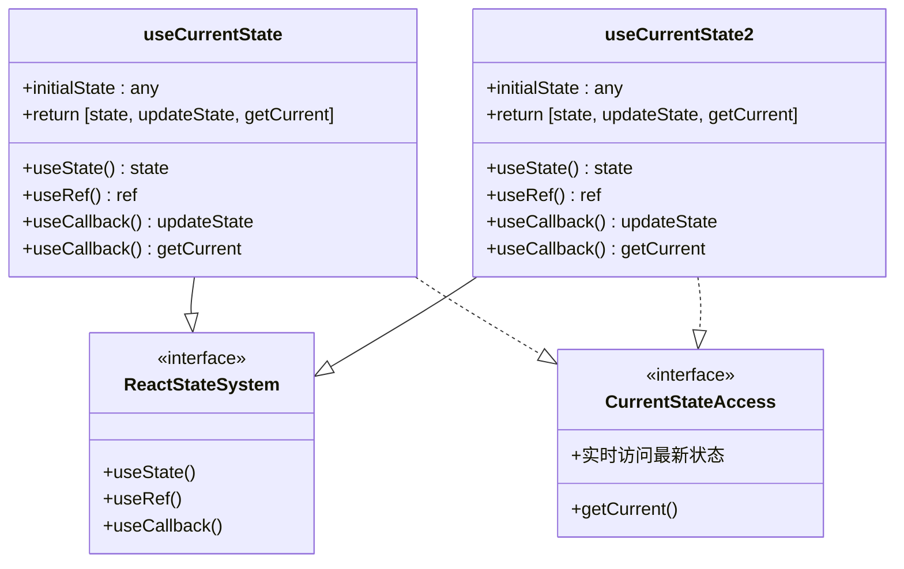
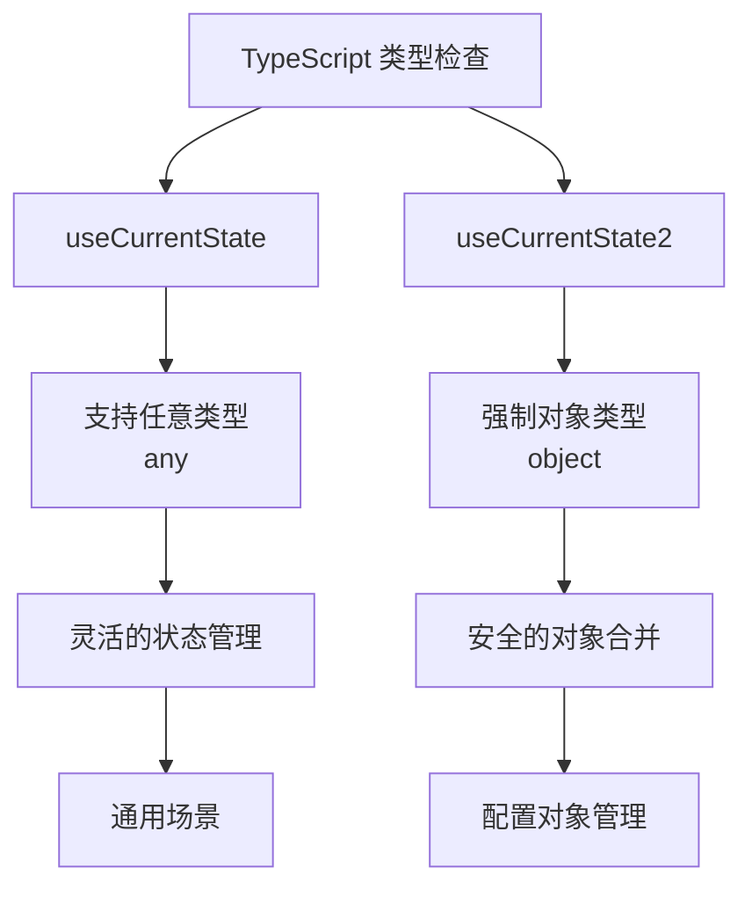
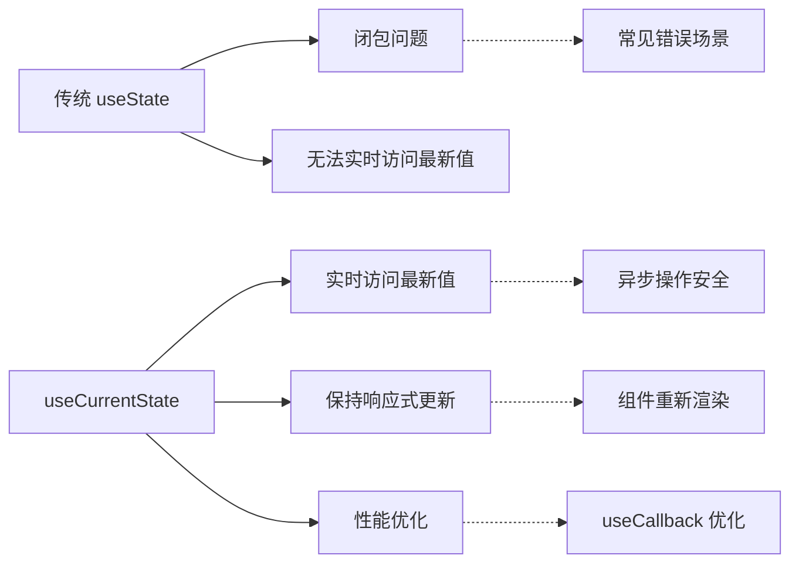

# useCurrentState Hook 详细文档

<cite>
**本文档中引用的文件**
- [useCurrentState.ts](file://src/hooks/useCurrentState.ts)
- [useCurrentState.d.ts](file://types/0buildTypes/hooks/useCurrentState.d.ts)
- [useTablePro.tsx](file://src/table-pro/useTablePro.tsx)
</cite>

## 目录
1. [简介](#简介)
2. [核心功能](#核心功能)
3. [架构设计](#架构设计)
4. [详细组件分析](#详细组件分析)
5. [使用示例](#使用示例)
6. [类型定义](#类型定义)
7. [性能考虑](#性能考虑)
8. [常见问题解决方案](#常见问题解决方案)
9. [最佳实践](#最佳实践)
10. [总结](#总结)

## 简介

`useCurrentState` Hook 是 Fat Design 组件库中提供的一个创新状态管理工具，专门解决 React 应用中异步操作时状态闭包过期的问题。它通过结合 `useState` 和 `useRef` 的优势，为开发者提供了一个既能保持 React 响应式系统完整性，又能实时访问最新状态值的解决方案。

该 Hook 提供了两种变体：
- `useCurrentState`: 支持任意类型的初始状态
- `useCurrentState2`: 专门用于对象类型的状态管理

## 核心功能

### 主要特性

1. **实时状态访问**: 通过 `getCurrent()` 方法提供对最新状态值的即时访问
2. **状态同步**: 利用 `useRef` 同步保存最新状态值，确保在异步回调中不会出现闭包过期问题
3. **响应式兼容**: 完全兼容 React 的状态更新机制，保持组件重新渲染
4. **类型安全**: 提供完整的 TypeScript 类型定义
5. **性能优化**: 使用 `useCallback` 避免不必要的重新渲染

### 解决的核心问题

- **异步操作中的状态闭包问题**: 在定时器、事件监听器、异步请求回调中，避免使用过时的状态值
- **状态更新与访问分离**: 提供状态更新方法的同时，也提供实时访问最新状态的能力
- **复杂状态管理**: 特别适用于需要频繁更新和访问状态的复杂业务场景

## 架构设计



**图表来源**
- [useCurrentState.ts](file://src/hooks/useCurrentState.ts#L6-L18)
- [useCurrentState.ts](file://src/hooks/useCurrentState.ts#L21-L38)

## 详细组件分析

### useCurrentState 实现分析

```typescript
function useCurrentState(initialState: any) {
    const [state, setState] = useState(initialState);
    const ref = useRef(initialState);
    ref.current = state;

    const updateState = useCallback((nextState: any) => {
        ref.current = nextState;
        setState(nextState);
    }, []);

    const getCurrent = useCallback(() => {
        return ref.current;
    }, []);

    return [state, updateState, getCurrent]
}
```

#### 关键实现原理

1. **状态同步机制**:
   ```javascript
   ref.current = state;  // 每次状态更新后同步到 ref
   ```

2. **状态更新流程**:
   ```mermaid
sequenceDiagram
participant Component as "React 组件"
participant Hook as "useCurrentState"
participant State as "useState"
participant Ref as "useRef"
Component->>Hook : 调用 updateState(newState)
Hook->>Ref : ref.current = newState
Hook->>State : setState(newState)
State->>Component : 触发重新渲染
Component->>Hook : 调用 getCurrent()
Hook->>Ref : 返回 ref.current
```

**图表来源**
- [useCurrentState.ts](file://src/hooks/useCurrentState.ts#L10-L12)
- [useCurrentState.ts](file://src/hooks/useCurrentState.ts#L14-L16)

**章节来源**
- [useCurrentState.ts](file://src/hooks/useCurrentState.ts#L6-L18)

### useCurrentState2 实现分析

```typescript
function useCurrentState2(initialState: any = {}) {
    const [state, setState] = useState(initialState);
    const ref = useRef(initialState);
    ref.current = state;

    const updateState = useCallback((nextState0: any) => {
        if (!nextState0 || typeof nextState0 !== "object"){
            return;
        }
        const nextState = {...ref.current, ...nextState0};
        ref.current = nextState;
        setState(nextState);
    }, []);

    const getCurrent = useCallback(() => {
        return ref.current;
    }, []);

    return [state, updateState, getCurrent]
}
```

#### 对象合并特性

`useCurrentState2` 专门针对对象类型状态进行了优化，支持部分更新：

```javascript
const nextState = {...ref.current, ...nextState0};  // 浅合并对象
```

**章节来源**
- [useCurrentState.ts](file://src/hooks/useCurrentState.ts#L21-L38)

## 使用示例

### 基本使用模式

#### 异步请求场景

```typescript
// 在异步请求中避免状态闭包问题
const fetchData = async () => {
    const [data, setData, getData] = useCurrentState([]);
    
    const response = await api.getData();
    
    // 使用最新的数据状态
    const currentData = getData();
    setData([...currentData, ...response.data]);
};
```

#### 定时器处理场景

```typescript
// 在定时器中使用最新状态
const TimerComponent = () => {
    const [count, setCount, getCount] = useCurrentState(0);
    
    useEffect(() => {
        const timer = setInterval(() => {
            // 获取最新状态值
            const currentCount = getCount();
            console.log('Current count:', currentCount);
            
            // 更新状态
            setCount(currentCount + 1);
        }, 1000);
        
        return () => clearInterval(timer);
    }, []);
    
    return <div>Count: {count}</div>;
};
```

#### 事件监听器场景

```typescript
// 在事件监听器中使用最新状态
const EventListenerComponent = () => {
    const [active, setActive, isActive] = useCurrentState(false);
    
    useEffect(() => {
        const handleKeyDown = (event: KeyboardEvent) => {
            // 检查当前激活状态
            if (isActive()) {
                console.log('Active state:', isActive());
                // 执行相关逻辑
            }
        };
        
        window.addEventListener('keydown', handleKeyDown);
        return () => window.removeEventListener('keydown', handleKeyDown);
    }, []);
    
    return (
        <button onClick={() => setActive(!isActive())}>
            Toggle Active
        </button>
    );
};
```

### 复杂业务场景 - useTablePro 示例

在 `useTablePro` Hook 中，`useCurrentState` 被广泛应用于管理复杂的表格状态：

```typescript
// 状态管理示例
const [loading, setLoading, getIsLoading] = useCurrentState(false);
const [rowSelection, updateRowSelection, getRowSelection] = useCurrentState2({
    selectedRowKeys: []
});
const [formProps, updateFormProps, getFormProps] = useCurrentState2({
    _tmpFormValues: {},
    isUseCard: true
});
```

#### 状态访问模式

```typescript
// 在查询函数中使用最新状态
const doQuery = async (queryTrigger: string) => {
    const currentPaginationProps = getPaginationProps();
    const currentFilterProps = getFilterProps();
    const currentFormProps = getFormProps();

    // 构建查询参数
    const queryParams = {
        formValues: currentFormProps._tmpFormValues,
        otherValues: {
            queryTrigger,
            current: currentPaginationProps.current,
            pageSize: currentPaginationProps.pageSize,
            filterValue: currentFilterProps.value
        }
    };
    
    // 执行查询逻辑...
};
```

**章节来源**
- [useTablePro.tsx](file://src/table-pro/useTablePro.tsx#L74-L114)

## 类型定义

### 基础类型定义

```typescript
// useCurrentState 类型定义
declare function useCurrentState(initialState: any): [
    state: any,           // 当前状态值
    updateState: (nextState: any) => void,  // 更新状态的方法
    getCurrent: () => any // 获取最新状态的方法
];

// useCurrentState2 类型定义
declare function useCurrentState2(initialState?: any): [
    state: any,           // 当前状态值
    updateState: (nextState: object) => void,  // 更新状态的方法（仅接受对象）
    getCurrent: () => any // 获取最新状态的方法
];
```

### TypeScript 类型安全



**图表来源**
- [useCurrentState.d.ts](file://types/0buildTypes/hooks/useCurrentState.d.ts#L3-L10)

**章节来源**
- [useCurrentState.d.ts](file://types/0buildTypes/hooks/useCurrentState.d.ts#L0-L11)

## 性能考虑

### 性能优化策略

1. **useCallback 优化**:
   ```typescript
   const updateState = useCallback((nextState: any) => {
       ref.current = nextState;
       setState(nextState);
   }, []);
   ```
   - 避免每次渲染都创建新的函数
   - 保持函数引用稳定性

2. **最小化依赖数组**:
   - `useCallback` 的依赖数组为空，确保函数引用不变
   - 避免不必要的重新渲染

3. **内存管理**:
   - `useRef` 不会触发重新渲染
   - 状态同步通过 `setState` 触发必要的更新

### 性能对比



## 常见问题解决方案

### 问题1: 与受控组件的集成

**问题描述**: 在受控组件中使用 `useCurrentState` 时可能出现状态不一致

**解决方案**:
```typescript
const ControlledComponent = () => {
    const [value, setValue, getValue] = useCurrentState('');
    
    const handleChange = (e: ChangeEvent<HTMLInputElement>) => {
        const newValue = e.target.value;
        setValue(newValue);
    };
    
    // 确保组件外部使用最新的状态值
    const currentValue = getValue();
    
    return (
        <input 
            value={currentValue} 
            onChange={handleChange}
            onBlur={() => console.log('Final value:', currentValue)}
        />
    );
};
```

### 问题2: 状态初始化问题

**问题描述**: 初始状态设置不当可能导致类型错误

**解决方案**:
```typescript
// 正确的初始状态设置
const [count, setCount, getCount] = useCurrentState<number>(0);
const [data, setData, getData] = useCurrentState<string[]>([]);
const [config, setConfig, getConfig] = useCurrentState2({});

// 使用泛型明确指定类型
const [user, setUser, getUser] = useCurrentState<User | null>(null);
```

### 问题3: 调试技巧

**调试方法**:
```typescript
const DebugComponent = () => {
    const [state, setState, getState] = useCurrentState<any>({});
    
    // 添加调试信息
    const debugState = () => {
        console.log('Current state:', getState());
        console.log('Last update:', new Date());
    };
    
    useEffect(() => {
        debugState();
    }, [state]);
    
    return (
        <button onClick={debugState}>
            Debug State
        </button>
    );
};
```

### 问题4: 内存泄漏预防

**预防措施**:
```typescript
const MemorySafeComponent = () => {
    const [data, setData, getData] = useCurrentState<any[]>([]);
    
    useEffect(() => {
        // 清理函数中处理状态引用
        return () => {
            // 如果需要清理，可以在这里处理
            // 注意：useRef 不需要手动清理
        };
    }, []);
    
    return null;
};
```

## 最佳实践

### 使用场景建议

1. **推荐使用场景**:
   - 异步操作回调中需要访问最新状态
   - 定时器、事件监听器中使用状态
   - 复杂业务逻辑中的状态管理
   - 需要实时访问最新状态值的场景

2. **不推荐使用场景**:
   - 简单的状态管理（使用普通 `useState` 即可）
   - 不需要实时访问最新状态的场景
   - 状态更新频率极低的场景

### 编码规范

```typescript
// 推荐的命名约定
const [isLoading, setIsLoading, getIsLoading] = useCurrentState(false);
const [formData, setFormData, getFormData] = useCurrentState2({});
const [selectedItems, setSelectedItems, getSelectedItems] = useCurrentState([]);

// 推荐的使用模式
const useOptimizedState = () => {
    const [state, setState, getState] = useCurrentState(initialValue);
    
    // 提供额外的业务方法
    const resetState = () => setState(initialValue);
    const updatePartial = (partial: Partial<typeof initialValue>) => {
        setState({...getState(), ...partial});
    };
    
    return { state, setState, getState, resetState, updatePartial };
};
```

### 错误处理

```typescript
const SafeStateComponent = () => {
    const [data, setData, getData] = useCurrentState<any>(null);
    
    const safeGetData = () => {
        try {
            return getData();
        } catch (error) {
            console.error('Failed to get current state:', error);
            return null;
        }
    };
    
    return (
        <div>
            {/* 使用安全的状态访问 */}
            {safeGetData()}
        </div>
    );
};
```

## 总结

`useCurrentState` Hook 是 React 状态管理的一个重要补充，它巧妙地解决了异步操作中状态闭包过期的问题。通过结合 `useState` 和 `useRef` 的优势，它提供了：

1. **实时状态访问**: 通过 `getCurrent()` 方法提供对最新状态值的即时访问
2. **响应式兼容性**: 完全保持 React 的状态更新机制
3. **类型安全性**: 提供完整的 TypeScript 类型定义
4. **性能优化**: 使用 `useCallback` 避免不必要的重新渲染
5. **易于使用**: 简洁的 API 设计，易于理解和使用

在实际项目中，特别是在复杂业务场景下，`useCurrentState` 能够显著提升代码的可靠性和可维护性。通过合理使用这个 Hook，开发者可以构建更加健壮和高效的 React 应用程序。

**章节来源**
- [useCurrentState.ts](file://src/hooks/useCurrentState.ts#L0-L57)
- [useTablePro.tsx](file://src/table-pro/useTablePro.tsx#L70-L269)