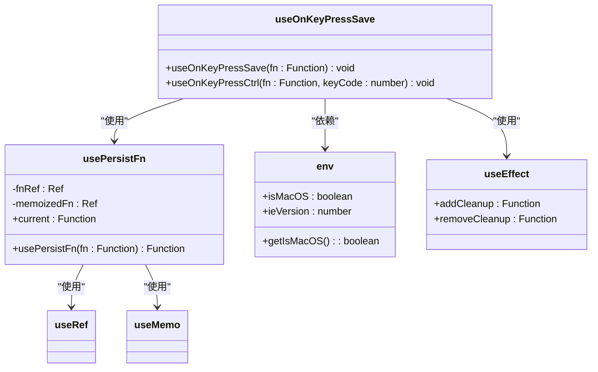
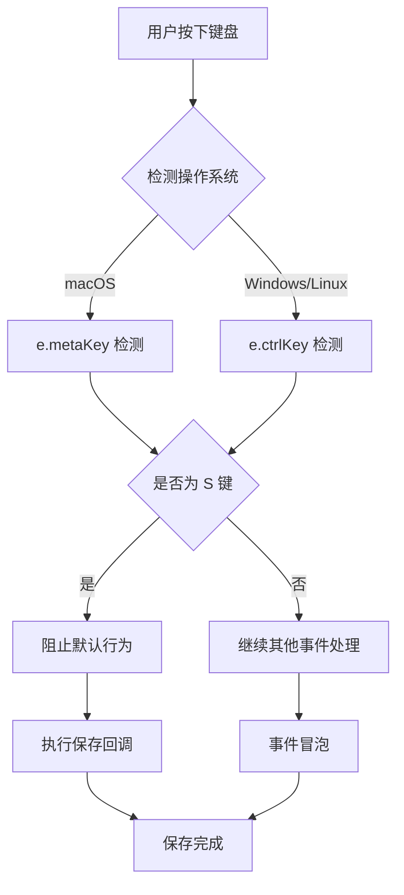

# useOnKeyPressSave Hook 使用文档

<cite>
**本文档引用的文件**
- [useOnKeyPressSave.ts](file://src/hooks/useOnKeyPressSave.ts)
- [usePersistFn.ts](file://src/hooks/usePersistFn.ts)
- [env.ts](file://src/util/env.ts)
- [useOnKeyPressSave.d.ts](file://types/0buildTypes/hooks/useOnKeyPressSave.d.ts)
- [comps.jsx](file://src/button/comps.jsx)
</cite>

## 目录
1. [简介](#简介)
2. [核心功能](#核心功能)
3. [架构概览](#架构概览)
4. [详细组件分析](#详细组件分析)
5. [使用示例](#使用示例)
6. [跨平台兼容性](#跨平台兼容性)
7. [性能考虑](#性能考虑)
8. [故障排除指南](#故障排除指南)
9. [最佳实践](#最佳实践)
10. [总结](#总结)

## 简介

`useOnKeyPressSave` 是 Fat Design 组件库中的一个 React Hook，专门用于监听键盘快捷键（Ctrl+S 或 Cmd+S）并触发保存操作。这个 Hook 提供了优雅的用户体验，允许用户通过键盘快捷键快速保存当前内容，特别适用于表单编辑、文档编辑器和配置页面等场景。

该 Hook 的设计遵循现代 React 开发的最佳实践，包括使用 `useEffect` 生命周期管理、事件清理机制、以及跨平台兼容性处理。它不仅简化了键盘事件的监听逻辑，还提供了自动的事件冒泡控制和浏览器默认行为的覆盖。

## 核心功能

### 主要特性

1. **智能快捷键识别**：自动识别 Windows/Linux 的 Ctrl+S 和 Mac 的 Cmd+S
2. **事件冒泡控制**：通过 `preventDefault()` 阻止浏览器默认保存行为
3. **跨平台兼容**：根据操作系统自动适配不同的修饰键
4. **内存安全**：使用 `usePersistFn` 确保回调函数的稳定性
5. **生命周期管理**：自动添加和移除事件监听器

### 技术亮点

- **React Hooks 架构**：完全基于 React Hooks 实现
- **类型安全**：完整的 TypeScript 类型定义
- **性能优化**：使用 `usePersistFn` 避免不必要的重渲染
- **环境感知**：动态检测操作系统类型

## 架构概览

```mermaid
graph TB
subgraph "useOnKeyPressSave Hook 架构"
A[useOnKeyPressSave Hook] --> B[useOnKeyPressCtrl]
B --> C[usePersistFn]
C --> D[useEffect]
subgraph "环境检测"
E[env.isMacOS] --> F[window.addEventListener]
F --> G[window.removeEventListener]
end
subgraph "事件处理"
H[keydown 事件] --> I[e.keyCode === 83]
I --> J[e.ctrlKey/metaKey]
J --> K[e.preventDefault()]
K --> L[fn2 执行]
end
D --> E
H --> I
end
```

**图表来源**
- [useOnKeyPressSave.ts](file://src/hooks/useOnKeyPressSave.ts#L1-L42)
- [usePersistFn.ts](file://src/hooks/usePersistFn.ts#L1-L29)
- [env.ts](file://src/util/env.ts#L1-L40)

## 详细组件分析

### 核心实现分析

#### useOnKeyPressCtrl 函数

```typescript
function useOnKeyPressCtrl(fn: any, keyCode: number) {
    const fn2 = usePersistFn(fn);

    useEffect(() => {
        const onKeyDown = (e: any) => {
            if (e.keyCode === keyCode && (env.isMacOS ? e.metaKey : e.ctrlKey)) {
                e.preventDefault();
                fn2();
            }
        }
        window.addEventListener('keydown', onKeyDown, false);
        return () => {
            window.removeEventListener('keydown', onKeyDown, false);
        }
    }, [keyCode, fn2])
}
```

**关键实现要点**：

1. **事件监听器管理**：
   - 使用 `useEffect` 添加和清理事件监听器
   - 确保组件卸载时正确移除监听器，避免内存泄漏

2. **条件判断逻辑**：
   - 检查 `keyCode === 83`（S 键）
   - 根据操作系统类型选择正确的修饰键：
     - macOS: `e.metaKey` (Cmd 键)
     - Windows/Linux: `e.ctrlKey` (Ctrl 键)

3. **事件阻止机制**：
   - 调用 `e.preventDefault()` 防止浏览器默认的保存行为
   - 确保自定义保存逻辑优先执行

#### useOnKeyPressSave 函数

```typescript
function useOnKeyPressSave(fn: any) {
    return useOnKeyPressCtrl(fn, 83);
}
```

这是一个专门针对 Ctrl+S/Cmd+S 快捷键的封装，简化了调用接口。

**图表来源**
- [useOnKeyPressSave.ts](file://src/hooks/useOnKeyPressSave.ts#L8-L25)

### 依赖关系分析



**图表来源**
- [useOnKeyPressSave.ts](file://src/hooks/useOnKeyPressSave.ts#L1-L42)
- [usePersistFn.ts](file://src/hooks/usePersistFn.ts#L1-L29)
- [env.ts](file://src/util/env.ts#L1-L40)

**章节来源**
- [useOnKeyPressSave.ts](file://src/hooks/useOnKeyPressSave.ts#L1-L42)
- [usePersistFn.ts](file://src/hooks/usePersistFn.ts#L1-L29)
- [env.ts](file://src/util/env.ts#L1-L40)

## 使用示例

### 基本使用示例

```typescript
import React, { useState } from 'react';
import { useOnKeyPressSave } from 'fat-design';

function DocumentEditor() {
    const [content, setContent] = useState('');
    
    const handleSave = () => {
        console.log('保存内容:', content);
        // 实际保存逻辑
    };
    
    // 监听 Ctrl+S/Cmd+S 快捷键
    useOnKeyPressSave(handleSave);
    
    return (
        <textarea
            value={content}
            onChange={(e) => setContent(e.target.value)}
            style={{ width: '100%', height: '300px' }}
        />
    );
}
```

### 表单编辑场景

```typescript
import React, { useState } from 'react';
import { Form, Input, Button } from 'fat-design';
import { useOnKeyPressSave } from 'fat-design';

function ConfigForm() {
    const [formData, setFormData] = useState({
        setting1: '',
        setting2: '',
        setting3: ''
    });
    
    const handleSave = async () => {
        try {
            // 发送配置数据到服务器
            await saveConfig(formData);
            alert('配置已保存');
        } catch (error) {
            alert('保存失败: ' + error.message);
        }
    };
    
    // 设置快捷键保存
    useOnKeyPressSave(handleSave);
    
    return (
        <Form 
            data={formData}
            onChange={setFormData}
            onSubmit={handleSave}
        >
            <Form.Item label="设置1" name="setting1">
                <Input />
            </Form.Item>
            
            <Form.Item label="设置2" name="setting2">
                <Input />
            </Form.Item>
            
            <Form.Item label="设置3" name="setting3">
                <Input />
            </Form.Item>
            
            <Button type="primary" htmlType="submit">
                保存配置
            </Button>
        </Form>
    );
}
```

### 复杂编辑器场景

```typescript
import React, { useState, useCallback } from 'react';
import { useOnKeyPressSave } from 'fat-design';

function RichTextEditor() {
    const [editorContent, setEditorContent] = useState('');
    const [isSaving, setIsSaving] = useState(false);
    
    const handleSave = useCallback(async () => {
        if (isSaving) return;
        
        setIsSaving(true);
        try {
            // 显示保存中提示
            showLoadingIndicator();
            
            // 执行保存逻辑
            await saveRichText(editorContent);
            
            // 显示成功消息
            showSuccessMessage('内容已保存');
        } catch (error) {
            showError('保存失败: ' + error.message);
        } finally {
            setIsSaving(false);
        }
    }, [editorContent, isSaving]);
    
    // 注册快捷键
    useOnKeyPressSave(handleSave);
    
    return (
        <div>
            <h3>富文本编辑器</h3>
            <textarea
                value={editorContent}
                onChange={(e) => setEditorContent(e.target.value)}
                rows={10}
                style={{ width: '100%' }}
            />
            <p>按 Ctrl+S 或 Cmd+S 保存内容</p>
        </div>
    );
}
```

## 跨平台兼容性

### 操作系统检测机制



**图表来源**
- [useOnKeyPressSave.ts](file://src/hooks/useOnKeyPressSave.ts#L14-L17)
- [env.ts](file://src/util/env.ts#L7-L9)

### 平台特定的显示文本

```javascript
// 在按钮组件中使用的显示文本
function createButtonText() {
    if (env.isMacOS) {
        return "保存（⌘ +S）";
    }
    return "保存（Ctrl+S）";
}
```

这种设计确保了用户界面与平台习惯保持一致，提升了用户体验。

**章节来源**
- [useOnKeyPressSave.ts](file://src/hooks/useOnKeyPressSave.ts#L14-L17)
- [env.ts](file://src/util/env.ts#L7-L9)
- [comps.jsx](file://src/button/comps.jsx#L47-L51)

## 性能考虑

### 内存管理

1. **事件监听器清理**：
   ```typescript
   useEffect(() => {
       const onKeyDown = (e: any) => {
           // 事件处理逻辑
       }
       
       window.addEventListener('keydown', onKeyDown, false);
       return () => {
           window.removeEventListener('keydown', onKeyDown, false);
       }
   }, [keyCode, fn2])
   ```

2. **持久化函数**：
   - 使用 `usePersistFn` 避免回调函数的频繁重建
   - 减少不必要的组件重渲染

3. **依赖数组优化**：
   - 正确指定依赖项，避免不必要的副作用执行
   - `keyCode` 和 `fn2` 作为依赖确保响应性

### 最佳实践建议

1. **避免在回调中修改状态**：
   ```typescript
   // 推荐：使用异步回调
   const handleSave = useCallback(async () => {
       await saveData();
   }, []);
   
   // 避免：直接在回调中修改状态
   const handleSave = useCallback(() => {
       setData(newData); // 可能导致意外的重渲染
   }, []);
   ```

2. **合理使用防抖**：
   ```typescript
   import { debounce } from 'lodash';
   
   const debouncedSave = debounce(handleSave, 1000);
   useOnKeyPressSave(debouncedSave);
   ```

## 故障排除指南

### 常见问题及解决方案

#### 1. 快捷键不响应

**问题描述**：Ctrl+S 或 Cmd+S 按下后没有触发保存操作

**可能原因**：
- 其他组件阻止了键盘事件
- 回调函数未正确传递
- 组件未正确挂载

**解决方案**：
```typescript
// 确保回调函数正确传递
const handleSave = useCallback(() => {
    console.log('保存被触发');
    // 保存逻辑
}, []);

// 检查组件是否正确挂载
useOnKeyPressSave(handleSave);
```

#### 2. 浏览器默认保存行为仍然出现

**问题描述**：按下快捷键后，浏览器仍然尝试打开保存对话框

**解决方案**：
```typescript
// 确保 preventDefault 被正确调用
const handleSave = useCallback((e: KeyboardEvent) => {
    e.preventDefault(); // 确保这行存在
    // 保存逻辑
}, []);
```

#### 3. 多个快捷键冲突

**问题描述**：多个组件同时监听相同的快捷键

**解决方案**：
```typescript
// 使用条件判断避免冲突
const handleSave = useCallback((e: KeyboardEvent) => {
    if (document.activeElement.tagName === 'INPUT') {
        return; // 如果焦点在输入框上，不执行保存
    }
    // 保存逻辑
}, []);
```

#### 4. 跨组件通信问题

**问题描述**：在复杂应用中，需要知道哪个组件应该响应快捷键

**解决方案**：
```typescript
// 使用上下文或状态管理
const SaveShortcut = ({ onSave }: { onSave: () => void }) => {
    useOnKeyPressSave(onSave);
    return null;
};

// 在需要保存的组件中使用
<SaveShortcut onSave={handleSave} />
```

### 调试技巧

1. **启用调试模式**：
   ```typescript
   const handleSave = useCallback((e: KeyboardEvent) => {
       console.log('快捷键触发', e.key, e.ctrlKey, e.metaKey);
       // 保存逻辑
   }, []);
   ```

2. **检查事件冒泡**：
   ```typescript
   const handleSave = useCallback((e: KeyboardEvent) => {
       e.stopPropagation();
       // 保存逻辑
   }, []);
   ```

## 最佳实践

### 1. 可访问性考虑

```typescript
// 提供视觉反馈
const SaveButtonWithShortcut = () => {
    const [isFocused, setIsFocused] = useState(false);
    
    return (
        <Button 
            onFocus={() => setIsFocused(true)}
            onBlur={() => setIsFocused(false)}
        >
            {isFocused ? '保存（Ctrl+S）' : '保存'}
        </Button>
    );
};
```

### 2. 错误处理

```typescript
const handleSave = useCallback(async () => {
    try {
        await saveData();
        showMessage('保存成功');
    } catch (error) {
        handleError(error);
        showMessage('保存失败，请重试');
    }
}, []);
```

### 3. 用户体验优化

```typescript
const handleSave = useCallback(async () => {
    // 显示加载状态
    setLoading(true);
    
    try {
        await saveData();
        // 显示成功状态
        showSuccessMessage('内容已保存');
    } catch (error) {
        // 显示错误状态
        showErrorMessage('保存失败: ' + error.message);
    } finally {
        // 确保清除加载状态
        setLoading(false);
    }
}, []);
```

### 4. 条件启用

```typescript
// 根据条件启用快捷键
const SaveShortcut = ({ enabled = true, onSave }: Props) => {
    useEffect(() => {
        if (!enabled) return;
        
        const handleKeyDown = (e: KeyboardEvent) => {
            if ((e.ctrlKey || e.metaKey) && e.key === 's') {
                e.preventDefault();
                onSave();
            }
        };
        
        window.addEventListener('keydown', handleKeyDown);
        return () => window.removeEventListener('keydown', handleKeyDown);
    }, [enabled, onSave]);
    
    return null;
};
```

## 总结

`useOnKeyPressSave` Hook 是一个设计精良的 React Hook，它解决了现代 Web 应用中常见的键盘快捷键需求。通过智能的跨平台兼容性、完善的事件管理机制和简洁的 API 设计，它为开发者提供了一个可靠的方式来增强应用程序的可用性。

### 主要优势

1. **简单易用**：只需传入保存回调函数即可工作
2. **跨平台支持**：自动适配 Windows/Linux 和 macOS
3. **性能优化**：使用 React Hooks 最佳实践
4. **类型安全**：完整的 TypeScript 支持
5. **内存安全**：自动管理事件监听器的生命周期

### 适用场景

- **表单编辑**：实时保存用户输入
- **文档编辑器**：自动保存编辑内容
- **配置页面**：即时保存用户设置
- **富文本编辑器**：定期保存编辑状态
- **任何需要快捷保存功能的场景**

通过遵循本文档中的最佳实践和注意事项，开发者可以充分利用 `useOnKeyPressSave` Hook 来提升应用程序的用户体验，同时确保代码的可维护性和性能表现。