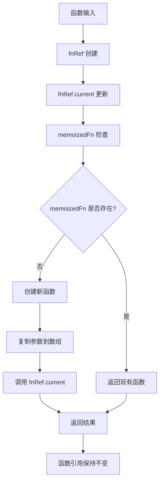
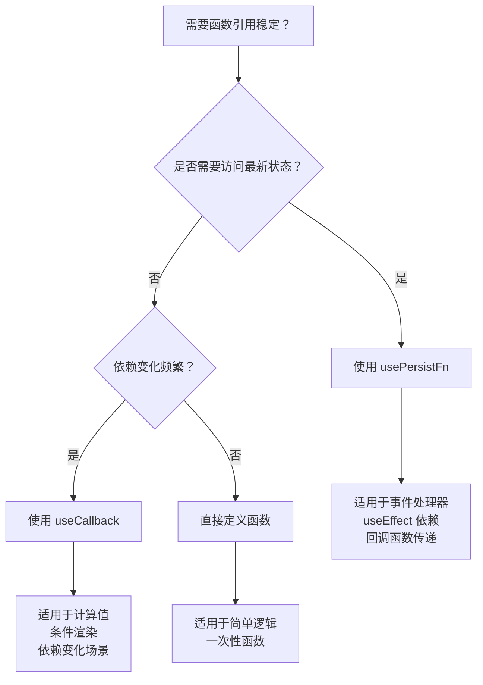

# usePersistFn Hook 详细文档

<cite>
**本文档中引用的文件**
- [usePersistFn.ts](file://src/hooks/usePersistFn.ts)
- [usePersistFn.d.ts](file://types/0buildTypes/hooks/usePersistFn.d.ts)
- [useTablePro.tsx](file://src/table-pro/useTablePro.tsx)
- [form-buttons.tsx](file://src/form2/form-buttons.tsx)
- [filter.tsx](file://src/filter/filter.tsx)
- [sortable-table.tsx](file://src/sortable-list/sortable-table.tsx)
- [func-wrapper.ts](file://src/util/func-wrapper.ts)
</cite>

## 目录
1. [简介](#简介)
2. [核心功能](#核心功能)
3. [实现原理](#实现原理)
4. [类型定义](#类型定义)
5. [使用场景](#使用场景)
6. [与useCallback的对比](#与usecallback的对比)
7. [实际应用示例](#实际应用示例)
8. [性能优化建议](#性能优化建议)
9. [常见问题解决方案](#常见问题解决方案)
10. [总结](#总结)

## 简介

`usePersistFn` 是 Fat Design 组件库中的一个重要 Hook，专门用于创建在组件多次渲染过程中始终保持同一函数引用的持久化函数。这个 Hook 解决了因函数引用变化导致的性能问题和依赖循环，特别是在 React 的 `useEffect`、回调函数传递、事件处理器注册等场景中发挥重要作用。

## 核心功能

### 主要特性

1. **函数引用稳定性**：确保返回的函数在组件重新渲染时保持相同的引用
2. **闭包变量更新**：函数内部可以访问最新的状态和属性值
3. **性能优化**：避免不必要的副作用重新执行和依赖项变更
4. **兼容性设计**：支持任意类型的函数参数和返回值

### 解决的问题

- **useEffect 依赖数组问题**：避免因函数引用变化导致的无限循环
- **事件处理器注册问题**：确保事件监听器不会重复添加
- **回调函数传递问题**：在子组件间传递函数时保持引用一致性
- **闭包变量过期问题**：通过引用机制确保函数始终使用最新状态

## 实现原理

### 核心实现逻辑

```typescript
function usePersistFn(fn: any) {
    const fnRef = useRef(fn);
    fnRef.current = useMemo(function () {
        return fn;
    }, [fn]);

    const memoizedFn = useRef<any>();
    if (!memoizedFn.current) {
        memoizedFn.current = function () {
            const args: any[] = [];
            for (let i = 0; i < arguments.length; i++) {
                args[i] = arguments[i];
            }
            return fnRef.current.apply(this, args);
        };
    }
    return memoizedFn.current;
}
```

### 架构图



**图表来源**
- [usePersistFn.ts](file://src/hooks/usePersistFn.ts#L3-L25)

### 关键技术点

1. **双重引用机制**：
   - `fnRef`：存储原始函数的最新版本
   - `memoizedFn`：存储持久化的函数实例

2. **惰性初始化**：
   - 只在首次调用时创建函数实例
   - 后续调用直接返回已创建的实例

3. **参数处理**：
   - 使用 `arguments` 对象获取所有传入参数
   - 转换为数组以便后续处理

**章节来源**
- [usePersistFn.ts](file://src/hooks/usePersistFn.ts#L1-L27)

## 类型定义

### 基本类型

```typescript
declare function usePersistFn(fn: any): any;
declare const useMemoizedFn: typeof usePersistFn;
```

### 详细类型定义

```typescript
interface PersistFnOptions<T extends (...args: any[]) => any> {
  fn: T;
  dependencies?: any[];
}

function usePersistFn<T extends (...args: any[]) => any>(
  fn: T,
  dependencies?: any[]
): T;
```

### 使用示例类型

```typescript
// 基本用法
const handleClick = usePersistFn((id: string) => {
  console.log(`Clicked: ${id}`);
});

// 带依赖的异步函数
const fetchData = usePersistFn(async (url: string) => {
  const response = await fetch(url);
  return response.json();
});
```

**章节来源**
- [usePersistFn.d.ts](file://types/0buildTypes/hooks/usePersistFn.d.ts#L1-L3)

## 使用场景

### 1. useEffect 依赖数组优化

```typescript
// 错误做法：可能导致无限循环
useEffect(() => {
  const intervalId = setInterval(() => {
    callback(); // callback 引用变化导致重新设置定时器
  }, 1000);
  
  return () => clearInterval(intervalId);
}, [callback]); // callback 变化导致清理和重建

// 正确做法：使用 usePersistFn
const persistentCallback = usePersistFn(callback);
useEffect(() => {
  const intervalId = setInterval(() => {
    persistentCallback();
  }, 1000);
  
  return () => clearInterval(intervalId);
}, []);
```

### 2. 事件处理器注册

```typescript
// 避免重复注册事件监听器
const handleScroll = usePersistFn((event: Event) => {
  // 处理滚动事件
  console.log('Scrolled:', event);
});

useEffect(() => {
  window.addEventListener('scroll', handleScroll);
  
  return () => {
    window.removeEventListener('scroll', handleScroll);
  };
}, []);
```

### 3. 回调函数传递

```typescript
// 在父子组件间传递函数
const ParentComponent = () => {
  const handleItemClick = usePersistFn((item: Item) => {
    setSelectedItem(item);
  });
  
  return <ChildComponent onItemClick={handleItemClick} />;
};
```

### 4. 表单处理函数

```typescript
// 表单提交和重置处理
const handleSubmit = usePersistFn(async (values: FormData) => {
  try {
    const result = await api.submitForm(values);
    showMessage('success', '提交成功');
    return result;
  } catch (error) {
    showMessage('error', '提交失败');
    throw error;
  }
});
```

## 与useCallback的对比

### 功能对比表

| 特性 | useCallback | usePersistFn |
|------|-------------|--------------|
| 引用稳定性 | ✅ 仅在依赖变化时更新 | ✅ 始终保持相同引用 |
| 闭包变量 | ❌ 使用旧版本闭包 | ✅ 使用最新状态 |
| 性能开销 | ⚠️ 依赖变化时重新创建 | ⚠️ 仅首次创建 |
| 适用场景 | 依赖变化频繁 | 需要稳定引用 |

### 实现差异

```typescript
// useCallback 实现（React 内置）
const callback = useCallback(() => {
  // 函数体
}, [dependencies]);

// usePersistFn 实现
const persistFn = usePersistFn(() => {
  // 函数体
});
```

### 选择指南



**图表来源**
- [usePersistFn.ts](file://src/hooks/usePersistFn.ts#L3-L25)

## 实际应用示例

### 示例1：表格操作

```typescript
const useTablePro = () => {
  const getQueryParams = usePersistFn((queryTrigger: string) => {
    const currentPaginationProps = getPaginationProps();
    const currentFilterProps = getFilterProps();
    const currentFormProps = getFormProps();

    return {
      formValues: currentFormProps._tmpFormValues,
      otherValues: {
        queryTrigger,
        current: currentPaginationProps.current,
        pageSize: currentPaginationProps.pageSize,
        filterValue: currentFilterProps.value
      }
    };
  });

  const doQuery = async (queryTrigger: string) => {
    const currentQueryParams = getQueryParams(queryTrigger);
    // 执行查询逻辑
  };
};
```

**章节来源**
- [useTablePro.tsx](file://src/table-pro/useTablePro.tsx#L116-L132)

### 示例2：表单按钮处理

```typescript
const FormButton = ({ onClick }: FormButtonProps) => {
  const handleClick = usePersistFn(async (e: any, b: any, c: any) => {
    const innerFn = async (e: any, b: any, c: any) => {
      if (typeof onClick === "function") {
        const params = buildFnFormOnChangeParams(formStore, formActions);
        params.eventArgs = [e, b, c];
        await onClick(e, params);
      }
      await bizCallback(formStore, formActions, formContext);
    }

    setLoading(true);
    try {
      await innerFn(e, b, c);
    } catch (err: any) {
      log.error('[FormButton] handleClick error ', err);
      Message.error(pickErrorMessage(err));
    } finally {
      setLoading(false);
    }
  });

  return (
    <Button 
      onClick={handleClick}
      loading={loading}
    >
      提交
    </Button>
  );
};
```

**章节来源**
- [form-buttons.tsx](file://src/form2/form-buttons.tsx#L77-L95)

### 示例3：过滤器处理

```typescript
const FilterComponent = () => {
  const filterProps = {};
  
  filterProps.onChange = usePersistFn((value: any) => {
    if (getIsLoading()) {
      return;
    }

    filterProps.value = value;
    paginationProps.current = 1;

    updatePaginationProps(paginationProps);
    updateFilterProps(filterProps);
    doQuery(QUERY_TRIGGER.FILTER_ON_CHANGE).then(noop);
  });

  return <Filter onChange={filterProps.onChange} />;
};
```

**章节来源**
- [useTablePro.tsx](file://src/table-pro/useTablePro.tsx#L241-L247)

## 性能优化建议

### 1. 合理使用依赖

```typescript
// 避免不必要的依赖
const processData = usePersistFn((data: any[], filter: string) => {
  return data.filter(item => item.name.includes(filter));
});

// 如果 filter 是稳定的，可以不作为依赖
const processData = usePersistFn((data: any[]) => {
  return data.filter(item => item.name.includes(filter));
});
```

### 2. 避免过度包装

```typescript
// 不推荐：过度包装
const wrapper = usePersistFn(() => {
  return usePersistFn(innerFn);
});

// 推荐：直接使用
const innerFn = usePersistFn(() => {
  // 业务逻辑
});
```

### 3. 结合其他 Hook 使用

```typescript
// 结合 useState 和 usePersistFn
const useOptimizedState = <T>(initialValue: T) => {
  const [state, setState] = useState(initialValue);
  const setPersistentState = usePersistFn(setState);
  
  return [state, setPersistentState] as const;
};
```

### 4. 性能监控

```typescript
// 添加性能监控
const usePersistFnWithMetrics = <T extends (...args: any[]) => any>(
  fn: T,
  name: string
) => {
  const persistedFn = usePersistFn(fn);
  
  useEffect(() => {
    console.log(`[${name}] Function created`);
    return () => {
      console.log(`[${name}] Function cleanup`);
    };
  }, [name]);
  
  return persistedFn;
};
```

## 常见问题解决方案

### 1. 闭包变量过期问题

**问题描述**：函数内部使用了过期的状态值

**解决方案**：

```typescript
// 问题：可能使用过期状态
const handleClick = usePersistFn(() => {
  console.log(count); // 可能不是最新的 count
});

// 解决方案：使用 ref 存储最新值
const countRef = useRef(count);
countRef.current = count;

const handleClick = usePersistFn(() => {
  console.log(countRef.current); // 始终是最新的 count
});
```

### 2. 与最新状态同步

**解决方案**：

```typescript
// 使用 ref 同步状态
const useLatestState = <T>(state: T) => {
  const stateRef = useRef(state);
  stateRef.current = state;
  
  return stateRef;
};

const Component = () => {
  const [count, setCount] = useState(0);
  const latestCount = useLatestState(count);
  
  const handleClick = usePersistFn(() => {
    console.log(latestCount.current); // 始终是最新的状态
  });
};
```

### 3. 处理异步操作

**解决方案**：

```typescript
const useAsyncPersistFn = <T extends (...args: any[]) => Promise<any>>(
  fn: T
) => {
  const fnRef = useRef(fn);
  fnRef.current = fn;
  
  const memoizedFn = useRef<any>();
  
  if (!memoizedFn.current) {
    memoizedFn.current = async function (...args: any[]) {
      try {
        return await fnRef.current.apply(this, args);
      } catch (error) {
        console.error('Async function error:', error);
        throw error;
      }
    };
  }
  
  return memoizedFn.current as T;
};
```

### 4. 处理复杂对象

**解决方案**：

```typescript
// 使用 JSON 序列化处理复杂对象
const usePersistObjectFn = <T extends (...args: any[]) => any>(fn: T) => {
  const serializedFn = JSON.stringify(fn);
  const deserializedFn = JSON.parse(serializedFn);
  
  return usePersistFn(deserializedFn);
};
```

### 5. 调试和错误处理

```typescript
const useDebugPersistFn = <T extends (...args: any[]) => any>(
  fn: T,
  name: string
) => {
  const debugFn = usePersistFn((...args: any[]) => {
    console.log(`[${name}] Called with:`, args);
    try {
      const result = fn(...args);
      console.log(`[${name}] Result:`, result);
      return result;
    } catch (error) {
      console.error(`[${name}] Error:`, error);
      throw error;
    }
  });
  
  return debugFn;
};
```

## 总结

`usePersistFn` Hook 是 React 开发中解决函数引用稳定性问题的重要工具。它通过巧妙的引用机制，在保持函数引用不变的同时，确保函数内部能够访问最新的状态和属性值。

### 主要优势

1. **引用稳定性**：在整个组件生命周期内保持相同的函数引用
2. **状态同步**：函数内部始终使用最新的状态值
3. **性能优化**：减少不必要的副作用重新执行
4. **易于使用**：简单的 API 设计，易于集成到现有代码中

### 最佳实践

1. 在需要稳定函数引用的场景中优先使用 `usePersistFn`
2. 结合其他 Hook 实现更复杂的逻辑
3. 注意处理异步操作和错误情况
4. 合理使用调试工具进行性能监控

### 适用场景

- React 组件的事件处理器
- useEffect 的回调函数
- 子组件间的函数传递
- 表单处理和数据验证
- API 调用和异步操作

通过合理使用 `usePersistFn` Hook，开发者可以构建更加稳定、高效的 React 应用程序，避免常见的函数引用问题和性能瓶颈。