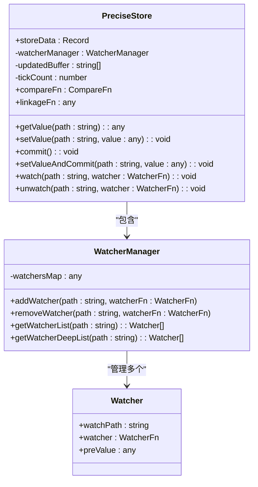
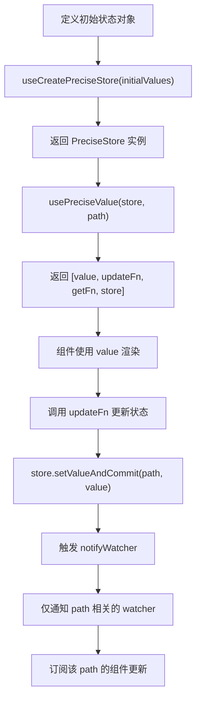

# usePreciseStore Hook

<cite>
**本文档中引用的文件**
- [usePreciseStore.ts](file://src/hooks/usePreciseStore.ts)
- [usePreciseStore.d.ts](file://types/0buildTypes/hooks/usePreciseStore.d.ts)
- [index.ts](file://src/hooks/index.ts)
- [context.ts](file://src/config-provider/v2/context.ts)
</cite>

## 目录
1. [简介](#简介)
2. [核心功能与设计原理](#核心功能与设计原理)
3. [类型定义与泛型支持](#类型定义与泛型支持)
4. [API 详解](#api-详解)
5. [使用示例](#使用示例)
6. [性能优势与适用场景](#性能优势与适用场景)
7. [常见问题与最佳实践](#常见问题与最佳实践)
8. [结论](#结论)

## 简介

`usePreciseStore` 是一个用于实现精确状态监听与更新的 React 自定义 Hook。它通过观察者模式（发布-订阅机制）支持细粒度的状态订阅，使组件仅在所依赖的状态片段发生变化时才重新渲染，从而显著优化应用性能。该 Hook 特别适用于需要高效状态管理的大型应用，能够有效替代或补充 React Context，避免不必要的重渲染。

**Section sources**
- [usePreciseStore.ts](file://src/hooks/usePreciseStore.ts#L0-L298)
- [usePreciseStore.d.ts](file://types/0buildTypes/hooks/usePreciseStore.d.ts#L0-L53)

## 核心功能与设计原理

`usePreciseStore` 的核心基于观察者模式构建，其主要功能包括：

- **精确状态监听**：组件可以订阅状态树中的特定路径（path），仅当该路径对应的数据发生变化时才会触发更新。
- **批量提交机制**：通过 `commit()` 方法统一触发通知，避免频繁的状态变更导致多次渲染。
- **深度路径匹配**：利用 `lodash.get` 和 `lodash.set` 实现嵌套对象的路径访问与修改，支持如 `"user.profile.name"` 这样的深层路径。
- **智能比较更新**：通过可配置的 `compareFn` 判断新旧值是否真正变化，防止无效更新。
- **自动清理订阅**：在组件卸载时自动调用 `unwatch`，防止内存泄漏。

其内部维护了一个 `WatcherManager` 来管理所有订阅者，并通过 `updatedBuffer` 缓冲区记录已变更的路径，在 `commit` 阶段统一通知相关监听器。



**Diagram sources**
- [usePreciseStore.ts](file://src/hooks/usePreciseStore.ts#L100-L200)

**Section sources**
- [usePreciseStore.ts](file://src/hooks/usePreciseStore.ts#L0-L298)

## 类型定义与泛型支持

`usePreciseStore` 提供了完整的 TypeScript 类型定义，支持泛型以增强类型安全。

关键类型包括：

- `PreciseStore`：核心状态存储类，封装了状态数据和监听逻辑。
- `useCreatePreciseStore`：用于创建一个 `PreciseStore` 实例。
- `useGetPreciseStore`：从 React Context 中获取已创建的 `PreciseStore`。
- `usePreciseValue`：订阅特定路径的状态变化，返回 `[value, update, getCurrent, store]`。
- `usePreciseTick`：监听任何一次状态变更，适用于需要响应全局更新的场景。



**Diagram sources**
- [usePreciseStore.d.ts](file://types/0buildTypes/hooks/usePreciseStore.d.ts#L0-L53)

**Section sources**
- [usePreciseStore.d.ts](file://types/0buildTypes/hooks/usePreciseStore.d.ts#L0-L53)

## API 详解

### useCreatePreciseStore

创建一个新的 `PreciseStore` 实例。

**参数：**
- `initialValues`: 初始状态值，可以是对象或返回对象的函数。
- `compareFn`: 可选，用于比较新旧值是否相等的函数，默认为 `'equal'`。
- `linkageFn`: 可选，状态变更后执行的联动函数。

**返回值：** `PreciseStore` 实例。

### useGetPreciseStore

从 React Context 中获取 `PreciseStore` 实例。

**参数：** `context` - React Context 对象。

**返回值：** `PreciseStore` 实例。

### usePreciseValue

订阅指定路径的状态变化。

**参数：**
- `store`: `PreciseStore` 实例。
- `path`: 要订阅的状态路径（支持嵌套路径）。

**返回值：** 元组 `[value, updateValue, getCurrent, store]`
- `value`: 当前路径的值。
- `updateValue`: 更新函数。
- `getCurrent`: 获取当前最新值（在 render 前）。
- `store`: 原始 store 实例。

### usePreciseTick

监听 store 的任何一次变更。

**参数：** `store` - `PreciseStore` 实例。

**返回值：** 与 `usePreciseValue` 相同，但监听的是内部计数器 `KEY_SAVED_TICK_COUNT`。

**Section sources**
- [usePreciseStore.ts](file://src/hooks/usePreciseStore.ts#L156-L297)

## 使用示例

### 全局状态管理

```typescript
// 创建全局 store
const globalStore = useCreatePreciseStore({
  user: { name: 'Alice', age: 25 },
  theme: 'dark'
});

// 在组件中订阅 user.name
const [userName, setUserName] = usePreciseValue(globalStore, 'user.name');
```

### 表单状态联动

```typescript
const formStore = useCreatePreciseStore({
  fields: { username: '', password: '' },
  errors: { username: '', password: '' }
});

// 当 username 变化时自动清除错误
formStore.linkageFn = (data, store) => {
  if (data.fields.username) {
    store.setValueAndCommit('errors.username', '');
  }
};
```

### 复杂组件通信

```typescript
// 父组件创建 store 并通过 Context 传递
const Parent = () => {
  const store = useCreatePreciseStore({ count: 0 });
  return (
    <ConfigProvider value={{ store }}>
      <ChildA />
      <ChildB />
    </ConfigProvider>
  );
};

// 子组件获取 store
const ChildA = () => {
  const store = useGetPreciseStore(configContext);
  const [count, setCount] = usePreciseValue(store, 'count');
  return <button onClick={() => setCount(count + 1)}>Count: {count}</button>;
};
```

**Section sources**
- [usePreciseStore.ts](file://src/hooks/usePreciseStore.ts#L0-L298)
- [context.ts](file://src/config-provider/v2/context.ts#L0-L19)

## 性能优势与适用场景

### 与 React Context 的对比

| 特性 | React Context | usePreciseStore |
|------|---------------|-----------------|
| 订阅粒度 | 组件级 | 路径级 |
| 重渲染范围 | 所有消费者 | 仅订阅路径的组件 |
| 状态更新 | 即时触发 | 可批量提交 |
| 内存管理 | 需手动清理 | 自动清理订阅 |

### 适用场景

- **大型应用全局状态管理**：替代 Redux 或 MobX 的轻量方案。
- **表单复杂联动逻辑**：字段间依赖关系处理。
- **高频率更新状态**：如实时数据展示、动画控制。
- **跨层级组件通信**：避免层层传递 props。

## 常见问题与最佳实践

### 状态更新延迟

**问题原因**：`setValue` 后未调用 `commit()`。

**解决方案**：使用 `setValueAndCommit()` 或手动调用 `commit()`。

### 订阅泄漏预防

- 使用 `useEffect` 返回清理函数，内部自动调用 `unwatch`。
- 避免在每次渲染中创建新的 `watcher` 函数。

### 最佳实践

1. **合理划分状态路径**：避免过细或过粗的订阅。
2. **使用 `linkageFn` 处理副作用**：集中管理状态联动逻辑。
3. **结合 `useMemo` 创建 store**：确保实例稳定。
4. **优先使用 `usePreciseValue` 而非直接读取**：保证响应式更新。

**Section sources**
- [usePreciseStore.ts](file://src/hooks/usePreciseStore.ts#L0-L298)

## 结论

`usePreciseStore` 是一个高效、灵活的状态管理解决方案，通过精确的路径订阅机制实现了细粒度的渲染优化。其基于观察者模式的设计使得状态变更通知更加精准，特别适合需要高性能状态管理的复杂应用。结合 TypeScript 的强类型支持，开发者可以构建出既安全又高效的前端应用架构。