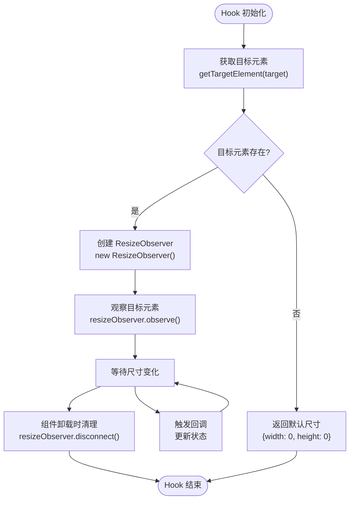

# useSize Hook 使用文档

<cite>
**本文档中引用的文件**
- [useSize.ts](file://src/hooks/useSize.ts)
- [useSize.d.ts](file://types/0buildTypes/hooks/useSize.d.ts)
- [react-dom.ts](file://src/util/react-dom.ts)
- [query-form-layout.tsx](file://src/query-form/query-form-layout.tsx)
- [demo-query-form.tsx](file://demo/demo-query-form.tsx)
</cite>

## 目录
1. [简介](#简介)
2. [核心功能](#核心功能)
3. [类型定义](#类型定义)
4. [实现原理](#实现原理)
5. [使用方法](#使用方法)
6. [实际应用场景](#实际应用场景)
7. [性能优化](#性能优化)
8. [常见问题解决](#常见问题解决)
9. [最佳实践](#最佳实践)
10. [总结](#总结)

## 简介

`useSize` 是 Fat Design 组件库中的一个高性能响应式 Hook，专门用于监听 DOM 元素的尺寸变化并返回响应式的宽度和高度数据。该 Hook 基于现代浏览器的 ResizeObserver API 实现，能够高效地处理 DOM 尺寸变化事件，避免频繁的重渲染问题。

## 核心功能

### 主要特性

1. **实时尺寸监控**：自动监听目标 DOM 元素的宽度和高度变化
2. **高效性能**：使用 ResizeObserver API，相比传统的 window.resize 事件更高效
3. **响应式设计**：返回实时更新的尺寸数据，支持响应式布局
4. **资源管理**：自动处理组件挂载和卸载时的资源清理
5. **灵活参数**：支持传入 ref 对象或直接传入 DOM 节点

### 返回值结构

```typescript
interface UseSizeRes {
    width: number;   // 元素的宽度（像素）
    height: number;  // 元素的高度（像素）
}
```

## 类型定义

```typescript
export interface UseSizeRes {
    width: number;
    height: number;
}

declare function useSize(target: any): UseSizeRes;
```

**节来源**
- [useSize.d.ts](file://types/0buildTypes/hooks/useSize.d.ts#L0-L6)

## 实现原理

### 核心实现逻辑



**图表来源**
- [useSize.ts](file://src/hooks/useSize.ts#L10-L35)

### 关键实现细节

1. **状态管理**：使用 React 的 `useState` 来存储当前的尺寸信息
2. **副作用处理**：通过 `useEffect` 在组件挂载时设置 ResizeObserver
3. **资源清理**：在组件卸载时断开 ResizeObserver 连接
4. **初始值处理**：当目标元素不存在时，返回 `{width: 0, height: 0}`

```typescript
function useSize(target: any): UseSizeRes {
    const [state, setState] = useState({
        width: 0,
        height: 0
    });

    useEffect(() => {
        const el = getTargetElement(target);
        if (!el) {
            return;
        }

        const resizeObserver = new ResizeObserver((entries) => {
            entries.forEach((entry) => {
                const {clientWidth, clientHeight} = entry.target;
                setState({width: clientWidth, height: clientHeight});
            });
        });

        resizeObserver.observe(el);
        return () => {
            resizeObserver.disconnect();
        };
    }, [])

    return state;
}
```

**节来源**
- [useSize.ts](file://src/hooks/useSize.ts#L0-L42)

## 使用方法

### 基本用法

```typescript
import {useSize} from 'fat-design';

function MyComponent() {
    const ref = useRef(null);
    const {width, height} = useSize(ref);
    
    return (
        <div ref={ref}>
            宽度: {width}px, 高度: {height}px
        </div>
    );
}
```

### 传入 DOM 节点

```typescript
import {useSize} from 'fat-design';

function MyComponent() {
    const element = document.getElementById('my-element');
    const {width, height} = useSize(element);
    
    return (
        <div>
            元素尺寸: {width}x{height}
        </div>
    );
}
```

### 传入函数返回值

```typescript
import {useSize} from 'fat-design';

function MyComponent() {
    const getElement = () => document.getElementById('dynamic-element');
    const {width, height} = useSize(getElement);
    
    return (
        <div>
            动态元素尺寸: {width}x{height}
        </div>
    );
}
```

## 实际应用场景

### 1. 响应式布局适配

```typescript
import {useSize, Grid} from 'fat-design';

function ResponsiveGrid() {
    const ref = useRef(null);
    const {width} = useSize(ref);
    
    const getColumns = () => {
        if (width < 600) return 1;
        if (width < 900) return 2;
        return 3;
    };
    
    return (
        <div ref={ref}>
            <Grid columns={getColumns()}>
                {/* 内容 */}
            </Grid>
        </div>
    );
}
```

### 2. 图表容器适配

```typescript
import {useSize} from 'fat-design';
import Chart from './ChartComponent';

function AdaptiveChart() {
    const ref = useRef(null);
    const {width, height} = useSize(ref);
    
    return (
        <div ref={ref} style={{width: '100%', height: '400px'}}>
            <Chart width={width} height={height} />
        </div>
    );
}
```

### 3. 动态UI调整

```typescript
import {useSize, Button} from 'fat-design';

function DynamicButton() {
    const ref = useRef(null);
    const {width} = useSize(ref);
    
    const getText = () => {
        if (width < 200) return '小';
        if (width < 300) return '中';
        return '大';
    };
    
    return (
        <div ref={ref}>
            <Button size={getText()} />
        </div>
    );
}
```

### 4. 表格自适应列宽

```typescript
import {useSize, Table} from 'fat-design';

function AutoWidthTable() {
    const ref = useRef(null);
    const {width} = useSize(ref);
    
    const columns = useMemo(() => [
        {title: '名称', dataIndex: 'name', width: width * 0.3},
        {title: '描述', dataIndex: 'desc', width: width * 0.5},
        {title: '操作', dataIndex: 'actions', width: width * 0.2}
    ], [width]);
    
    return (
        <div ref={ref}>
            <Table columns={columns} dataSource={data} />
        </div>
    );
}
```

**节来源**
- [query-form-layout.tsx](file://src/query-form/query-form-layout.tsx#L59-L65)

## 性能优化

### 1. 避免过度监听

```typescript
import {useSize, useCallback} from 'fat-design';

function OptimizedComponent() {
    const ref = useRef(null);
    const {width, height} = useSize(ref);
    
    // 使用 useCallback 缓存计算逻辑
    const calculateLayout = useCallback(() => {
        // 复杂的布局计算逻辑
        return width > 800 ? 'wide' : 'narrow';
    }, [width]);
    
    return (
        <div ref={ref}>
            {/* 组件内容 */}
        </div>
    );
}
```

### 2. 条件渲染优化

```typescript
import {useSize} from 'fat-design';

function ConditionalRender() {
    const ref = useRef(null);
    const {width} = useSize(ref);
    
    // 只在特定宽度范围内渲染复杂组件
    if (width < 300) {
        return <SimpleComponent />;
    }
    
    return (
        <div ref={ref}>
            <ComplexComponent />
        </div>
    );
}
```

### 3. 防抖处理

```typescript
import {useSize, useState, useEffect} from 'fat-design';
import debounce from 'lodash/debounce';

function DebouncedSize() {
    const ref = useRef(null);
    const {width, height} = useSize(ref);
    const [debouncedWidth, setDebouncedWidth] = useState(width);
    
    useEffect(() => {
        const debouncedSetState = debounce(() => {
            setDebouncedWidth(width);
        }, 100);
        
        debouncedSetState();
        return () => debouncedSetState.cancel();
    }, [width]);
    
    return (
        <div ref={ref}>
            延迟更新的宽度: {debouncedWidth}px
        </div>
    );
}
```

## 常见问题解决

### 1. 初始值为0的问题

**问题描述**：当组件首次渲染时，尺寸可能为0，导致布局异常。

**解决方案**：
```typescript
import {useSize, useState, useEffect} from 'fat-design';

function SafeSizeComponent() {
    const ref = useRef(null);
    const {width, height} = useSize(ref);
    const [hasRendered, setHasRendered] = useState(false);
    
    useEffect(() => {
        if (width > 0 || height > 0) {
            setHasRendered(true);
        }
    }, [width, height]);
    
    if (!hasRendered) {
        return null; // 或者显示加载状态
    }
    
    return (
        <div ref={ref}>
            {/* 正常渲染内容 */}
        </div>
    );
}
```

### 2. SSR（服务端渲染）兼容性

**问题描述**：在服务端渲染环境中，DOM API 不可用。

**解决方案**：
```typescript
import {useSize, useEffect, useState} from 'fat-design';

function SSRCompatibleComponent() {
    const [isClient, setIsClient] = useState(false);
    const ref = useRef(null);
    const size = useSize(ref);
    
    useEffect(() => {
        setIsClient(true);
    }, []);
    
    if (!isClient) {
        return null; // 或者返回骨架屏
    }
    
    return (
        <div ref={ref}>
            {/* 客户端渲染内容 */}
        </div>
    );
}
```

### 3. 多个 useSize Hook 的协调

**问题描述**：在一个组件中使用多个 useSize Hook 可能导致性能问题。

**解决方案**：
```typescript
import {useSize, useMemo} from 'fat-design';

function CoordinatedComponents() {
    const ref1 = useRef(null);
    const ref2 = useRef(null);
    const size1 = useSize(ref1);
    const size2 = useSize(ref2);
    
    // 使用 useMemo 合并多个尺寸信息
    const combinedSize = useMemo(() => ({
        totalWidth: size1.width + size2.width,
        totalHeight: Math.max(size1.height, size2.height)
    }), [size1, size2]);
    
    return (
        <>
            <div ref={ref1}>组件1: {size1.width}x{size1.height}</div>
            <div ref={ref2}>组件2: {size2.width}x{size2.height}</div>
            <div>总尺寸: {combinedSize.totalWidth}x{combinedSize.totalHeight}</div>
        </>
    );
}
```

### 4. ResizeObserver 兼容性

**问题描述**：某些旧版浏览器可能不支持 ResizeObserver。

**解决方案**：
```typescript
import {useSize, useEffect, useState} from 'fat-design';

function FallbackSize() {
    const ref = useRef(null);
    const [supportsResizeObserver, setSupportsResizeObserver] = useState(true);
    const size = useSize(ref);
    
    useEffect(() => {
        if (typeof ResizeObserver === 'undefined') {
            setSupportsResizeObserver(false);
            // 提供降级方案
        }
    }, []);
    
    if (!supportsResizeObserver) {
        return <div>ResizeObserver 不可用，请升级浏览器</div>;
    }
    
    return (
        <div ref={ref}>
            {/* 正常功能 */}
        </div>
    );
}
```

## 最佳实践

### 1. 合理使用 ref

```typescript
// 推荐：使用 useRef 创建引用
const ref = useRef(null);

// 不推荐：直接使用 DOM 查询
const element = document.getElementById('my-element'); // 可能导致内存泄漏
```

### 2. 避免在渲染函数中直接使用

```typescript
// 推荐：在 useEffect 中处理尺寸相关逻辑
useEffect(() => {
    if (width > 800) {
        // 处理大屏幕逻辑
    }
}, [width]);

// 不推荐：在 JSX 中直接使用尺寸进行条件判断
<div>
    {width > 800 ? <LargeScreenComponent /> : <SmallScreenComponent />}
</div>
```

### 3. 合理设置最小更新频率

```typescript
import {useSize, useState, useEffect} from 'fat-design';
import throttle from 'lodash/throttle';

function ThrottledSize() {
    const ref = useRef(null);
    const {width, height} = useSize(ref);
    const [throttledWidth, setThrottledWidth] = useState(width);
    
    useEffect(() => {
        const throttledSetState = throttle(() => {
            setThrottledWidth(width);
        }, 200);
        
        throttledSetState();
        return () => throttledSetState.cancel();
    }, [width]);
    
    return (
        <div ref={ref}>
            节流后的宽度: {throttledWidth}px
        </div>
    );
}
```

### 4. 错误边界处理

```typescript
import {useSize, useState, useEffect} from 'fat-design';

function ErrorBoundarySize() {
    const [error, setError] = useState(null);
    const ref = useRef(null);
    
    useEffect(() => {
        try {
            // 尝试获取尺寸
            const size = useSize(ref);
            // 处理尺寸
        } catch (err) {
            setError(err);
        }
    }, []);
    
    if (error) {
        return <div>尺寸获取失败: {error.message}</div>;
    }
    
    return (
        <div ref={ref}>
            {/* 正常渲染 */}
        </div>
    );
}
```

## 总结

`useSize` Hook 是一个功能强大且高效的响应式工具，它通过现代的 ResizeObserver API 实现了对 DOM 元素尺寸变化的实时监听。该 Hook 的主要优势包括：

1. **高性能**：基于 ResizeObserver API，相比传统方法更加高效
2. **易用性**：简单的 API 设计，易于集成到现有项目中
3. **灵活性**：支持多种参数类型和使用场景
4. **可靠性**：自动处理资源管理和错误情况

在使用 `useSize` Hook 时，需要注意以下几点：

- 合理处理初始值为0的情况
- 考虑 SSR 环境的兼容性
- 避免过度监听和频繁更新
- 根据实际需求选择合适的性能优化策略

通过遵循最佳实践和正确处理常见问题，`useSize` Hook 可以显著提升组件的响应式能力和用户体验。