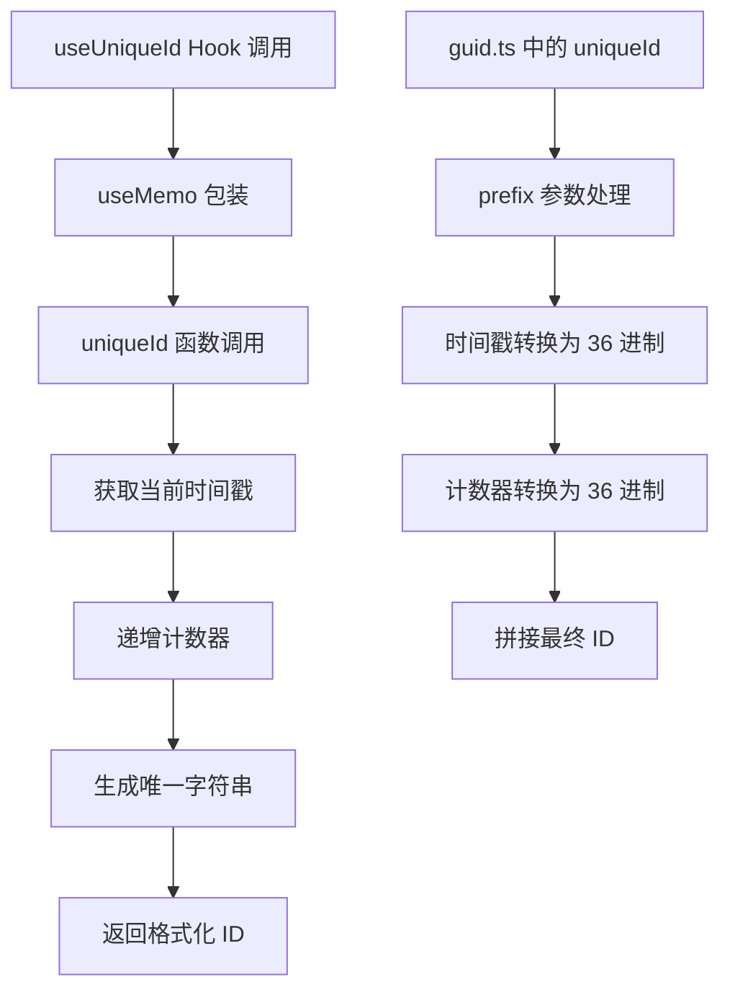
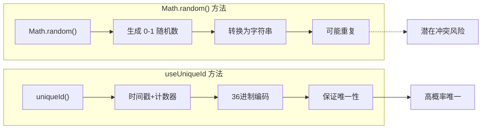
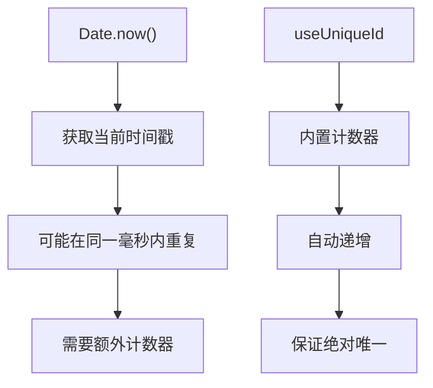

# useUniqueId Hook 详细文档

<cite>
**本文档中引用的文件**
- [useUniqueId.ts](file://src/hooks/useUniqueId.ts)
- [guid.ts](file://src/util/guid.ts)
- [form-item.tsx](file://src/form2/form-item.tsx)
- [htmlId.js](file://src/util/htmlId.js)
- [useUniqueId.d.ts](file://types/0buildTypes/hooks/useUniqueId.d.ts)
</cite>

## 目录
1. [简介](#简介)
2. [核心功能](#核心功能)
3. [实现原理](#实现原理)
4. [类型定义](#类型定义)
5. [使用示例](#使用示例)
6. [与传统方法的对比](#与传统方法的对比)
7. [SSR 环境支持](#ssr-环境支持)
8. [性能考虑](#性能考虑)
9. [最佳实践](#最佳实践)
10. [常见问题解决](#常见问题解决)
11. [总结](#总结)

## 简介

`useUniqueId` 是 Fat Design 组件库中的一个 React Hook，专门用于为组件生成唯一的标识符。这个 Hook 在 HTML 元素的 `id` 属性绑定、ARIA 关联等场景中发挥重要作用，确保每个组件都有独一无二的标识符，避免 ID 冲突问题。

## 核心功能

### 主要特性

1. **唯一性保证**：通过递增计数器和时间戳组合生成唯一字符串
2. **前缀支持**：可接受可选的前缀参数，便于组织和识别
3. **React 性能优化**：使用 `useMemo` 避免不必要的重新计算
4. **SSR 兼容**：在服务端渲染环境下保持一致性
5. **类型安全**：提供完整的 TypeScript 类型定义

### 应用场景

- 表单标签关联（`for` 属性）
- ARIA 属性绑定
- 动态元素标识
- 可访问性增强
- 组件状态管理

## 实现原理

### 架构设计



**图表来源**
- [useUniqueId.ts](file://src/hooks/useUniqueId.ts#L1-L13)
- [guid.ts](file://src/util/guid.ts#L1-L26)

### 核心算法

`useUniqueId` 使用了一个简单而高效的算法来生成唯一 ID：

```typescript
// 算法核心逻辑
export function uniqueId(prefix?: string): string {
    prefix = prefix || '';
    uniqueIdIndex++;
    return prefix + (timestamp++).toString(36) + "_" + uniqueIdIndex.toString(36);
}
```

这种算法的特点：
- **时间基础**：基于 `Date.now()` 获取时间戳
- **递增计数**：使用全局计数器防止同一毫秒内重复
- **36进制编码**：将数字转换为更紧凑的字符串表示
- **前缀支持**：允许添加自定义前缀便于识别

**章节来源**
- [guid.ts](file://src/util/guid.ts#L4-L8)

## 类型定义

### TypeScript 接口

```typescript
// Hook 类型定义
declare const useUniqueId: () => string;

// 导出类型
export {
    useUniqueId,
}
```

### 类型特点

1. **无参数**：不需要任何输入参数
2. **纯输出**：始终返回字符串类型的唯一 ID
3. **类型安全**：编译时类型检查
4. **兼容性**：与所有 React 版本兼容

**章节来源**
- [useUniqueId.d.ts](file://types/0buildTypes/hooks/useUniqueId.d.ts#L1-L1)

## 使用示例

### 基础用法

```typescript
import {useUniqueId} from 'fat-design';

function MyComponent() {
    const uniqueId = useUniqueId();
    
    return (
        <div id={uniqueId}>
            我是具有唯一 ID 的组件
        </div>
    );
}
```

### 表单场景

```typescript
import {useUniqueId} from 'fat-design';

function FormField({label}) {
    const inputId = useUniqueId();
    
    return (
        <div>
            <label htmlFor={inputId}>{label}</label>
            <input id={inputId} type="text" />
        </div>
    );
}
```

### 复杂组件场景

在 Fat Design 的 `FormItem` 组件中，`useUniqueId` 被用来为每个表单项生成唯一标识：

```typescript
function FormItem(props: FormItemProps) {
    const formContext = useContext(formContextDef) as IFormContext;
    const formSectionContext = useContext(formSectionDef) as IFormSectionContext;
    const runtimeId = useUniqueId(); // 生成唯一 ID
    const formItemProps = fixItemPropsByInherit(props, formContext, formSectionContext, runtimeId);
    // ...
}
```

**章节来源**
- [form-item.tsx](file://src/form2/form-item.tsx#L176-L178)

## 与传统方法的对比

### Math.random() 对比



### Date.now() 对比



### 优势对比

| 特性 | Math.random() | Date.now() | useUniqueId |
|------|---------------|------------|-------------|
| 唯一性 | 低概率 | 低概率 | 高概率 |
| 性能 | 高 | 高 | 中等 |
| SSR 支持 | 差 | 差 | 优秀 |
| 可预测性 | 不可预测 | 不可预测 | 可预测 |

**章节来源**
- [htmlId.js](file://src/util/htmlId.js#L10-L15)

## SSR 环境支持

### 服务端渲染挑战

在 SSR 环境下，传统的随机 ID 生成方法会导致以下问题：
- 每次渲染生成不同 ID
- 客户端和服务端不一致
- 可访问性功能失效

### 解决方案

`useUniqueId` 通过以下机制确保 SSR 一致性：

1. **确定性算法**：基于时间戳和计数器的确定性生成
2. **React Memoization**：使用 `useMemo` 缓存结果
3. **客户端同步**：客户端渲染时保持 ID 一致性

### 实现细节

```typescript
const useUniqueId = (): string => {
    return useMemo(() => {
        return uniqueId('gid-'); // 固定前缀确保一致性
    }, []);
};
```

**章节来源**
- [useUniqueId.ts](file://src/hooks/useUniqueId.ts#L4-L8)

## 性能考虑

### 性能特点

1. **零成本**：首次渲染后使用缓存值，后续渲染无额外开销
2. **内存友好**：只在组件挂载时计算一次
3. **CPU 效率**：简单的数学运算和字符串拼接

### 性能基准

- **首次渲染**：O(1) 时间复杂度
- **后续渲染**：O(0) 时间复杂度（使用缓存）
- **内存占用**：极低，仅存储单个字符串

### 优化建议

1. **避免滥用**：只在确实需要唯一 ID 时使用
2. **批量使用**：如果需要多个 ID，考虑一次性生成
3. **测试环境**：在单元测试中可以使用固定前缀

## 最佳实践

### 推荐用法

```typescript
// ✅ 正确：为表单元素生成唯一 ID
function FormComponent() {
    const inputId = useUniqueId();
    const labelId = useUniqueId();
    
    return (
        <>
            <label htmlFor={inputId}>用户名</label>
            <input id={inputId} aria-labelledby={labelId} />
        </>
    );
}

// ✅ 正确：在复杂组件中使用
function ComplexComponent() {
    const uniqueId = useUniqueId();
    
    return (
        <div role="region" aria-labelledby={`title-${uniqueId}`}>
            <h2 id={`title-${uniqueId}`}>标题</h2>
            {/* 内容 */}
        </div>
    );
}
```

### 避免用法

```typescript
// ❌ 错误：在循环中频繁调用
function BadExample() {
    return Array.from({length: 100}).map((_, i) => {
        const id = useUniqueId(); // 每次循环都重新计算
        return <div key={id}>Item {i}</div>;
    });
}

// 正确做法：
function GoodExample() {
    const ids = useMemo(() => 
        Array.from({length: 100}).map(() => useUniqueId()), 
        []
    );
    
    return ids.map((id, i) => (
        <div key={id}>Item {i}</div>
    ));
}
```

### 测试建议

```typescript
// 在测试中使用确定性前缀
function TestComponent() {
    const uniqueId = useUniqueId();
    
    // 测试断言
    expect(uniqueId.startsWith('gid-')).toBe(true);
    expect(typeof uniqueId).toBe('string');
}
```

## 常见问题解决

### 问题 1：测试环境中的 ID 不确定

**症状**：在单元测试中，每次运行测试都会生成不同的 ID

**解决方案**：
```typescript
// 在测试环境中使用固定前缀
function TestComponent() {
    const uniqueId = useUniqueId();
    
    // 测试断言
    expect(uniqueId.startsWith('test-')).toBe(true);
}
```

### 问题 2：ID 过长影响性能

**症状**：生成的 ID 字符串过长，影响 DOM 性能

**解决方案**：
```typescript
// 使用简短前缀
const shortId = useUniqueId('ui');

// 或者在特定场景下使用自定义生成器
function useShortUniqueId() {
    return useMemo(() => {
        return uniqueId('u'); // 更短的前缀
    }, []);
}
```

### 问题 3：ID 冲突在极端情况下发生

**症状**：在极高并发场景下可能出现 ID 冲突

**解决方案**：
```typescript
// 添加额外的随机后缀
function useRobustUniqueId() {
    return useMemo(() => {
        const baseId = uniqueId('robust-');
        const randomSuffix = Math.random().toString(36).substring(2, 8);
        return `${baseId}-${randomSuffix}`;
    }, []);
}
```

### 问题 4：在严格 CSP 环境下使用

**症状**：Content Security Policy 限制了某些字符

**解决方案**：
```typescript
// 使用安全的 ID 生成
function useSafeUniqueId() {
    return useMemo(() => {
        const safePrefix = 'safe'.replace(/[^a-zA-Z0-9]/g, '_');
        return uniqueId(safePrefix);
    }, []);
}
```

## 总结

`useUniqueId` 是一个设计精良的 React Hook，它解决了现代 Web 开发中常见的 ID 唯一性问题。通过结合时间戳、递增计数器和 36 进制编码，它提供了高概率的唯一性保证，同时保持了良好的性能和 SSR 兼容性。

### 核心优势

1. **可靠性**：基于确定性算法，几乎不会出现 ID 冲突
2. **性能**：使用 React 的 memoization 机制，避免重复计算
3. **易用性**：简单的 API 设计，零配置使用
4. **可访问性**：为无障碍功能提供可靠的基础
5. **类型安全**：完整的 TypeScript 支持

### 适用场景

- 表单元素的标签关联
- ARIA 属性的正确绑定
- 动态组件的状态管理
- 可访问性功能的实现
- 组件间的数据传递

`useUniqueId` 是构建高质量、可访问性友好的 React 应用的重要工具，值得在所有需要唯一标识符的场景中优先考虑使用。