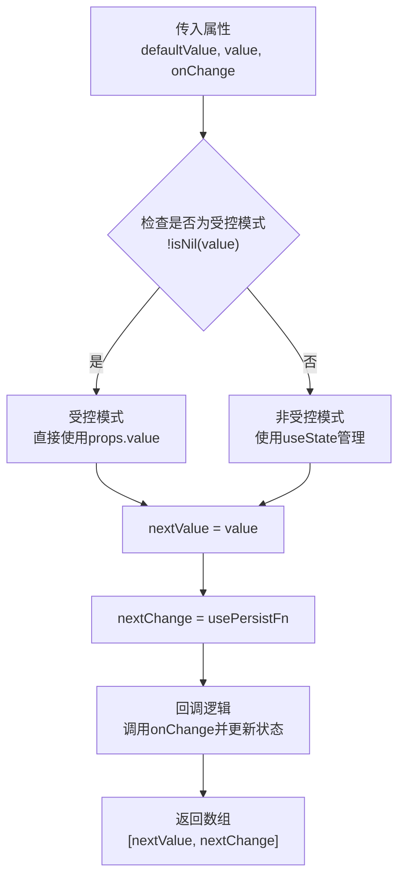
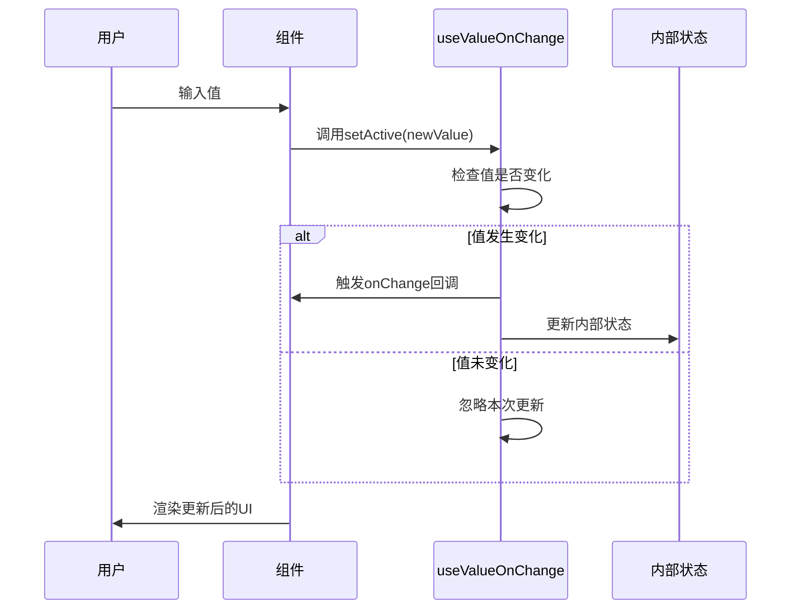
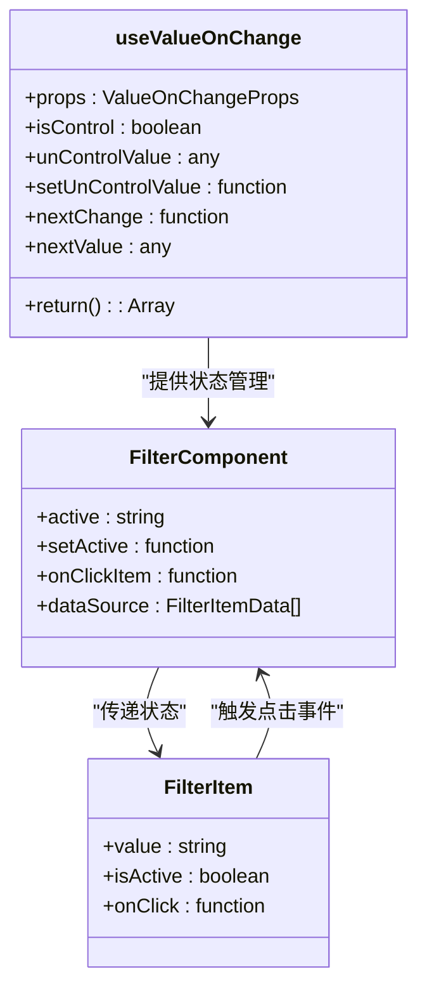
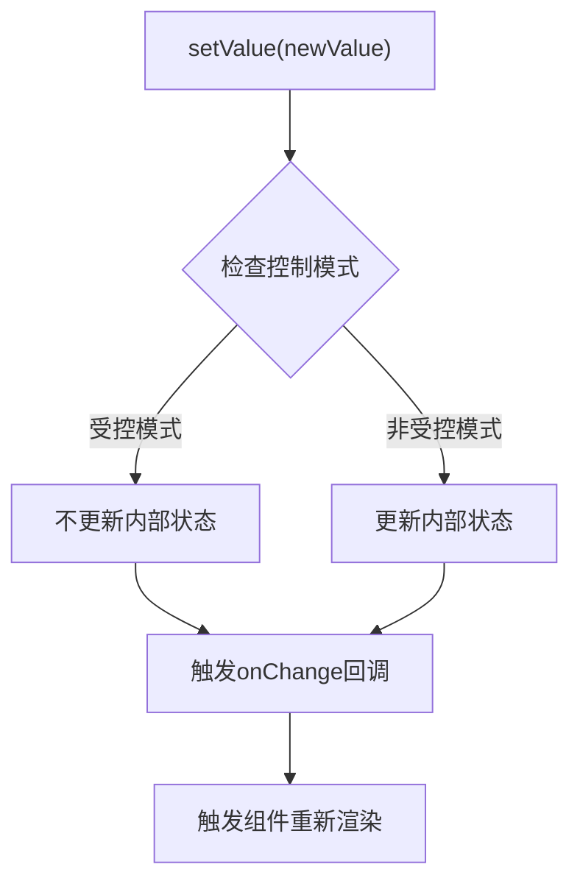

# useValueOnChange Hook详细文档

<cite>
**本文档引用的文件**
- [useValueOnChange.ts](file://src/hooks/useValueOnChange.ts)
- [usePersistFn.ts](file://src/hooks/usePersistFn.ts)
- [filter.tsx](file://src/filter/filter.tsx)
- [filter-types.ts](file://src/filter/filter-types.ts)
- [index.ts](file://src/hooks/index.ts)
- [useValueOnChange.d.ts](file://types/0buildTypes/hooks/useValueOnChange.d.ts)
</cite>

## 目录
1. [简介](#简介)
2. [核心功能概述](#核心功能概述)
3. [Hook实现原理](#hook实现原理)
4. [类型定义详解](#类型定义详解)
5. [使用场景分析](#使用场景分析)
6. [实际应用示例](#实际应用示例)
7. [性能优化策略](#性能优化策略)
8. [常见问题与解决方案](#常见问题与解决方案)
9. [最佳实践指南](#最佳实践指南)
10. [总结](#总结)

## 简介

`useValueOnChange`是一个专门为React组件设计的状态管理Hook，它巧妙地封装了值变化的监听逻辑，提供了简洁的`onChange`回调处理机制。该Hook支持受控和非受控两种模式，能够智能判断值的变化并仅在有效变化时触发回调，从而避免不必要的更新操作。

## 核心功能概述

### 主要特性

1. **双模式支持**：同时支持受控组件（controlled）和非受控组件（uncontrolled）模式
2. **智能值比较**：自动判断值是否发生变化，避免无效的回调触发
3. **持久化回调**：通过`usePersistFn`确保回调函数的稳定性
4. **类型安全**：完整的TypeScript类型定义，提供良好的开发体验
5. **灵活配置**：支持初始值、当前值和变更回调函数的灵活配置

### 设计理念

`useValueOnChange`的设计核心在于简化值变化的处理逻辑，让开发者能够专注于业务逻辑而非状态管理细节。它通过抽象常见的值变化模式，减少了样板代码的编写，提高了代码的可维护性和可读性。

## Hook实现原理

### 核心架构



**图表来源**
- [useValueOnChange.ts](file://src/hooks/useValueOnChange.ts#L4-L33)

### 实现细节分析

#### 受控与非受控模式判断

```typescript
const {defaultValue, value, onChange} = props;
const isControl = !isNil(value);
```

Hook通过检查`value`属性是否存在来判断组件是处于受控还是非受控模式。这种设计使得Hook具有高度的灵活性，能够适应不同的使用场景。

#### 状态管理策略

```typescript
const [unControlValue, setUnControlValue] = useState(defaultValue);
const nextValue = isControl ? value : unControlValue;
```

在非受控模式下，Hook会使用React的`useState`来管理组件内部的状态，而在受控模式下则直接使用外部传入的`value`。

#### 回调函数优化

```typescript
const nextChange = usePersistFn((newValue: any, b: any, c: any) => {
    if (typeof onChange === "function") {
        onChange(newValue, b, c);
    }
    
    if (!isControl) {
        setUnControlValue(newValue);
    }
});
```

通过`usePersistFn`包装回调函数，确保回调函数在组件重新渲染时保持引用稳定，避免不必要的子组件重新渲染。

**章节来源**
- [useValueOnChange.ts](file://src/hooks/useValueOnChange.ts#L4-L33)

## 类型定义详解

### 完整类型定义

```typescript
interface ValueOnChangeProps<T = any> {
    defaultValue?: T;
    value?: T;
    onChange?: (newValue: T, extraParam1?: any, extraParam2?: any) => void;
}

function useValueOnChange<T>(props: ValueOnChangeProps<T>): [T, (newValue: T, extraParam1?: any, extraParam2?: any) => void];
```

### 类型参数说明

1. **泛型参数T**：支持任意类型的值，提供完全的类型安全性
2. **defaultValue**：可选的初始值，用于非受控模式
3. **value**：可选的当前值，用于受控模式
4. **onChange**：可选的变更回调函数，接收新值和其他额外参数

### 返回值类型

Hook返回一个元组：
- 第一个元素：当前值（受控模式使用props.value，非受控模式使用内部状态）
- 第二个元素：变更回调函数，经过`usePersistFn`优化

**章节来源**
- [filter-types.ts](file://src/filter/filter-types.ts#L18-L28)
- [useValueOnChange.d.ts](file://types/0buildTypes/hooks/useValueOnChange.d.ts#L0-L1)

## 使用场景分析

### 表单控件场景



**图表来源**
- [filter.tsx](file://src/filter/filter.tsx#L90-L95)

### 选择器组件场景

在过滤器组件中，`useValueOnChange`被用来管理当前激活项的状态：

```typescript
// 在Filter组件中的使用
const [active, setActive] = useValueOnChange(props);

const onClickItem = usePersistFn((d: FilterItemData) => {
    setActive(d.value, d);
});
```

这种模式特别适合需要跟踪用户选择状态的组件，如标签页、选项卡、过滤器等。

### 状态同步场景



**图表来源**
- [filter.tsx](file://src/filter/filter.tsx#L90-L105)

**章节来源**
- [filter.tsx](file://src/filter/filter.tsx#L90-L105)

## 实际应用示例

### 基础使用示例

```typescript
// 受控模式
const MyComponent = ({ value, onChange }) => {
    const [currentValue, setValue] = useValueOnChange({
        value,
        onChange
    });
    
    return (
        <input 
            value={currentValue} 
            onChange={(e) => setValue(e.target.value)}
        />
    );
};

// 非受控模式
const MyComponent = ({ defaultValue }) => {
    const [value, setValue] = useValueOnChange({
        defaultValue
    });
    
    return (
        <input 
            value={value} 
            onChange={(e) => setValue(e.target.value)}
        />
    );
};
```

### 复杂对象处理示例

```typescript
// 处理复杂对象的变更
const [formData, setFormData] = useValueOnChange({
    defaultValue: { name: '', age: 0 },
    onChange: (newData, field) => {
        console.log('字段:', field, '新值:', newData[field]);
    }
});

// 设置特定字段
setFormData({ ...formData, name: 'John' }, 'name');
```

### 数组数据处理示例

```typescript
// 处理数组数据
const [items, setItems] = useValueOnChange({
    defaultValue: [],
    onChange: (newItems, operation) => {
        console.log('操作:', operation, '新列表:', newItems);
    }
});

// 添加新项
setItems([...items, newItem], 'add');

// 删除某项
setItems(items.filter(item => item.id !== targetId), 'remove');
```

**章节来源**
- [filter.tsx](file://src/filter/filter.tsx#L90-L95)

## 性能优化策略

### 持久化回调函数

`useValueOnChange`通过`usePersistFn`实现了回调函数的持久化，这是性能优化的关键：

```typescript
const nextChange = usePersistFn((newValue: any, b: any, c: any) => {
    if (typeof onChange === "function") {
        onChange(newValue, b, c);
    }
    
    if (!isControl) {
        setUnControlValue(newValue);
    }
});
```

这种设计避免了每次组件重新渲染时都创建新的回调函数实例，从而减少了不必要的子组件重新渲染。

### 状态更新优化



**图表来源**
- [useValueOnChange.ts](file://src/hooks/useValueOnChange.ts#L15-L25)

### 内存泄漏防护

通过合理使用React的`useState`和`useRef`，Hook有效地管理了内存使用：

1. **useState**：仅在非受控模式下使用，避免不必要的状态开销
2. **useRef**：用于存储持久化的回调函数，避免重复创建
3. **条件渲染**：根据控制模式动态决定状态管理策略

**章节来源**
- [usePersistFn.ts](file://src/hooks/usePersistFn.ts#L3-L28)

## 常见问题与解决方案

### 问题1：深度比较性能问题

**问题描述**：当处理复杂对象或数组时，简单的相等比较可能不够准确。

**解决方案**：
```typescript
// 自定义比较函数
const compareObjects = (a: any, b: any) => {
    return JSON.stringify(a) === JSON.stringify(b);
};

// 或者使用专门的比较库
import {isEqual} from 'lodash';

const [data, setData] = useValueOnChange({
    defaultValue: {},
    onChange: (newData) => {
        // 深度比较后处理
        if (!isEqual(data, newData)) {
            // 执行变更逻辑
        }
    }
});
```

### 问题2：异步更新处理

**问题描述**：在异步操作中，可能会出现状态不一致的问题。

**解决方案**：
```typescript
const [loading, setLoading] = useState(false);
const [data, setData] = useValueOnChange({
    defaultValue: []
});

const fetchData = async () => {
    setLoading(true);
    try {
        const newData = await api.getData();
        setData(newData); // 确保数据更新
    } finally {
        setLoading(false);
    }
};
```

### 问题3：多层嵌套状态管理

**问题描述**：在复杂的组件树中，状态管理变得困难。

**解决方案**：
```typescript
// 使用context进行状态提升
const FormContext = createContext();

const FormProvider = ({ children }) => {
    const [formData, setFormData] = useValueOnChange({
        defaultValue: {}
    });
    
    return (
        <FormContext.Provider value={{ formData, setFormData }}>
            {children}
        </FormContext.Provider>
    );
};

// 子组件中使用
const FormField = ({ name }) => {
    const { formData, setFormData } = useContext(FormContext);
    
    return (
        <input
            value={formData[name] || ''}
            onChange={(e) => setFormData({
                ...formData,
                [name]: e.target.value
            }, name)}
        />
    );
};
```

### 问题4：类型安全问题

**问题描述**：在大型项目中，类型定义可能变得复杂。

**解决方案**：
```typescript
// 定义明确的接口
interface FormData {
    name: string;
    email: string;
    age: number;
}

const [formData, setFormData] = useValueOnChange<FormData>({
    defaultValue: { name: '', email: '', age: 0 }
});

// 类型安全的更新
setFormData({
    ...formData,
    name: 'New Name'
}, 'name'); // 编译时检查字段名
```

## 最佳实践指南

### 1. 合理选择控制模式

```typescript
// 推荐：明确选择控制模式
const ControlledComponent = ({ value, onChange }) => {
    const [localValue, setLocalValue] = useValueOnChange({
        value,
        onChange
    });
    
    return <input value={localValue} onChange={e => setLocalValue(e.target.value)} />;
};

// 或者非受控模式
const UncontrolledComponent = ({ defaultValue }) => {
    const [value, setValue] = useValueOnChange({
        defaultValue
    });
    
    return <input value={value} onChange={e => setValue(e.target.value)} />;
};
```

### 2. 错误处理策略

```typescript
const [data, setData] = useValueOnChange({
    defaultValue: [],
    onChange: (newData) => {
        try {
            // 数据验证
            validateData(newData);
            
            // 执行业务逻辑
            processData(newData);
            
        } catch (error) {
            console.error('数据变更失败:', error);
            // 可以在这里恢复到上一个有效状态
        }
    }
});
```

### 3. 性能监控

```typescript
const [value, setValue] = useValueOnChange({
    defaultValue: '',
    onChange: (newValue) => {
        // 性能监控
        const startTime = performance.now();
        
        // 执行变更逻辑
        processChange(newValue);
        
        const endTime = performance.now();
        console.log(`变更处理耗时: ${endTime - startTime}ms`);
    }
});
```

### 4. 测试友好设计

```typescript
// 导出测试工具函数
export const createTestHook = (props: any) => {
    const result = useValueOnChange(props);
    return {
        currentValue: result[0],
        changeValue: result[1],
        debug: () => {
            console.log('Hook状态:', {
                props,
                currentValue: result[0]
            });
        }
    };
};
```

### 5. 文档和注释规范

```typescript
/**
 * useValueOnChange Hook
 * @param props - Hook配置参数
 * @param props.defaultValue - 初始值（非受控模式）
 * @param props.value - 当前值（受控模式）
 * @param props.onChange - 值变更回调函数
 * @returns [currentValue, handleChange] - 当前值和变更处理器
 * 
 * @example
 * // 受控模式
 * const [value, setValue] = useValueOnChange({
 *   value: controlledValue,
 *   onChange: handleValueChange
 * });
 */
```

## 总结

`useValueOnChange`是一个设计精良的状态管理Hook，它通过巧妙的模式识别和智能的状态管理，为React组件提供了强大而灵活的值变化处理能力。其主要优势包括：

1. **统一的API设计**：无论是受控还是非受控组件，都使用相同的API，降低了学习成本
2. **性能优化**：通过持久化回调和智能状态管理，有效减少不必要的重新渲染
3. **类型安全**：完整的TypeScript支持，提供良好的开发体验
4. **易于扩展**：清晰的架构设计，便于添加新的功能特性

在实际项目中，`useValueOnChange`特别适用于以下场景：
- 表单控件的状态管理
- 选择器和过滤器组件
- 多级联动组件
- 需要历史记录或撤销功能的组件

通过遵循本文档提供的最佳实践和解决方案，开发者可以充分发挥`useValueOnChange`的优势，构建更加高效、可维护的React应用程序。