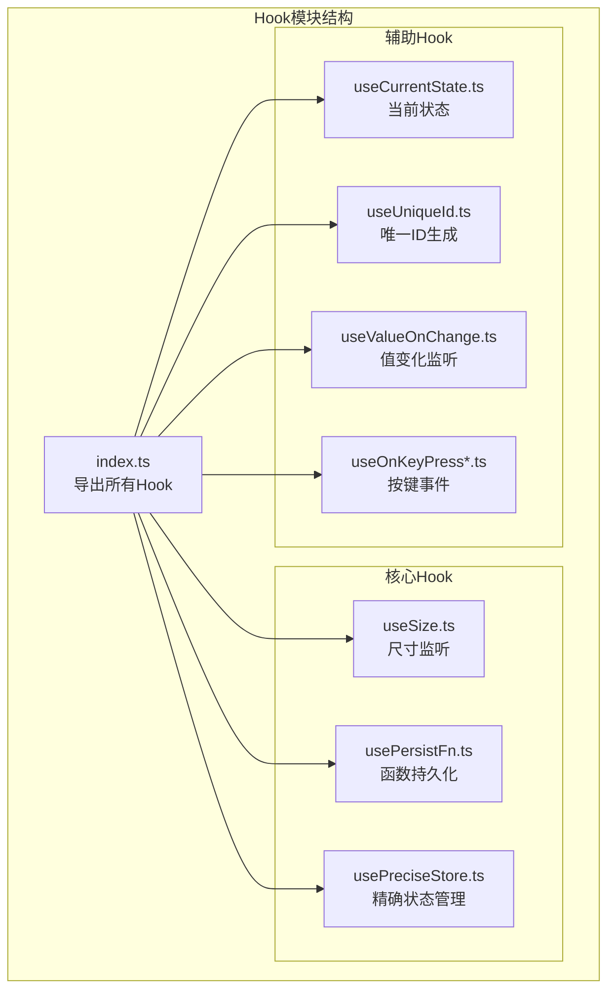
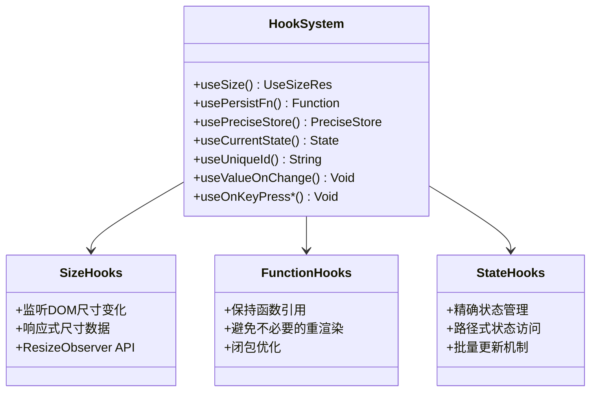
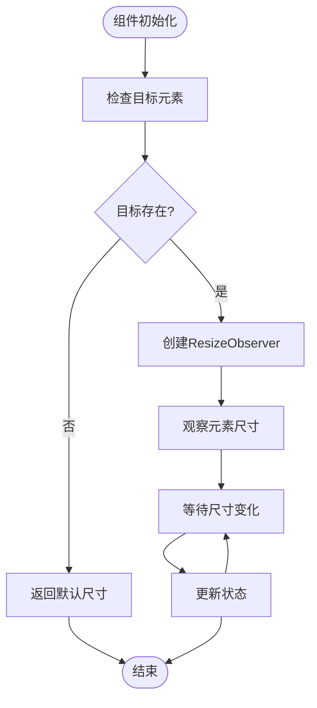
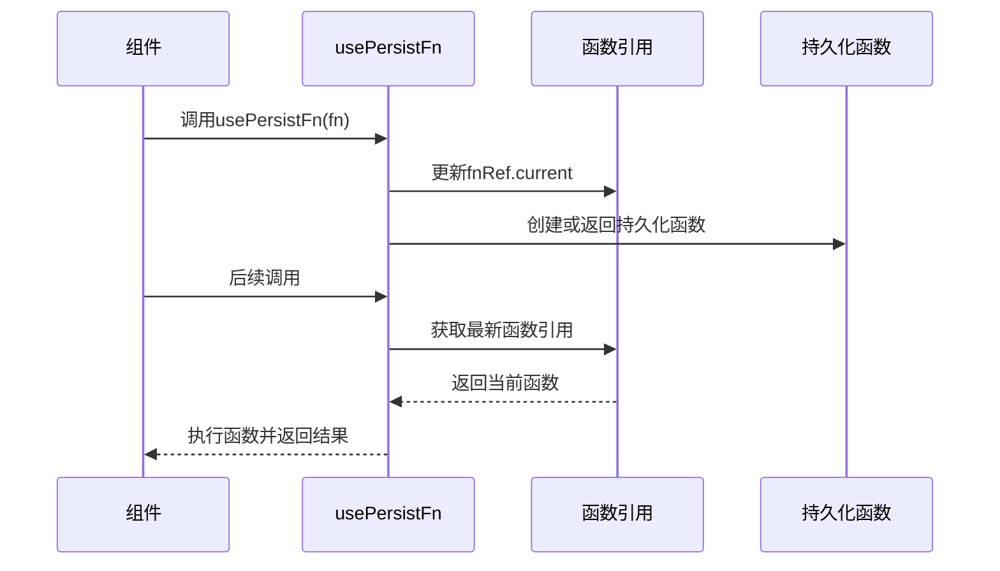
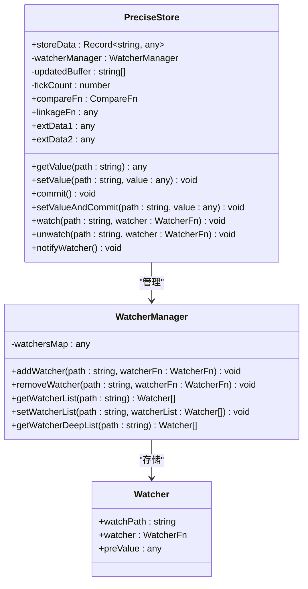
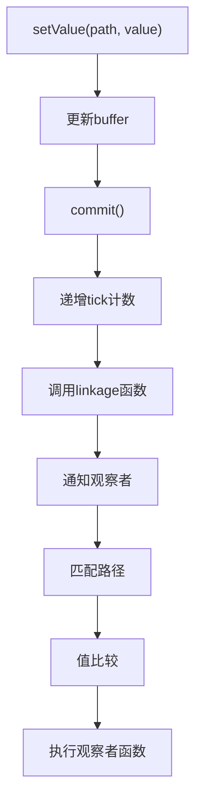
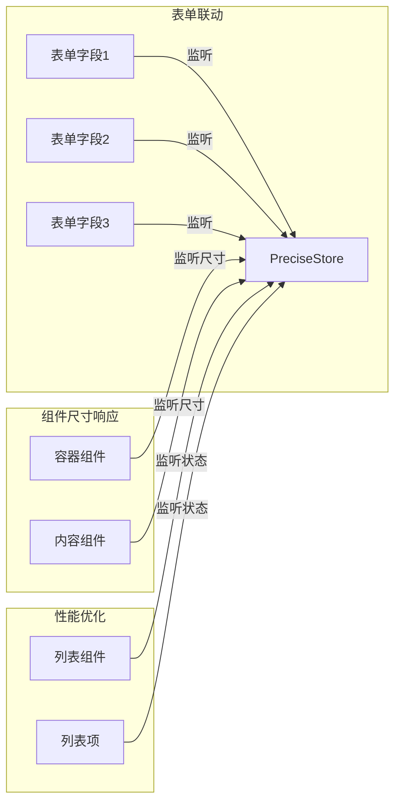
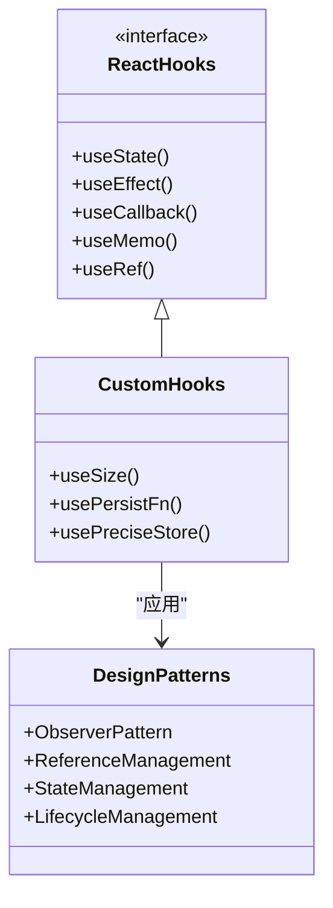
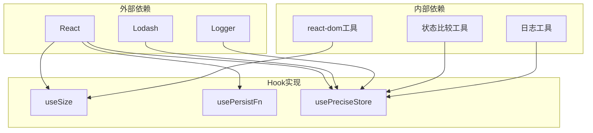
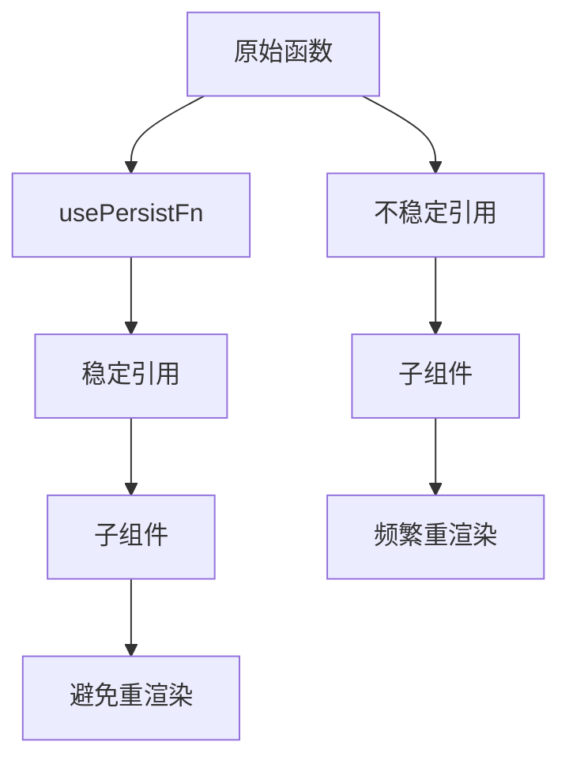

# 自定义Hook详细参考文档

<cite>
**本文档中引用的文件**
- [src/hooks/index.ts](file://src/hooks/index.ts)
- [src/hooks/useSize.ts](file://src/hooks/useSize.ts)
- [src/hooks/usePersistFn.ts](file://src/hooks/usePersistFn.ts)
- [src/hooks/usePreciseStore.ts](file://src/hooks/usePreciseStore.ts)
- [types/hooks/index.d.ts](file://types/hooks/index.d.ts)
- [types/0buildTypes/hooks/useSize.d.ts](file://types/0buildTypes/hooks/useSize.d.ts)
- [types/0buildTypes/hooks/usePersistFn.d.ts](file://types/0buildTypes/hooks/usePersistFn.d.ts)
- [types/0buildTypes/hooks/usePreciseStore.d.ts](file://types/0buildTypes/hooks/usePreciseStore.d.ts)
</cite>

## 目录
1. [简介](#简介)
2. [项目结构](#项目结构)
3. [核心Hook概览](#核心hook概览)
4. [useSize Hook详解](#usesize-hook详解)
5. [usePersistFn Hook详解](#usepersistfn-hook详解)
6. [usePreciseStore Hook详解](#useprecisestore-hook详解)
7. [架构设计分析](#架构设计分析)
8. [实际应用场景](#实际应用场景)
9. [性能优化策略](#性能优化策略)
10. [常见问题解决](#常见问题解决)
11. [总结](#总结)

## 简介

Fat Design是一个基于React的UI组件库，其中包含了一套精心设计的自定义Hook系统。这些Hook不仅提供了强大的功能，还展示了React Hooks的最佳实践和高级技巧。本文档将深入解析三个核心Hook：`useSize`、`usePersistFn`和`usePreciseStore`，探讨它们的实现原理、使用场景以及性能优化策略。

这些Hook分别解决了不同的技术挑战：
- **useSize**：监听DOM元素尺寸变化，提供响应式的尺寸数据
- **usePersistFn**：创建在组件重渲染时保持函数引用不变的持久化函数
- **usePreciseStore**：实现精确的状态监听与更新，支持复杂的状态管理需求

## 项目结构

Fat Design的Hook模块位于`src/hooks`目录下，包含了多个专门的Hook实现：



**图表来源**
- [src/hooks/index.ts](file://src/hooks/index.ts#L1-L30)

**章节来源**
- [src/hooks/index.ts](file://src/hooks/index.ts#L1-L30)

## 核心Hook概览

### Hook分类与功能



**图表来源**
- [src/hooks/useSize.ts](file://src/hooks/useSize.ts#L1-L44)
- [src/hooks/usePersistFn.ts](file://src/hooks/usePersistFn.ts#L1-L29)
- [src/hooks/usePreciseStore.ts](file://src/hooks/usePreciseStore.ts#L1-L299)

## useSize Hook详解

### 实现原理

`useSize` Hook利用ResizeObserver API监听DOM元素的尺寸变化，提供响应式的宽度和高度数据。

```typescript
interface UseSizeRes {
    width: number;
    height: number;
}

function useSize(target: any): UseSizeRes {
    const [state, setState] = useState({
        width: 0,
        height: 0
    });

    useEffect(() => {
        const el = getTargetElement(target);
        if (!el) {
            return;
        }

        const resizeObserver = new ResizeObserver((entries) => {
            entries.forEach((entry) => {
                const {clientWidth, clientHeight} = entry.target;
                setState({width: clientWidth, height: clientHeight});
            });
        });

        resizeObserver.observe(el);
        return () => {
            resizeObserver.disconnect();
        };
    }, [])

    return state;
}
```

### 关键特性

1. **响应式尺寸数据**：通过ResizeObserver实时监听元素尺寸变化
2. **自动清理**：组件卸载时自动断开观察器连接
3. **兼容性处理**：通过`getTargetElement`函数处理不同类型的target参数
4. **初始状态**：提供默认的0尺寸作为初始值

### 使用场景



**图表来源**
- [src/hooks/useSize.ts](file://src/hooks/useSize.ts#L10-L35)

### 类型定义

```typescript
export interface UseSizeRes {
    width: number;
    height: number;
}
```

**章节来源**
- [src/hooks/useSize.ts](file://src/hooks/useSize.ts#L1-L44)
- [types/0buildTypes/hooks/useSize.d.ts](file://types/0buildTypes/hooks/useSize.d.ts#L1-L7)

## usePersistFn Hook详解

### 实现原理

`usePersistFn` Hook通过巧妙的引用管理和闭包机制，确保函数在组件重渲染时保持引用不变。

```typescript
function usePersistFn(fn: any) {
    const fnRef = useRef(fn);
    fnRef.current = useMemo(function () {
        return fn;
    }, [fn]);

    const memoizedFn = useRef<any>();
    if (!memoizedFn.current) {
        memoizedFn.current = function () {
            const args: any[] = [];
            for (let i = 0; i < arguments.length; i++) {
                args[i] = arguments[i];
            }
            return fnRef.current.apply(this, args);
        };
    }
    return memoizedFn.current;
}
```

### 核心机制



**图表来源**
- [src/hooks/usePersistFn.ts](file://src/hooks/usePersistFn.ts#L3-L25)

### 性能优势

1. **引用稳定性**：函数引用在整个组件生命周期内保持不变
2. **避免重渲染**：传递给子组件的回调函数不会因父组件重渲染而改变
3. **内存效率**：只在必要时创建新的函数实例
4. **参数处理**：正确处理可变参数列表

### 使用示例

```typescript
// 基本用法
const handleClick = usePersistFn((id: string) => {
    console.log('Clicked:', id);
});

// 传递给子组件
<Button onClick={handleClick}>点击我</Button>

// 在effect中使用
useEffect(() => {
    const timer = setInterval(handleClick, 1000);
    return () => clearInterval(timer);
}, []);
```

**章节来源**
- [src/hooks/usePersistFn.ts](file://src/hooks/usePersistFn.ts#L1-L29)
- [types/0buildTypes/hooks/usePersistFn.d.ts](file://types/0buildTypes/hooks/usePersistFn.d.ts#L1-L4)

## usePreciseStore Hook详解

### 架构设计

`usePreciseStore`是一个复杂的状态管理系统，提供了精确的状态监听和更新机制。



**图表来源**
- [src/hooks/usePreciseStore.ts](file://src/hooks/usePreciseStore.ts#L50-L150)

### 核心功能

#### 1. 精确状态管理

```typescript
class PreciseStore {
    constructor(initialValues: Record<any, any>, compareFn?: CompareFn, linkageFn?: any) {
        this.storeData = initialValues || {};
        this.compareFn = compareFn || DEFAULT_COMPARE_FN;
        this.linkageFn = linkageFn;
        this.updatedBuffer = [];
    }

    setValue(path: string, value: any) {
        _set(this.storeData, path, value);
        this.updatedBuffer.push(path);
    }

    commit() {
        this.tickCount = this.tickCount + 1;
        _set(this.storeData, KEY_SAVED_TICK_COUNT, this.tickCount);
        if (typeof this.linkageFn === "function") {
            this.linkageFn(this.storeData, this);
        }
        this.notifyWatcher();
    }
}
```

#### 2. 路径式状态访问



**图表来源**
- [src/hooks/usePreciseStore.ts](file://src/hooks/usePreciseStore.ts#L100-L130)

#### 3. 观察者模式实现

```typescript
class WatcherManager {
    addWatcher(path: string, watcherFn: WatcherFn) {
        this.getWatcherList(path).push({watcher: watcherFn, watchPath: path, preValue: undefined})
    }

    getWatcherDeepList(path: string): Watcher[] {
        const s = _get(this.watchersMap, path);
        if (!s) {
            return [];
        }
        const result: Watcher[] = [];
        travelWatchersMap(s, result);
        return result;
    }
}
```

### Hook接口

#### usePreciseValue Hook

```typescript
function usePreciseValue(store: PreciseStore, path: string): [any, UpdateFn<AnyType>, GetFn<AnyType>, PreciseStore] {
    const valueRef = useRef<any>();

    const [value, setValue] = useState(() => {
        const nowValue = store.getValue(path);
        valueRef.current = nowValue;
        return nowValue;
    });

    useEffect(() => {
        const init = () => {
            const nextValue = store.getValue(path);
            if (valueRef.current !== nextValue) {
                valueRef.current = nextValue;
                setValue(nextValue);
            }
        }

        init();

        const watcher = (nextValue: any) => {
            if (valueRef.current !== nextValue) {
                valueRef.current = nextValue;
                setValue(nextValue);
            }
        };

        store.watch(path, watcher);

        return () => {
            store.unwatch(path, watcher);
        }
    }, [store, path]);

    return [value, updateValue, getCurrent, store];
}
```

#### usePreciseTick Hook

```typescript
function usePreciseTick(store: PreciseStore): [AnyType, UpdateFn<AnyType>, GetFn<AnyType>, PreciseStore] {
    return usePreciseValue(store, KEY_SAVED_TICK_COUNT);
}
```

### 使用场景



**章节来源**
- [src/hooks/usePreciseStore.ts](file://src/hooks/usePreciseStore.ts#L1-L299)
- [types/0buildTypes/hooks/usePreciseStore.d.ts](file://types/0buildTypes/hooks/usePreciseStore.d.ts#L1-L54)

## 架构设计分析

### 设计模式应用



### 依赖关系分析



**图表来源**
- [src/hooks/useSize.ts](file://src/hooks/useSize.ts#L1-L5)
- [src/hooks/usePreciseStore.ts](file://src/hooks/usePreciseStore.ts#L1-L10)

## 实际应用场景

### 场景一：表单联动

```typescript
// 创建状态存储
const store = useCreatePreciseStore({
    form: {
        name: '',
        email: '',
        phone: ''
    }
});

// 监听邮箱变化，自动填充用户名
usePreciseValue(store, 'form.email');
store.watch('form.email', (email, prevEmail) => {
    if (email && !store.getValue('form.name')) {
        const username = email.split('@')[0];
        store.setValueAndCommit('form.name', username);
    }
});
```

### 场景二：组件尺寸响应

```typescript
// 监听容器尺寸变化
const containerRef = useRef<HTMLDivElement>(null);
const size = useSize(containerRef);

// 根据尺寸调整布局
useEffect(() => {
    if (size.width > 768) {
        setLayout('desktop');
    } else {
        setLayout('mobile');
    }
}, [size]);
```

### 场景三：性能优化

```typescript
// 使用持久化函数避免不必要的重渲染
const handleScroll = usePersistFn((event) => {
    // 处理滚动事件
    debouncedUpdate(event);
});

// 在effect中使用
useEffect(() => {
    window.addEventListener('scroll', handleScroll);
    return () => {
        window.removeEventListener('scroll', handleScroll);
    };
}, []);
```

## 性能优化策略

### 1. 引用稳定性优化



### 2. 状态更新优化

```typescript
// 批量更新策略
const store = useCreatePreciseStore(initialValues);

// 分别设置多个值
store.setValue('user.name', 'John');
store.setValue('user.age', 30);
store.setValue('user.email', 'john@example.com');

// 一次性提交
store.commit(); // 只触发一次通知
```

### 3. 内存管理

```typescript
// 正确的清理机制
useEffect(() => {
    const cleanup = store.watch('path', handler);
    return () => {
        store.unwatch('path', handler);
        cleanup(); // 清理观察者
    };
}, []);

// 避免内存泄漏
const store = useCreatePreciseStore({});
// 组件卸载时自动清理
```

## 常见问题解决

### 问题1：useSize无法获取尺寸

**原因分析**：
- DOM元素尚未挂载
- target参数无效
- ResizeObserver不支持

**解决方案**：
```typescript
// 安全的尺寸监听
const [size, setSize] = useState({width: 0, height: 0});

useEffect(() => {
    const element = ref.current;
    if (!element) return;

    const observer = new ResizeObserver(entries => {
        for (const entry of entries) {
            const {width, height} = entry.contentRect;
            setSize({width, height});
        }
    });

    observer.observe(element);
    return () => observer.disconnect();
}, []);

// 或使用更安全的实现
const safeSize = useSize(ref);
const {width, height} = safeSize;
```

### 问题2：usePersistFn导致内存泄漏

**原因分析**：
- 函数引用未正确清理
- 循环引用
- 外部变量捕获过多

**解决方案**：
```typescript
// 正确的使用方式
const callback = usePersistFn((data) => {
    // 只捕获必要的变量
    processData(data);
});

// 避免捕获整个对象
const badCallback = usePersistFn(() => {
    // 错误：捕获整个this
    this.process();
});

// 正确：只捕获需要的属性
const goodCallback = usePersistFn(() => {
    process(this.data);
});
```

### 问题3：usePreciseStore性能问题

**原因分析**：
- 过多的观察者
- 频繁的状态更新
- 复杂的比较函数

**解决方案**：
```typescript
// 优化观察者数量
const store = useCreatePreciseStore(initialState);

// 只监听必要的路径
store.watch('important.path', handler);

// 使用简单的比较函数
const store = useCreatePreciseStore(
    initialState, 
    'shallowEqual' // 使用浅比较
);

// 批量更新
store.setValue('a', valueA);
store.setValue('b', valueB);
store.setValue('c', valueC);
store.commit(); // 一次性通知
```

## 总结

Fat Design的自定义Hook系统展现了React Hooks的强大能力和设计智慧。通过深入分析这三个核心Hook，我们可以看到：

### 技术亮点

1. **useSize**：优雅地封装了ResizeObserver API，提供了简洁的尺寸监听能力
2. **usePersistFn**：巧妙地解决了函数引用稳定性问题，显著提升了性能
3. **usePreciseStore**：实现了复杂的状态管理系统，支持精确的状态监听和批量更新

### 最佳实践

1. **合理使用引用稳定性**：在需要避免重渲染的场景中优先使用`usePersistFn`
2. **精确状态管理**：对于复杂的表单联动和状态同步需求，`usePreciseStore`提供了强大的解决方案
3. **性能优先**：通过批量更新和智能比较，最大化减少不必要的重新渲染

### 应用建议

1. **渐进式采用**：根据项目需求逐步引入这些Hook
2. **充分测试**：特别是对于状态管理相关的Hook，要进行充分的单元测试
3. **文档维护**：为团队成员提供详细的使用指南和最佳实践

这些Hook不仅解决了具体的技术问题，更重要的是展示了如何在React生态系统中构建高质量、高性能的自定义Hook。通过学习和应用这些设计模式，开发者可以提升自己的React技能，构建更加优秀的用户界面。