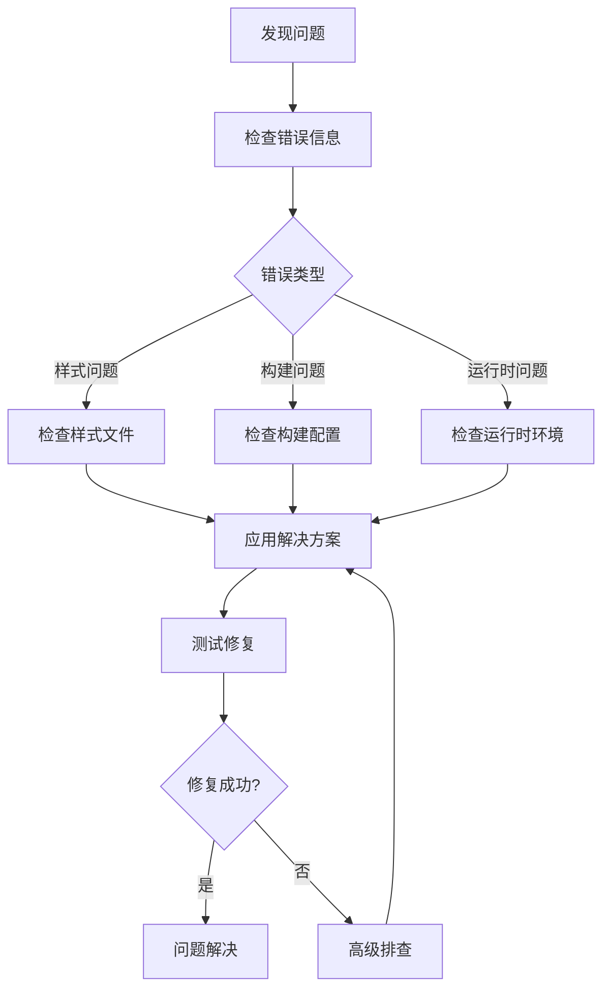

# 常见问题解答

<cite>
**本文档引用的文件**
- [README.md](file://README.md)
- [package.json](file://package.json)
- [vite.config.ts](file://vite.config.ts)
- [src/util/react-dom.ts](file://src/util/react-dom.ts)
- [src/core/style/_size.scss](file://src/core/style/_size.scss)
- [pnpm-lock.yaml](file://pnpm-lock.yaml)
- [package-lock.json](file://package-lock.json)
</cite>

## 目录
1. [简介](#简介)
2. [样式问题](#样式问题)
3. [Tree-shaking问题](#tree-shaking问题)
4. [React版本兼容性](#react版本兼容性)
5. [TypeScript类型错误](#typescript类型错误)
6. [构建工具集成](#构建工具集成)
7. [环境配置问题](#环境配置问题)
8. [调试技巧和诊断工具](#调试技巧和诊断工具)
9. [性能优化建议](#性能优化建议)
10. [故障排除指南](#故障排除指南)

## 简介

Fat Design 是一个轻量级的React UI组件库，具有以下特点：
- 体积更小：构建后仅761KB（相比Next的1.1MB）
- 功能强大：包含Form2、Table、Image、QueryForm等高级组件
- 兼容性强：支持React 16、17、18版本
- 模块化设计：支持Tree-shaking优化

本文档旨在帮助开发者解决在使用Fat Design过程中遇到的常见问题，提供详细的故障排查步骤和解决方案。

## 样式问题

### 问题1：样式未生效

**症状表现：**
- 组件外观不符合预期
- 样式类名存在但不生效
- 主题颜色无法应用

**可能原因：**
1. 样式文件未正确引入
2. CSS模块加载顺序问题
3. 样式冲突或覆盖
4. SCSS变量未正确编译

**解决方案：**

#### 1. 检查样式文件引入
确保正确引入了组件样式：

```javascript
// 正确的引入方式
import 'fat-design/dist/index.css'; // 全局样式
import 'fat-design/dist/theme-default.css'; // 默认主题
```

#### 2. 检查SCSS变量定义
Fat Design使用了一套完整的尺寸系统，确保你的项目支持SCSS变量：

```scss
// 引入核心样式变量
@import "fat-design/src/core/style/_size.scss";
@import "fat-design/src/core/style/_color.scss";
```

#### 3. 解决样式冲突
使用CSS模块或命名空间避免样式冲突：

```javascript
// 使用CSS模块
import styles from './myStyles.module.scss';

<div className={styles.customButton}>
  <Button>按钮</Button>
</div>
```

**节来源**
- [src/core/style/_size.scss](file://src/core/style/_size.scss#L1-L290)

### 问题2：主题切换失败

**症状表现：**
- 主题切换后样式不变
- 自定义主题不生效

**解决方案：**

#### 1. 使用主题组件
```javascript
import { ThemeProvider } from 'fat-design';

<ThemeProvider theme="blue">
  <App />
</ThemeProvider>
```

#### 2. 手动引入主题文件
```javascript
// 引入特定主题
import 'fat-design/dist/theme-blue1.css';
```

#### 3. 自定义主题变量
```scss
// 自定义主题变量
$primary-color: #1890ff;
$success-color: #52c41a;
$error-color: #f5222d;

@import "fat-design/src/theme/theme-default.scss";
```

## Tree-shaking问题

### 问题3：Tree-shaking失效

**症状表现：**
- 构建后的bundle体积过大
- 未使用的组件仍然被打包
- Tree-shaking统计显示未优化

**可能原因：**
1. 动态导入语法问题
2. 模块导出方式不当
3. 构建配置问题

**解决方案：**

#### 1. 检查模块导入方式
使用正确的ES6模块导入：

```javascript
// 推荐：按需导入
import { Button, Form } from 'fat-design';

// 避免：全量导入
import FatDesign from 'fat-design';
```

#### 2. 配置构建工具
确保Vite配置正确：

```javascript
// vite.config.ts
export default defineConfig({
  build: {
    rollupOptions: {
      external: ['react', 'react-dom'], // 外部化React
      output: {
        globals: {
          react: 'React',
          'react-dom': 'ReactDOM',
        },
      },
    },
  },
});
```

#### 3. 使用可视化工具分析
运行以下命令生成bundle分析报告：

```bash
npm run build
# 生成 stats.html 文件用于分析
```

**节来源**
- [vite.config.ts](file://vite.config.ts#L40-L119)

### 问题4：模块解析失败

**症状表现：**
- Cannot resolve module错误
- TypeScript无法找到类型定义

**解决方案：**

#### 1. 检查TypeScript配置
确保tsconfig.json配置正确：

```json
{
  "compilerOptions": {
    "moduleResolution": "node",
    "esModuleInterop": true,
    "allowSyntheticDefaultImports": true,
    "declaration": true,
    "declarationDir": "types"
  }
}
```

#### 2. 清理缓存重新安装
```bash
rm -rf node_modules
rm package-lock.json
npm cache clean --force
npm install
```

## React版本兼容性

### 问题5：React版本不兼容

**症状表现：**
- React版本警告
- 组件渲染异常
- 生命周期方法报错

**解决方案：**

#### 1. 支持的React版本
Fat Design支持以下React版本：
- React 16.x
- React 17.x  
- React 18.x
- React 19.x

#### 2. 版本检测和适配
系统自动检测React版本并适配：

```javascript
// 自动适配不同版本的ReactDOM
import { pReactDOM } from 'fat-design/src/util/react-dom';

// 创建根节点
const root = pReactDOM.createRoot(container);
root.render(<App />);
```

#### 3. 升级到React 18
如果使用React 18，确保正确配置：

```javascript
import { createRoot } from 'react-dom/client';
import { pReactDOM } from 'fat-design/src/util/react-dom';

// 配置React 18
pReactDOM.configReactDOM18(ReactDOM, ReactDOMClient);

// 使用新的渲染API
const root = pReactDOM.createRoot(container);
root.render(<App />);
```

**节来源**
- [src/util/react-dom.ts](file://src/util/react-dom.ts#L1-L236)

### 问题6：Hooks使用问题

**症状表现：**
- Hooks调用顺序错误
- 条件渲染导致Hooks异常
- 自定义Hooks无法正常工作

**解决方案：**

#### 1. 遵循Hooks规则
- 只在函数组件顶层调用Hooks
- 不要在循环、条件或嵌套函数中调用Hooks
- 确保Hooks调用顺序一致

#### 2. 使用官方推荐的Hooks
```javascript
import { useComparedState, useCurrentState, usePersistFn } from 'fat-design';

// 使用比较状态
const [state, setState] = useComparedState(initialValue);

// 使用持久化函数
const handleClick = usePersistFn(() => {
  console.log('点击事件');
});
```

## TypeScript类型错误

### 问题7：TypeScript类型错误

**症状表现：**
- 编译时类型检查失败
- JSX类型不匹配
- 属性类型错误

**解决方案：**

#### 1. 检查类型定义
确保正确导入类型定义：

```typescript
import { ButtonProps, FormProps } from 'fat-design/types';

interface MyComponentProps extends ButtonProps {
  customProp?: string;
}
```

#### 2. 配置TypeScript编译器
确保tsconfig.json配置正确：

```json
{
  "compilerOptions": {
    "target": "ESNext",
    "module": "ESNext",
    "jsx": "react-jsx",
    "strict": true,
    "esModuleInterop": true,
    "skipLibCheck": true
  }
}
```

#### 3. 解决具体类型错误
针对常见的类型错误提供解决方案：

```typescript
// 错误：JSX元素类型不匹配
// 解决：确保正确导入组件类型
import { Button } from 'fat-design';

// 错误：属性类型不匹配
// 解决：检查属性名称和类型
<Button type="primary" onClick={handleClick} />;
```

**节来源**
- [pnpm-lock.yaml](file://pnpm-lock.yaml#L353-L383)

### 问题8：泛型类型推断失败

**症状表现：**
- 泛型参数类型不明确
- 类型推断错误
- 泛型约束不满足

**解决方案：**

#### 1. 明确指定泛型参数
```typescript
// 明确指定泛型类型
const result = fetchData<string>('api/data');

// 或者使用类型断言
const result = fetchData('api/data') as Promise<Data[]>;
```

#### 2. 定义接口扩展
```typescript
interface CustomFormProps<T = any> extends FormProps<T> {
  customField?: T;
}
```

## 构建工具集成

### 问题9：Vite集成问题

**症状表现：**
- Vite热更新失效
- 样式无法热更新
- 构建失败

**解决方案：**

#### 1. Vite配置优化
```javascript
// vite.config.ts
import { defineConfig } from 'vite';
import react from '@vitejs/plugin-react';

export default defineConfig({
  plugins: [
    react({
      jsxImportSource: 'solid-js', // 如果需要
    }),
  ],
  css: {
    preprocessorOptions: {
      scss: {
        additionalData: `@import "fat-design/src/core/style/_variables.scss";`,
      },
    },
  },
});
```

#### 2. 解决CSS模块问题
```javascript
// vite.config.ts
export default defineConfig({
  css: {
    modules: {
      localsConvention: 'camelCaseOnly',
    },
  },
});
```

### 问题10：Webpack集成问题

**症状表现：**
- Webpack无法解析模块
- 样式loader配置错误
- Tree-shaking失效

**解决方案：**

#### 1. Webpack配置
```javascript
// webpack.config.js
module.exports = {
  resolve: {
    extensions: ['.js', '.jsx', '.ts', '.tsx'],
    alias: {
      'fat-design': path.resolve(__dirname, 'node_modules/fat-design'),
    },
  },
  module: {
    rules: [
      {
        test: /\.(scss|css)$/,
        use: [
          'style-loader',
          'css-loader',
          {
            loader: 'sass-loader',
            options: {
              additionalData: `@import "fat-design/src/core/style/_variables.scss";`,
            },
          },
        ],
      },
    ],
  },
};
```

## 环境配置问题

### 问题11：开发环境配置

**症状表现：**
- 开发服务器启动失败
- 热更新不工作
- 调试工具无法连接

**解决方案：**

#### 1. 启动开发服务器
```bash
# 使用npm
npm run dev

# 或使用pnpm
pnpm dev
```

#### 2. 检查环境变量
```bash
# 设置环境变量
export NODE_ENV=development
export TARGET_ENV=development
```

#### 3. 配置IDE调试
```javascript
// VS Code launch.json
{
  "version": "0.2.0",
  "configurations": [
    {
      "name": "Debug React App",
      "type": "chrome",
      "request": "launch",
      "url": "http://localhost:3000",
      "webRoot": "${workspaceFolder}/src"
    }
  ]
}
```

### 问题12：生产环境部署

**症状表现：**
- 生产构建失败
- 静态资源路径错误
- 服务端渲染问题

**解决方案：**

#### 1. 生产构建
```bash
# 构建生产版本
npm run build:prod

# 或使用pnpm
pnpm build:prod
```

#### 2. 配置CDN路径
```javascript
// vite.config.ts
export default defineConfig({
  base: '/assets/',
  build: {
    assetsDir: 'static',
  },
});
```

#### 3. 部署到静态服务器
```nginx
# nginx.conf
server {
  listen 80;
  server_name your-domain.com;
  
  location / {
    root /path/to/build;
    try_files $uri $uri/ /index.html;
  }
}
```

**节来源**
- [package.json](file://package.json#L1-L54)

## 调试技巧和诊断工具

### 问题13：性能问题诊断

**症状表现：**
- 页面渲染缓慢
- 组件重渲染频繁
- 内存泄漏

**解决方案：**

#### 1. 使用性能分析工具
```javascript
// 启用性能分析
import { visualizer } from 'rollup-plugin-visualizer';

// vite.config.ts
export default defineConfig({
  plugins: [
    visualizer({
      filename: './stats.html',
      open: true,
      gzipSize: true,
      brotliSize: true,
    }),
  ],
});
```

#### 2. 分析bundle大小
```bash
# 生成bundle分析报告
npm run build
# 打开 stats.html 查看详细分析
```

#### 3. 使用React DevTools
安装React DevTools浏览器扩展，监控组件渲染和状态变化。

### 问题14：调试技巧

**解决方案：**

#### 1. 启用详细日志
```javascript
// 启用调试模式
localStorage.setItem('DEBUG', 'true');

// 或在代码中
if (process.env.NODE_ENV === 'development') {
  console.log('Fat Design Debug Mode Enabled');
}
```

#### 2. 使用断点调试
```javascript
// 在组件中添加断点
const MyComponent = () => {
  debugger; // 断点位置
  return <div>调试组件</div>;
};
```

#### 3. 性能监控
```javascript
// 监控组件渲染时间
const Profiler = ({ id, children }) => {
  const [renderTime, setRenderTime] = useState(0);
  
  useEffect(() => {
    const startTime = performance.now();
    return () => {
      const endTime = performance.now();
      setRenderTime(endTime - startTime);
    };
  }, []);
  
  return <div>{children}</div>;
};
```

**节来源**
- [vite.config.ts](file://vite.config.ts#L40-L82)

## 性能优化建议

### 优化策略

#### 1. 按需加载
```javascript
// 使用动态导入实现按需加载
const LazyComponent = lazy(() => import('./HeavyComponent'));

const App = () => (
  <Suspense fallback={<div>加载中...</div>}>
    <LazyComponent />
  </Suspense>
);
```

#### 2. 组件懒加载
```javascript
// 使用React.lazy和Suspense
const HeavyButton = lazy(() => import('fat-design/Button'));
```

#### 3. 样式优化
```scss
// 使用CSS变量减少重复计算
:root {
  --space-small: 4px;
  --space-medium: 8px;
  --space-large: 16px;
}

.component {
  margin: var(--space-medium);
  padding: var(--space-small);
}
```

#### 4. 图片优化
```javascript
// 使用图片预览组件
import { Image } from 'fat-design';

<Image
  src="large-image.jpg"
  preview={{
    src: "large-image.jpg",
    width: 1920,
    height: 1080
  }}
/>
```

## 故障排除指南

### 常见错误代码对照表

| 错误代码 | 描述 | 解决方案 |
|---------|------|----------|
| E001 | 样式文件未找到 | 检查样式文件路径 |
| E002 | React版本不兼容 | 更新React版本或使用兼容版本 |
| E003 | TypeScript类型错误 | 检查类型定义和导入 |
| E004 | Tree-shaking失效 | 使用ES6模块导入 |
| E005 | 构建失败 | 清理缓存重新安装 |

### 故障排查流程

#### 1. 问题确认


#### 2. 日志收集
```javascript
// 收集调试信息
const collectDebugInfo = () => {
  return {
    fatDesignVersion: require('fat-design/package.json').version,
    reactVersion: require('react/package.json').version,
    nodeVersion: process.version,
    os: process.platform,
    memoryUsage: process.memoryUsage(),
  };
};
```

#### 3. 社区支持
- GitHub Issues：提交bug报告
- 讨论区：寻求社区帮助
- 文档：查阅官方文档

### 最佳实践

#### 1. 项目初始化
```bash
# 初始化项目
npx create-react-app my-app --template typescript

# 安装Fat Design
npm install fat-design

# 添加样式
npm install sass
```

#### 2. 代码规范
```javascript
// 使用ESLint和Prettier
// .eslintrc.js
module.exports = {
  extends: ['react-app', 'react-app/jest'],
  rules: {
    'react/jsx-filename-extension': [1, { extensions: ['.js', '.jsx', '.ts', '.tsx'] }],
  },
};
```

#### 3. 测试策略
```javascript
// 编写单元测试
import { render, screen } from '@testing-library/react';
import { Button } from 'fat-design';

test('renders button', () => {
  render(<Button>点击我</Button>);
  expect(screen.getByText(/点击我/i)).toBeInTheDocument();
});
```

通过遵循这些最佳实践和解决方案，开发者可以有效地使用Fat Design组件库，避免常见问题，并获得良好的开发体验。如果遇到本文档未涵盖的问题，请参考官方文档或向社区寻求帮助。