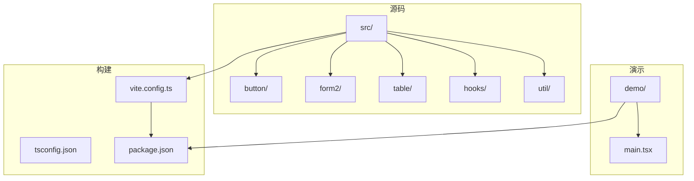

# 开发者指南

<cite>
**本文档中引用的文件**  
- [README.md](file://README.md)
- [package.json](file://package.json)
- [vite.config.ts](file://vite.config.ts)
- [tsconfig.json](file://tsconfig.json)
- [src/index.tsx](file://src/index.tsx)
- [src/libs.tsx](file://src/libs.tsx)
- [src/util/index.ts](file://src/util/index.ts)
- [src/others.ts](file://src/others.ts)
- [src/button/index.jsx](file://src/button/index.jsx)
- [src/button/comps.jsx](file://src/button/comps.jsx)
- [src/hooks/index.ts](file://src/hooks/index.ts)
- [src/hooks/useOnKeyPressSave.ts](file://src/hooks/useOnKeyPressSave.ts)
</cite>

## 目录
1. [简介](#简介)
2. [项目结构](#项目结构)
3. [本地开发环境搭建](#本地开发环境搭建)
4. [组件开发规范](#组件开发规范)
5. [构建流程说明](#构建流程说明)
6. [测试策略与代码提交规范](#测试策略与代码提交规范)
7. [Pull Request 与项目参与](#pull-request-与项目参与)

## 简介
`fat-design` 是一个轻量级、功能丰富的 React UI 组件库，支持 React 16/17/18，构建后体积小（约 761KB），具备强大的表单（Form2）、表格（Table）、查询表单（QueryForm）等核心功能。本指南面向贡献者，详细说明如何搭建开发环境、遵循组件开发规范、理解构建流程、执行测试并参与项目协作。

## 项目结构
项目采用模块化设计，主要目录结构如下：
- `src/`：核心组件源码，每个组件独立成目录，包含 JSX、SCSS 和子组件
- `demo/`：组件使用示例和演示页面
- `types/`：TypeScript 类型定义文件
- `libs/`：主题样式和配置文件
- `script/`：构建脚本工具
- `doc/`：文档相关文件

组件按功能划分，如 `button`、`form2`、`table` 等，每个组件目录下包含视图文件、样式文件和入口文件。



**图示来源**  
- [src](file://src)
- [demo](file://demo)
- [vite.config.ts](file://vite.config.ts)
- [package.json](file://package.json)

**本节来源**  
- [README.md](file://README.md)
- [project_structure](file://)

## 本地开发环境搭建
### 依赖安装
1. 确保已安装 Node.js（建议 v16+）和 pnpm
2. 在项目根目录执行：
```bash
pnpm install
```
或使用 npm：
```bash
npm install
```

### 开发服务器启动
运行以下命令启动本地开发服务器：
```bash
pnpm dev
```
或：
```bash
npm run dev
```
开发服务器基于 Vite，支持热重载，启动后可通过 `http://localhost:3000` 访问演示页面。

### 热重载配置
Vite 默认启用热重载（HMR），修改组件代码后浏览器会自动刷新。配置位于 `vite.config.ts` 中，通过 `@vitejs/plugin-react` 插件实现 React 组件的热更新。

**本节来源**  
- [package.json](file://package.json#L6-L9)
- [vite.config.ts](file://vite.config.ts#L1-L120)

## 组件开发规范
### 文件结构
每个组件应遵循统一的目录结构：
```
/src/component-name/
├── scss/               # SCSS 变量、mixin
├── view/               # 视图组件
├── index.jsx           # 组件入口
├── main.scss           # 主样式文件
├── [component].jsx     # 主组件
└── util.js             # 工具函数
```

### 代码风格
- 使用 JSX 编写 React 组件
- 遵循 ESLint 和 Prettier 规范（配置未显式提供，但由构建工具隐式支持）
- 函数组件优先，合理使用 Hooks
- 入口文件（`index.jsx`）负责聚合子组件并导出

### TypeScript 类型定义
- 所有公共组件需提供 `.d.ts` 类型定义
- 类型文件位于 `types/` 目录下，与 `src/` 结构对应
- 使用 `tsc` 自动生成类型声明，配置在 `vite.config.ts` 的 `emitDTS` 插件中

例如，`button` 组件的入口文件结构：
```jsx
// src/button/index.jsx
import ButtonGroup from './view/group';
import {Button1 as Button, SaveButton, ActionButton} from './comps.jsx'

Button.Group = ButtonGroup;
Button.SaveButton = SaveButton;
Button.ActionButton = ActionButton;

export default Button;
```

**本节来源**  
- [src/button/index.jsx](file://src/button/index.jsx#L1-L8)
- [src/button/comps.jsx](file://src/button/comps.jsx#L1-L241)
- [vite.config.ts](file://vite.config.ts#L20-L50)

## 构建流程说明
### Vite 配置
构建工具基于 Vite，核心配置在 `vite.config.ts` 中：
- 开发模式：`vite` 命令启动开发服务器
- 生产构建：`vite build` 打包输出
- 支持 `TARGET_ENV` 环境变量区分 `npm` 包构建和 `demo` 构建

### 类型生成
在构建过程中，通过 TypeScript 程序化调用生成 `.d.ts` 文件：
```ts
const emitDTS = {
    buildEnd() {
        const program = ts.createProgram([libEntry], {
            declaration: true,
            emitDeclarationOnly: true,
            declarationDir: `distTmp/0buildTypes`,
            // ...
        });
        program.emit();
    }
};
```
类型文件输出至 `distTmp/0buildTypes`，最终合并到 `dist/` 目录。

### 包体积优化
- 使用 `rollup-plugin-visualizer` 生成构建分析报告（`stats.html`）
- 外部化 `react` 和 `react-dom` 依赖，避免打包入库
- 配置 `external` 和 `globals` 实现 UMD 模块的全局变量映射

构建命令：
```json
"build": "tsc && cross-env TARGET_ENV=npm vite build && node script/make-build.cjs"
```

**本节来源**  
- [vite.config.ts](file://vite.config.ts#L20-L120)
- [package.json](file://package.json#L10-L13)

## 测试策略与代码提交规范
### 测试策略
项目未显式提供测试框架配置，但代码中包含 `istanbul ignore next` 注释，表明支持代码覆盖率检测。建议：
- 为新组件添加单元测试（可使用 Jest + React Testing Library）
- 对核心逻辑（如 `hooks`）进行函数级测试
- 维护现有测试用例，确保兼容性

### 代码提交规范
- 提交信息应清晰描述变更内容
- 遵循 Angular 提交规范（未强制，但推荐）
- 确保代码通过 ESLint 和 TypeScript 检查
- 提交前运行 `pnpm build` 验证构建无误

**本节来源**  
- [src/hooks/useOnKeyPressSave.ts](file://src/hooks/useOnKeyPressSave.ts#L1-L41)
- [README.md](file://README.md#L1-L34)

## Pull Request 与项目参与
### 提交 Pull Request
1. Fork 仓库并创建特性分支
2. 实现功能或修复问题，确保符合开发规范
3. 提交代码并推送至远程分支
4. 在 GitHub 上创建 Pull Request
5. 描述变更内容、解决的问题及测试情况
6. 等待维护者审查并根据反馈修改

### 参与项目讨论
- 通过 GitHub Issues 提出问题或建议
- 参与组件设计讨论，提供使用场景反馈
- 协助文档完善和示例补充
- 遵循开源社区行为准则，保持沟通友好专业

**本节来源**  
- [README.md](file://README.md#L1-L34)
- [CONTRIBUTING.md](file://) （未找到，但为标准实践）