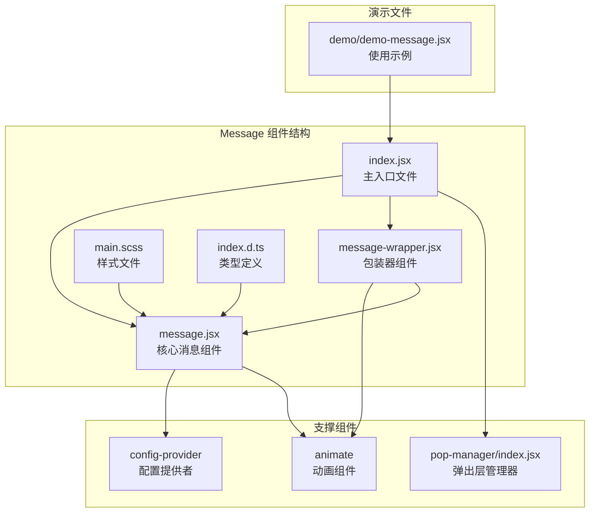
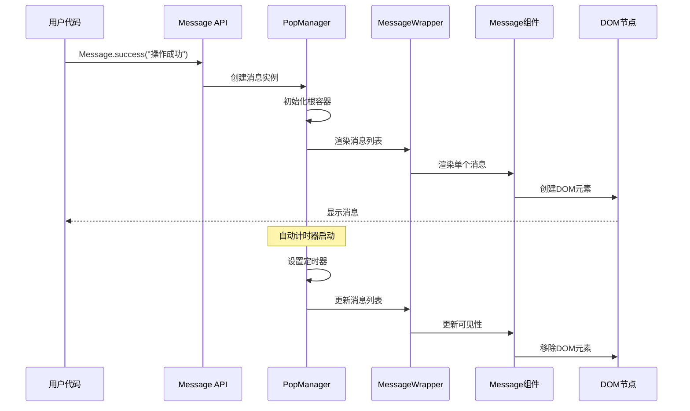
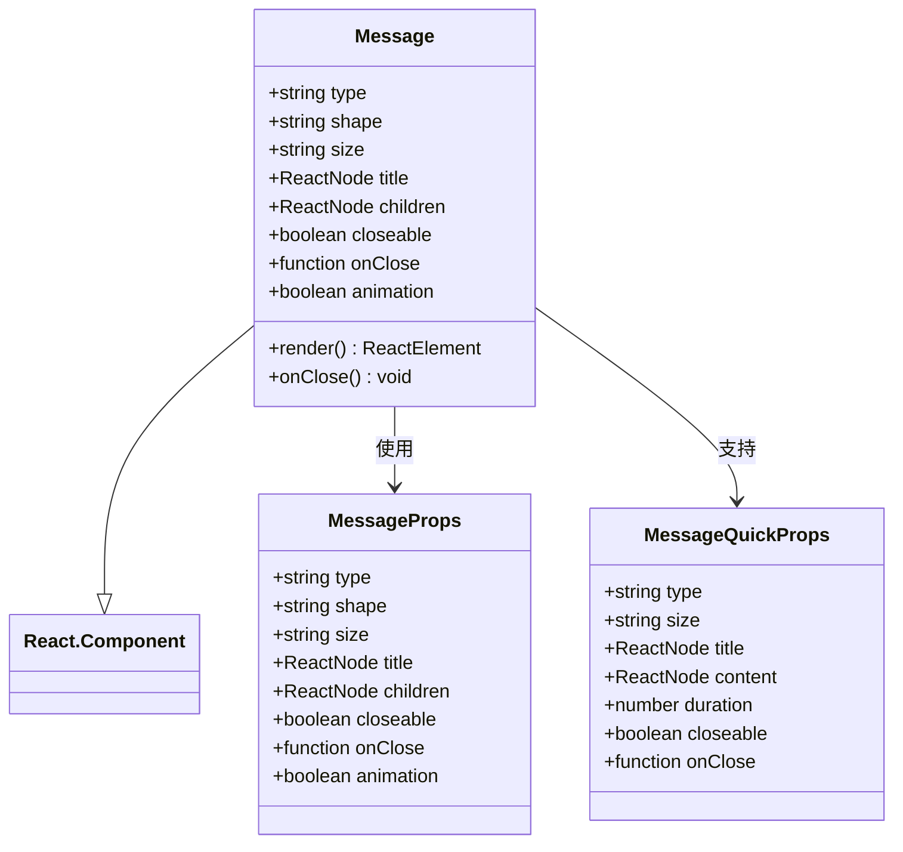
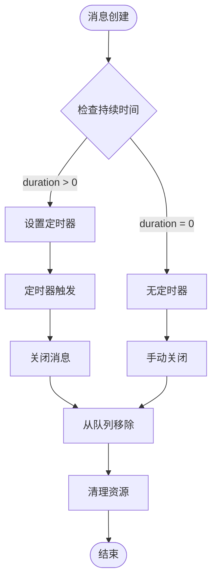
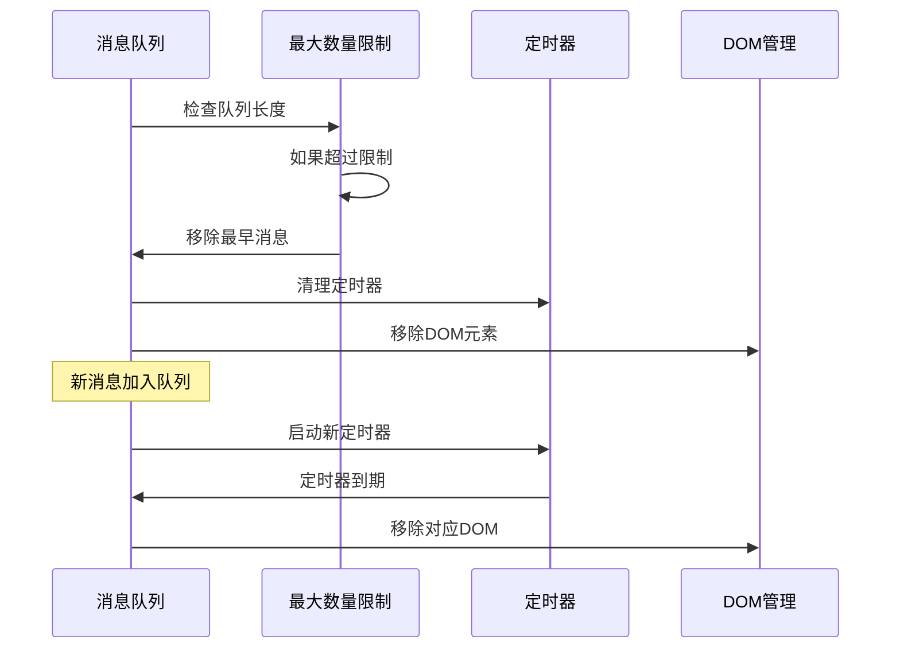
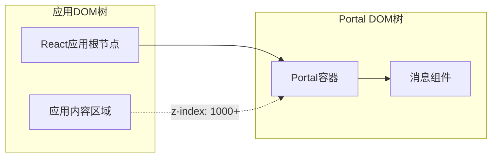
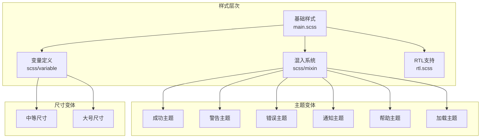
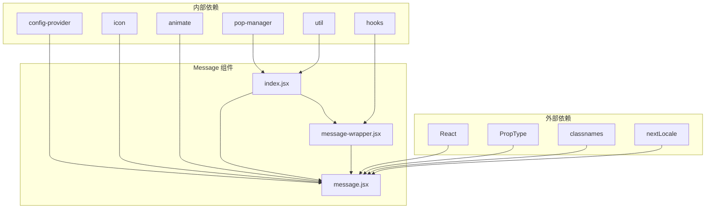

# 全局提示 (Message) 组件文档

<cite>
**本文档中引用的文件**
- [src/message/index.jsx](file://src/message/index.jsx)
- [src/message/message.jsx](file://src/message/message.jsx)
- [src/message/message-wrapper.jsx](file://src/message/message-wrapper.jsx)
- [src/message/main.scss](file://src/message/main.scss)
- [src/pop-manager/index.jsx](file://src/pop-manager/index.jsx)
- [demo/demo-message.jsx](file://demo/demo-message.jsx)
- [types/message/index.d.ts](file://types/message/index.d.ts)
</cite>

## 目录
1. [简介](#简介)
2. [项目结构](#项目结构)
3. [核心组件](#核心组件)
4. [架构概览](#架构概览)
5. [详细组件分析](#详细组件分析)
6. [依赖关系分析](#依赖关系分析)
7. [性能考虑](#性能考虑)
8. [故障排除指南](#故障排除指南)
9. [结论](#结论)

## 简介

Message 组件是 Fat Design 组件库中的轻量级全局提示系统，专门用于快速反馈用户操作结果（如成功、错误、警告等）。该组件采用静态方法调用方式，提供了简洁而强大的 API 接口，支持自动消失机制、堆叠显示逻辑以及手动销毁功能。

Message 组件的核心设计理念是：
- **轻量级设计**：最小化 DOM 结构，减少性能开销
- **静态方法调用**：通过类方法直接调用，无需实例化
- **React Portal 集成**：确保正确的层级管理和渲染位置
- **灵活配置**：支持多种形状、尺寸和主题样式
- **自动管理**：内置计时器和队列管理机制

## 项目结构

Message 组件在 Fat Design 中的组织结构如下：



**图表来源**
- [src/message/index.jsx](file://src/message/index.jsx#L1-L39)
- [src/message/message.jsx](file://src/message/message.jsx#L1-L189)
- [src/message/message-wrapper.jsx](file://src/message/message-wrapper.jsx#L1-L61)

**章节来源**
- [src/message/index.jsx](file://src/message/index.jsx#L1-L39)
- [src/message/message.jsx](file://src/message/message.jsx#L1-L189)
- [src/message/message-wrapper.jsx](file://src/message/message-wrapper.jsx#L1-L61)

## 核心组件

### Message 主组件

Message 是核心的消息显示组件，负责渲染单个消息内容。它支持多种类型、形状和尺寸的配置。

主要特性：
- **类型支持**：success、warning、error、notice、help、loading
- **形状选项**：inline（内联）、addon（附加）、toast（气泡）
- **尺寸选择**：medium（中等）、large（大号）
- **可选关闭**：支持显示关闭按钮
- **动画效果**：可配置的展开收起动画

### MessageWrapper 包装器

MessageWrapper 负责管理多个消息实例的显示和布局，通过 React Hooks 实现状态管理。

关键功能：
- **列表管理**：维护消息队列和显示顺序
- **动画控制**：统一的进入和离开动画
- **样式封装**：提供统一的容器样式

### PopManager 弹出层管理器

PopManager 是整个消息系统的底层管理器，负责消息的创建、销毁和生命周期管理。

核心能力：
- **消息池管理**：限制最大消息数量
- **定时器管理**：自动处理消息过期
- **DOM 操作**：动态创建和移除 DOM 节点
- **事件处理**：统一的事件分发机制

**章节来源**
- [src/message/message.jsx](file://src/message/message.jsx#L15-L189)
- [src/message/message-wrapper.jsx](file://src/message/message-wrapper.jsx#L6-L61)
- [src/pop-manager/index.jsx](file://src/pop-manager/index.jsx#L35-L246)

## 架构概览

Message 组件采用了分层架构设计，从上到下分为 API 层、管理层、渲染层和样式层：



**图表来源**
- [src/message/index.jsx](file://src/message/index.jsx#L6-L39)
- [src/pop-manager/index.jsx](file://src/pop-manager/index.jsx#L94-L143)

## 详细组件分析

### Message 组件详细分析

Message 组件是一个功能完整的 React 组件，具有以下核心特性：



**图表来源**
- [src/message/message.jsx](file://src/message/message.jsx#L15-L85)
- [types/message/index.d.ts](file://types/message/index.d.ts#L10-L100)

#### 静态方法调用方式

Message 提供了丰富的静态方法，支持不同类型的提示：

```javascript
// 基础静态方法
Message.success("操作成功");
Message.error("发生错误");
Message.warning("请注意");
Message.notice("通知信息");
Message.help("帮助信息");
Message.loading("加载中...");

// 高级配置方法
Message.success({
    content: "操作成功",
    duration: 3000,
    onClose: () => console.log('关闭回调')
});
```

#### 自动消失机制

消息的自动消失通过 PopManager 的定时器机制实现：



**图表来源**
- [src/pop-manager/index.jsx](file://src/pop-manager/index.jsx#L105-L120)

#### 堆叠显示逻辑

当同时显示多个消息时，系统采用 FIFO（先进先出）策略管理消息队列：



**图表来源**
- [src/pop-manager/index.jsx](file://src/pop-manager/index.jsx#L125-L135)

### React Portal 集成

Message 组件通过 PopManager 实现了 React Portal 功能，确保消息始终显示在正确的层级：



Portal 的实现原理：
1. **动态创建容器**：在 body 下创建专用的 DOM 容器
2. **固定定位**：使用 fixed 定位确保层级正确
3. **样式隔离**：避免影响应用原有样式
4. **生命周期管理**：自动创建和销毁容器

### 样式系统分析

Message 组件采用了模块化的样式系统，支持多种主题和变体：



**图表来源**
- [src/message/main.scss](file://src/message/main.scss#L1-L402)

**章节来源**
- [src/message/message.jsx](file://src/message/message.jsx#L15-L189)
- [src/message/message-wrapper.jsx](file://src/message/message-wrapper.jsx#L6-L61)
- [src/pop-manager/index.jsx](file://src/pop-manager/index.jsx#L35-L246)
- [src/message/main.scss](file://src/message/main.scss#L1-L402)

## 依赖关系分析

Message 组件的依赖关系展现了清晰的分层架构：



**图表来源**
- [src/message/index.jsx](file://src/message/index.jsx#L1-L5)
- [src/message/message.jsx](file://src/message/message.jsx#L1-L10)

### 核心依赖说明

1. **ConfigProvider**：提供全局配置和主题支持
2. **PopManager**：负责消息的生命周期管理
3. **Animate**：提供动画效果支持
4. **Hooks**：使用 React Hooks 进行状态管理
5. **Util**：提供工具函数和辅助方法

**章节来源**
- [src/message/index.jsx](file://src/message/index.jsx#L1-L5)
- [src/message/message.jsx](file://src/message/message.jsx#L1-L10)
- [src/message/message-wrapper.jsx](file://src/message/message-wrapper.jsx#L1-L5)

## 性能考虑

Message 组件在设计时充分考虑了性能优化：

### DOM 操作优化
- **Portal 技术**：减少 DOM 层级深度
- **批量更新**：使用 React 的批处理机制
- **内存管理**：及时清理定时器和事件监听器

### 渲染性能
- **条件渲染**：只渲染可见的消息
- **CSS 动画**：利用 GPU 加速的 CSS 动画
- **样式缓存**：避免重复计算样式

### 内存泄漏防护
- **定时器清理**：确保每个消息都有对应的清理机制
- **事件解绑**：及时移除事件监听器
- **组件卸载**：正确处理组件的卸载过程

## 故障排除指南

### 常见问题及解决方案

#### 消息无法显示
**原因**：Portal 容器未正确创建或样式冲突
**解决方案**：
1. 检查是否有其他样式影响 z-index
2. 确认 PopManager 已正确初始化
3. 验证 DOM 容器是否存在

#### 消息自动消失过快
**原因**：duration 参数设置不当
**解决方案**：
```javascript
// 设置较长的持续时间
Message.success({
    content: "操作成功",
    duration: 5000 // 5秒
});

// 或者禁用自动消失
Message.success({
    content: "操作成功",
    duration: 0
});
```

#### 多个消息重叠显示
**原因**：maxCount 配置限制过多
**解决方案**：
```javascript
// 调整最大消息数量
Message.config({
    maxCount: 3 // 限制最多显示3条消息
});
```

**章节来源**
- [src/pop-manager/index.jsx](file://src/pop-manager/index.jsx#L125-L135)
- [src/message/index.jsx](file://src/message/index.jsx#L15-L30)

## 结论

Message 组件是 Fat Design 组件库中一个设计精良的全局提示系统，具有以下优势：

### 设计优势
- **简洁的 API**：静态方法调用方式简单易用
- **灵活的配置**：支持多种类型、形状和尺寸
- **自动管理**：内置生命周期管理机制
- **性能优化**：采用 Portal 和动画优化技术

### 技术特点
- **分层架构**：清晰的职责分离和模块化设计
- **类型安全**：完整的 TypeScript 类型定义
- **样式系统**：模块化的 SCSS 架构
- **国际化支持**：内置多语言支持

### 使用建议
1. **合理使用类型**：根据业务需求选择合适的提示类型
2. **控制显示频率**：避免短时间内频繁显示消息
3. **适当设置持续时间**：平衡用户体验和信息传达
4. **注意样式定制**：充分利用主题和样式系统

Message 组件为开发者提供了一个强大而易用的全局提示解决方案，能够满足各种场景下的用户反馈需求，是构建现代 Web 应用不可或缺的组件之一。