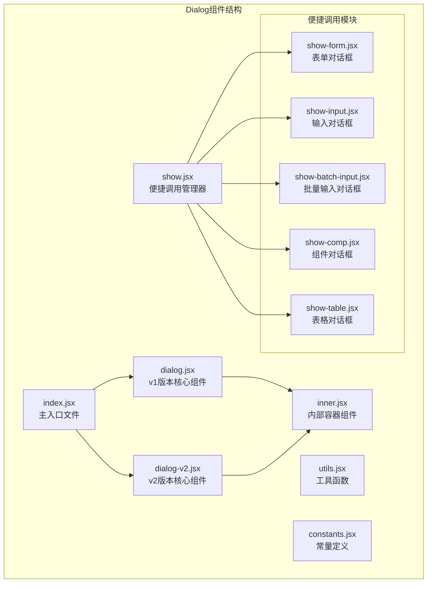
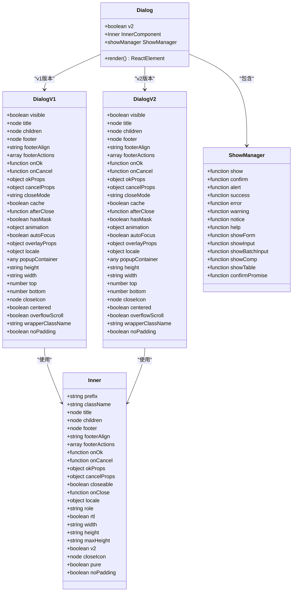
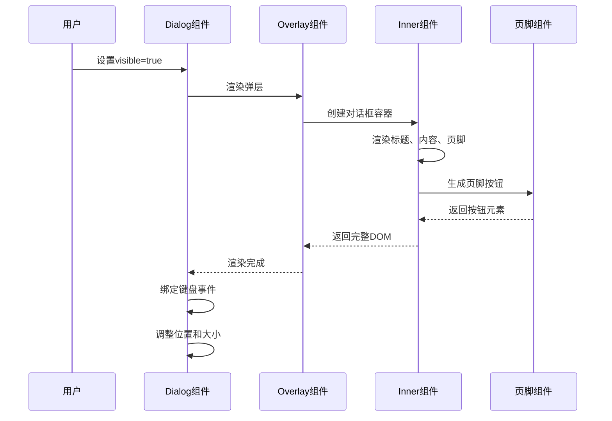
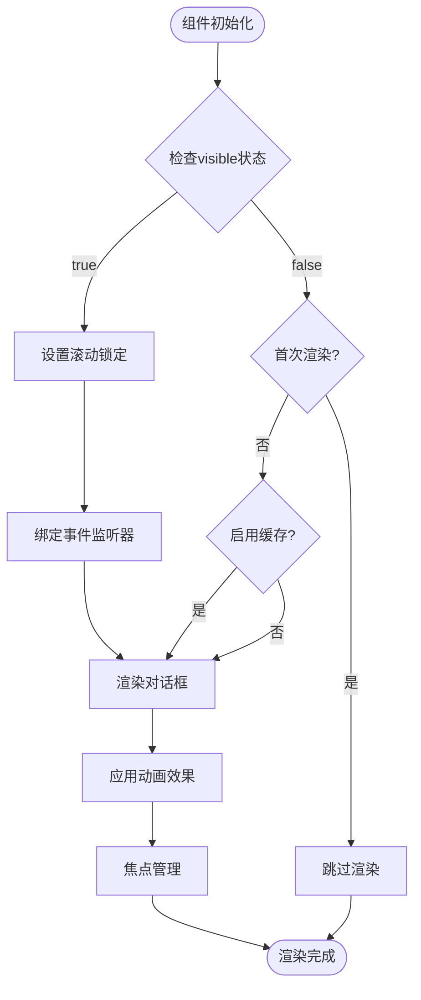
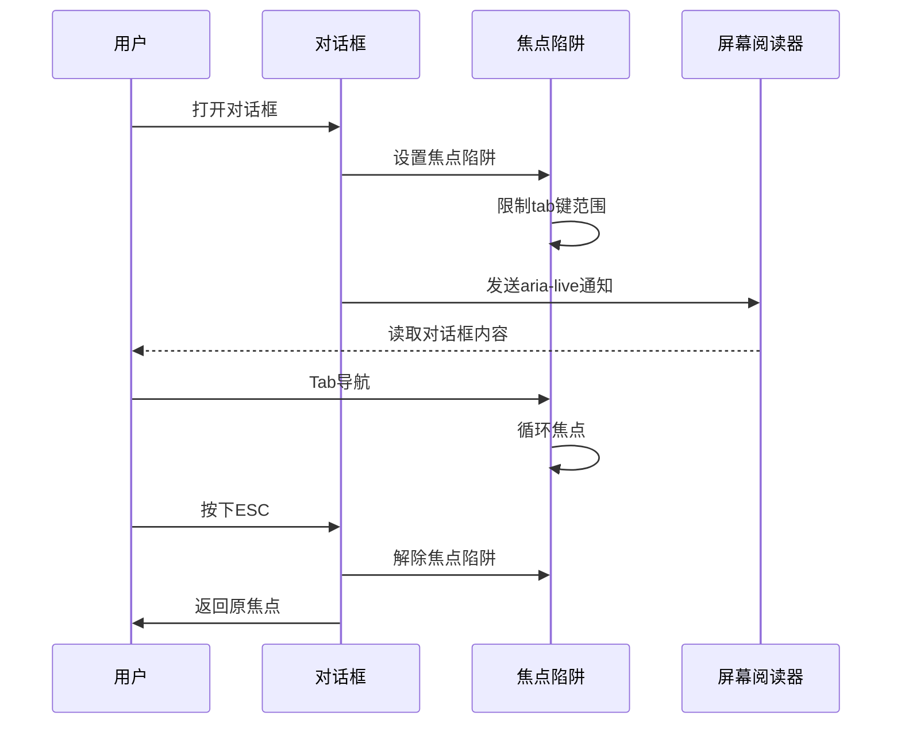

# 对话框 (Dialog)

<cite>
**本文档引用的文件**
- [src/dialog/index.jsx](file://src/dialog/index.jsx)
- [src/dialog/dialog.jsx](file://src/dialog/dialog.jsx)
- [src/dialog/dialog-v2.jsx](file://src/dialog/dialog-v2.jsx)
- [src/dialog/inner.jsx](file://src/dialog/inner.jsx)
- [src/dialog/show.jsx](file://src/dialog/show.jsx)
- [src/dialog/utils.jsx](file://src/dialog/utils.jsx)
- [src/dialog/constants.jsx](file://src/dialog/constants.jsx)
- [src/dialog/show-form.jsx](file://src/dialog/show-form.jsx)
- [demo/demo-dialog-show.tsx](file://demo/demo-dialog-show.tsx)
</cite>

## 目录
1. [简介](#简介)
2. [项目结构](#项目结构)
3. [核心组件](#核心组件)
4. [架构概览](#架构概览)
5. [详细组件分析](#详细组件分析)
6. [Props详解](#props详解)
7. [使用示例](#使用示例)
8. [无障碍访问支持](#无障碍访问支持)
9. [性能考虑](#性能考虑)
10. [故障排除指南](#故障排除指南)
11. [结论](#结论)

## 简介

Dialog组件是Fat Design框架中的核心模态对话框组件，提供了丰富的功能来处理各种用户交互场景。该组件支持基础用法、非受控/受控模式、自定义标题与页脚、嵌套表单处理等功能，并具有完整的无障碍访问支持。

Dialog组件采用双版本架构设计：
- **v1版本**：基于React.createClass的传统组件
- **v2版本**：基于React Hooks的新一代组件

## 项目结构

Dialog组件的文件组织结构清晰，主要包含以下核心文件：



**图表来源**
- [src/dialog/index.jsx](file://src/dialog/index.jsx#L1-L67)
- [src/dialog/dialog.jsx](file://src/dialog/dialog.jsx#L1-L492)
- [src/dialog/dialog-v2.jsx](file://src/dialog/dialog-v2.jsx#L1-L380)

**章节来源**
- [src/dialog/index.jsx](file://src/dialog/index.jsx#L1-L67)
- [src/dialog/dialog.jsx](file://src/dialog/dialog.jsx#L1-L492)

## 核心组件

Dialog组件的核心功能通过多个层次的组件协作实现：

### 主组件 (Dialog)
主组件负责版本路由和配置转换，根据`v2`属性决定使用哪个版本的实现。

### 内部容器 (Inner)
Inner组件是对话框的实际渲染容器，负责：
- 渲染标题、内容和页脚
- 管理对话框的基本布局
- 处理焦点管理和无障碍属性

### 显示管理器 (Show Manager)
Show Manager提供了便捷的对话框调用方式，支持多种预设类型的对话框。

**章节来源**
- [src/dialog/index.jsx](file://src/dialog/index.jsx#L1-L67)
- [src/dialog/inner.jsx](file://src/dialog/inner.jsx#L1-L210)
- [src/dialog/show.jsx](file://src/dialog/show.jsx#L1-L259)

## 架构概览

Dialog组件采用了分层架构设计，确保了代码的可维护性和扩展性：



**图表来源**
- [src/dialog/index.jsx](file://src/dialog/index.jsx#L8-L20)
- [src/dialog/dialog.jsx](file://src/dialog/dialog.jsx#L25-L150)
- [src/dialog/dialog-v2.jsx](file://src/dialog/dialog-v2.jsx#L25-L100)
- [src/dialog/inner.jsx](file://src/dialog/inner.jsx#L15-L50)

## 详细组件分析

### Dialog V1 组件分析

Dialog V1是传统的基于类的组件实现，提供了完整的功能集：



**图表来源**
- [src/dialog/dialog.jsx](file://src/dialog/dialog.jsx#L250-L350)
- [src/dialog/inner.jsx](file://src/dialog/inner.jsx#L100-L200)

#### 关键特性

1. **响应式布局调整**：组件能够根据窗口大小动态调整对话框的位置和尺寸
2. **焦点管理**：自动处理键盘导航和焦点陷阱
3. **动画支持**：内置淡入淡出动画效果
4. **遮罩处理**：智能的遮罩显示和隐藏逻辑

### Dialog V2 组件分析

Dialog V2是基于React Hooks的现代化实现，具有更好的性能和更简洁的代码：



**图表来源**
- [src/dialog/dialog-v2.jsx](file://src/dialog/dialog-v2.jsx#L200-L300)

#### V2版本优势

1. **性能优化**：减少不必要的重渲染
2. **内存管理**：更好的生命周期管理
3. **Hooks支持**：利用React Hooks的优势
4. **类型安全**：更好的TypeScript支持

**章节来源**
- [src/dialog/dialog.jsx](file://src/dialog/dialog.jsx#L25-L492)
- [src/dialog/dialog-v2.jsx](file://src/dialog/dialog-v2.jsx#L25-L380)

## Props详解

Dialog组件提供了丰富的Props配置选项：

### 基础Props

| 属性 | 类型 | 默认值 | 描述 |
|------|------|--------|------|
| `visible` | boolean | false | 控制对话框的显示状态 |
| `title` | node | - | 对话框标题内容 |
| `children` | node | - | 对话框主要内容 |
| `footer` | node \| boolean | true | 底部内容，设置为false则不显示 |

### 页脚配置Props

| 属性 | 类型 | 默认值 | 描述 |
|------|------|--------|------|
| `footerAlign` | string | 'right' | 底部按钮的对齐方式 |
| `footerActions` | array | ['ok', 'cancel'] | 按钮排列顺序 |

### 回调函数Props

| 属性 | 类型 | 默认值 | 描述 |
|------|------|--------|------|
| `onOk` | function | noop | 点击确定按钮时触发 |
| `onCancel` | function | noop | 点击取消/关闭按钮时触发 |
| `onClose` | function | noop | 点击关闭按钮时触发 |

### 显示控制Props

| 属性 | 类型 | 默认值 | 描述 |
|------|------|--------|------|
| `closeMode` | array \| string | ['close', 'esc'] | 控制对话框关闭的方式 |
| `hasMask` | boolean | true | 是否显示遮罩 |
| `autoFocus` | boolean | false | 对话框弹出时是否自动获得焦点 |
| `cache` | boolean | false | 隐藏时是否保留子节点 |

### 布局和样式Props

| 属性 | 类型 | 默认值 | 描述 |
|------|------|--------|------|
| `width` | string \| number | 520 | 对话框宽度 |
| `height` | string \| number | - | 对话框高度 |
| `centered` | boolean | false | 对话框是否居中对齐 |
| `overflowScroll` | boolean | true | 高度超出时是否显示滚动条 |

**章节来源**
- [src/dialog/dialog.jsx](file://src/dialog/dialog.jsx#L40-L150)
- [src/dialog/dialog-v2.jsx](file://src/dialog/dialog-v2.jsx#L25-L100)

## 使用示例

### 基础用法

```jsx
import {Dialog, Button} from 'fat-design';

function BasicExample() {
    const [visible, setVisible] = useState(false);
    
    return (
        <>
            <Button onClick={() => setVisible(true)}>打开对话框</Button>
            <Dialog
                visible={visible}
                title="基础对话框"
                onOk={() => setVisible(false)}
                onCancel={() => setVisible(false)}
            >
                这是一个简单的对话框内容
            </Dialog>
        </>
    );
}
```

### 非受控模式

```jsx
import {Dialog} from 'fat-design';

function UncontrolledExample() {
    return (
        <Dialog
            title="非受控对话框"
            footerActions={['ok']}
            onOk={() => console.log('已确认')}
        >
            这个对话框不需要手动控制visible状态
        </Dialog>
    );
}
```

### 自定义页脚

```jsx
import {Dialog, Button} from 'fat-design';

function CustomFooterExample() {
    return (
        <Dialog
            title="自定义页脚"
            footer={
                <div style={{display: 'flex', justifyContent: 'space-between'}}>
                    <Button type="secondary">辅助操作</Button>
                    <div>
                        <Button>取消</Button>
                        <Button type="primary">确认</Button>
                    </div>
                </div>
            }
        >
            自定义页脚内容
        </Dialog>
    );
}
```

### 便捷调用方式

```jsx
import {Dialog} from 'fat-design';

// 确认对话框
Dialog.confirm({
    title: '确认操作',
    content: '您确定要执行此操作吗？',
    onOk: () => {
        console.log('用户确认');
        return new Promise(resolve => setTimeout(resolve, 1000));
    }
});

// 输入对话框
Dialog.showInput({
    title: '输入信息',
    label: '请输入内容',
    onOk: (value) => {
        console.log('输入内容:', value);
        return Promise.resolve();
    }
});
```

**章节来源**
- [demo/demo-dialog-show.tsx](file://demo/demo-dialog-show.tsx#L1-L607)

## 无障碍访问支持

Dialog组件提供了完整的无障碍访问支持：

### 焦点管理



**图表来源**
- [src/dialog/dialog.jsx](file://src/dialog/dialog.jsx#L180-L200)
- [src/dialog/dialog-v2.jsx](file://src/dialog/dialog-v2.jsx#L250-L280)

### ARIA属性支持

1. **角色属性**：
   - `role="alertdialog"`：表示这是一个警告对话框
   - `aria-modal="true"`：标记为模态对话框

2. **标签属性**：
   - `aria-labelledby`：关联标题元素
   - `aria-describedby`：关联描述内容

3. **键盘导航**：
   - Tab键循环焦点
   - ESC键关闭对话框
   - Enter键激活按钮

### 屏幕阅读器兼容性

组件确保所有交互元素都有适当的文本描述，支持主流屏幕阅读器如JAWS、NVDA和VoiceOver。

**章节来源**
- [src/dialog/inner.jsx](file://src/dialog/inner.jsx#L100-L150)
- [src/dialog/dialog.jsx](file://src/dialog/dialog.jsx#L450-L492)

## 性能考虑

### 渲染优化

1. **条件渲染**：只有当`visible`为true时才渲染对话框
2. **缓存机制**：通过`cache`属性避免重复渲染
3. **懒加载**：首次渲染时延迟加载对话框内容

### 内存管理

1. **事件清理**：组件卸载时自动清理事件监听器
2. **滚动锁定**：对话框关闭时自动解锁页面滚动
3. **焦点恢复**：自动恢复之前的焦点状态

### 动画性能

1. **CSS动画**：优先使用CSS动画而非JavaScript动画
2. **硬件加速**：利用GPU加速提升动画流畅度
3. **动画优化**：合理设置动画持续时间和缓动函数

## 故障排除指南

### 常见问题及解决方案

#### 1. 对话框无法关闭

**问题**：点击关闭按钮或遮罩区域无法关闭对话框

**解决方案**：
```jsx
// 检查closeMode配置
<Dialog
    closeMode={['close', 'esc', 'mask']} // 确保包含所需关闭方式
    onClose={(triggerType, event) => {
        console.log('关闭触发方式:', triggerType);
        // 根据触发方式执行不同逻辑
    }}
/>
```

#### 2. 焦点管理问题

**问题**：Tab键导航跳出对话框范围

**解决方案**：
```jsx
// 确保对话框内容包含可聚焦元素
<Dialog
    autoFocus // 自动获取焦点
>
    <input placeholder="输入框" />
    <button>按钮</button>
</Dialog>
```

#### 3. 响应式布局问题

**问题**：对话框在小屏幕上显示异常

**解决方案**：
```jsx
<Dialog
    width="90%" // 使用百分比宽度
    centered // 居中显示
    overflowScroll // 超出时显示滚动条
>
    {/* 内容 */}
</Dialog>
```

#### 4. 动画卡顿问题

**问题**：对话框动画不流畅

**解决方案**：
```jsx
<Dialog
    animation={false} // 禁用动画
    // 或者使用轻量动画
    animation={{
        in: 'fadeIn',
        out: 'fadeOut'
    }}
/>
```

**章节来源**
- [src/dialog/dialog.jsx](file://src/dialog/dialog.jsx#L300-L400)
- [src/dialog/dialog-v2.jsx](file://src/dialog/dialog-v2.jsx#L150-L250)

## 结论

Dialog组件是Fat Design框架中功能最完善的模态对话框组件之一。它不仅提供了丰富的配置选项和灵活的使用方式，还具备完整的无障碍访问支持和优秀的性能表现。

### 主要优势

1. **双版本支持**：同时提供传统和现代两种实现方式
2. **便捷调用**：内置多种预设类型的对话框
3. **无障碍支持**：完整的ARIA属性和键盘导航
4. **性能优化**：智能的渲染和内存管理
5. **扩展性强**：易于定制和扩展

### 最佳实践建议

1. **合理使用版本**：新项目推荐使用v2版本
2. **注重无障碍**：始终为重要交互添加适当的ARIA属性
3. **性能优化**：合理使用缓存和动画配置
4. **用户体验**：提供清晰的反馈和错误处理
5. **响应式设计**：确保在各种设备上都能正常显示

通过遵循这些最佳实践，开发者可以充分利用Dialog组件的强大功能，构建出高质量的用户界面交互体验。