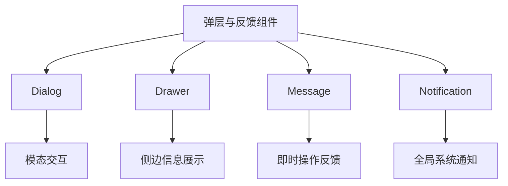
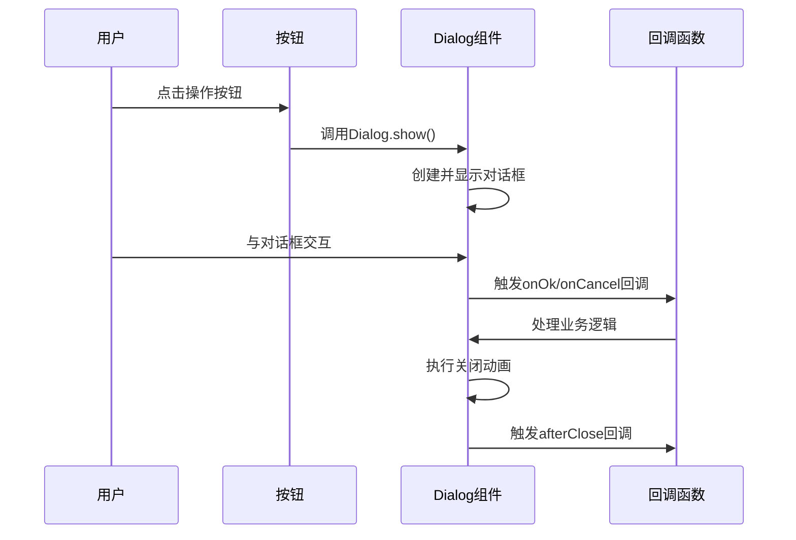
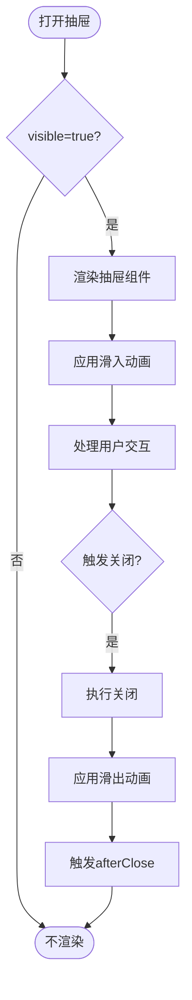
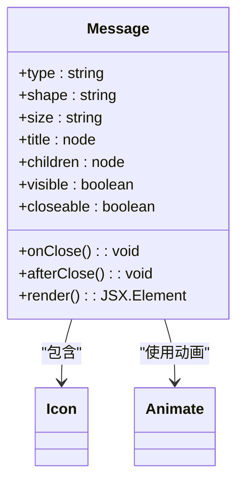
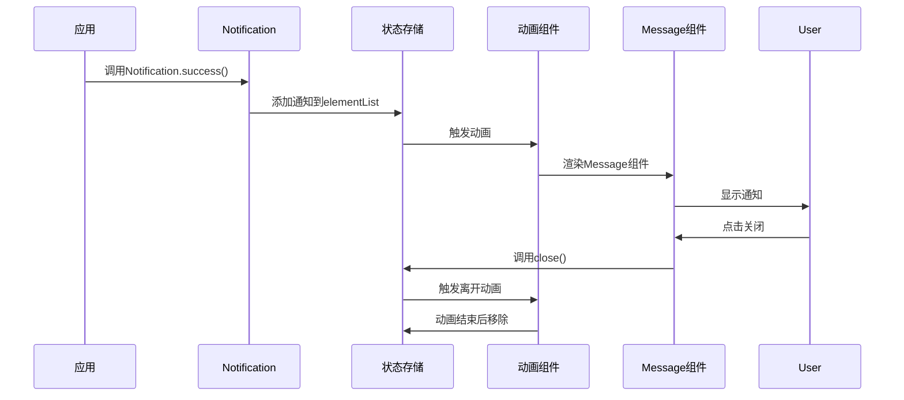

# 弹层与反馈

<cite>
**本文档引用文件**  
- [dialog.jsx](file://src/dialog/dialog.jsx)
- [dialog-v2.jsx](file://src/dialog/dialog-v2.jsx)
- [index.jsx](file://src/dialog/index.jsx)
- [show.jsx](file://src/dialog/show.jsx)
- [constants.jsx](file://src/dialog/constants.jsx)
- [utils.jsx](file://src/dialog/utils.jsx)
- [drawer.jsx](file://src/drawer/drawer.jsx)
- [index.jsx](file://src/drawer/index.jsx)
- [message.jsx](file://src/message/message.jsx)
- [index.jsx](file://src/message/index.jsx)
- [notification.jsx](file://src/notification/notification.jsx)
- [index.js](file://src/notification/index.js)
- [demo-dialog-show.tsx](file://demo/demo-dialog-show.tsx)
- [demo-drawer-show.tsx](file://demo/demo-drawer-show.tsx)
- [demo-message.jsx](file://demo/demo-message.jsx)
</cite>

## 目录
1. [简介](#简介)
2. [组件概览](#组件概览)
3. [Dialog 对话框](#dialog-对话框)
4. [Drawer 抽屉](#drawer-抽屉)
5. [Message 消息反馈](#message-消息反馈)
6. [Notification 通知](#notification-通知)
7. [层级管理与焦点控制](#层级管理与焦点控制)
8. [无障碍访问（a11y）最佳实践](#无障碍访问a11y最佳实践)
9. [实际应用案例](#实际应用案例)
10. [总结](#总结)

## 简介

弹层与反馈组件是用户界面中实现信息展示、用户交互和状态提示的核心元素。本指南系统性地介绍 Fat Design 组件库中的 `Dialog`、`Drawer`、`Message` 和 `Notification` 组件，详细说明其 API 用法、事件机制、方法调用方式以及在不同场景下的最佳实践。

**Section sources**
- [dialog.jsx](file://src/dialog/dialog.jsx#L1-L50)
- [message.jsx](file://src/message/message.jsx#L1-L50)
- [notification.jsx](file://src/notification/notification.jsx#L1-L20)

## 组件概览

Fat Design 提供了多种弹层与反馈组件，适用于不同的交互场景：

- **Dialog（对话框）**：模态弹窗，用于需要用户确认或输入信息的场景。
- **Drawer（抽屉）**：从屏幕边缘滑出的面板，适合展示辅助信息或表单。
- **Message（消息反馈）**：轻量级的非模态提示，用于即时反馈操作结果。
- **Notification（通知）**：可自动消失的全局通知，用于系统级消息提醒。

这些组件共同构成了完整的用户反馈体系，帮助开发者构建清晰、直观的用户体验。



**Diagram sources**
- [dialog.jsx](file://src/dialog/dialog.jsx#L1-L20)
- [drawer.jsx](file://src/drawer/drawer.jsx#L1-L20)
- [message.jsx](file://src/message/message.jsx#L1-L20)
- [notification.jsx](file://src/notification/notification.jsx#L1-L20)

## Dialog 对话框

`Dialog` 组件是主要的模态弹窗组件，支持丰富的配置选项和交互模式。

### Props API

| 属性名 | 类型 | 默认值 | 说明 |
|--------|------|--------|------|
| visible | boolean | false | 是否显示对话框 |
| title | node | - | 对话框标题 |
| children | node | - | 对话框内容 |
| footer | boolean\|node | true | 底部内容，设为 false 则不显示 |
| footerAlign | 'left'\|'center'\|'right' | - | 底部按钮对齐方式 |
| footerActions | array | ['ok', 'cancel'] | 底部按钮配置 |
| onOk | function | - | 点击确定按钮时的回调 |
| onCancel | function | - | 点击取消/关闭按钮时的回调 |
| closeMode | array\|string | ['close', 'mask', 'esc'] | 控制关闭方式 |
| cache | boolean | false | 隐藏时是否保留子节点 |
| afterClose | function | - | 关闭动画结束后触发的回调 |
| hasMask | boolean | true | 是否显示遮罩 |
| animation | object\|boolean | {in: 'expandInDown', out: 'expandOutUp'} | 显示/隐藏动画 |
| autoFocus | boolean | true | 是否自动获得焦点 |
| width | string\|number | - | 弹窗宽度（v2 版本） |
| height | string\|number | - | 对话框高度 |
| centered | boolean | false | 是否居中显示（v2 版本） |
| overflowScroll | boolean | true | 内容超出时是否显示滚动条 |

### 事件回调

- **onOk**: 用户点击“确定”按钮时触发，可返回 Promise 进行异步处理。
- **onCancel**: 用户点击“取消”按钮时触发。
- **onClose**: 对话框关闭时触发，`event.triggerType` 可区分关闭来源（`esc`、`closeIcon`）。
- **afterClose**: 对话框完全关闭后（动画结束后）触发。

### 方法调用

`Dialog` 提供了便捷的静态方法用于快速展示常见类型的对话框：

- `Dialog.show()`: 显示自定义内容对话框
- `Dialog.confirm()`: 显示确认对话框
- `Dialog.alert()`: 显示警告对话框
- `Dialog.success()`: 显示成功提示
- `Dialog.error()`: 显示错误提示
- `Dialog.warning()`: 显示警告提示
- `Dialog.notice()`: 显示通知提示
- `Dialog.help()`: 显示帮助提示

此外还提供了特定场景的方法：
- `Dialog.showInput()`: 显示输入对话框
- `Dialog.showForm()`: 显示表单对话框
- `Dialog.showTable()`: 显示表格对话框
- `Dialog.showComp()`: 显示自定义组件对话框



**Diagram sources**
- [show.jsx](file://src/dialog/show.jsx#L50-L150)
- [dialog.jsx](file://src/dialog/dialog.jsx#L100-L200)

**Section sources**
- [dialog.jsx](file://src/dialog/dialog.jsx#L1-L492)
- [show.jsx](file://src/dialog/show.jsx#L1-L259)
- [demo-dialog-show.tsx](file://demo/demo-dialog-show.tsx#L1-L607)

## Drawer 抽屉

`Drawer` 组件是从屏幕边缘滑出的面板，常用于移动端或需要节省空间的场景。

### Props API

| 属性名 | 类型 | 默认值 | 说明 |
|--------|------|--------|------|
| visible | boolean | false | 是否显示抽屉 |
| title | node | - | 抽屉标题 |
| placement | 'top'\|'right'\|'bottom'\|'left' | 'right' | 抽屉出现的位置 |
| width | string\|number | '30vw' | 宽度（仅 left/right 有效） |
| height | string\|number | '300px' | 高度（仅 top/bottom 有效） |
| closeMode | array\|string | ['close', 'mask', 'esc'] | 控制关闭方式 |
| cache | boolean | false | 隐藏时是否保留子节点 |
| onClose | function | - | 关闭时触发的回调 |
| afterClose | function | - | 关闭动画结束后触发的回调 |
| hasMask | boolean | true | 是否显示遮罩 |
| animation | object\|boolean | 根据placement自动选择 | 显示/隐藏动画 |

### 事件回调

- **onClose**: 抽屉关闭时触发，可区分关闭来源。
- **afterClose**: 抽屉完全关闭后触发。

### 方法调用

`Drawer` 也提供了 `show` 静态方法用于快速展示：

```javascript
Drawer.show({
    title: '标题',
    placement: 'right',
    content: '内容',
    onOk: () => {
        // 确认逻辑
    }
});
```



**Diagram sources**
- [drawer.jsx](file://src/drawer/drawer.jsx#L1-L335)
- [demo-drawer-show.tsx](file://demo/demo-drawer-show.tsx#L1-L126)

**Section sources**
- [drawer.jsx](file://src/drawer/drawer.jsx#L1-L335)
- [index.jsx](file://src/drawer/index.jsx#L1-L20)
- [demo-drawer-show.tsx](file://demo/demo-drawer-show.tsx#L1-L126)

## Message 消息反馈

`Message` 组件用于轻量级的操作反馈提示。

### Props API

| 属性名 | 类型 | 默认值 | 说明 |
|--------|------|--------|------|
| type | 'success'\|'warning'\|'error'\|'notice'\|'help'\|'loading' | 'success' | 反馈类型 |
| shape | 'inline'\|'addon'\|'toast' | 'inline' | 反馈外观 |
| size | 'medium'\|'large' | 'medium' | 反馈大小 |
| title | node | - | 标题 |
| children | node | - | 内容 |
| visible | boolean | true | 当前是否显示 |
| closeable | boolean | false | 是否显示关闭按钮 |
| onClose | function | - | 关闭按钮的回调 |
| afterClose | function | - | 关闭之后调用的函数 |
| animation | boolean | true | 是否开启展开收起动画 |

### 使用方式

```javascript
// 显示成功消息
Message.success('操作成功');

// 显示错误消息
Message.error('操作失败');

// 显示警告消息
Message.warning('请注意');

// 显示加载中
Message.loading('加载中...');
```



**Diagram sources**
- [message.jsx](file://src/message/message.jsx#L1-L189)
- [demo-message.jsx](file://demo/demo-message.jsx#L1-L77)

**Section sources**
- [message.jsx](file://src/message/message.jsx#L1-L189)
- [index.jsx](file://src/message/index.jsx#L1-L10)
- [demo-message.jsx](file://demo/demo-message.jsx#L1-L77)

## Notification 通知

`Notification` 组件用于全局的通知提醒，通常出现在屏幕的角落。

### 实现原理

`Notification` 基于 `Message` 组件构建，通过 `Animate` 组件实现滑入滑出动画效果。

### Props API

`Notification` 主要通过配置管理器进行全局配置，包括：
- placement: 通知出现的位置
- offset: 偏移距离
- size: 通知大小

### 使用方式

```javascript
// 显示成功通知
Notification.success({
    title: '成功',
    content: '操作成功完成'
});

// 显示错误通知
Notification.error({
    title: '错误',
    content: '操作失败，请重试'
});
```



**Diagram sources**
- [notification.jsx](file://src/notification/notification.jsx#L1-L87)
- [index.js](file://src/notification/index.js#L1-L10)

**Section sources**
- [notification.jsx](file://src/notification/notification.jsx#L1-L87)
- [index.js](file://src/notification/index.js#L1-L15)

## 层级管理与焦点控制

### 层级管理

弹层组件通过 z-index 进行层级管理，确保新打开的弹窗总是在最上层。`PopManager` 组件负责管理弹窗的堆叠顺序。

### 聚焦控制

- **自动聚焦**：`Dialog` 和 `Drawer` 默认会将焦点移动到弹窗内部。
- **焦点锁定**：在弹窗打开期间，焦点被限制在弹窗内部，防止用户通过 Tab 键访问背景内容。
- **返回原焦点**：弹窗关闭后，焦点会自动返回到打开弹窗前的元素。

### 键盘交互

- **Esc 键**：默认情况下，按下 Esc 键可以关闭弹窗（可通过 `closeMode` 配置）。
- **Tab 键**：在弹窗内部进行焦点循环。
- **Enter 键**：在确认按钮上触发点击事件。

```mermaid
stateDiagram-v2
[*] --> Background
Background --> DialogOpen : 打开对话框
DialogOpen --> DialogFocused : 自动聚焦
DialogFocused --> FocusLocked : 锁定焦点范围
FocusLocked --> UserInteraction : 用户交互
UserInteraction --> CheckClose{检查关闭条件}
CheckClose --> |Esc键| CloseViaEsc[通过Esc关闭]
CheckClose --> |点击遮罩| CloseViaMask[通过遮罩关闭]
CheckClose --> |点击关闭按钮| CloseViaButton[通过按钮关闭]
CloseViaEsc --> RestoreFocus[恢复原焦点]
CloseViaMask --> RestoreFocus
CloseViaButton --> RestoreFocus
RestoreFocus --> Background
```

**Diagram sources**
- [dialog.jsx](file://src/dialog/dialog.jsx#L150-L200)
- [focus.js](file://src/util/focus.js#L1-L50)
- [show.jsx](file://src/dialog/show.jsx#L100-L150)

**Section sources**
- [dialog.jsx](file://src/dialog/dialog.jsx#L1-L492)
- [drawer.jsx](file://src/drawer/drawer.jsx#L1-L335)
- [focus.js](file://src/util/focus.js#L1-L100)

## 无障碍访问（a11y）最佳实践

### 语义化标签

- 使用 `role="alertdialog"` 标记模态对话框
- 使用 `aria-label` 为图标按钮提供可访问的标签
- 使用 `aria-hidden` 隐藏装饰性元素

### 键盘导航

- 确保所有交互元素都可通过键盘访问
- 实现合理的 Tab 键顺序
- 提供视觉焦点指示器

### 屏幕阅读器支持

- 为重要状态变化提供 ARIA live regions
- 使用适当的 ARIA 属性描述组件状态
- 确保错误消息能被屏幕阅读器读出

### 最佳实践示例

```jsx
<Dialog 
    title="确认操作" 
    role="alertdialog"
    aria-labelledby="dialog-title"
    closeMode={['close', 'mask', 'esc']}
>
    <div id="dialog-title">您确定要执行此操作吗？</div>
    {/* 内容 */}
</Dialog>
```

**Section sources**
- [dialog.jsx](file://src/dialog/dialog.jsx#L200-L250)
- [message.jsx](file://src/message/message.jsx#L100-L150)
- [utils.jsx](file://src/dialog/utils.jsx#L1-L20)

## 实际应用案例

### 表单提交场景

```javascript
// 表单提交时显示加载状态
Dialog.showForm({
    title: '创建用户',
    formProps: { /* 表单配置 */ },
    onOk: (formData) => {
        return api.createUser(formData).then(() => {
            Message.success('用户创建成功');
        }).catch(() => {
            Message.error('创建失败，请重试');
        });
    }
});
```

### 操作确认场景

```javascript
// 删除操作前确认
const handleDelete = async () => {
    const confirmed = await Dialog.confirmPromise({
        title: '确认删除',
        content: '删除后无法恢复，确定要删除吗？'
    });
    if (confirmed) {
        // 执行删除
    }
};
```

### 系统通知场景

```javascript
// 系统后台任务完成通知
socket.on('taskCompleted', (data) => {
    Notification.success({
        title: '任务完成',
        content: `任务 ${data.taskId} 已成功完成`
    });
});
```

**Section sources**
- [demo-dialog-show.tsx](file://demo/demo-dialog-show.tsx#L1-L607)
- [demo-drawer-show.tsx](file://demo/demo-drawer-show.tsx#L1-L126)
- [demo-message.jsx](file://demo/demo-message.jsx#L1-L77)

## 总结

Fat Design 的弹层与反馈组件提供了完整的用户交互解决方案。通过合理使用 `Dialog`、`Drawer`、`Message` 和 `Notification` 组件，可以构建出清晰、直观的用户体验。在使用这些组件时，应注意：

1. 根据场景选择合适的组件类型
2. 合理配置交互行为和动画效果
3. 遵循无障碍访问最佳实践
4. 注意层级管理和焦点控制
5. 提供清晰的用户反馈

通过遵循这些原则，可以创建出既美观又实用的用户界面。