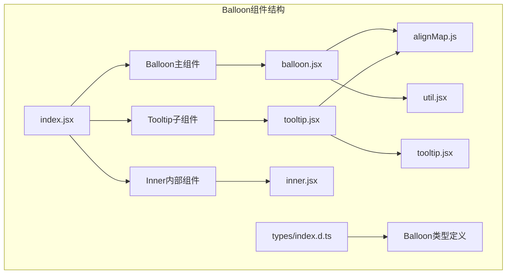
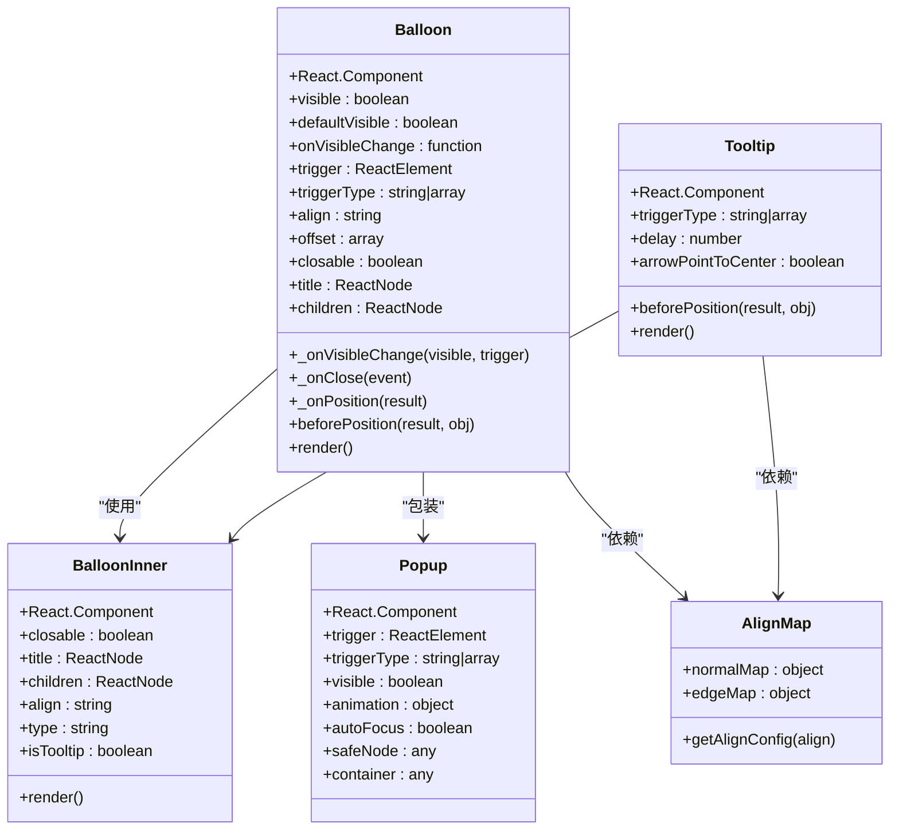
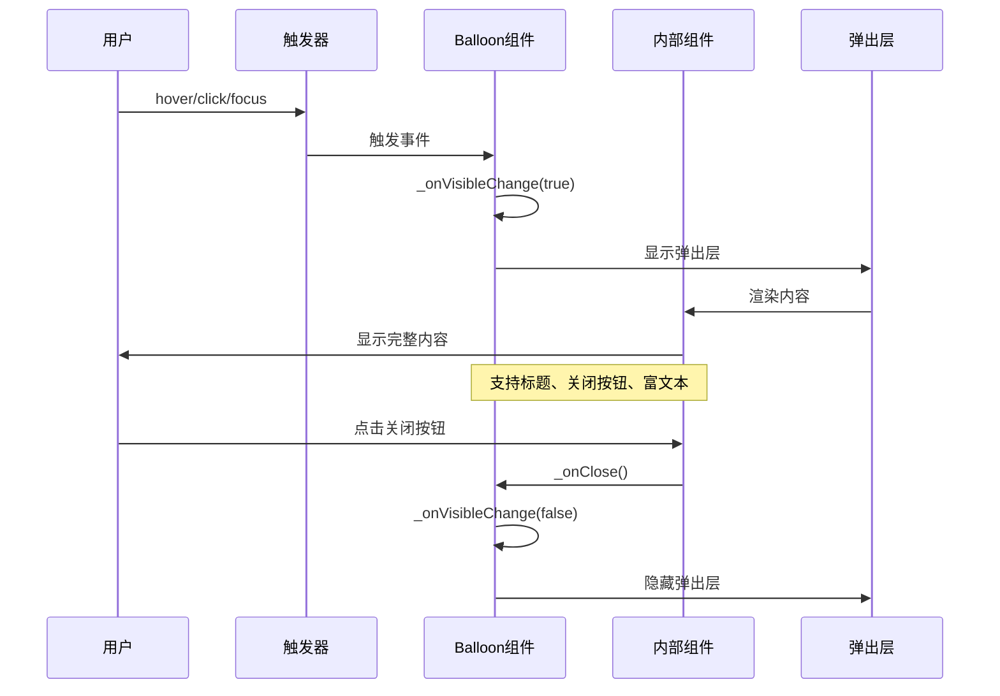
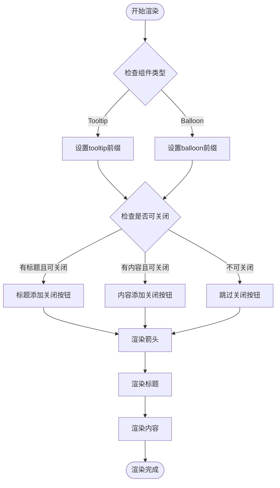
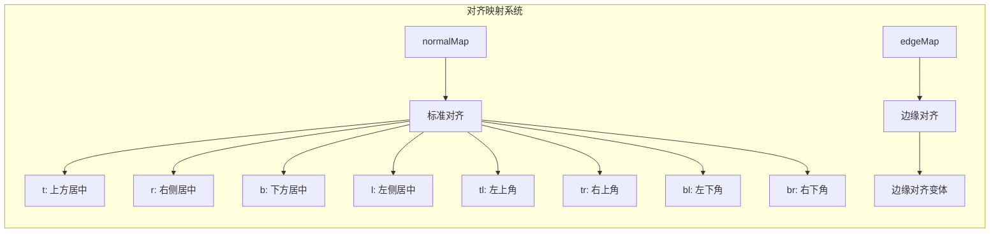
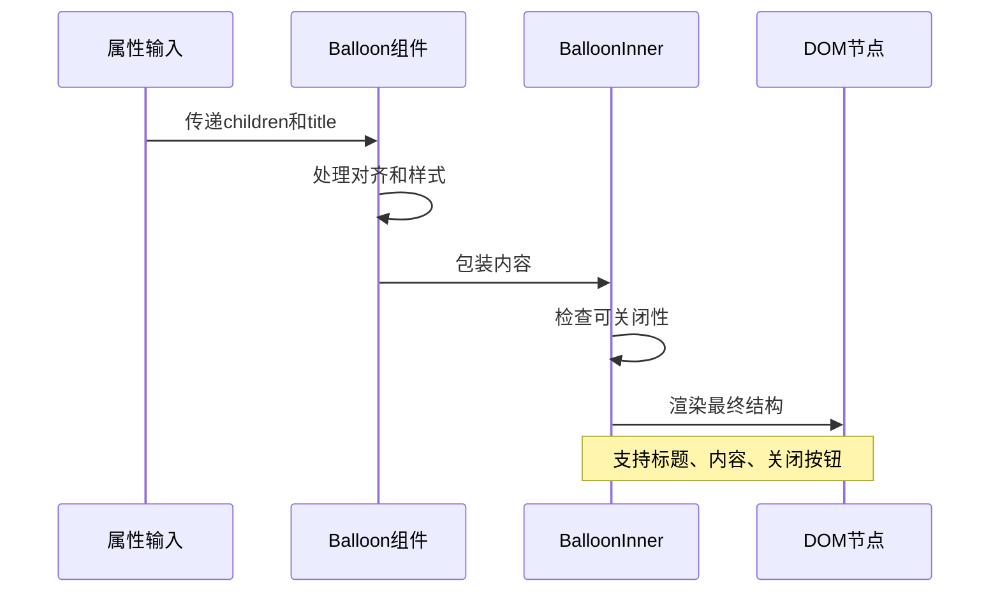

# 气泡提示 (Balloon)

<cite>
**本文档中引用的文件**
- [balloon.jsx](file://src/balloon/balloon.jsx)
- [index.jsx](file://src/balloon/index.jsx)
- [inner.jsx](file://src/balloon/inner.jsx)
- [tooltip.jsx](file://src/balloon/tooltip.jsx)
- [alignMap.js](file://src/balloon/alignMap.js)
- [util.jsx](file://src/balloon/util.jsx)
- [index.d.ts](file://types/balloon/index.d.ts)
- [demo-buttons.tsx](file://demo/demo-buttons.tsx)
</cite>

## 目录
1. [简介](#简介)
2. [项目结构](#项目结构)
3. [核心组件](#核心组件)
4. [架构概览](#架构概览)
5. [详细组件分析](#详细组件分析)
6. [触发方式与位置控制](#触发方式与位置控制)
7. [内容渲染机制](#内容渲染机制)
8. [应用场景](#应用场景)
9. [性能考虑](#性能考虑)
10. [故障排除指南](#故障排除指南)
11. [结论](#结论)

## 简介

Balloon组件是Fat Design设计系统中的一个关键组件，专门用于创建悬浮提示工具。它与Tooltip组件形成对比，具有更丰富的功能特性：支持富文本内容、交互元素，以及更灵活的布局选项。Balloon组件的设计理念是提供一种轻量级但功能强大的信息展示解决方案，适用于各种复杂的用户界面场景。

### 主要特性

- **富文本支持**：与仅支持纯文本的Tooltip不同，Balloon可以包含复杂的HTML内容和交互元素
- **多种触发方式**：支持hover、click、focus等多种触发行为
- **智能定位**：基于alignMap.js定义的对齐策略，自动计算最佳显示位置
- **响应式设计**：支持RTL语言和自动位置调整
- **无障碍支持**：完整的ARIA标签和键盘导航支持

## 项目结构

Balloon组件的文件组织遵循模块化设计原则，主要文件分布在以下目录结构中：



**图表来源**
- [index.jsx](file://src/balloon/index.jsx#L1-L47)
- [balloon.jsx](file://src/balloon/balloon.jsx#L1-L50)
- [tooltip.jsx](file://src/balloon/tooltip.jsx#L1-L50)

**章节来源**
- [index.jsx](file://src/balloon/index.jsx#L1-L47)
- [balloon.jsx](file://src/balloon/balloon.jsx#L1-L469)

## 核心组件

### Balloon主组件

Balloon主组件是整个气泡提示系统的核心，负责管理状态、处理用户交互和协调各个子组件的工作。

```javascript
// 核心属性配置
static defaultProps = {
    prefix: defaultPrefix,
    pure: false,
    type: 'normal',
    closable: true,
    defaultVisible: false,
    size: 'medium',
    alignEdge: false,
    arrowPointToCenter: false,
    align: 'b',
    offset: [0, 0],
    trigger: <span />,
    onClose: noop,
    afterClose: noop,
    onVisibleChange: noop,
    needAdjust: false,
    triggerType: 'hover',
    safeNode: undefined,
    safeId: null,
    autoFocus: true,
    animation: {
        in: 'zoomIn zoomInBig',
        out: 'zoomOut zoomOutBig',
    },
    cache: false,
    popupStyle: {},
    popupClassName: '',
    popupProps: {}
};
```

### Tooltip子组件

Tooltip组件继承了Balloon的核心功能，但专为简单的文本提示而设计，具有更简洁的接口。

```javascript
// Tooltip特有配置
static defaultProps = {
    triggerType: 'hover',
    prefix: defaultPrefix,
    align: 'b',
    delay: 50,
    trigger: <span />,
    arrowPointToCenter: false,
};
```

**章节来源**
- [balloon.jsx](file://src/balloon/balloon.jsx#L100-L150)
- [tooltip.jsx](file://src/balloon/tooltip.jsx#L60-L80)

## 架构概览

Balloon组件采用分层架构设计，确保了良好的可维护性和扩展性：



**图表来源**
- [balloon.jsx](file://src/balloon/balloon.jsx#L15-L100)
- [inner.jsx](file://src/balloon/inner.jsx#L15-L60)
- [tooltip.jsx](file://src/balloon/tooltip.jsx#L15-L60)

## 详细组件分析

### Balloon主组件详细分析

Balloon组件的核心逻辑集中在状态管理和事件处理上：



**图表来源**
- [balloon.jsx](file://src/balloon/balloon.jsx#L235-L250)
- [inner.jsx](file://src/balloon/inner.jsx#L70-L90)

#### 关键方法实现

**可见性状态管理**：
```javascript
_onVisibleChange(visible, trigger) {
    // 非受控模式
    if (!('visible' in this.props)) {
        this.setState({
            visible: visible,
        });
    }

    this.props.onVisibleChange(visible, trigger);

    if (!visible) {
        this.props.onClose();
    }
}
```

**位置调整算法**：
```javascript
_onPosition(res) {
    const { rtl } = this.props;
    alignMap = this.props.alignEdge ? edgeMap : normalMap;
    const newAlign = res.align.join(' ');
    let resAlign;

    let alignKey = 'align';
    if (rtl) {
        alignKey = 'rtlAlign';
    }

    for (const key in alignMap) {
        if (alignMap[key][alignKey] === newAlign) {
            resAlign = key;
            break;
        }
    }

    if (resAlign !== this.state.align) {
        this.setState({
            align: resAlign,
            innerAlign: true,
        });
    }
}
```

**章节来源**
- [balloon.jsx](file://src/balloon/balloon.jsx#L235-L289)

### BalloonInner内部组件分析

BalloonInner负责实际的内容渲染和样式管理：



**图表来源**
- [inner.jsx](file://src/balloon/inner.jsx#L46-L95)

**章节来源**
- [inner.jsx](file://src/balloon/inner.jsx#L1-L128)

## 触发方式与位置控制

### 触发方式

Balloon组件支持多种触发方式，每种方式都有其特定的使用场景：

```javascript
// 支持的触发类型
triggerType: PropTypes.oneOfType([
    PropTypes.string,           // 'hover', 'click', 'focus'
    PropTypes.array             // ['hover', 'click']
])

// 默认触发方式
defaultProps: {
    triggerType: 'hover',       // 鼠标悬停触发
}
```

#### 触发方式详解

1. **hover触发**：鼠标悬停时显示，适合简单的信息提示
2. **click触发**：点击时显示，适合需要用户主动交互的场景
3. **focus触发**：焦点获得时显示，主要用于表单元素
4. **组合触发**：同时支持多种触发方式，提供更好的用户体验

### 位置控制机制

位置控制通过alignMap.js中的预定义配置实现：



**图表来源**
- [alignMap.js](file://src/balloon/alignMap.js#L5-L100)

#### 对齐策略详解

每个对齐配置包含以下关键属性：

```javascript
// 示例对齐配置
{
    align: 'bc tc',           // 弹层底部中心对准触发器顶部中心
    rtlAlign: 'bc tc',        // RTL模式下的对齐
    arrow: 'bottom',          // 箭头方向
    trOrigin: 'bottom',       // 转换原点
    rtlTrOrigin: 'bottom',    // RTL模式下的转换原点
    offset: [0, -12]          // 偏移量
}
```

**章节来源**
- [alignMap.js](file://src/balloon/alignMap.js#L1-L203)

## 内容渲染机制

### 渲染流程

Balloon组件的内容渲染遵循以下流程：



**图表来源**
- [balloon.jsx](file://src/balloon/balloon.jsx#L372-L413)
- [inner.jsx](file://src/balloon/inner.jsx#L46-L95)

### 可见性控制

通过visible属性控制组件的显示状态：

```javascript
// 受控模式
<Balloon visible={true/false} />

// 非受控模式
<Balloon defaultVisible={true} />
```

### onVisibleChange回调

当组件可见性发生变化时触发：

```javascript
onVisibleChange={(visible, trigger) => {
    console.log('可见性:', visible);
    console.log('触发源:', trigger); // 'closeClick', 'fromTrigger', 'docClick'
}}
```

**章节来源**
- [balloon.jsx](file://src/balloon/balloon.jsx#L220-L240)

## 应用场景

### 表单字段说明

Balloon组件非常适合用于表单字段的详细说明：

```jsx
<Balloon
    title="用户名要求"
    align="r"
    trigger={<Icon type="help" size="small" />}
>
    <ul>
        <li>长度至少6个字符</li>
        <li>只能包含字母和数字</li>
        <li>不能包含特殊字符</li>
    </ul>
</Balloon>
```

### 复杂图表注释

在数据可视化中，Balloon可以提供丰富的图表说明：

```jsx
<Balloon
    title="销售趋势分析"
    align="t"
    trigger={<div className="chart-point" />}
>
    <div className="chart-tooltip">
        <h4>季度销售数据</h4>
        <div className="chart-legend">
            <span className="legend-item" style={{color: '#ff6b6b'}}>Q1: $120K</span>
            <span className="legend-item" style={{color: '#4ecdc4'}}>Q2: $150K</span>
        </div>
        <button onClick={() => showDetails()}>查看详情</button>
    </div>
</Balloon>
```

### 文档化用法参考

根据doc-utils/DocUtils.js中的文档化实践，Balloon组件应该：

1. **提供清晰的标题**：使用明确的标题帮助用户理解内容
2. **保持内容简洁**：避免过于冗长的信息
3. **支持交互元素**：允许用户执行相关操作
4. **遵循无障碍标准**：正确设置ARIA标签和键盘导航

**章节来源**
- [demo-buttons.tsx](file://demo/demo-buttons.tsx#L368-L382)

## 性能考虑

### 渲染优化

1. **条件渲染**：只在需要时渲染内容
2. **缓存机制**：通过cache属性控制DOM节点的保留
3. **延迟加载**：结合delay属性实现按需加载

### 内存管理

1. **事件清理**：在组件卸载时清理事件监听器
2. **定时器管理**：及时清除不必要的定时器
3. **DOM引用**：合理管理DOM节点引用

### 动画性能

```javascript
// 默认动画配置
animation: {
    in: 'zoomIn zoomInBig',      // 进场动画
    out: 'zoomOut zoomOutBig',   // 出场动画
}
```

## 故障排除指南

### 常见问题及解决方案

#### 1. 位置错乱问题

**症状**：Balloon显示位置不正确
**原因**：对齐配置错误或容器尺寸变化
**解决方案**：
```javascript
// 使用autoAdjust自动调整位置
<Balloon autoAdjust align="b" />

// 或者手动调整偏移量
<Balloon offset={[0, 12]} align="b" />
```

#### 2. 内容溢出问题

**症状**：内容超出可视区域
**原因**：内容过长或容器限制
**解决方案**：
```javascript
// 设置最大宽度
<Balloon popupStyle={{ maxWidth: '300px' }}>
    长内容...
</Balloon>
```

#### 3. 交互冲突问题

**症状**：点击触发器时无法正常显示
**原因**：安全节点配置不当
**解决方案**：
```javascript
// 正确配置安全节点
<Balloon safeNode="#my-safe-node">
    可交互内容...
</Balloon>
```

**章节来源**
- [balloon.jsx](file://src/balloon/balloon.jsx#L285-L329)

## 结论

Balloon组件是Fat Design设计系统中一个功能强大且灵活的悬浮提示工具。它不仅提供了比传统Tooltip更丰富的功能，还通过模块化的架构设计确保了良好的可维护性和扩展性。

### 主要优势

1. **功能丰富**：支持富文本、交互元素和复杂布局
2. **灵活配置**：多种触发方式和位置控制选项
3. **性能优化**：智能的渲染和内存管理机制
4. **无障碍支持**：完整的ARIA标签和键盘导航
5. **易于集成**：清晰的API设计和类型定义

### 最佳实践建议

1. **合理选择触发方式**：根据内容复杂度选择合适的触发方式
2. **优化位置配置**：利用alignMap.js提供的对齐策略
3. **注意性能影响**：避免在大量元素上同时使用Balloon
4. **遵循设计规范**：保持一致的视觉风格和交互体验
5. **测试无障碍功能**：确保所有用户都能正常使用

通过深入理解Balloon组件的设计原理和实现细节，开发者可以更好地利用这一强大工具来提升用户界面的交互质量和信息传达效果。