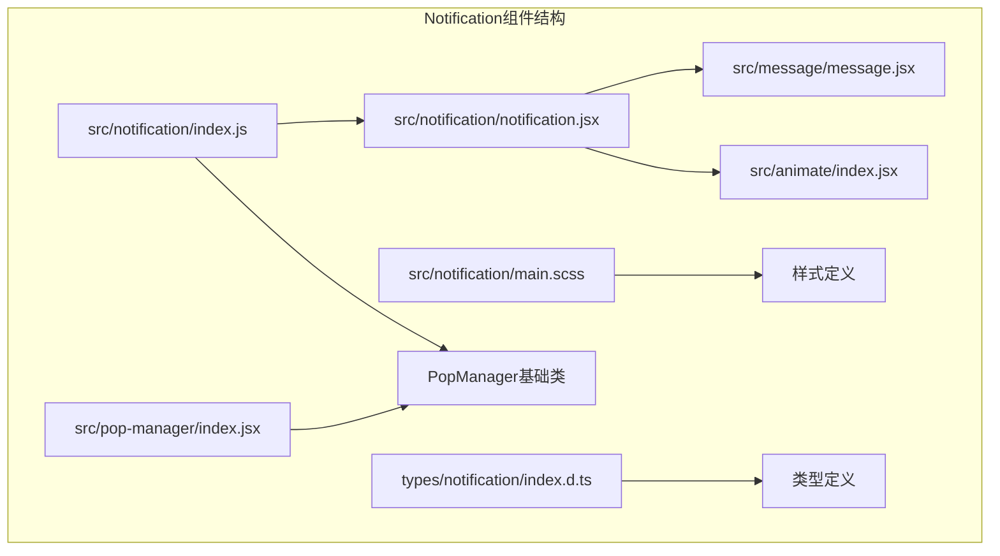
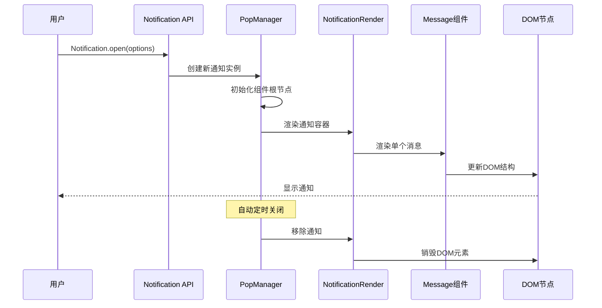
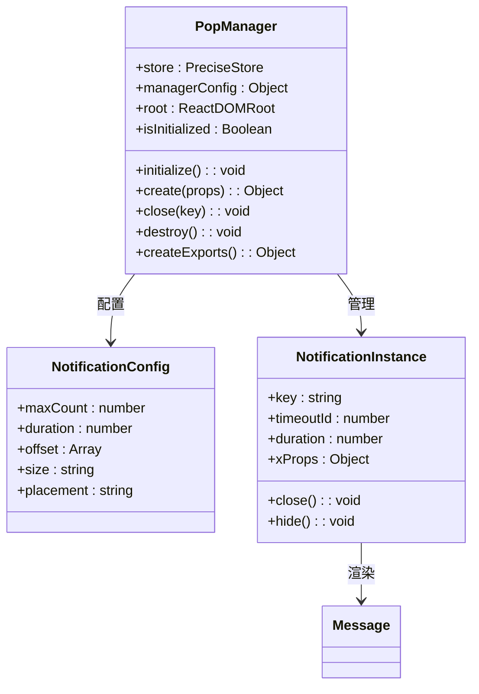
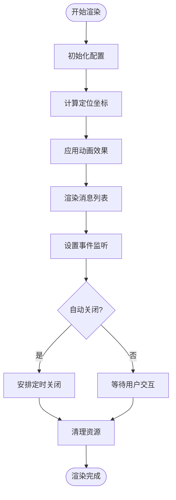
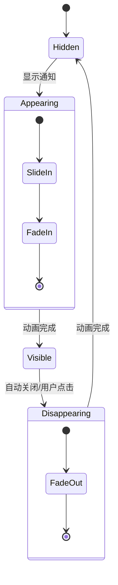
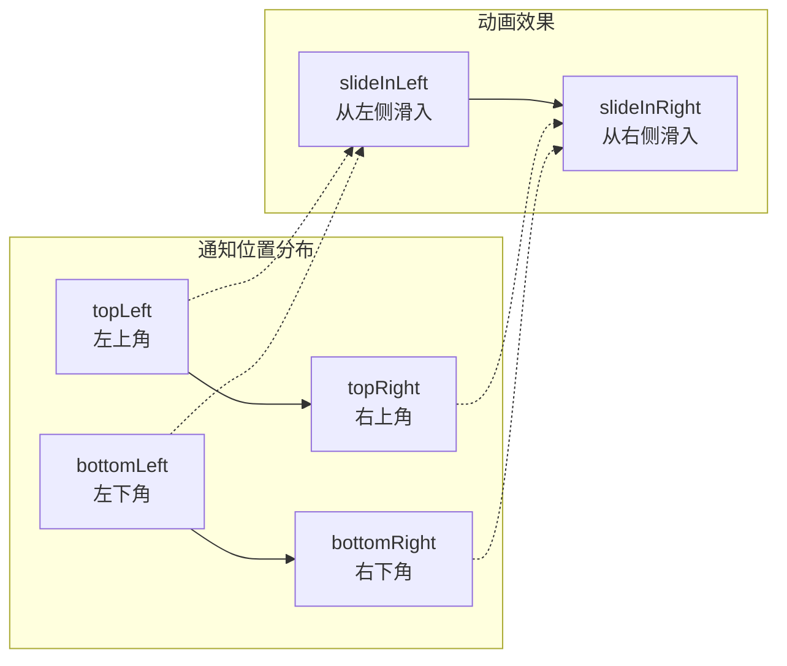

# 通知提醒框 (Notification)

<cite>
**本文档引用的文件**
- [src/notification/index.js](file://src/notification/index.js)
- [src/notification/notification.jsx](file://src/notification/notification.jsx)
- [src/notification/main.scss](file://src/notification/main.scss)
- [src/pop-manager/index.jsx](file://src/pop-manager/index.jsx)
- [src/message/message.jsx](file://src/message/message.jsx)
- [types/notification/index.d.ts](file://types/notification/index.d.ts)
- [demo/demo-buttons.tsx](file://demo/demo-buttons.tsx)
</cite>

## 目录
1. [简介](#简介)
2. [项目结构](#项目结构)
3. [核心组件](#核心组件)
4. [架构概览](#架构概览)
5. [详细组件分析](#详细组件分析)
6. [API参考](#api参考)
7. [使用示例](#使用示例)
8. [配置选项](#配置选项)
9. [性能考虑](#性能考虑)
10. [故障排除指南](#故障排除指南)
11. [总结](#总结)

## 简介

Notification组件是Fat Design设计系统中的一个重要UI组件，专门用于在页面右上角弹出通知提醒。它适用于系统级提醒、重要事件通知等场景，为用户提供及时的信息传达。与Message组件不同，Notification更强调信息的传达而非操作反馈，通常具有更高的视觉优先级和更持久的存在时间。

Notification组件采用现代化的通知管理机制，支持多种通知类型、自定义位置、动画效果和交互行为。它基于PopManager构建，提供了完整的生命周期管理和状态控制。

## 项目结构

Notification组件的文件组织结构清晰明确，遵循模块化设计原则：



**图表来源**
- [src/notification/index.js](file://src/notification/index.js#L1-L22)
- [src/notification/notification.jsx](file://src/notification/notification.jsx#L1-L87)

**章节来源**
- [src/notification/index.js](file://src/notification/index.js#L1-L22)
- [src/notification/notification.jsx](file://src/notification/notification.jsx#L1-L87)

## 核心组件

Notification组件的核心由以下几个关键部分组成：

### 1. PopManager基础层
PopManager是所有弹出式组件的基础管理器，负责：
- 组件实例的创建和销毁
- 生命周期管理
- 状态同步和存储
- 最大数量限制

### 2. Notification渲染层
NotificationRender负责具体的渲染逻辑：
- 动画效果处理
- 布局定位计算
- 消息列表渲染
- 事件处理

### 3. Message集成层
Notification内部集成了Message组件，利用其成熟的UI渲染能力：
- 不同类型的视觉标识
- 自动关闭机制
- 用户交互支持

**章节来源**
- [src/pop-manager/index.jsx](file://src/pop-manager/index.jsx#L1-L246)
- [src/notification/notification.jsx](file://src/notification/notification.jsx#L1-L87)

## 架构概览

Notification组件采用了分层架构设计，确保了良好的可维护性和扩展性：



**图表来源**
- [src/notification/index.js](file://src/notification/index.js#L8-L20)
- [src/notification/notification.jsx](file://src/notification/notification.jsx#L20-L87)

## 详细组件分析

### PopManager核心机制

PopManager是Notification组件的核心基础设施，提供了完整的弹出式组件管理能力：



**图表来源**
- [src/pop-manager/index.jsx](file://src/pop-manager/index.jsx#L35-L246)
- [src/notification/index.js](file://src/notification/index.js#L8-L20)

### Notification渲染流程

Notification的渲染过程涉及多个步骤的协调：



**图表来源**
- [src/notification/notification.jsx](file://src/notification/notification.jsx#L20-L87)

### 动画系统

Notification组件实现了丰富的动画效果，提升用户体验：



**章节来源**
- [src/notification/notification.jsx](file://src/notification/notification.jsx#L7-L16)
- [src/notification/main.scss](file://src/notification/main.scss#L1-L43)

## API参考

### 主要API方法

Notification组件提供了简洁而强大的API接口：

#### 1. 基础方法
```typescript
// 打开通知
static open(options: NotificationOptions): string

// 关闭指定通知
static close(key: string): void

// 关闭所有通知
static close(): void

// 销毁所有通知
static destroy(): void

// 配置全局设置
static config(config: NotificationConfig): NotificationConfig
```

#### 2. 快捷方法
```typescript
// 成功通知
static success(options: NotificationOptions): string

// 错误通知  
static error(options: NotificationOptions): string

// 警告通知
static warning(options: NotificationOptions): string

// 信息通知
static info(options: NotificationOptions): string

// 加载通知
static loading(options: NotificationOptions): string

// 帮助通知
static help(options: NotificationOptions): string

// 一般通知
static notice(options: NotificationOptions): string
```

### 参数类型定义

#### NotificationOptions 接口
```typescript
interface NotificationOptions {
    key?: string;                    // 唯一标识符
    type?: 'success' | 'error' | 'warning' | 'notice' | 'help';  // 通知类型
    title?: ReactNode;              // 标题内容
    content?: ReactNode;            // 主体内容
    icon?: string;                  // 自定义图标类型
    duration?: number;              // 显示时长（毫秒）
    onClick?: MouseEventHandler;    // 点击事件处理器
    style?: CSSProperties;          // 自定义样式
    className?: string;             // 自定义类名
    onClose?: () => void;           // 关闭回调
}
```

#### NotificationConfig 接口
```typescript
interface NotificationConfig {
    offset?: [number, number];      // 边距偏移量 [水平, 垂直]
    maxCount?: number;              // 最大同时显示数量
    size?: 'large' | 'medium';      // 尺寸大小
    duration?: number;              // 默认显示时长
    getContainer?: () => HTMLElement; // 容器获取函数
    placement?: 'topRight' | 'topLeft' | 'bottomLeft' | 'bottomRight'; // 位置
}
```

**章节来源**
- [types/notification/index.d.ts](file://types/notification/index.d.ts#L1-L36)

## 使用示例

### 基本使用

```javascript
// 基本成功通知
Notification.success({
    title: '操作成功',
    content: '您的操作已成功完成'
});

// 错误通知
Notification.error({
    title: '操作失败',
    content: '请检查输入信息并重试'
});
```

### 自定义配置

```javascript
// 自定义通知
Notification.open({
    type: 'error',
    icon: 'smile',
    title: '自定义标题',
    content: '这是一个自定义的通知内容',
    duration: 5000,
    onClick: () => {
        console.log('通知被点击');
    },
    onClose: () => {
        console.log('通知已关闭');
    }
});
```

### 高级用法

```javascript
// 设置全局配置
Notification.config({
    placement: 'topLeft',
    offset: [50, 50],
    maxCount: 5,
    duration: 6000
});

// 获取通知实例的key
const key = Notification.info({
    title: '系统通知',
    content: '这是一条重要的系统通知'
});

// 后续关闭特定通知
setTimeout(() => {
    Notification.close(key);
}, 10000);
```

### 实际应用场景

#### 1. 表单提交反馈
```javascript
async function handleSubmit(formData) {
    try {
        const result = await api.submitForm(formData);
        Notification.success({
            title: '提交成功',
            content: '表单已成功提交'
        });
    } catch (error) {
        Notification.error({
            title: '提交失败',
            content: error.message
        });
    }
}
```

#### 2. 系统状态通知
```javascript
// 网络连接状态变化
function handleNetworkChange(isOnline) {
    if (isOnline) {
        Notification.success({
            title: '网络恢复',
            content: '已重新连接到服务器'
        });
    } else {
        Notification.warning({
            title: '网络断开',
            content: '当前处于离线状态'
        });
    }
}
```

#### 3. 数据加载进度
```javascript
// 异步数据加载
async function loadData() {
    const loadingKey = Notification.loading({
        title: '加载中',
        content: '正在获取数据，请稍候...'
    });
    
    try {
        const data = await fetchData();
        Notification.success({
            key: loadingKey,
            title: '加载完成',
            content: '数据已成功加载'
        });
    } catch (error) {
        Notification.error({
            key: loadingKey,
            title: '加载失败',
            content: error.message
        });
    }
}
```

**章节来源**
- [demo/demo-buttons.tsx](file://demo/demo-buttons.tsx#L220-L350)

## 配置选项

### 全局配置

Notification支持灵活的全局配置，可以在应用启动时进行统一设置：

```javascript
// 应用启动时配置
Notification.config({
    // 位置配置
    placement: 'topRight',  // 'topRight' | 'topLeft' | 'bottomLeft' | 'bottomRight'
    
    // 偏移量配置
    offset: [30, 30],       // [水平偏移, 垂直偏移] 单位：像素
    
    // 数量限制
    maxCount: 999,          // 同时最多显示的通知数量
    
    // 默认显示时长
    duration: 4500,         // 毫秒，默认4.5秒
    
    // 尺寸配置
    size: 'medium',         // 'medium' | 'large'
    
    // 自定义容器
    getContainer: () => document.getElementById('notification-container')
});
```

### 位置配置详解

Notification支持四种标准位置：



**图表来源**
- [src/notification/notification.jsx](file://src/notification/notification.jsx#L7-L16)

### 持久化通知模式

对于需要用户主动确认的重要通知，可以设置较长的显示时长或禁用自动关闭：

```javascript
// 永久显示的通知（需要手动关闭）
Notification.open({
    title: '重要公告',
    content: '系统即将进行维护，请提前保存工作',
    duration: 0,  // 0表示永不自动关闭
    closeable: true  // 显示关闭按钮
});

// 长时间显示的通知
Notification.open({
    title: '系统更新',
    content: '新版本已发布，建议尽快更新',
    duration: 10000  // 10秒后自动关闭
});
```

### 自定义样式和行为

```javascript
// 自定义样式的通知
Notification.open({
    title: '个性化通知',
    content: '带有自定义样式的通知',
    style: {
        backgroundColor: '#f0f8ff',
        border: '1px solid #add8e6',
        borderRadius: '8px'
    },
    className: 'custom-notification',
    onClick: (event) => {
        // 自定义点击行为
        window.location.href = '/settings';
    }
});
```

**章节来源**
- [src/notification/index.js](file://src/notification/index.js#L8-L20)
- [src/notification/notification.jsx](file://src/notification/notification.jsx#L20-L40)

## 性能考虑

### 内存管理

Notification组件通过PopManager实现了完善的内存管理机制：

1. **自动清理**：过期通知会自动清理，避免内存泄漏
2. **最大数量限制**：防止过多通知堆积影响性能
3. **组件卸载**：通知关闭时会正确卸载相关DOM节点

### 渲染优化

1. **虚拟化渲染**：只渲染可见的通知，隐藏的通知不会占用渲染资源
2. **动画优化**：使用CSS3动画而非JavaScript动画，提高流畅度
3. **批量更新**：使用React的批量更新机制减少不必要的重渲染

### 最佳实践

```javascript
// 避免频繁创建大量通知
// ❌ 不推荐：循环创建大量通知
for (let i = 0; i < 100; i++) {
    Notification.info({title: `通知${i}`, content: '测试内容'});
}

// ✅ 推荐：合并相似通知
const notifications = [
    {title: '通知1', content: '内容1'},
    {title: '通知2', content: '内容2'}
];
notifications.forEach(notif => Notification.info(notif));
```

## 故障排除指南

### 常见问题及解决方案

#### 1. 通知不显示
**可能原因**：
- PopManager未正确初始化
- DOM容器不存在
- 配置错误

**解决方案**：
```javascript
// 确保在DOM准备好后再使用
document.addEventListener('DOMContentLoaded', () => {
    Notification.success({
        title: '测试通知',
        content: '应该能看到这条通知'
    });
});
```

#### 2. 动画效果异常
**可能原因**：
- CSS文件未正确加载
- 动画配置冲突

**解决方案**：
```javascript
// 检查CSS加载状态
if (!document.querySelector('.fatd-notification')) {
    console.warn('Notification样式文件未加载');
}
```

#### 3. 通知重复出现
**可能原因**：
- 未正确设置唯一key
- 多次调用相同配置

**解决方案**：
```javascript
// 使用唯一key避免重复
const uniqueKey = `notification-${Date.now()}`;
Notification.open({
    key: uniqueKey,
    title: '唯一通知',
    content: '只有这个key的通知会被显示'
});
```

### 调试技巧

```javascript
// 开启调试模式
console.log('当前通知配置:', Notification.config());

// 查看当前显示的通知
const config = Notification.config();
console.log('当前通知数量:', config.maxCount);

// 监听通知事件
Notification.open({
    title: '测试通知',
    content: '测试内容',
    onClose: () => {
        console.log('通知已关闭');
    }
});
```

**章节来源**
- [src/pop-manager/index.jsx](file://src/pop-manager/index.jsx#L100-L150)

## 总结

Notification组件是Fat Design设计系统中一个功能完善、设计精良的通知管理组件。它具有以下核心特性：

### 主要优势

1. **易用性**：提供简洁直观的API接口，支持多种使用方式
2. **灵活性**：支持自定义配置、样式和行为
3. **可靠性**：基于成熟的PopManager架构，具备完善的生命周期管理
4. **美观性**：内置动画效果和响应式布局，提供良好的用户体验
5. **扩展性**：模块化设计便于功能扩展和定制

### 适用场景

- 系统级重要事件通知
- 用户操作结果反馈
- 状态变更提示
- 信息提醒和公告
- 错误和警告提示

### 发展方向

随着前端技术的发展，Notification组件可以进一步增强：
- 支持更多动画效果和主题
- 增强无障碍访问支持
- 优化移动端体验
- 提供更丰富的自定义选项

Notification组件作为Fat Design生态系统的重要组成部分，为开发者提供了强大而灵活的通知解决方案，是构建现代Web应用不可或缺的UI组件之一。