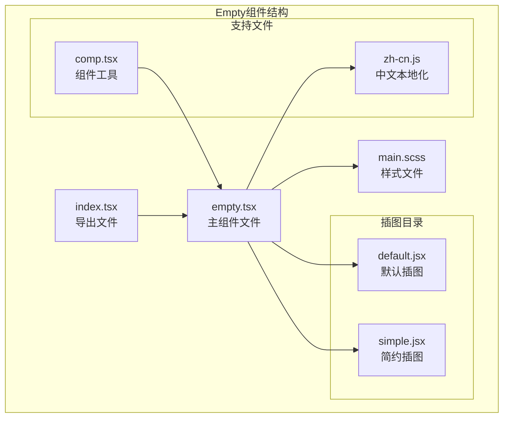
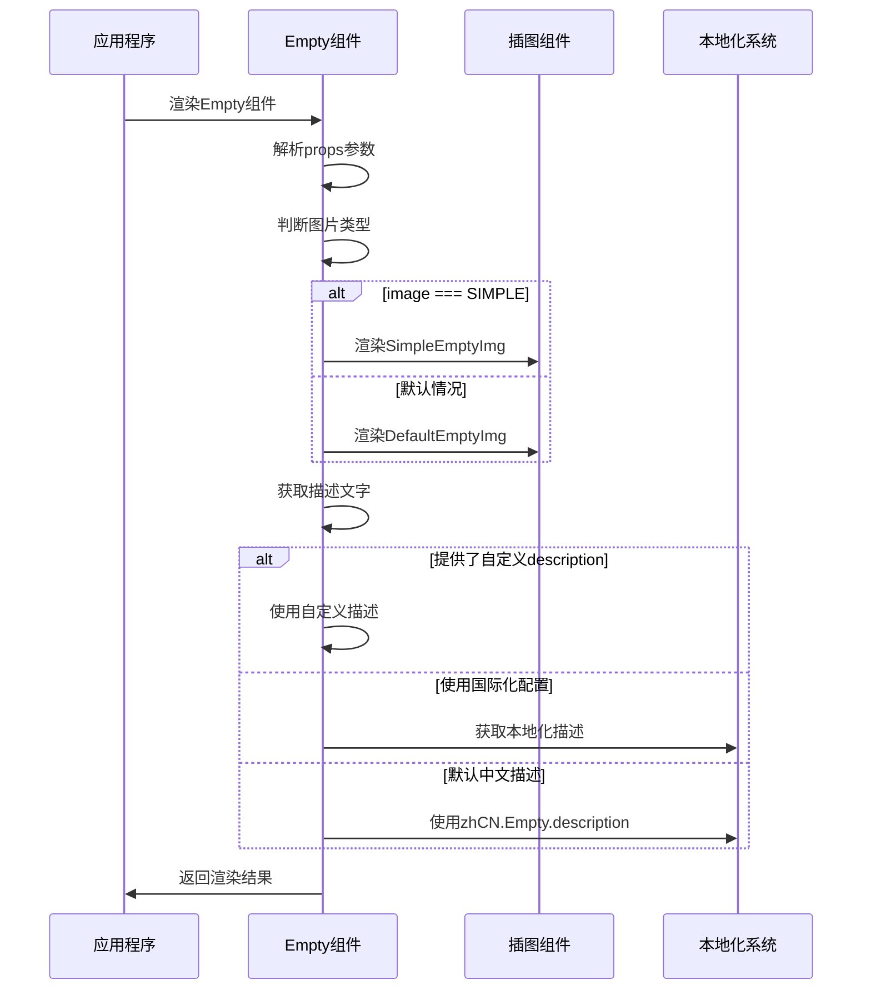
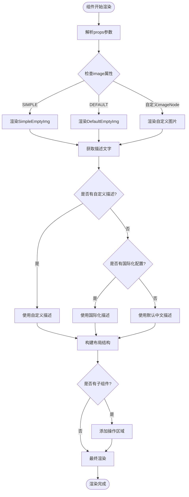
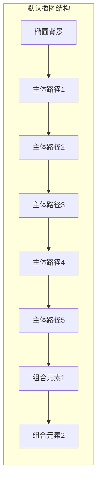
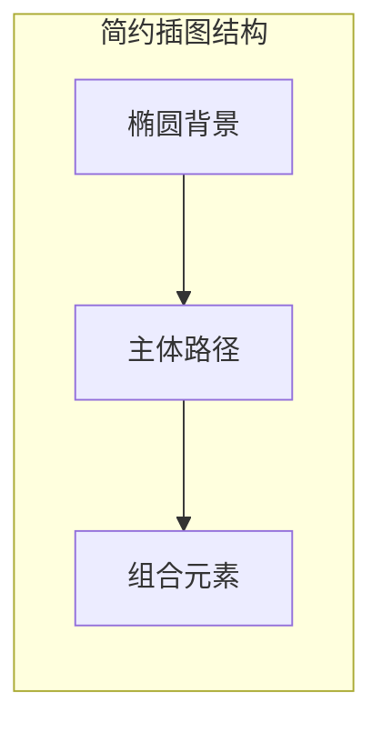
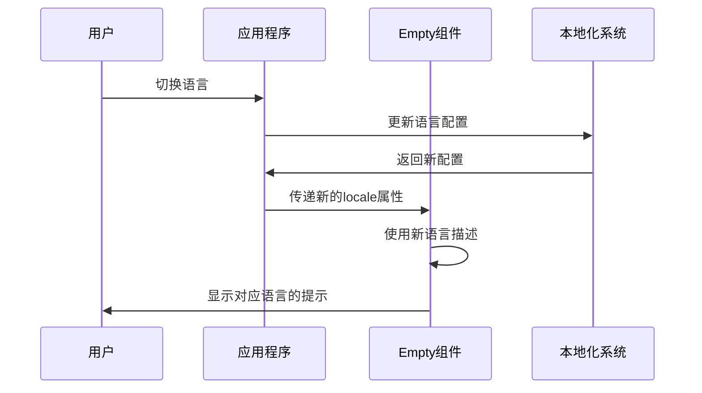

# Empty 空状态组件

<cite>
**本文档引用的文件**
- [empty.tsx](file://src/empty/empty.tsx)
- [index.tsx](file://src/empty/index.tsx)
- [main.scss](file://src/empty/main.scss)
- [default.jsx](file://src/empty/img/default.jsx)
- [simple.jsx](file://src/empty/img/simple.jsx)
- [zh-cn.js](file://src/locale/zh-cn.js)
- [comp.tsx](file://src/util/comp.tsx)
</cite>

## 目录
1. [简介](#简介)
2. [项目结构](#项目结构)
3. [核心组件](#核心组件)
4. [架构概览](#架构概览)
5. [详细组件分析](#详细组件分析)
6. [插图系统](#插图系统)
7. [国际化支持](#国际化支持)
8. [使用指南](#使用指南)
9. [最佳实践](#最佳实践)
10. [故障排除](#故障排除)
11. [总结](#总结)

## 简介

Empty空状态组件是Fat Design设计系统中的一个重要UI组件，专门用于在数据缺失、搜索无结果、页面为空等场景下提供友好的视觉反馈和用户体验优化。该组件通过内置的默认插图和简约样式，帮助用户理解当前状态，并引导他们采取适当的行动。

Empty组件的设计理念是：
- **清晰传达状态**：明确告知用户当前没有可用数据
- **提升用户体验**：避免空白页面造成的困惑
- **引导用户操作**：提供相关操作按钮或指引
- **保持界面美观**：通过精心设计的插图和布局维持整体视觉效果

## 项目结构

Empty组件的文件组织结构清晰明了，遵循模块化设计原则：



**图表来源**
- [empty.tsx](file://src/empty/empty.tsx#L1-L95)
- [index.tsx](file://src/empty/index.tsx#L1-L7)
- [main.scss](file://src/empty/main.scss#L1-L85)

**章节来源**
- [empty.tsx](file://src/empty/empty.tsx#L1-L95)
- [index.tsx](file://src/empty/index.tsx#L1-L7)

## 核心组件

### Empty组件接口定义

Empty组件采用TypeScript接口定义，提供了完整的类型安全性和扩展性：

```typescript
export interface EmptyProps extends Record<string, any> {
    prefixCls?: string;
    className?: string;
    style?: React.CSSProperties;
    imageStyle?: React.CSSProperties;
    image?: string;
    description?: React.ReactNode;
    locale?: any;
    children?: any;
    rtl?: boolean;
    imageNode?: any;
    prefix?: string;
}
```

### 主要属性说明

| 属性名 | 类型 | 默认值 | 描述 |
|--------|------|--------|------|
| `prefixCls` | `string` | - | CSS类前缀 |
| `className` | `string` | - | 自定义CSS类名 |
| `style` | `React.CSSProperties` | - | 内联样式 |
| `imageStyle` | `React.CSSProperties` | - | 图片样式 |
| `image` | `string` | `'DEFAULT'` | 图片类型 |
| `description` | `React.ReactNode` | - | 描述文字 |
| `locale` | `any` | `zhCN.Empty` | 国际化配置 |
| `children` | `any` | - | 子组件（通常为操作按钮） |
| `rtl` | `boolean` | - | 是否启用RTL布局 |
| `imageNode` | `any` | - | 自定义图片节点 |

**章节来源**
- [empty.tsx](file://src/empty/empty.tsx#L13-L25)

## 架构概览

Empty组件采用了分层架构设计，确保了良好的可维护性和扩展性：



**图表来源**
- [empty.tsx](file://src/empty/empty.tsx#L28-L46)
- [empty.tsx](file://src/empty/empty.tsx#L49-L92)

## 详细组件分析

### 组件渲染逻辑

Empty组件的核心渲染逻辑分为三个主要部分：

1. **图片选择逻辑**：根据`image`属性决定使用哪种插图
2. **描述文字处理**：优先级从高到低依次为：自定义描述 > 国际化配置 > 默认中文描述
3. **布局结构**：包含图片区域、描述文字区域和可选的操作区域



**图表来源**
- [empty.tsx](file://src/empty/empty.tsx#L28-L46)
- [empty.tsx](file://src/empty/empty.tsx#L49-L92)

### 样式系统

Empty组件的样式系统采用了BEM命名规范，确保了样式的模块化和可维护性：

```scss
// 基础样式
.empty {
  margin: 0 8px;
  font-size: 14px;
  line-height: 1.5;
  text-align: center;
}

// 图片区域样式
.empty-image {
  height: 100px;
  margin-bottom: 8px;
}

// 描述文字样式
.empty-description {
  color: #bbbbc1;
}

// 简约模式样式
.empty-normal {
  margin: 32px 0;
  color: #dddde2;
}

.empty-normal .empty-image {
  height: 40px;
}
```

**章节来源**
- [main.scss](file://src/empty/main.scss#L1-L85)

## 插图系统

### 默认插图（Default）

默认插图是一个复杂的SVG图形，包含多个路径和形状元素：



**图表来源**
- [default.jsx](file://src/empty/img/default.jsx#L1-L57)

### 简约插图（Simple）

简约插图采用更简洁的设计风格，适合现代扁平化界面：



**图表来源**
- [simple.jsx](file://src/empty/img/simple.jsx#L1-L29)

### 插图类型枚举

组件内部定义了插图类型常量：

```javascript
const EMPTY_TYPE = {
    'DEFAULT' : 'DEFAULT',
    'SIMPLE' : 'SIMPLE',
};
```

**章节来源**
- [empty.tsx](file://src/empty/empty.tsx#L8-L11)
- [default.jsx](file://src/empty/img/default.jsx#L1-L57)
- [simple.jsx](file://src/empty/img/simple.jsx#L1-L29)

## 国际化支持

### 本地化配置

Empty组件支持多语言配置，默认提供中文支持：

```javascript
// 中文本地化配置
{
    Empty: {
        description: '暂无数据',
    }
}
```

### 国际化集成

组件通过`locale`属性接收国际化配置，支持动态切换语言：



**图表来源**
- [zh-cn.js](file://src/locale/zh-cn.js#L200-L206)
- [empty.tsx](file://src/empty/empty.tsx#L39-L46)

**章节来源**
- [zh-cn.js](file://src/locale/zh-cn.js#L200-L206)
- [empty.tsx](file://src/empty/empty.tsx#L39-L46)

## 使用指南

### 基本用法

最简单的使用方式是直接渲染Empty组件：

```jsx
import { Empty } from 'fat-design';

function BasicExample() {
    return <Empty />;
}
```

### 自定义描述文字

```jsx
function CustomDescription() {
    return (
        <Empty 
            description="这里没有任何内容" 
            image="SIMPLE"
        />
    );
}
```

### 添加操作按钮

```jsx
function WithActions() {
    return (
        <Empty 
            description="暂无数据"
            image="DEFAULT"
        >
            <button>添加新数据</button>
        </Empty>
    );
}
```

### 自定义插图

```jsx
function CustomImage() {
    const customImage = (
        <svg width="100" height="100" viewBox="0 0 100 100">
            {/* 自定义SVG内容 */}
        </svg>
    );
    
    return (
        <Empty 
            imageNode={customImage}
            description="自定义插图"
        />
    );
}
```

### 在表格中使用

```jsx
function TableWithEmpty() {
    const data = []; // 空数据数组
    
    return (
        <div>
            {data.length > 0 ? (
                <table>
                    {/* 表格内容 */}
                </table>
            ) : (
                <Empty 
                    description="暂无数据，请添加新记录"
                    image="DEFAULT"
                >
                    <button onClick={() => addNewRecord()}>
                        添加记录
                    </button>
                </Empty>
            )}
        </div>
    );
}
```

## 最佳实践

### 设计原则

1. **一致性**：在整个应用中保持统一的空状态样式
2. **相关性**：描述文字应该与当前上下文相关
3. **行动导向**：提供明确的操作指引
4. **美观性**：使用高质量的插图和配色方案

### 使用场景

- 数据列表为空时
- 搜索结果为空时
- 新建页面初始状态
- 权限不足时的状态
- 加载失败后的备用状态

### 性能优化

- 合理使用缓存机制避免重复渲染
- 对于大量数据的空状态，考虑虚拟滚动
- 使用合适的插图大小，避免过度渲染

## 故障排除

### 常见问题

1. **插图不显示**
   - 检查`image`属性是否正确设置
   - 确认SVG文件路径是否正确
   - 验证CSS样式是否被覆盖

2. **描述文字乱码**
   - 检查国际化配置是否正确加载
   - 确认字符编码设置
   - 验证字体是否正常加载

3. **样式异常**
   - 检查CSS类名冲突
   - 确认主题配置是否正确
   - 验证响应式样式设置

### 调试技巧

```javascript
// 开发环境调试
console.log('Empty component props:', props);
console.log('Resolved description:', getDescription(props));

// 检查插图渲染
console.log('Image node:', getImageNode(props));
```

**章节来源**
- [empty.tsx](file://src/empty/empty.tsx#L28-L46)
- [empty.tsx](file://src/empty/empty.tsx#L49-L92)

## 总结

Empty空状态组件是Fat Design设计系统中一个重要的UI元素，它通过精心设计的插图、灵活的配置选项和完善的国际化支持，为用户提供了一致且友好的空状态体验。

### 主要特性

- **双模式设计**：提供默认和简约两种插图风格
- **完全可定制**：支持自定义描述、插图和操作按钮
- **国际化支持**：内置多语言配置，支持动态切换
- **样式模块化**：采用SCSS和BEM规范，易于维护
- **类型安全**：完整的TypeScript接口定义

### 技术优势

- **性能优化**：合理的组件结构和渲染逻辑
- **扩展性强**：支持多种使用场景和自定义需求
- **维护简便**：清晰的代码结构和模块化设计
- **兼容性好**：支持RTL布局和各种主题配置

通过合理使用Empty组件，开发者可以显著提升应用的用户体验，使界面更加友好和专业。无论是数据缺失还是需要引导用户操作的场景，Empty组件都能提供优雅的解决方案。