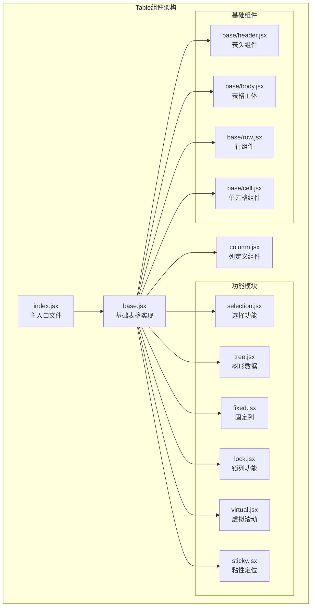
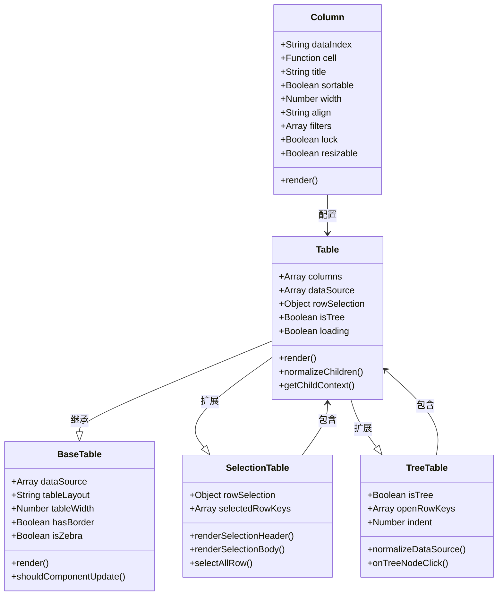
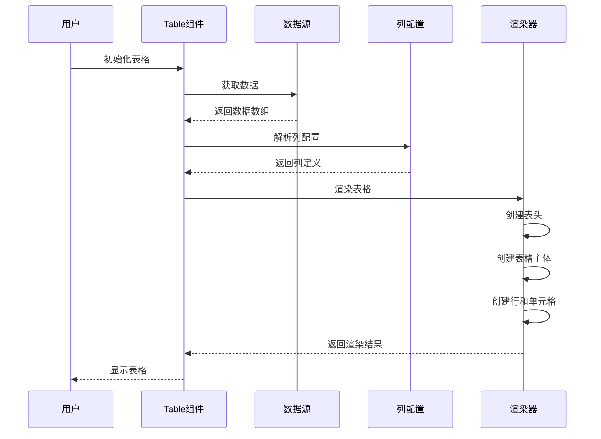
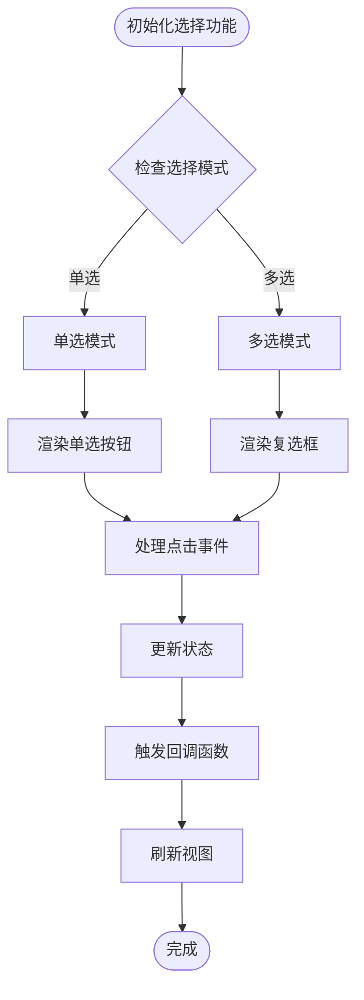
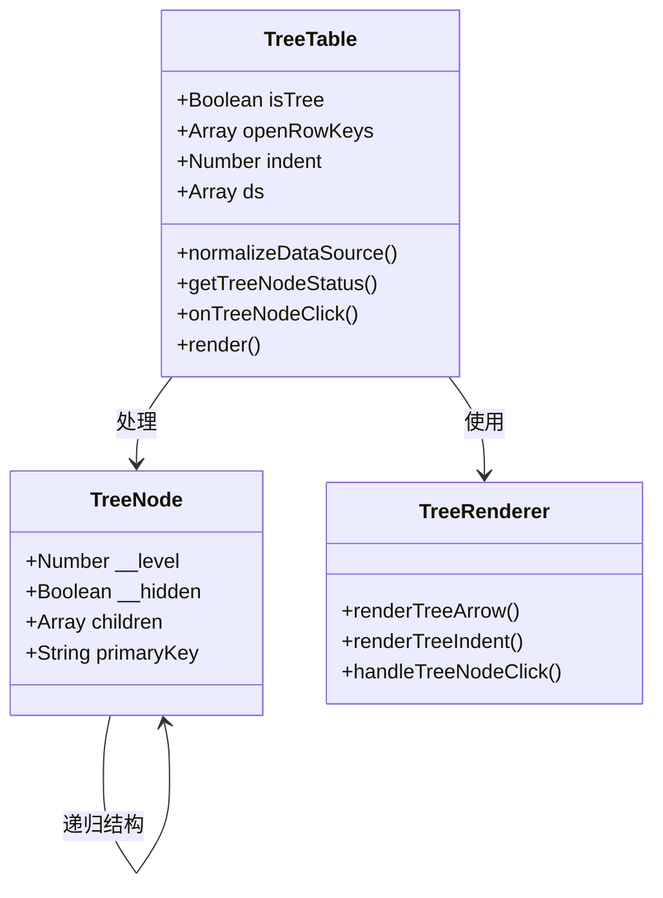
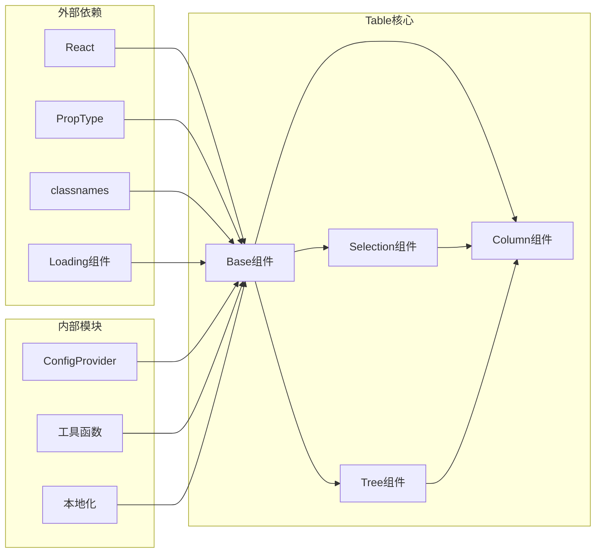

# Table 基础表格组件使用文档

<cite>
**本文档引用的文件**
- [src/table/index.jsx](file://src/table/index.jsx)
- [src/table/base.jsx](file://src/table/base.jsx)
- [src/table/column.jsx](file://src/table/column.jsx)
- [src/table/selection.jsx](file://src/table/selection.jsx)
- [src/table/tree.jsx](file://src/table/tree.jsx)
- [src/table/main.scss](file://src/table/main.scss)
- [types/table/index.d.ts](file://types/table/index.d.ts)
- [demo/demo-table-pro.tsx](file://demo/demo-table-pro.tsx)
- [demo/demo-sortable-table.tsx](file://demo/demo-sortable-table.tsx)
</cite>

## 目录
1. [简介](#简介)
2. [项目结构](#项目结构)
3. [核心组件](#核心组件)
4. [架构概览](#架构概览)
5. [详细组件分析](#详细组件分析)
6. [依赖关系分析](#依赖关系分析)
7. [性能考虑](#性能考虑)
8. [故障排除指南](#故障排除指南)
9. [结论](#结论)

## 简介

Table基础表格组件是Fat Design设计系统中的核心数据展示组件，提供了轻量级、高性能的数据表格解决方案。该组件专注于基础功能，包括数据绑定、列定义、排序、筛选、固定列、树形数据展示等基本特性，同时保持了良好的性能和易用性。

与TablePro相比，基础Table组件更加轻量，更适合常规的数据展示场景，而TablePro则提供了更多高级功能和企业级特性。基础Table组件的设计理念是"简单即美"，在满足基本需求的同时避免过度复杂化。

## 项目结构

Table组件采用模块化架构，将不同功能分离到独立的模块中：



**图表来源**
- [src/table/index.jsx](file://src/table/index.jsx#L1-L139)
- [src/table/base.jsx](file://src/table/base.jsx#L1-L50)

**章节来源**
- [src/table/index.jsx](file://src/table/index.jsx#L1-L139)
- [src/table/base.jsx](file://src/table/base.jsx#L1-L100)

## 核心组件

### Table主组件

Table主组件是整个表格系统的入口点，它通过高阶函数的方式将各种功能模块组合在一起：

```javascript
// 功能模块按特定顺序组合
const ORDER_LIST = [fixed, lock, selection, expanded, virtual, tree, list, sticky];
const Table = ORDER_LIST.reduce((ret, current) => {
    ret = current(ret);
    return ret;
}, Base);
```

主要特性：
- **模块化设计**：通过高阶函数组合不同功能模块
- **配置化**：支持丰富的配置选项和自定义
- **扩展性强**：可以通过插件机制扩展新功能
- **性能优化**：内置多种性能优化策略

### Column列定义组件

Column组件负责定义表格的列配置，支持灵活的列配置：

```javascript
// Column组件的核心属性
static propTypes = {
    dataIndex: PropTypes.string,           // 数据字段映射
    cell: PropTypes.oneOfType([PropTypes.element, PropTypes.node, PropTypes.func]), // 单元格渲染
    title: PropTypes.oneOfType([PropTypes.element, PropTypes.node, PropTypes.func]), // 表头内容
    sortable: PropTypes.bool,              // 是否支持排序
    width: PropTypes.oneOfType([PropTypes.number, PropTypes.string]), // 列宽
    align: PropTypes.oneOf(['left', 'center', 'right']), // 对齐方式
    filters: PropTypes.arrayOf(            // 过滤器配置
        PropTypes.shape({
            label: PropTypes.string,
            value: PropTypes.oneOfType([PropTypes.node, PropTypes.string]),
        })
    ),
    lock: PropTypes.oneOfType([PropTypes.bool, PropTypes.string]), // 锁列配置
    resizable: PropTypes.bool,             // 是否支持列宽调整
};
```

**章节来源**
- [src/table/column.jsx](file://src/table/column.jsx#L1-L119)
- [src/table/base.jsx](file://src/table/base.jsx#L20-L100)

## 架构概览

Table组件采用了分层架构设计，从底层的基础组件到上层的功能模块，形成了清晰的层次结构：



**图表来源**
- [src/table/base.jsx](file://src/table/base.jsx#L25-L100)
- [src/table/column.jsx](file://src/table/column.jsx#L10-L50)
- [src/table/selection.jsx](file://src/table/selection.jsx#L20-L80)
- [src/table/tree.jsx](file://src/table/tree.jsx#L10-L60)

## 详细组件分析

### 基础表格组件分析

基础表格组件（BaseTable）是整个表格系统的核心，提供了表格的基本功能和接口：



**图表来源**
- [src/table/base.jsx](file://src/table/base.jsx#L100-L200)

#### 主要功能特性

1. **数据绑定**：支持数组形式的数据源
2. **列定义**：灵活的列配置系统
3. **事件处理**：完整的事件回调机制
4. **样式定制**：丰富的样式配置选项
5. **性能优化**：内置性能优化策略

### 选择功能组件分析

选择功能组件（SelectionTable）为表格添加了行选择能力：



**图表来源**
- [src/table/selection.jsx](file://src/table/selection.jsx#L100-L200)

#### 选择功能特性

- **单选/多选模式**：支持两种选择模式
- **全选功能**：支持全选和反选
- **受控/非受控模式**：支持两种状态管理模式
- **自定义配置**：支持自定义选择列配置

### 树形数据组件分析

树形数据组件（TreeTable）为表格添加了树形结构展示能力：



**图表来源**
- [src/table/tree.jsx](file://src/table/tree.jsx#L50-L150)

#### 树形数据特性

- **层级展示**：支持多层级数据展示
- **动态展开**：支持动态展开和收起
- **缩进控制**：可配置的缩进尺寸
- **状态管理**：完整的展开状态管理

**章节来源**
- [src/table/selection.jsx](file://src/table/selection.jsx#L1-L100)
- [src/table/tree.jsx](file://src/table/tree.jsx#L1-L100)

## 依赖关系分析

Table组件的依赖关系体现了其模块化设计理念：



**图表来源**
- [src/table/base.jsx](file://src/table/base.jsx#L1-L20)
- [src/table/index.jsx](file://src/table/index.jsx#L1-L20)

**章节来源**
- [src/table/base.jsx](file://src/table/base.jsx#L1-L50)
- [src/table/index.jsx](file://src/table/index.jsx#L1-L50)

## 性能考虑

Table组件在设计时充分考虑了性能优化：

### 渲染优化

1. **PureComponent模式**：支持纯渲染模式减少不必要的重渲染
2. **虚拟滚动**：支持大数据量的虚拟滚动
3. **懒加载**：支持行内容的懒加载
4. **缓存机制**：缓存计算结果减少重复计算

### 内存优化

1. **事件委托**：使用事件委托减少内存占用
2. **组件卸载**：及时清理组件资源
3. **数据结构优化**：优化数据结构减少内存碎片

### 渲染性能

1. **批量更新**：批量处理状态更新
2. **防抖节流**：对频繁触发的操作进行防抖节流
3. **异步渲染**：支持异步渲染提高响应速度

## 故障排除指南

### 常见问题及解决方案

#### 1. 列宽显示异常

**问题描述**：表格列宽无法正确显示或超出容器宽度

**解决方案**：
```javascript
// 设置tableLayout为fixed
<Table tableLayout="fixed" tableWidth={800}>
    <Table.Column title="姓名" dataIndex="name" width={200} />
    <Table.Column title="年龄" dataIndex="age" width={100} />
</Table>
```

#### 2. 选择功能失效

**问题描述**：行选择功能无法正常工作

**解决方案**：
```javascript
// 正确配置rowSelection
<Table 
    dataSource={data}
    rowSelection={{
        mode: 'multiple', // 或'single'
        selectedRowKeys: selectedKeys,
        onChange: (selectedKeys, records) => {
            console.log('选中:', selectedKeys, records);
        }
    }}
/>
```

#### 3. 树形数据不显示

**问题描述**：树形数据结构无法正确渲染

**解决方案**：
```javascript
// 确保数据包含children字段
const treeData = [
    {
        id: '1',
        name: '父节点1',
        children: [
            { id: '1-1', name: '子节点1-1' },
            { id: '1-2', name: '子节点1-2' }
        ]
    }
];

<Table dataSource={treeData} isTree={true} />
```

**章节来源**
- [src/table/base.jsx](file://src/table/base.jsx#L300-L400)
- [src/table/selection.jsx](file://src/table/selection.jsx#L150-L250)

## 结论

Table基础表格组件是一个设计精良、功能完善的表格解决方案。它通过模块化的架构设计，将复杂的功能分解为独立的模块，既保证了功能的完整性，又保持了代码的可维护性。

### 主要优势

1. **轻量级设计**：专注于基础功能，避免过度复杂化
2. **模块化架构**：功能模块独立，便于扩展和维护
3. **性能优化**：内置多种性能优化策略
4. **易于使用**：API设计简洁直观，学习成本低
5. **扩展性强**：支持自定义和二次开发

### 适用场景

- **常规数据展示**：适合大多数数据展示场景
- **简单交互**：支持基本的排序、筛选、选择功能
- **性能要求**：在大数据量场景下表现良好
- **快速开发**：开箱即用，减少开发时间

### 与TablePro的区别

| 特性 | Table基础版 | TablePro企业版 |
|------|-------------|----------------|
| 功能复杂度 | 简单 | 复杂 |
| 性能开销 | 轻量 | 较重 |
| 企业功能 | 基础 | 完整 |
| 学习成本 | 低 | 中等 |
| 适用场景 | 常规场景 | 复杂业务场景 |

Table基础表格组件以其简洁的设计和强大的功能，为开发者提供了一个优秀的数据展示解决方案。在满足基本需求的同时，保持了良好的性能和可扩展性，是构建用户界面的理想选择。