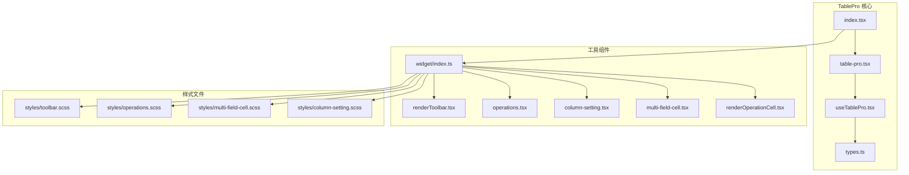
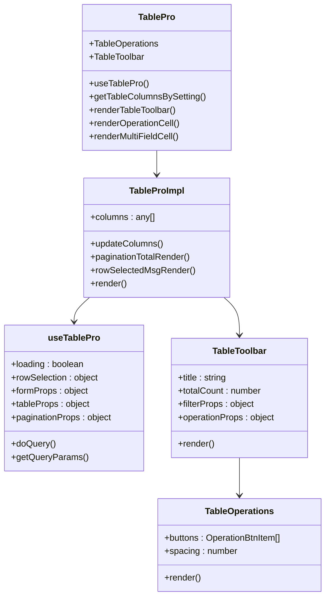
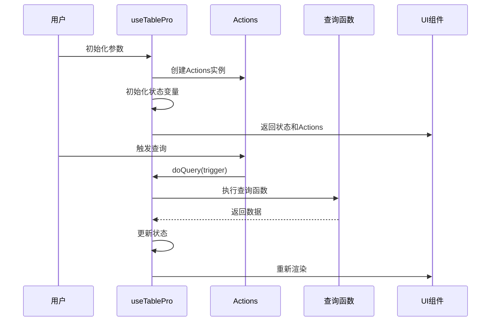
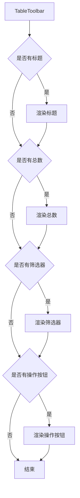
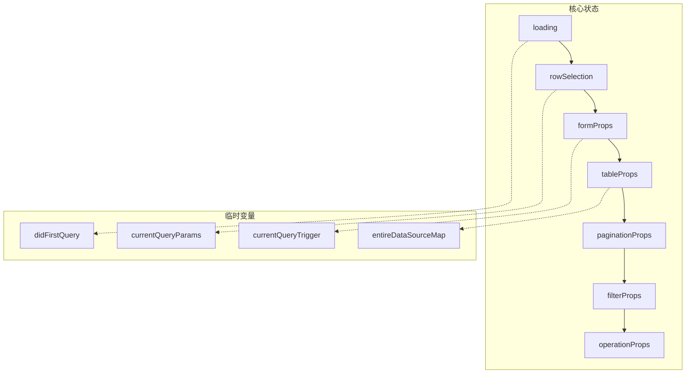
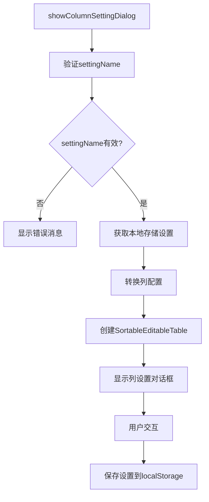
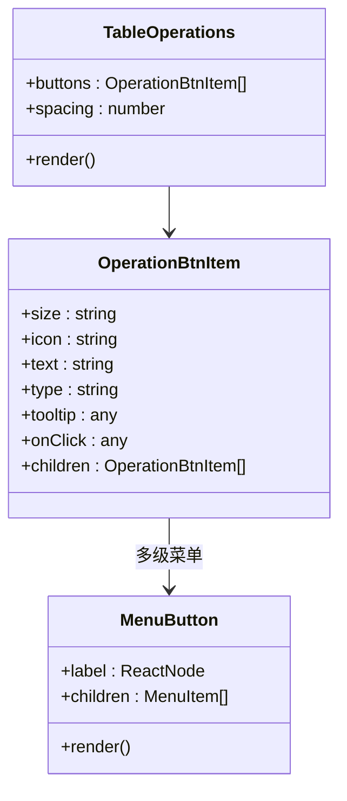
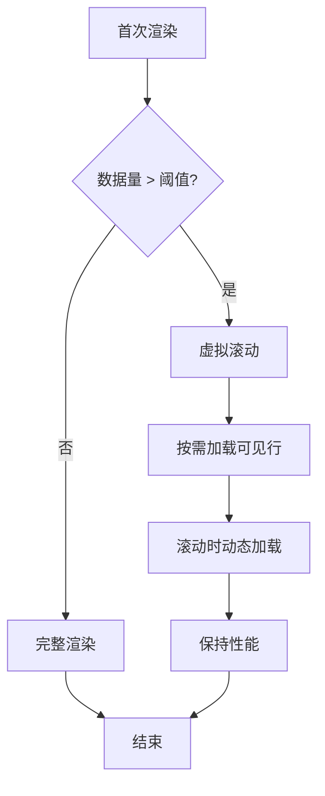
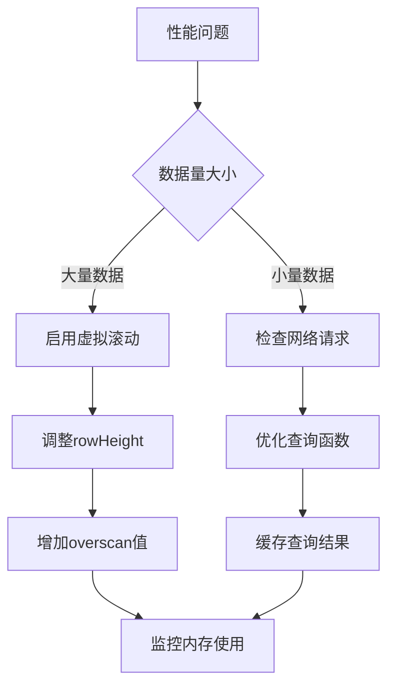

# TablePro 增强表格

<cite>
**本文档引用的文件**
- [src/table-pro/index.tsx](file://src/table-pro/index.tsx)
- [src/table-pro/table-pro.tsx](file://src/table-pro/table-pro.tsx)
- [src/table-pro/useTablePro.tsx](file://src/table-pro/useTablePro.tsx)
- [src/table-pro/types.ts](file://src/table-pro/types.ts)
- [src/table-pro/widget/index.ts](file://src/table-pro/widget/index.ts)
- [src/table-pro/widget/renderToolbar.tsx](file://src/table-pro/widget/renderToolbar.tsx)
- [src/table-pro/widget/operations.tsx](file://src/table-pro/widget/operations.tsx)
- [src/table-pro/widget/renderOperationCell.tsx](file://src/table-pro/widget/renderOperationCell.tsx)
- [src/table-pro/widget/renderMultiFieldCell.tsx](file://src/table-pro/widget/renderMultiFieldCell.tsx)
- [src/table-pro/widget/column-setting.tsx](file://src/table-pro/widget/column-setting.tsx)
- [demo/demo-table-pro.tsx](file://demo/demo-table-pro.tsx)
- [src/table-pro/widget/styles/toolbar.scss](file://src/table-pro/widget/styles/toolbar.scss)
- [src/table-pro/widget/styles/operations.scss](file://src/table-pro/widget/styles/operations.scss)
</cite>

## 目录
1. [简介](#简介)
2. [项目结构](#项目结构)
3. [核心组件](#核心组件)
4. [架构概览](#架构概览)
5. [详细组件分析](#详细组件分析)
6. [状态管理](#状态管理)
7. [列配置系统](#列配置系统)
8. [工具栏和操作](#工具栏和操作)
9. [性能优化](#性能优化)
10. [使用示例](#使用示例)
11. [故障排除](#故障排除)
12. [总结](#总结)

## 简介

TablePro 是 Fat Design 设计系统中的一个高级表格组件，它在基础 Table 组件的基础上提供了丰富的功能增强。TablePro 通过 useTablePro Hook 实现了完整的表格状态管理，包括数据查询、分页控制、列配置、工具栏管理和批量操作等功能。

该组件的主要特点包括：
- 完整的状态管理机制
- 灵活的列配置系统
- 强大的工具栏和操作功能
- 多字段单元格渲染
- 跨页选择支持
- 自定义操作按钮
- 性能优化的虚拟滚动

## 项目结构

TablePro 的项目结构清晰地分离了核心逻辑、工具组件和样式文件：



**图表来源**
- [src/table-pro/index.tsx](file://src/table-pro/index.tsx#L1-L52)
- [src/table-pro/widget/index.ts](file://src/table-pro/widget/index.ts#L1-L32)

**章节来源**
- [src/table-pro/index.tsx](file://src/table-pro/index.tsx#L1-L52)
- [src/table-pro/table-pro.tsx](file://src/table-pro/table-pro.tsx#L1-L214)

## 核心组件

TablePro 组件采用组合式架构设计，主要由以下几个核心部分组成：

### 主组件类

TablePro 主组件是一个静态类，提供了所有必要的工具函数和子组件：

```typescript
class TablePro extends React.Component<TableProProps, any> {
    static TableOperations: React.FC<OperationsProps> = tableUtils.TableOperations;
    static TableToolbar: React.FC<TableToolbarProps> = tableUtils.TableToolbar;
    static useTablePro: IUseTableProFunc = useTablePro;
    static getTableColumnsBySetting: IGetTableColumnsBySettingFunc = tableUtils.getTableColumnsBySetting;
    static renderTableToolbar: IRenderTableToolbar = tableUtils.renderTableToolbar;
    static renderOperationCell: IRenderOperationCell = tableUtils.renderOperationCell;
    static renderMultiFieldCell: IRenderMultiFieldCell = tableUtils.renderMultiFieldCell;
}
```

### 内部实现组件

TableProImpl 是实际的渲染组件，负责协调各个子组件的工作：

```typescript
class TableProImpl extends React.Component<TableProProps, TableProState> {
    constructor(props: any) {
        super(props);
        this.state = {
            columns: null, // columns为null表示没有初始化完成
        };
    }
}
```

**章节来源**
- [src/table-pro/index.tsx](file://src/table-pro/index.tsx#L11-L45)
- [src/table-pro/table-pro.tsx](file://src/table-pro/table-pro.tsx#L25-L35)

## 架构概览

TablePro 采用了分层架构设计，将不同功能模块分离到独立的组件中：



**图表来源**
- [src/table-pro/index.tsx](file://src/table-pro/index.tsx#L11-L45)
- [src/table-pro/table-pro.tsx](file://src/table-pro/table-pro.tsx#L25-L35)
- [src/table-pro/useTablePro.tsx](file://src/table-pro/useTablePro.tsx#L50-L100)

## 详细组件分析

### useTablePro Hook 分析

useTablePro 是 TablePro 的核心状态管理 Hook，它提供了完整的表格状态管理功能：



**图表来源**
- [src/table-pro/useTablePro.tsx](file://src/table-pro/useTablePro.tsx#L50-L150)

#### 状态管理机制

useTablePro 使用多个状态钩子来管理不同的表格状态：

```typescript
const [loading, setLoading, getIsLoading] = useCurrentState(false);
const [rowSelection, updateRowSelection, getRowSelection] = useCurrentState2(initByParams({
    selectedRowKeys: []
}, params.initTableProps.rowSelection));
const [formProps, updateFormProps, getFormProps] = useCurrentState2(initByParams({
    _tmpFormValues: params.initFormProps?.defaultValues || {},
    isUseCard: true
}, params.initFormProps));
```

#### 查询触发机制

TablePro 定义了多种查询触发方式：

```typescript
const QUERY_TRIGGER = {
    DID_MOUNT: 'DID_MOUNT',
    FORM_ON_SUBMIT: 'FORM_ON_SUBMIT',
    FORM_ON_RESET: 'FORM_ON_RESET',
    FORM_ON_ASYNC_ENUMS: 'FORM_ON_ASYNC_ENUMS',
    FILTER_ON_CHANGE: 'FILTER_ON_CHANGE',
    PAGINATION_ON_CHANGE: 'PAGINATION_ON_CHANGE',
    PAGINATION_ON_CHANGE_SIZE: 'PAGINATION_ON_CHANGE_SIZE',
};
```

**章节来源**
- [src/table-pro/useTablePro.tsx](file://src/table-pro/useTablePro.tsx#L50-L200)

### 工具栏组件分析

TableToolbar 组件负责渲染表格顶部的工具栏区域：



**图表来源**
- [src/table-pro/widget/renderToolbar.tsx](file://src/table-pro/widget/renderToolbar.tsx#L15-L70)

#### 工具栏渲染逻辑

```typescript
return (
    <div className={cls('comp')}>
        {title ? (
            <div className={cls('title')}>
                {title}
            </div>
        ) : null}

        {(typeof totalCount === "number" || typeof totalCount === "string") ? (
            <div className={cls('total')}>
                共 {totalCount} 项
            </div>
        ) : null}

        {filterProps && isNotEmpty(filterProps.dataSource) ? (
            <div className={cls('filter-wrap')}>
                <FilterComp {...filterProps} />
            </div>
        ) : null}

        {operationProps ? (
            <div className={cls('operations-wrap')}>
                <OperationsComp {...operationProps} prefix={prefix} actions={actions}/>
            </div>
        ) : null}
    </div>
)
```

**章节来源**
- [src/table-pro/widget/renderToolbar.tsx](file://src/table-pro/widget/renderToolbar.tsx#L15-L70)

## 状态管理

### 状态变量结构

TablePro 使用复杂的状态管理系统来维护表格的各种状态：



**图表来源**
- [src/table-pro/useTablePro.tsx](file://src/table-pro/useTablePro.tsx#L50-L100)

### Actions 接口设计

TablePro 定义了完整的 Actions 接口来管理表格行为：

```typescript
class TableProActions {
    public name: string = 'TableProActions';
    
    // 查询相关方法
    doQuery: (queryTrigger?: string) => Promise<boolean>;
    getQueryParams: (queryTrigger: string) => any;
    
    // 状态更新方法
    updateRowSelection: (selection: any) => void;
    updateFormProps: (props: any) => void;
    updateTableProps: (props: any) => void;
    
    // 获取状态方法
    getSettingName: () => string;
    getInitialParams: () => IUseTableProParams;
}
```

**章节来源**
- [src/table-pro/useTablePro.tsx](file://src/table-pro/useTablePro.tsx#L40-L80)

## 列配置系统

### 列设置对话框

TablePro 提供了强大的列配置功能，允许用户自定义列的显示、排序和锁定：



**图表来源**
- [src/table-pro/widget/column-setting.tsx](file://src/table-pro/widget/column-setting.tsx#L150-L200)

### 编辑列配置

```typescript
function toEditingColumns(columns: any[], settingArray: any): any[] {
    const columns2 = columns.map((column, index) => {
        const editingTitle = getColumnTitleText(column, index);
        const editingColumnKey = `${editingTitle}_${column.dataIndex}`;

        const columnObj = {
            ...column,
            editingColumnKey: editingColumnKey,
            editingTitle: editingTitle,
            editingLockLeft: column.lock === 'left',
            editingLockRight: column.lock === 'right',
            editingDisplay: typeof column.display === "boolean" ? column.display : true,
            editingSortIndex: index,
        };

        if (settingObj) {
            setObjAttr(columnObj, settingObj, 'editingLockLeft', 'boolean');
            setObjAttr(columnObj, settingObj, 'editingLockRight', 'boolean');
            setObjAttr(columnObj, settingObj, 'editingDisplay', 'boolean');
            setObjAttr(columnObj, settingObj, 'editingSortIndex', 'number');
        }

        return columnObj;
    });

    return columns2.sort((a, b) => {
        return a.editingSortIndex - b.editingSortIndex;
    });
}
```

**章节来源**
- [src/table-pro/widget/column-setting.tsx](file://src/table-pro/widget/column-setting.tsx#L100-L150)

## 工具栏和操作

### 操作按钮组件

TableOperations 组件支持多种操作按钮类型和布局：



**图表来源**
- [src/table-pro/widget/operations.tsx](file://src/table-pro/widget/operations.tsx#L10-L50)

### 操作单元格渲染

renderOperationCell 提供了灵活的操作按钮渲染功能：

```typescript
function getChildren(operationItems: any[], max: number, operationPerms: string[]): any {
    if (isEmptyArray(operationItems)) {
        return {tileChildren: [], packChildren: []};
    }

    // 根据operationCode过滤
    const filteredItems = operationItems.filter((item) => {
        const operationCode = item.operationCode;
        if (!operationCode) {
            return true;
        }
        if (isEmptyArray(operationPerms)) {
            return false;
        }
        return Array.isArray(operationPerms) && operationPerms.indexOf(operationCode) >= 0;
    });

    // 分组
    const tileChildren: any[] = [];
    const packChildren: any[] = [];
    const length = filteredItems.length;
    for (let i = 0; i < filteredItems.length; i++) {
        const child = filteredItems[i];
        if (length <= max || i + 1 < max) {
            tileChildren.push(child);
        } else {
            packChildren.push(child);
        }
    }
    return {tileChildren, packChildren};
}
```

**章节来源**
- [src/table-pro/widget/renderOperationCell.tsx](file://src/table-pro/widget/renderOperationCell.tsx#L20-L60)

## 性能优化

### 虚拟滚动配置

TablePro 支持大数据量下的虚拟滚动优化：

```typescript
// 虚拟滚动配置示例
const tableProps = {
    virtual: true,
    height: 400,
    rowHeight: 48,
    overscan: 10
};
```

### 懒加载策略



### 跨页选择优化

TablePro 实现了高效的跨页选择机制：

```typescript
const cacheEntireDataSourceMap = usePersistFn(() => {
    if (!isEnableCrossPageRowSelection) {
        tempVars.entireDataSourceMap = {}
    }

    const tableProps = getTableProps();
    if (!tableProps.primaryKey) {
        throw new Error('tableProps is missing the primaryKey parameter');
    }
    const dataSource = tableProps.dataSource || []
    const dataSourceMap = toMap(dataSource, (r: any) => {
        return r[tableProps.primaryKey];
    });
    Object.assign(tempVars.entireDataSourceMap, dataSourceMap);
});
```

**章节来源**
- [src/table-pro/useTablePro.tsx](file://src/table-pro/useTablePro.tsx#L150-L200)

## 使用示例

### 基本使用示例

```typescript
import {TablePro} from 'fat-design';

const propsRef = useRef<any>(null);

propsRef.current = useTablePro({
    isEnableCrossPageRowSelection: true,
    initFormProps: {
        labelAlign: 'top',
        defaultValues: {
            username1: 'AAA',
        },
        schema
    },
    initTableProps: {
        title: '审批任务列表',
        primaryKey: 'id',
        columns: [
            {title: '姓名', dataIndex: 'id', width: '150px', lock: 'left'},
            {title: '标题', dataIndex: 'title.name', width: '180px', sortable: true},
            {title: '入职日期', dataIndex: 'time', width: '200px', cell: renderTime},
            {title: '是否', dataIndex: 'yes', width: '120px', cell: renderBoolean},
        ]
    },
    onQuery: (formParams: any, otherParams: any) => {
        return new Promise((resolve, reject) => {
            setTimeout(() => {
                resolve({
                    total: 100,
                    dataSource: dataSource(formParams, otherParams)
                })
            }, 0)
        })
    },
});

return (
    <TablePro {...propsRef.current} settingName={'TableProDemo'}/>
);
```

### 自定义操作按钮

```typescript
initOperationProps: {
    buttons: [
        {text: '操作一', icon: "smile", type: 'primary'},
        {text: '操作二'},
        {text: '操作三'},
        {
            text: '操作四',
            icon: "smile",
            children: [
                {text: '操作一', icon: "smile"},
                {text: '操作二'},
                {text: '操作三'},
            ]
        },
        {text: '设置', onClick:'setting', icon: 'set'},
    ]
}
```

### 多字段单元格渲染

```typescript
cell: (a: any, b: any, record: any) => {
    return renderMultiFieldCell([
        {content: '建议内容'},
        {title: '建议内容', content: record.suggestion},
        {title: '建议原因', content: record.reason},
        {title: '状态', content: record.status},
        {title: '连续次数', content: record.count},
    ]);
}
```

**章节来源**
- [demo/demo-table-pro.tsx](file://demo/demo-table-pro.tsx#L100-L200)

## 故障排除

### 常见问题及解决方案

#### 1. 设置名称无效
```typescript
// 错误：设置名称太短
<TablePro {...props} settingName="abc"/>

// 正确：设置名称长度大于10
<TablePro {...props} settingName="TableProDemo"/>
```

#### 2. 主键缺失
```typescript
// 错误：缺少主键
initTableProps: {
    columns: [...],
    // 缺少primaryKey
}

// 正确：指定主键
initTableProps: {
    columns: [...],
    primaryKey: 'id'
}
```

#### 3. 查询函数返回格式错误
```typescript
// 错误：返回格式不正确
onQuery: () => {
    return {data: []}; // 缺少total字段
}

// 正确：返回标准格式
onQuery: () => {
    return {
        total: 100,
        dataSource: []
    };
}
```

### 性能问题诊断



**章节来源**
- [src/table-pro/widget/column-setting.tsx](file://src/table-pro/widget/column-setting.tsx#L150-L180)

## 总结

TablePro 增强表格是一个功能强大且设计精良的表格组件，它通过以下特性为开发者提供了优秀的开发体验：

### 主要优势

1. **完整的状态管理**：通过 useTablePro Hook 实现了统一的状态管理机制
2. **灵活的配置系统**：支持列配置、工具栏定制和操作按钮自定义
3. **强大的功能扩展**：提供了多字段单元格渲染、跨页选择等高级功能
4. **良好的性能优化**：支持虚拟滚动和懒加载策略
5. **完善的类型支持**：提供了完整的 TypeScript 类型定义

### 适用场景

TablePro 特别适用于以下业务场景：
- 需要复杂查询条件的表格应用
- 需要跨页选择功能的数据管理界面
- 需要自定义操作按钮的业务系统
- 大数据量表格的性能优化需求

### 最佳实践建议

1. 合理使用 settingName 来启用列配置功能
2. 根据数据量大小选择合适的虚拟滚动配置
3. 充分利用多字段单元格渲染提升用户体验
4. 合理设计操作按钮的权限控制机制
5. 在大数据量场景下启用跨页选择缓存

TablePro 通过其模块化的架构设计和丰富的功能特性，为现代 Web 应用提供了强大而灵活的表格解决方案。