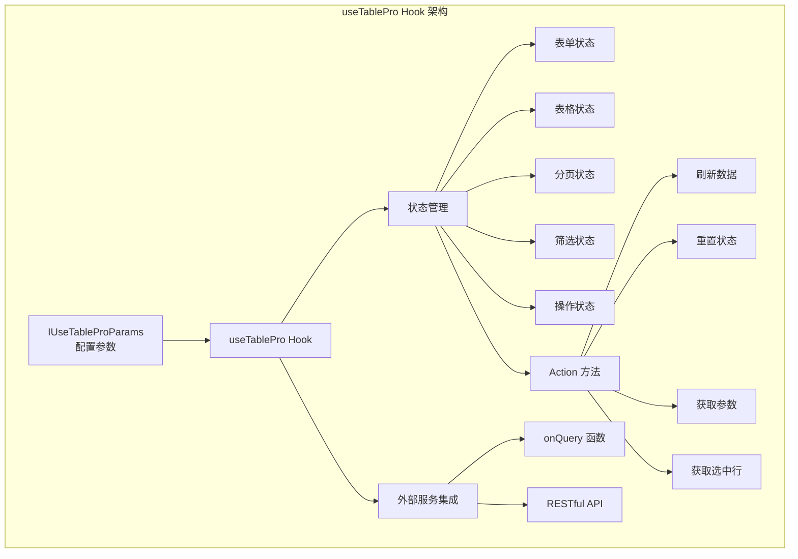
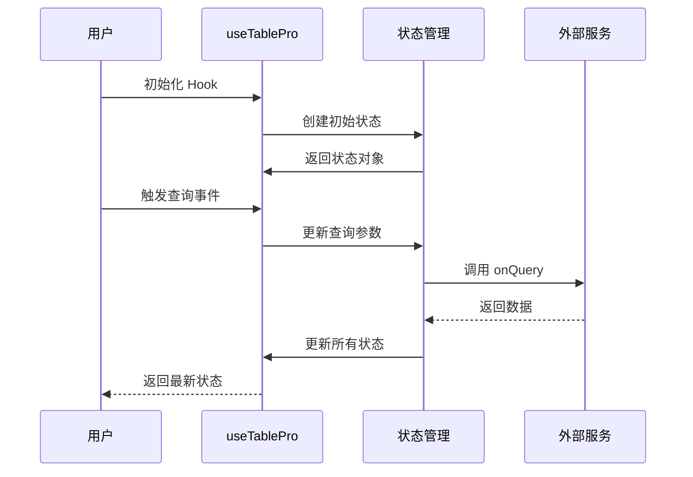
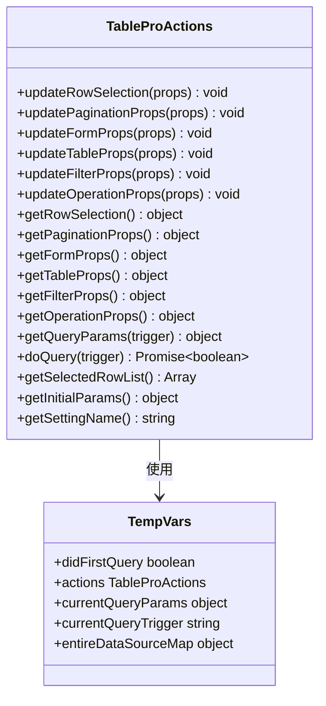
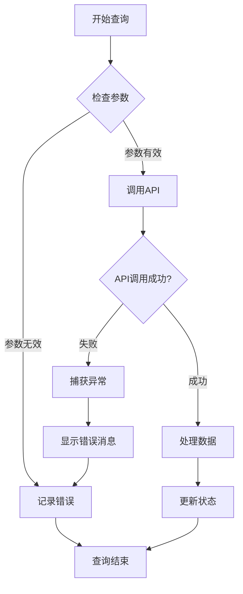

# useTablePro Hook 状态管理

<cite>
**本文档引用的文件**
- [useTablePro.tsx](file://src/table-pro/useTablePro.tsx)
- [types.ts](file://src/table-pro/types.ts)
- [table-pro.tsx](file://src/table-pro/table-pro.tsx)
- [demo-table-pro.tsx](file://demo/demo-table-pro.tsx)
- [useTablePro.d.ts](file://types/0buildTypes/table-pro/useTablePro.d.ts)
</cite>

## 目录
1. [简介](#简介)
2. [核心架构](#核心架构)
3. [状态管理机制](#状态管理机制)
4. [API接口详解](#api接口详解)
5. [使用示例](#使用示例)
6. [错误处理与性能优化](#错误处理与性能优化)
7. [最佳实践](#最佳实践)
8. [总结](#总结)

## 简介

`useTablePro` 是 Fat Design 组件库中 TablePro 核心的状态管理 Hook，它封装了表格数据查询、分页、排序、筛选等复杂逻辑，为开发者提供了统一的状态管理解决方案。该 Hook 通过响应式设计模式，实现了数据驱动的表格状态管理，大大简化了复杂表格组件的开发流程。

## 核心架构



**图表来源**
- [useTablePro.tsx](file://src/table-pro/useTablePro.tsx#L58-L389)

**章节来源**
- [useTablePro.tsx](file://src/table-pro/useTablePro.tsx#L1-L50)
- [types.ts](file://src/table-pro/types.ts#L34-L45)

## 状态管理机制

### 状态结构概览

`useTablePro` Hook 返回一个包含五个主要状态对象和一个 Action 对象的完整状态管理套件：

```typescript
interface TableProState {
    formProps: any;           // 表单相关状态
    tableProps: any;          // 表格相关状态
    paginationProps: any;     // 分页相关状态
    filterProps: any;         // 筛选相关状态
    operationProps: any;      // 操作相关状态
    actions: TableProActions; // 动作方法集合
}
```

### 状态生命周期



**图表来源**
- [useTablePro.tsx](file://src/table-pro/useTablePro.tsx#L100-L150)

**章节来源**
- [useTablePro.tsx](file://src/table-pro/useTablePro.tsx#L58-L120)

## API接口详解

### 配置参数接口 (IUseTableProParams)

```typescript
export interface IUseTableProParams {
    onQuery?: FnOnQuery; // 查询函数
    autoFirstQuery?: boolean,
    isReadyToFirstQuery?: FnOnQuery, // 判断是否可以进行第一次查询
    isEnableRowSelection?: boolean,
    isEnableCrossPageRowSelection?: boolean, // 是否开启跨页行选择
    isEnableFrontendPagination?: boolean, // 是否开启前端分页
    
    initFormProps?: any,
    initTableProps?: any,
    initPaginationProps?: any,
    initFilterProps?: any,
    initOperationProps?: any
}
```

### 返回状态对象详解

#### 1. formProps - 表单状态管理

```typescript
interface FormProps {
    _tmpFormValues: object; // 临时表单值
    isUseCard: boolean;     // 是否使用卡片布局
    onSubmit: Function;     // 表单提交回调
    onReset: Function;      // 表单重置回调
    onAsyncEnums: Function; // 异步枚举回调
}
```

#### 2. tableProps - 表格状态管理

```typescript
interface TableProps {
    showTotal: boolean;     // 是否显示总数
    title: string | null;   // 表格标题
    primaryKey: string;     // 主键字段名
    loading: boolean;       // 加载状态
    rowSelection: object;   // 行选择配置
    dataSource: any[];      // 数据源
}
```

#### 3. paginationProps - 分页状态管理

```typescript
interface PaginationProps {
    pageSizeList: number[];     // 每页大小选项
    shape: string;             // 分页器形状
    pageSizePosition: string;  // 每页大小位置
    pageSizeSelector: string;  // 每页大小选择器
    showJump: boolean;         // 是否显示跳转
    pageSize: number;          // 当前每页大小
    current: number;           // 当前页码
    total: number;            // 总记录数
    totalRender: string;      // 总数渲染方式
}
```

#### 4. filterProps - 筛选状态管理

```typescript
interface FilterProps {
    defaultValue: string; // 默认筛选值
    value: string;       // 当前筛选值
    dataSource: Array<{  // 筛选选项
        label: string;
        value: string;
        count?: number;
    }>;
    onChange: Function;  // 筛选变化回调
}
```

#### 5. operationProps - 操作状态管理

```typescript
interface OperationProps {
    prefix: string;      // 前缀
    spacing: number;     // 间距
    buttons: OperationBtnItem[]; // 操作按钮配置
    actions: any;        // 动作方法
}
```

### Action 方法详解



**图表来源**
- [useTablePro.tsx](file://src/table-pro/useTablePro.tsx#L350-L389)

**章节来源**
- [useTablePro.tsx](file://src/table-pro/useTablePro.tsx#L350-L389)
- [types.ts](file://src/table-pro/types.ts#L34-L120)

## 使用示例

### 基础使用示例

```typescript
import { useTablePro } from 'fat-design';

function BasicTableExample() {
    const tableProps = useTablePro({
        onQuery: async (formValues, otherValues) => {
            // 实现数据查询逻辑
            const response = await fetchData(formValues, otherValues);
            return {
                total: response.total,
                dataSource: response.data
            };
        },
        
        initFormProps: {
            defaultValues: {
                username: '',
                status: ''
            },
            schema: {
                type: 'object',
                properties: {
                    username: {
                        label: '用户名',
                        component: 'Input'
                    },
                    status: {
                        label: '状态',
                        component: 'Select',
                        enums: [
                            { label: '全部', value: '' },
                            { label: '启用', value: 'active' },
                            { label: '禁用', value: 'inactive' }
                        ]
                    }
                }
            }
        },
        
        initTableProps: {
            title: '用户列表',
            primaryKey: 'id',
            columns: [
                { title: 'ID', dataIndex: 'id', width: '100px' },
                { title: '用户名', dataIndex: 'username', width: '200px' },
                { title: '状态', dataIndex: 'status', width: '150px' }
            ]
        }
    });

    return <TablePro {...tableProps} />;
}
```

### 高级使用示例

```typescript
function AdvancedTableExample() {
    const propsRef = useRef(null);

    propsRef.current = useTablePro({
        // 开启跨页选择
        isEnableCrossPageRowSelection: true,
        
        // 查询函数
        onQuery: async (formParams, otherParams) => {
            try {
                const response = await api.queryUsers({
                    ...formParams,
                    ...otherParams
                });
                
                return {
                    total: response.total,
                    dataSource: response.data,
                    paginationProps: {
                        total: response.total,
                        current: otherParams.current,
                        pageSize: otherParams.pageSize
                    }
                };
            } catch (error) {
                Message.error('数据加载失败');
                return null;
            }
        },
        
        // 自动首次查询
        autoFirstQuery: true,
        
        // 表单配置
        initFormProps: {
            labelAlign: 'top',
            defaultValues: {
                username: '默认值'
            },
            schema: {
                type: 'object',
                properties: {
                    username: {
                        label: '用户名',
                        component: 'Input',
                        required: true
                    }
                }
            }
        },
        
        // 分页配置
        initPaginationProps: {
            pageSize: 10,
            pageSizeList: [10, 20, 50, 100],
            showJump: true
        },
        
        // 表格配置
        initTableProps: {
            primaryKey: 'id',
            columns: [
                {
                    title: '操作',
                    dataIndex: 'actions',
                    width: '200px',
                    cell: (value, index, record) => {
                        return renderOperationCell([
                            {
                                title: '编辑',
                                onClick: () => handleEdit(record)
                            },
                            {
                                title: '删除',
                                onClick: () => handleDelete(record)
                            }
                        ]);
                    }
                }
            ]
        },
        
        // 操作配置
        initOperationProps: {
            buttons: [
                {
                    text: '新增',
                    icon: 'add',
                    type: 'primary',
                    onClick: () => handleAdd()
                }
            ]
        }
    });

    // 获取选中行
    const handleBatchDelete = () => {
        const selectedRows = propsRef.current.actions.getSelectedRowList();
        if (!selectedRows.length) {
            Message.warning('请先选择要删除的数据');
            return;
        }
        
        Dialog.confirm({
            title: '批量删除',
            content: `确定要删除选中的 ${selectedRows.length} 条数据吗？`,
            onOk: async () => {
                await api.batchDelete(selectedRows.map(r => r.id));
                Message.success('删除成功');
                propsRef.current.actions.doQuery();
            }
        });
    };

    return <TablePro {...propsRef.current} />;
}
```

**章节来源**
- [demo-table-pro.tsx](file://demo/demo-table-pro.tsx#L1-L200)

## 错误处理与性能优化

### 错误处理机制



**图表来源**
- [useTablePro.tsx](file://src/table-pro/useTablePro.tsx#L140-L180)

### 性能优化策略

1. **防抖处理**：使用 `usePersistFn` 防止频繁的函数重建
2. **状态缓存**：跨页选择时缓存整个数据源映射
3. **条件查询**：智能判断是否需要首次查询
4. **异步处理**：使用 `async/await` 处理异步操作

```typescript
// 防抖处理示例
const doQuery = usePersistFn(async (queryTrigger: string) => {
    // 查询逻辑
});

// 条件查询示例
const tryFirstQuery = async (queryTrigger: string) => {
    if (!autoFirstQuery || tempVars.didFirstQuery) {
        return;
    }
    
    // 检查是否准备好查询
    let isReadyToFirstQuery = true;
    if (params.isReadyToFirstQuery) {
        isReadyToFirstQuery = params.isReadyToFirstQuery(
            queryParams.formValues, 
            queryParams.otherValues
        );
    }
    
    if (isReadyToFirstQuery) {
        return doQuery(queryTrigger);
    }
};
```

**章节来源**
- [useTablePro.tsx](file://src/table-pro/useTablePro.tsx#L140-L200)

## 最佳实践

### 1. 合理使用状态管理

```typescript
// 推荐：使用 ref 缓存状态
const propsRef = useRef(null);
propsRef.current = useTablePro(config);

// 避免：在组件内重复创建 Hook
function BadExample() {
    const tableProps = useTablePro(config); // 每次渲染都会重新创建
    return <TablePro {...tableProps} />;
}
```

### 2. 错误处理最佳实践

```typescript
const tableProps = useTablePro({
    onQuery: async (formValues, otherValues) => {
        try {
            const response = await api.query(formValues, otherValues);
            return processResponse(response);
        } catch (error) {
            logger.error('查询失败:', error);
            Message.error(getErrorMessage(error));
            return null;
        }
    }
});
```

### 3. 性能优化建议

```typescript
// 使用 useMemo 缓存复杂的计算结果
const memoizedColumns = useMemo(() => {
    return generateColumns(dataType);
}, [dataType]);

// 使用 useCallback 包装回调函数
const handleEdit = useCallback((record) => {
    // 编辑逻辑
}, []);
```

### 4. 数据联动处理

```typescript
// 实现数据联动
const tableProps = useTablePro({
    onQuery: async (formValues, otherValues) => {
        // 根据表单值动态调整查询参数
        const queryParam = {
            ...formValues,
            dynamicParam: calculateDynamicParam(formValues)
        };
        
        const response = await api.query(queryParam);
        return formatResponse(response);
    }
});
```

## 总结

`useTablePro` Hook 是 Fat Design 组件库中一个功能强大且设计精良的状态管理工具。它通过以下特性为开发者提供了优秀的开发体验：

1. **完整的状态管理**：涵盖了表格应用中常见的所有状态类型
2. **响应式设计**：自动响应用户交互和数据变化
3. **灵活的配置**：支持各种复杂的业务场景
4. **良好的扩展性**：易于与其他组件和服务集成
5. **完善的错误处理**：提供健壮的异常处理机制

通过合理使用 `useTablePro` Hook，开发者可以快速构建功能丰富、性能优异的表格应用，同时保持代码的简洁性和可维护性。无论是简单的数据展示还是复杂的业务表格，`useTablePro` 都能提供强有力的支持。