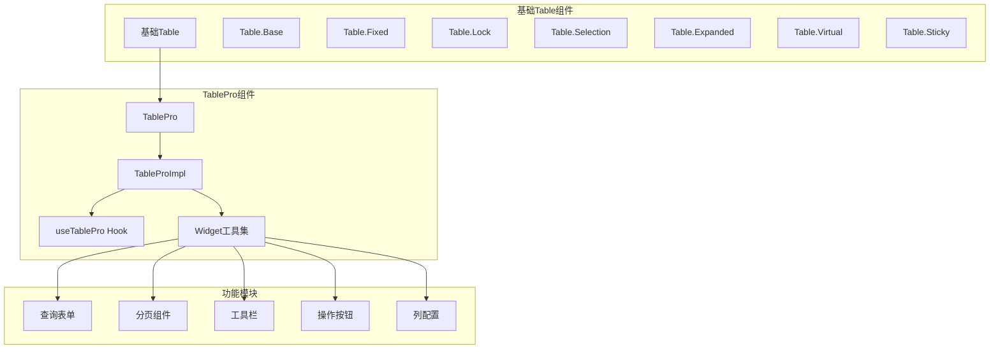
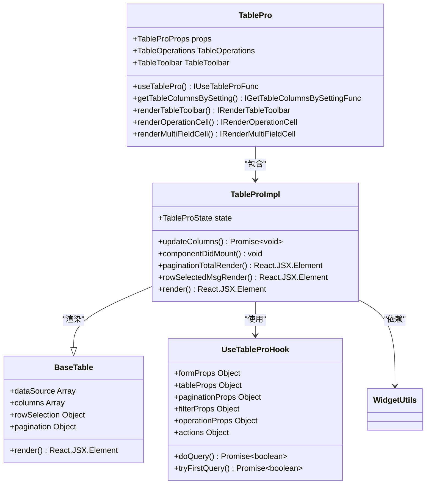
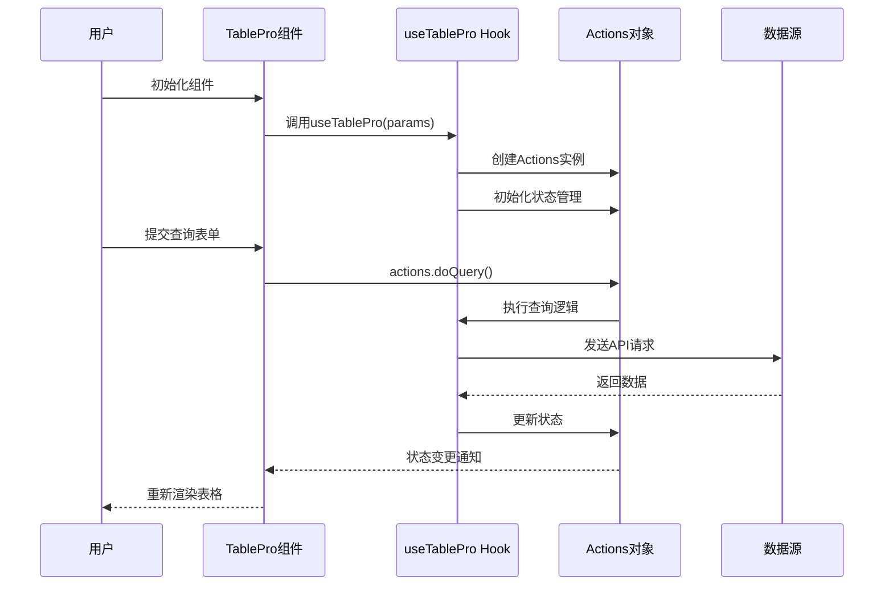
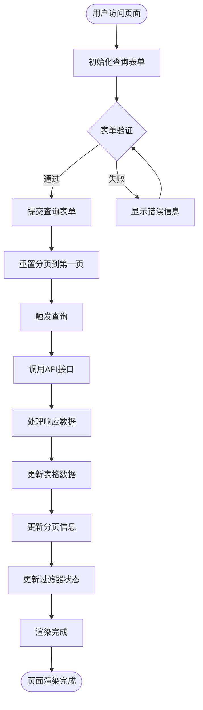
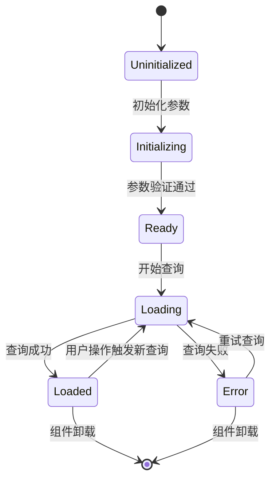
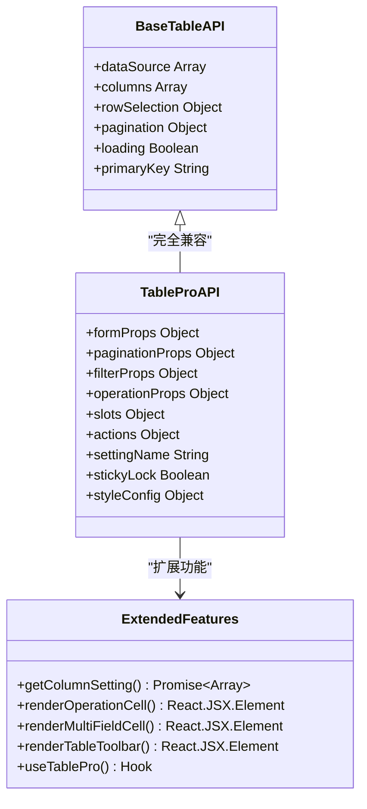
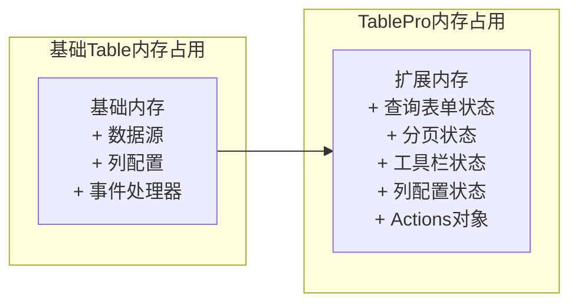
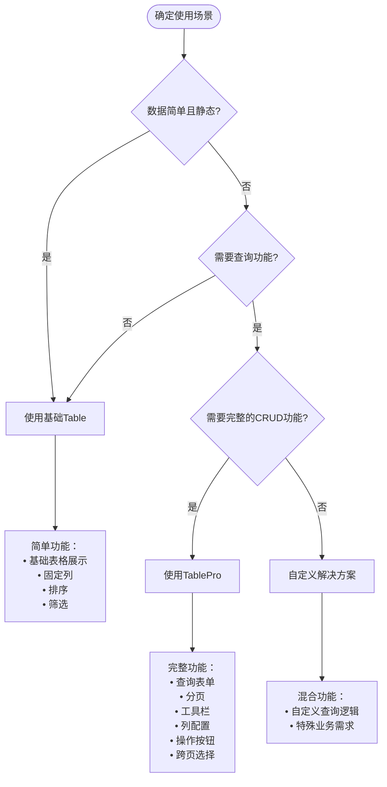
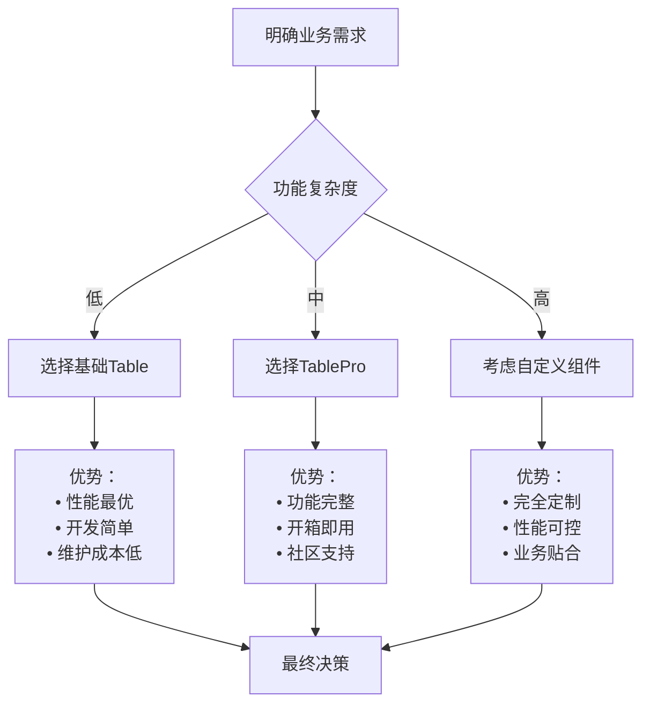

# TablePro与基础Table组件关系架构文档

<cite>
**本文档引用的文件**
- [src/table-pro/index.tsx](file://src/table-pro/index.tsx)
- [src/table-pro/table-pro.tsx](file://src/table-pro/table-pro.tsx)
- [src/table-pro/types.ts](file://src/table-pro/types.ts)
- [src/table-pro/useTablePro.tsx](file://src/table-pro/useTablePro.tsx)
- [src/table-pro/widget/index.ts](file://src/table-pro/widget/index.ts)
- [src/table-pro/widget/renderToolbar.tsx](file://src/table-pro/widget/renderToolbar.tsx)
- [src/table-pro/widget/operations.tsx](file://src/table-pro/widget/operations.tsx)
- [src/table/index.jsx](file://src/table/index.jsx)
- [src/table/base.jsx](file://src/table/base.jsx)
- [demo/demo-table-pro.tsx](file://demo/demo-table-pro.tsx)
</cite>

## 目录
1. [概述](#概述)
2. [项目结构分析](#项目结构分析)
3. [核心组件关系](#核心组件关系)
4. [架构设计模式](#架构设计模式)
5. [功能增强层次](#功能增强层次)
6. [状态管理机制](#状态管理机制)
7. [API兼容性分析](#api兼容性分析)
8. [性能对比分析](#性能对比分析)
9. [使用场景对比](#使用场景对比)
10. [最佳实践建议](#最佳实践建议)

## 概述

TablePro是Fat Design组件库中基于基础Table组件构建的高级表格组件，它在基础Table的基础上提供了完整的CRUD功能解决方案。TablePro通过组合模式和装饰器模式，将查询表单、分页、工具栏、列配置等功能无缝集成到基础Table组件之上，形成了一个功能完整的企业级表格解决方案。

## 项目结构分析



**图表来源**
- [src/table/index.jsx](file://src/table/index.jsx#L1-L139)
- [src/table-pro/index.tsx](file://src/table-pro/index.tsx#L1-L33)
- [src/table-pro/table-pro.tsx](file://src/table-pro/table-pro.tsx#L1-L214)

**章节来源**
- [src/table/index.jsx](file://src/table/index.jsx#L1-L139)
- [src/table-pro/index.tsx](file://src/table-pro/index.tsx#L1-L33)

## 核心组件关系

### 组件继承与扩展关系

TablePro通过以下方式与基础Table建立关系：

1. **组合模式**：TablePro将基础Table作为其核心渲染组件
2. **装饰器模式**：通过useTablePro Hook为基础Table添加功能
3. **工具集模式**：通过widget工具集提供额外的功能组件



**图表来源**
- [src/table-pro/table-pro.tsx](file://src/table-pro/table-pro.tsx#L25-L214)
- [src/table-pro/useTablePro.tsx](file://src/table-pro/useTablePro.tsx#L1-L390)
- [src/table/base.jsx](file://src/table/base.jsx#L1-L845)

**章节来源**
- [src/table-pro/table-pro.tsx](file://src/table-pro/table-pro.tsx#L25-L214)
- [src/table-pro/useTablePro.tsx](file://src/table-pro/useTablePro.tsx#L1-L390)

## 架构设计模式

### 1. 组合模式（Composition Pattern）

TablePro采用组合模式将多个功能模块组合在一起：

```typescript
// TablePro的核心渲染逻辑
render() {
    const {
        prefix,
        components,
        paginationProps,
        filterProps,
        formProps,
        operationProps,
        tableProps,
        actions,
        slots,
        styleMode,
        settingName,
        className,
        stickyLock = true,
        styleConfig
    } = this.props;

    // 动态获取组件
    const QueryFormComp = (components && components['QueryForm']) || QueryForm;
    const TableComp = getTableComp(components, stickyLock);
    const PaginationComp = (components && components['Pagination']) || Pagination;

    return (
        <div className={compCls} style={rootStyle}>
            {/* 查询表单 */}
            {initialParams.initFormProps ? (
                <div className={cls('query-form')} style={queryFormStyle}>
                    <QueryFormComp {...formProps} />
                </div>
            ) : null}

            {/* 工具栏 */}
            {(initialParams.initFilterProps || initialParams.initOperationProps) ?
                tableUtils.renderTableToolbar({
                    title: title,
                    totalCount: paginationProps.total,
                    filterProps: filterProps,
                    operationProps: operationProps,
                    prefix: prefix,
                    actions: actions,
                    components: components
                }) : null
            }

            {/* 主表格 */}
            <div className={cls('table')} style={tableStyle}>
                <TableComp {...otherTableProps} columns={columns}/>
            </div>

            {/* 底部区域 */}
            <div className={cls('table-bottom')} style={bottomStyle}>
                {/* 行选择消息 */}
                <div className={cls('row-selected')}>
                    {this.rowSelectedMsgRender(tableProps)}
                </div>

                {/* 分页 */}
                {initialParams.initPaginationProps ? (
                    <div className={cls('pagination')}>
                        <PaginationComp {...paginationProps} />
                    </div>
                ) : null}
            </div>
        </div>
    );
}
```

### 2. 状态管理模式（State Management Pattern）

TablePro通过useTablePro Hook实现集中式状态管理：



**图表来源**
- [src/table-pro/useTablePro.tsx](file://src/table-pro/useTablePro.tsx#L40-L390)
- [src/table-pro/table-pro.tsx](file://src/table-pro/table-pro.tsx#L100-L150)

**章节来源**
- [src/table-pro/table-pro.tsx](file://src/table-pro/table-pro.tsx#L100-L214)
- [src/table-pro/useTablePro.tsx](file://src/table-pro/useTablePro.tsx#L40-L390)

## 功能增强层次

### 1. 查询功能增强

TablePro在基础Table基础上增加了完整的查询功能：



**图表来源**
- [src/table-pro/useTablePro.tsx](file://src/table-pro/useTablePro.tsx#L150-L200)

### 2. 工具栏功能增强

TablePro提供了丰富的工具栏功能：

```typescript
// 工具栏渲染逻辑
const renderTableToolbar = (props: TableToolbarProps) => {
    const {title, totalCount, filterProps, operationProps, prefix, actions, components} = props;
    const FilterComp = (components && components['Filter']) || Filter;
    const OperationsComp = (components && components['Operations']) || TableOperations;

    return (
        <div className={cls('comp')}>
            {/* 标题 */}
            {title ? (
                <div className={cls('title')}>
                    {title}
                </div>
            ) : null}

            {/* 总数显示 */}
            {typeof totalCount === "number" || typeof totalCount === "string" ? (
                <div className={cls('total')}>
                    共 {totalCount} 项
                </div>
            ) : null}

            {/* 过滤器 */}
            {filterProps && isNotEmpty(filterProps.dataSource) ? (
                <div className={cls('filter-wrap')}>
                    <FilterComp {...filterProps} />
                </div>
            ) : null}

            {/* 操作按钮 */}
            {operationProps ? (
                <div className={cls('operations-wrap')}>
                    <OperationsComp {...operationProps} prefix={prefix} actions={actions}/>
                </div>
            ) : null}
        </div>
    )
};
```

### 3. 列配置功能增强

TablePro支持动态列配置和列设置：

```typescript
// 列配置功能
interface TableProProps {
    settingName: string; // 列设置的唯一标识
    columns: any[] | null; // 动态列配置
    // ... 其他属性
}

// 列设置更新逻辑
updateColumns = async () => {
    const columns = await tableUtils.getTableColumnsBySetting(this.props);
    this.setState({columns: columns});
}

// 列设置工具函数
const tableUtils = {
    getTableColumnsBySetting: getTableColumnsBySetting,
    renderTableToolbar: renderTableToolbar,
    renderOperationCell: renderOperationCell,
    renderMultiFieldCell: renderMultiFieldCell,
    // ... 其他工具函数
}
```

**章节来源**
- [src/table-pro/widget/renderToolbar.tsx](file://src/table-pro/widget/renderToolbar.tsx#L1-L72)
- [src/table-pro/table-pro.tsx](file://src/table-pro/table-pro.tsx#L45-L55)
- [src/table-pro/widget/index.ts](file://src/table-pro/widget/index.ts#L1-L32)

## 状态管理机制

### 1. 集中式状态管理

TablePro通过useTablePro Hook实现了统一的状态管理：



**图表来源**
- [src/table-pro/useTablePro.tsx](file://src/table-pro/useTablePro.tsx#L40-L100)

### 2. 状态同步机制

```typescript
// 状态管理的核心逻辑
function useTablePro(params: IUseTableProParams) {
    const [loading, setLoading, getIsLoading] = useCurrentState(false);
    const [rowSelection, updateRowSelection, getRowSelection] = useCurrentState2(
        initByParams({selectedRowKeys: []}, params.initTableProps.rowSelection)
    );
    const [formProps, updateFormProps, getFormProps] = useCurrentState2(
        initByParams({_tmpFormValues: params.initFormProps?.defaultValues || {}, isUseCard: true}, params.initFormProps)
    );
    const [tableProps, updateTableProps, getTableProps] = useCurrentState2(
        initByParams({showTotal: true, title: null, primaryKey: 'id'}, params.initTableProps)
    );
    const [paginationProps, updatePaginationProps, getPaginationProps] = useCurrentState2(
        initByParams({
            pageSizeList: [10, 20, 50, 100, 200],
            shape: 'arrow-only',
            pageSizePosition: 'end',
            pageSizeSelector: 'filter',
            showJump: false,
            pageSize: 20,
            current: 1,
            total: 0,
            totalRender: 'default'
        }, params.initPaginationProps)
    );

    // 查询触发器枚举
    const QUERY_TRIGGER = {
        DID_MOUNT: 'DID_MOUNT',
        FORM_ON_SUBMIT: 'FORM_ON_SUBMIT',
        FORM_ON_RESET: 'FORM_ON_RESET',
        FILTER_ON_CHANGE: 'FILTER_ON_CHANGE',
        PAGINATION_ON_CHANGE: 'PAGINATION_ON_CHANGE',
        PAGINATION_ON_CHANGE_SIZE: 'PAGINATION_ON_CHANGE_SIZE'
    };

    // 查询执行逻辑
    const doQuery = async (queryTrigger: string) => {
        const currentQueryParams = getQueryParams(queryTrigger);
        const {formValues, otherValues} = currentQueryParams;

        setLoading(true);
        
        // 清空选框（除非启用跨页选择）
        if (!isEnableCrossPageRowSelection || 
            queryTrigger === QUERY_TRIGGER.FORM_ON_SUBMIT || 
            queryTrigger === QUERY_TRIGGER.FORM_ON_RESET) {
            updateRowSelection({selectedRowKeys: []});
        }

        try {
            const res0 = await params.onQuery(formValues, otherValues);
            const res = formatQueryRes(res0);

            if (!res || !res.tableProps) {
                return false;
            }

            // 更新所有状态
            updatePaginationProps(res.paginationProps);
            updateFormProps(res.formProps);
            updateTableProps(res.tableProps);
            updateFilterProps(res.filterProps);
            updateOperationProps(res.operationProps);

            return true;
        } catch (e) {
            Message.error(pickErrorMessage(e));
            return false;
        } finally {
            setLoading(false);
        }
    };
}
```

**章节来源**
- [src/table-pro/useTablePro.tsx](file://src/table-pro/useTablePro.tsx#L40-L390)

## API兼容性分析

### 1. 向下兼容性

TablePro保持了与基础Table组件的API兼容性：

```typescript
// TableProProps继承了基础Table的大部分属性
export interface TableProProps {
    className?: string,
    settingName: string,
    prefix: string,
    components: any,
    formProps: any,
    tableProps: any, // 完全兼容基础Table的tableProps
    paginationProps: any,
    filterProps: any,
    operationProps: OperationsProps,
    slots?: QueryFormTableSlots,
    actions?: any,
    styleMode: StyleModeEnum,
    stickyLock?: boolean,
    styleConfig?: any,
}

// 基础Table的tableProps可以直接透传到TablePro
initTableProps: {
    title: '审批任务列表',
    primaryKey: 'id',
    columns: [
        {title: '姓名', dataIndex: 'id', width: '150px', lock: 'left'},
        {title: '标题', dataIndex: 'title.name', width: '180px', sortable: true},
        {title: '入职日期', dataIndex: 'time', width: '200px', cell: renderTime},
        {title: '是否', dataIndex: 'yes', width: '120px', cell: renderBoolean},
        // ... 更多列配置
    ]
}
```

### 2. API扩展性

TablePro在保持兼容性的基础上提供了扩展功能：



**图表来源**
- [src/table-pro/types.ts](file://src/table-pro/types.ts#L1-L120)
- [src/table-pro/widget/index.ts](file://src/table-pro/widget/index.ts#L1-L32)

**章节来源**
- [src/table-pro/types.ts](file://src/table-pro/types.ts#L1-L120)
- [src/table-pro/table-pro.tsx](file://src/table-pro/table-pro.tsx#L100-L150)

## 性能对比分析

### 1. 渲染性能对比

| 组件类型 | 渲染复杂度 | 渲染次数 | 性能特点 |
|---------|-----------|----------|----------|
| 基础Table | 中等 | 1次 | 直接渲染，无额外开销 |
| TablePro | 高 | 2-3次 | 包含查询表单、工具栏等额外组件 |

### 2. 内存占用对比



### 3. 查询性能优化

TablePro通过以下方式优化查询性能：

```typescript
// 防止重复查询
const doQuery = async (queryTrigger: string) => {
    if (getIsLoading()) {
        return; // 如果正在加载，则跳过查询
    }
    
    setLoading(true);
    
    try {
        const res0 = await params.onQuery(formValues, otherValues);
        // 处理响应...
    } finally {
        setLoading(false);
    }
};

// 缓存整个数据源以支持跨页选择
const cacheEntireDataSourceMap = usePersistFn(() => {
    if (!isEnableCrossPageRowSelection) {
        tempVars.entireDataSourceMap = {}; // 清空缓存
    }
    
    const dataSource = tableProps.dataSource || [];
    const dataSourceMap = toMap(dataSource, (r: any) => r[tableProps.primaryKey]);
    Object.assign(tempVars.entireDataSourceMap, dataSourceMap);
});
```

**章节来源**
- [src/table-pro/useTablePro.tsx](file://src/table-pro/useTablePro.tsx#L150-L200)
- [src/table-pro/useTablePro.tsx](file://src/table-pro/useTablePro.tsx#L200-L250)

## 使用场景对比

### 1. 适用场景对比



### 2. 技术选型建议

| 场景 | 推荐组件 | 理由 |
|------|----------|------|
| 简单数据展示 | 基础Table | 性能最优，开发简单 |
| 基础CRUD功能 | TablePro | 功能完整，开箱即用 |
| 复杂业务场景 | 自定义组件 | 灵活定制，避免过度设计 |
| 高性能要求 | 基础Table + 优化 | 减少不必要的功能开销 |

### 3. 实际使用示例

```typescript
// 基础Table使用示例
function SimpleTable() {
    return (
        <Table
            dataSource={data}
            columns={[
                {title: '姓名', dataIndex: 'name'},
                {title: '年龄', dataIndex: 'age'}
            ]}
        />
    );
}

// TablePro使用示例
function AdvancedTable() {
    const props = useTablePro({
        initTableProps: {
            columns: [
                {title: '姓名', dataIndex: 'name'},
                {title: '年龄', dataIndex: 'age'}
            ]
        },
        onQuery: async (formValues, otherValues) => {
            // 实现查询逻辑
            const result = await fetchData(formValues, otherValues);
            return {
                dataSource: result.data,
                total: result.total
            };
        }
    });

    return (
        <TablePro {...props} settingName="advancedTable" />
    );
}
```

**章节来源**
- [demo/demo-table-pro.tsx](file://demo/demo-table-pro.tsx#L1-L345)

## 最佳实践建议

### 1. 组件选择原则



### 2. 性能优化建议

```typescript
// 1. 启用虚拟滚动处理大数据
initTableProps: {
    useVirtual: true,
    rowHeight: 40,
    scrollToRow: 0
}

// 2. 合理配置分页
initPaginationProps: {
    pageSize: 20,
    pageSizeList: [10, 20, 50, 100],
    pageSizeSelector: 'filter'
}

// 3. 优化查询频率
const props = useTablePro({
    autoFirstQuery: true,
    isReadyToFirstQuery: (formValues, otherValues) => {
        // 只有在必要时才执行首次查询
        return Object.keys(formValues).length > 0;
    }
});

// 4. 启用跨页选择优化
isEnableCrossPageRowSelection: true,
```

### 3. 代码组织建议

```typescript
// 1. 创建专门的表格配置文件
// table-config.ts
export const userTableConfig = {
    columns: [
        {title: '用户名', dataIndex: 'username', width: 150},
        {title: '邮箱', dataIndex: 'email', width: 200},
        {title: '状态', dataIndex: 'status', width: 100, cell: renderStatus}
    ],
    operations: [
        {text: '编辑', onClick: 'edit'},
        {text: '删除', onClick: 'delete'}
    ]
};

// 2. 创建通用的表格包装组件
// UserTable.tsx
import {TablePro, useTablePro} from '@fat-design';
import {userTableConfig} from './table-config';

function UserTable() {
    const props = useTablePro({
        initTableProps: userTableConfig,
        onQuery: async (formValues, otherValues) => {
            const result = await userService.queryUsers(formValues, otherValues);
            return {
                dataSource: result.users,
                total: result.total
            };
        }
    });

    return (
        <TablePro 
            {...props} 
            settingName="userTable" 
            styleMode="simple"
        />
    );
}
```

### 4. 错误处理建议

```typescript
// 1. 添加全局错误处理
const props = useTablePro({
    onQuery: async (formValues, otherValues) => {
        try {
            const result = await apiCall(formValues, otherValues);
            return result;
        } catch (error) {
            // 记录错误日志
            logger.error('表格查询失败', {formValues, error});
            
            // 显示友好的错误提示
            Message.error('数据加载失败，请稍后重试');
            
            // 返回空数据避免组件崩溃
            return {
                dataSource: [],
                total: 0
            };
        }
    }
});
```

通过以上架构分析和最佳实践建议，开发者可以根据具体的业务需求和技术约束，选择最适合的表格组件方案，实现高效、可维护的企业级应用开发。